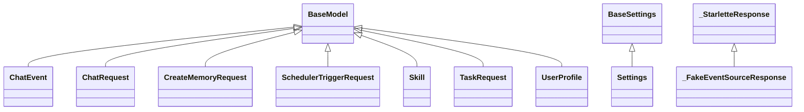

```mermaid
classDiagram
  BaseModel <|-- ChatEvent
  BaseModel <|-- ChatRequest
  BaseModel <|-- CreateMemoryRequest
  BaseModel <|-- SchedulerTriggerRequest
  BaseSettings <|-- Settings
  BaseModel <|-- Skill
  BaseModel <|-- TaskRequest
  BaseModel <|-- UserProfile
  _StarletteResponse <|-- _FakeEventSourceResponse
```
