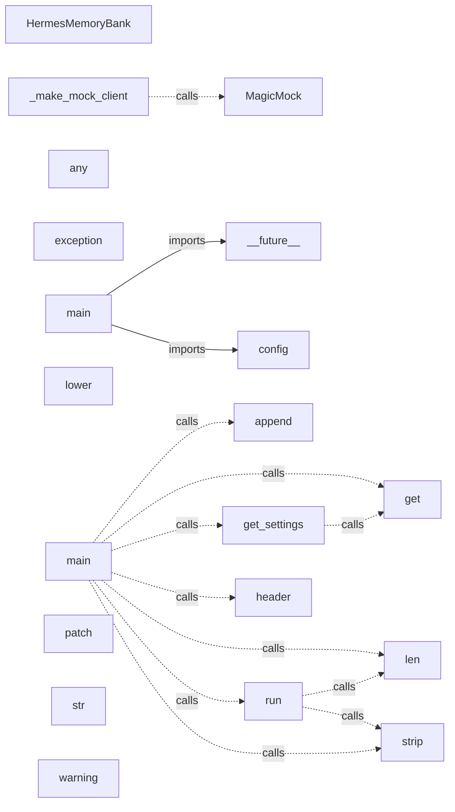

```mermaid
flowchart LR
  HermesMemoryBank["HermesMemoryBank"]
  MagicMock["MagicMock"]
  __future__["__future__"]
  _make_mock_client["_make_mock_client"]
  any["any"]
  append["append"]
  config["config"]
  exception["exception"]
  gateway_main["main"]
  get["get"]
  get_settings["get_settings"]
  header["header"]
  len["len"]
  lower["lower"]
  main["main"]
  patch["patch"]
  run["run"]
  str["str"]
  strip["strip"]
  warning["warning"]

  gateway_main -->|imports| __future__
  gateway_main -->|imports| config
  _make_mock_client -.->|calls| MagicMock
  get_settings -.->|calls| get
  main -.->|calls| append
  main -.->|calls| get
  main -.->|calls| get_settings
  main -.->|calls| header
  main -.->|calls| len
  main -.->|calls| run
  main -.->|calls| strip
  run -.->|calls| len
  run -.->|calls| strip

```
