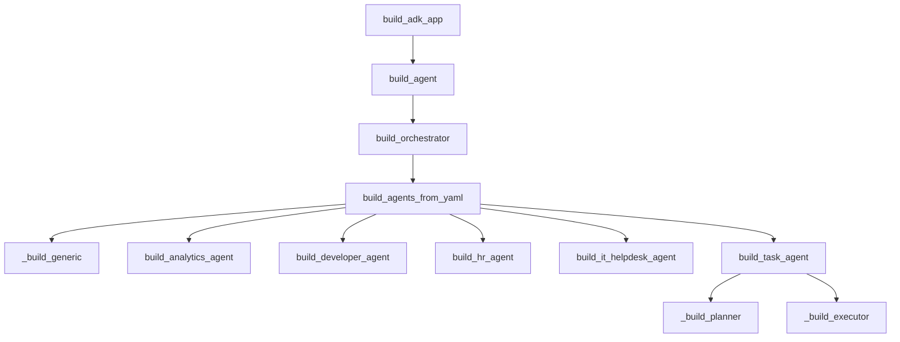
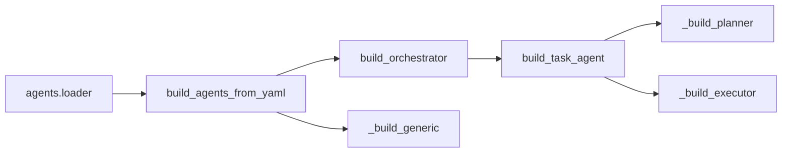

# Agents Subsystem Overview

## Overview

The agents subsystem is organized as a small family of builders that all produce ADK agent instances, but at different levels of abstraction and deployment intent. At the top level, [`build_agent`](agents/__init__.py#L11) creates the root agent graph used by the runtime, while [`build_adk_app`](agents/__init__.py#L17) wraps that graph in an `AdkApp` for deployment scenarios that need a full application object rather than a raw agent. Underneath that entrypoint, the subsystem splits into a generic YAML-driven loader path in [`agents.loader`](agents/loader.py#L1) and a set of special-purpose builders for domain-specific agents such as analytics, HR, IT helpdesk, developer, orchestrator, and long-running task execution.

The design is intentionally modular: the loader handles declarative composition, the orchestrator assembles the top-level routing agent, and the special-purpose builders define individual agent capabilities and tool sets. This gives the system two ways to evolve:
1. add or modify agents through configuration in `agents.yaml` via [`build_agents_from_yaml`](agents/loader.py#L147), or
2. add curated builders for agents that need a fixed toolchain or bespoke prompt/tool layout, such as [`build_task_agent`](agents/task_agent.py#L160).

The subsystem also shares common supporting services:
- model selection via [`get_model`](models/provider.py#L75),
- config access through [`get_settings`](config.py#L163),
- memory learning callbacks through [`build_skill_learning_callback`](memory/skill_learning.py#L25),
- and memory preload tooling via `PreloadMemoryTool` as used throughout the agent builders.

> **Sources:** `agents/__init__.py` · L11–L19 · [`build_agent`](agents/__init__.py#L11) · [`build_adk_app`](agents/__init__.py#L17)

## High-Level Architecture

At runtime, the subsystem begins with the root agent builder and fans out to either the orchestrator or a specific agent builder depending on which path the caller chooses. The generic loader sits in the middle for configuration-based sub-agent construction, while the task agent is a separate loop-oriented path for long-running work.

The key architectural pattern is that the orchestrator is not itself a specialist; instead, it delegates to a set of sub-agents built by either the generic YAML loader or curated builders. The task agent is intentionally separate because it models an autonomous loop rather than a normal conversational agent turn.

> **Sources:** `agents/__init__.py` · L11–L19 · [`build_agent`](agents/__init__.py#L11) · [`build_adk_app`](agents/__init__.py#L17) · `agents/orchestrator.py` · L34–L44 · [`build_orchestrator`](agents/orchestrator.py#L34) · `agents/loader.py` · L147–L203 · [`build_agents_from_yaml`](agents/loader.py#L147) · `agents/task_agent.py` · L160–L180 · [`build_task_agent`](agents/task_agent.py#L160)

## Agent Declaration, Build, and Orchestration Flow

### Declaration

The declaration layer is split between declarative YAML and code-defined builders:

- **Declarative path:** [`load_agents_yaml`](agents/loader.py#L133) parses `agents.yaml` and returns config dictionaries. This path supports environment variable substitution through [`_resolve_env_vars`](agents/loader.py#L125).
- **Code-defined path:** special-purpose builders such as [`build_analytics_agent`](agents/analytics.py#L37), [`build_hr_agent`](agents/hr.py#L42), and [`build_it_helpdesk_agent`](agents/it_helpdesk.py#L42) construct agents directly in Python.

### Build

The common build path is [`build_agents_from_yaml`](agents/loader.py#L147), which:
1. reads `agents.yaml`,
2. builds tool factories with [`_tool_factories`](agents/loader.py#L47),
3. checks for known custom builders from [`_custom_builders`](agents/loader.py#L107),
4. and falls back to [`_build_generic`](agents/loader.py#L181) for ordinary LlmAgent construction.

The orchestrator path uses [`build_orchestrator`](agents/orchestrator.py#L34) to create the top-level agent and attach the loaded sub-agents.

### Orchestration

[`build_agent`](agents/__init__.py#L11) is the root-level composition function. It fetches settings via [`get_settings`](config.py#L163) and then invokes [`build_orchestrator`](agents/orchestrator.py#L34). In other words, the orchestration entrypoint is centralized and intentionally thin.

The runtime-facing deployment wrapper, [`build_adk_app`](agents/__init__.py#L17), simply calls `build_agent()` and wraps the result in `AdkApp`. This keeps the agent graph construction separated from app packaging.

### Call Chain

A representative chain looks like:

`build_adk_app` → `build_agent` → `build_orchestrator` → `build_agents_from_yaml` → `_build_generic` / special-purpose builders

> **Sources:** `agents/loader.py` · L125–L203 · [`_resolve_env_vars`](agents/loader.py#L125) · [`load_agents_yaml`](agents/loader.py#L133) · [`build_agents_from_yaml`](agents/loader.py#L147) · [`_build_generic`](agents/loader.py#L181) · `agents/orchestrator.py` · L34–L44 · [`build_orchestrator`](agents/orchestrator.py#L34) · `agents/__init__.py` · L11–L19 · [`build_agent`](agents/__init__.py#L11) · [`build_adk_app`](agents/__init__.py#L17)

## Major Agent Builders and Roles

| Builder | File | Primary role | Notable shape |
|---|---|---|---|
| [`build_agent`](agents/__init__.py#L11) | `agents/__init__.py` | Root agent construction for the runtime | Thin wrapper around the orchestrator |
| [`build_adk_app`](agents/__init__.py#L17) | `agents/__init__.py` | Produce an `AdkApp` for deployment | App packaging around the root graph |
| [`build_orchestrator`](agents/orchestrator.py#L34) | `agents/orchestrator.py` | Top-level router that attaches sub-agents | Uses YAML-loaded sub-agents |
| [`build_analytics_agent`](agents/analytics.py#L37) | `agents/analytics.py` | Analytics-focused LlmAgent | BigQuery + search + memory learning |
| [`build_developer_agent`](agents/developer.py#L54) | `agents/developer.py` | Developer/workspace agent | Search, storage, code execution |
| [`build_hr_agent`](agents/hr.py#L42) | `agents/hr.py` | HR-support agent | Calendar, Drive, Gmail, search |
| [`build_it_helpdesk_agent`](agents/it_helpdesk.py#L42) | `agents/it_helpdesk.py` | IT helpdesk agent | Search, storage, workspace-style support |
| [`build_task_agent`](agents/task_agent.py#L160) | `agents/task_agent.py` | Autonomous long-running task loop | Planner + executor loop |
| [`build_analytics_agent`](agents/analytics.py#L37) | `agents/analytics.py` | Domain agent | Tool-rich, memory-enabled |
| [`build_developer_agent`](agents/developer.py#L54) | `agents/developer.py` | Domain agent | Includes sandbox/code execution tooling |
| [`build_hr_agent`](agents/hr.py#L42) | `agents/hr.py` | Domain agent | Workspace-oriented HR workflows |
| [`build_it_helpdesk_agent`](agents/it_helpdesk.py#L42) | `agents/it_helpdesk.py` | Domain agent | IT support with file/search access |

The table above shows a deliberate split between system-level builders and domain builders. The orchestrator and app builder are infrastructure-level, while the analytics/HR/IT/developer/task builders encode business behavior and tool policy.

> **Sources:** `agents/__init__.py` · L11–L19 · [`build_agent`](agents/__init__.py#L11) · [`build_adk_app`](agents/__init__.py#L17) · `agents/orchestrator.py` · L34–L44 · [`build_orchestrator`](agents/orchestrator.py#L34) · `agents/analytics.py` · L37–L53 · [`build_analytics_agent`](agents/analytics.py#L37) · `agents/developer.py` · L54–L79 · [`build_developer_agent`](agents/developer.py#L54) · `agents/hr.py` · L42–L70 · [`build_hr_agent`](agents/hr.py#L42) · `agents/it_helpdesk.py` · L42–L71 · [`build_it_helpdesk_agent`](agents/it_helpdesk.py#L42) · `agents/task_agent.py` · L160–L180 · [`build_task_agent`](agents/task_agent.py#L160)

## Generic Loader Path

### `load_agents_yaml` and Environment Resolution

The generic loader path is centered on [`load_agents_yaml`](agents/loader.py#L133). It reads the YAML file, applies [`_resolve_env_vars`](agents/loader.py#L125), and returns a list of config dicts. The environment substitution behavior is important because it allows agent declarations to be parameterized without hardcoding secrets or environment-specific settings into the YAML.

### Tool and Builder Resolution

The loader’s supporting functions are where much of its flexibility comes from:

- [`_tool_factories`](agents/loader.py#L47) maps tool names and settings to concrete tool instances.
- [`_custom_builders`](agents/loader.py#L107) maps named agents to custom builder functions.
- [`_build_generic`](agents/loader.py#L181) builds a standard `LlmAgent` when no special case applies.

This means the loader can handle a spectrum:
- a simple YAML entry with generic tools,
- a YAML entry that corresponds to a known special builder,
- or a fallback generic agent when no custom builder exists.

### Why This Path Matters

This path is the subsystem’s extensibility layer. Instead of forcing every agent to be hand-written in code, the project can declare new agents in configuration and let the loader assemble them consistently. The tests in `tests/agents/test_agent_loader.py` confirm that environment substitutions, validation, and custom-builder dispatch are all part of the intended behavior.

> **Sources:** `agents/loader.py` · L125–L203 · [`_resolve_env_vars`](agents/loader.py#L125) · [`load_agents_yaml`](agents/loader.py#L133) · [`build_agents_from_yaml`](agents/loader.py#L147) · [`_tool_factories`](agents/loader.py#L47) · [`_custom_builders`](agents/loader.py#L107) · [`_build_generic`](agents/loader.py#L181)

## Special-Purpose Agents

### Analytics Agent

[`build_analytics_agent`](agents/analytics.py#L37) constructs an `LlmAgent` that is wired for analytics workflows. The import relationships show it uses:
- [`get_model`](models/provider.py#L75) for model resolution,
- [`make_bigquery_tool`](tools/bigquery_tool.py#L85) for data querying,
- [`make_search_tool`](tools/search_tool.py#L16) for knowledge search,
- and [`build_skill_learning_callback`](memory/skill_learning.py#L25) for post-turn learning.

It also includes `PreloadMemoryTool`, indicating that the agent is expected to start with user context already loaded.

### Developer Agent

[`build_developer_agent`](agents/developer.py#L54) builds a more workspace- and code-oriented agent. The evidence shows it uses:
- [`make_search_tool`](tools/search_tool.py#L16),
- [`make_storage_tool`](tools/storage_tool.py#L86),
- [`PreloadMemoryTool`](not explicitly symbolized in the provided data, but referenced in relationships),
- [`get_model`](models/provider.py#L75),
- and [`build_skill_learning_callback`](memory/skill_learning.py#L25).

The module also imports `google.adk.tools.built_in_code_execution_tool`, which matches the test expectation that the developer agent’s description should mention a sandbox. In practical terms, this builder is the “developer workspace” specialization.

### HR Agent

[`build_hr_agent`](agents/hr.py#L42) is oriented around people-operations tasks. It imports:
- [`tools.calendar_tool`](tools/calendar_tool.py#L1),
- [`tools.drive_tool`](tools/drive_tool.py#L1),
- [`tools.gmail_tool`](tools/gmail_tool.py#L1),
- and [`tools.search_tool`](tools/search_tool.py#L1).

This makes it the most communication-heavy of the special agents, with workspace tools tailored to scheduling, document access, and mail lookup.

### IT Helpdesk Agent

[`build_it_helpdesk_agent`](agents/it_helpdesk.py#L42) overlaps with HR in some workspace tooling but is positioned for support workflows. It imports calendar, Drive, Gmail, search, and storage-related tools, suggesting it is intended for user assistance, incident triage, and internal document lookup.

### Orchestrator

[`build_orchestrator`](agents/orchestrator.py#L34) is the coordination layer that binds the sub-agents into the root graph. It imports [`build_agents_from_yaml`](agents/loader.py#L147), [`get_model`](models/provider.py#L75), and ADK agent types. Its role is not to do domain work itself, but to expose and route to the family of agents built by the loader and the special builders.

### Task Agent

[`build_task_agent`](agents/task_agent.py#L160) is structurally different from the conversational agents. It constructs a [`LoopAgent`](agents/task_agent.py#L160) with planner and executor pieces:
- [`_build_planner`](agents/task_agent.py#L90),
- [`_build_executor`](agents/task_agent.py#L138),
- and a completion marker via [`finish_task`](agents/task_agent.py#L55).

This agent is explicitly for long-running work and is used by the task submission flow rather than normal chat turns.

> **Sources:** `agents/analytics.py` · L37–L53 · [`build_analytics_agent`](agents/analytics.py#L37) · `agents/developer.py` · L54–L79 · [`build_developer_agent`](agents/developer.py#L54) · `agents/hr.py` · L42–L70 · [`build_hr_agent`](agents/hr.py#L42) · `agents/it_helpdesk.py` · L42–L71 · [`build_it_helpdesk_agent`](agents/it_helpdesk.py#L42) · `agents/orchestrator.py` · L34–L44 · [`build_orchestrator`](agents/orchestrator.py#L34) · `agents/task_agent.py` · L55–L180 · [`finish_task`](agents/task_agent.py#L55) · [`_build_planner`](agents/task_agent.py#L90) · [`_build_executor`](agents/task_agent.py#L138) · [`build_task_agent`](agents/task_agent.py#L160)

## Loader, Orchestrator, and Task Agent Relationship

The most important relationship in this subsystem is the separation between:
- **load-time composition** in [`agents.loader`](agents/loader.py#L1),
- **runtime routing** in [`build_orchestrator`](agents/orchestrator.py#L34),
- and **autonomous execution** in [`build_task_agent`](agents/task_agent.py#L160).

Conceptually:
- the loader turns configuration into agent instances,
- the orchestrator decides how those instances are assembled into the root graph,
- and the task agent handles a separate operational mode where the agent iterates until a task is completed.

That division is useful because it avoids overloading the orchestrator with planning logic, and avoids forcing the task agent to share the same lifecycle as standard conversational sub-agents.

> **Sources:** `agents/loader.py` · L147–L203 · [`build_agents_from_yaml`](agents/loader.py#L147) · [`_build_generic`](agents/loader.py#L181) · `agents/orchestrator.py` · L34–L44 · [`build_orchestrator`](agents/orchestrator.py#L34) · `agents/task_agent.py` · L90–L180 · [`_build_planner`](agents/task_agent.py#L90) · [`_build_executor`](agents/task_agent.py#L138) · [`build_task_agent`](agents/task_agent.py#L160)

## Relationship Summary

The precomputed relationship data shows that this subsystem is highly interconnected with shared config, model, tool, and memory modules rather than being isolated. In particular:

- [`agents.loader`](agents/loader.py#L1) imports the domain builders and core tool factories.
- [`agents.orchestrator`](agents/orchestrator.py#L1) imports the loader and model provider.
- [`agents.task_agent`](agents/task_agent.py#L1) imports domain tools directly, because the task loop needs a focused tool palette.

### Cross-Module Dependency Table

| Module | Imports From | Called By | Calls Into | Inherits From |
|--------|-------------|-----------|------------|---------------|
| `agents.__init__` | `agents.orchestrator`, `config`, `vertexai` | Deployment entrypoints | `build_orchestrator`, `AdkApp` | — |
| `agents.loader` | `config`, `models.provider`, `tools.*`, `agents.*`, `yaml` | `agents.orchestrator` | `load_agents_yaml`, `_tool_factories`, `_custom_builders`, `_build_generic` | — |
| `agents.orchestrator` | `agents.loader`, `config`, `models.provider`, `google.adk.*` | `agents.__init__` | `build_agents_from_yaml`, `get_model` | — |
| `agents.analytics` | `config`, `memory.skill_learning`, `models.provider`, `tools.bigquery_tool`, `tools.search_tool` | `agents.loader` (via custom builders) | `build_analytics_agent` | — |
| `agents.developer` | `config`, `memory.skill_learning`, `models.provider`, `tools.drive_tool`, `tools.search_tool`, `tools.storage_tool` | `agents.loader` | `build_developer_agent` | — |
| `agents.hr` | `config`, `memory.skill_learning`, `models.provider`, `tools.calendar_tool`, `tools.drive_tool`, `tools.gmail_tool`, `tools.search_tool` | `agents.loader` | `build_hr_agent` | — |
| `agents.it_helpdesk` | `config`, `memory.skill_learning`, `models.provider`, `tools.calendar_tool`, `tools.drive_tool`, `tools.gmail_tool`, `tools.search_tool`, `tools.storage_tool` | `agents.loader` | `build_it_helpdesk_agent` | — |
| `agents.task_agent` | `config`, `models.provider`, `tools.bigquery_tool`, `tools.search_tool`, `tools.scheduler_tool`, `tools.storage_tool` | `agents.loader`, `gateway.tasks` | `build_task_agent`, `_build_planner`, `_build_executor` | `LoopAgent` |

The main coupling pattern is “shared dependencies, not mutual imports”: the builders lean on the same config and model layer, but the code avoids obvious circularity at the module boundary. The only notably distinct path is `agents.task_agent`, which is specialized enough to justify a separate tool and loop structure.

> **Sources:** `agents/__init__.py` · L1–L19 · [`build_agent`](agents/__init__.py#L11) · [`build_adk_app`](agents/__init__.py#L17) · `agents/loader.py` · L1–L203 · [`build_agents_from_yaml`](agents/loader.py#L147) · `agents/orchestrator.py` · L1–L44 · [`build_orchestrator`](agents/orchestrator.py#L34) · `agents/task_agent.py` · L1–L180 · [`build_task_agent`](agents/task_agent.py#L160)