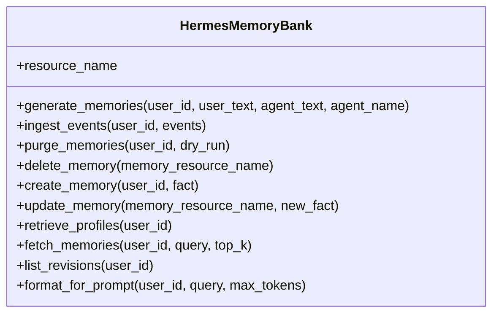
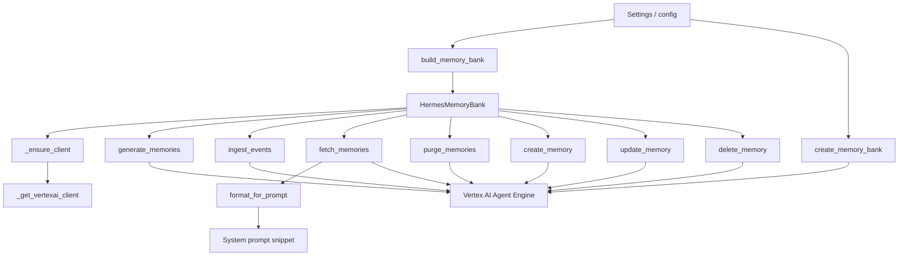

# Core Algorithms and Data Processing Logic

## Overview

This repository’s main computational problem is **memory lifecycle management for an AI assistant**: taking conversational or explicit facts, persisting them into Vertex AI Agent Engine memories, retrieving the most relevant memories later, formatting them into prompt-ready context, and supporting administrative operations like delete, update, and purge. The central implementation lives in [`memory.memory_bank`](memory/memory_bank.py#L1) and is encapsulated by the [`HermesMemoryBank`](memory/memory_bank.py#L79) facade.

At a high level, the project solves three related classes of work:

1. **Memory ingestion and distillation**  
   Conversation turns are transformed into durable memory records via [`HermesMemoryBank.generate_memories()`](memory/memory_bank.py#L105) or batched event streams via [`HermesMemoryBank.ingest_events()`](memory/memory_bank.py#L143).

2. **Memory retrieval and prompt construction**  
   Relevant memories are fetched using [`HermesMemoryBank.fetch_memories()`](memory/memory_bank.py#L331) and converted into a compact system-prompt snippet by [`HermesMemoryBank.format_for_prompt()`](memory/memory_bank.py#L381).

3. **Memory administration and provisioning**  
   The module also supports direct CRUD-style operations such as [`create_memory()`](memory/memory_bank.py#L250), [`update_memory()`](memory/memory_bank.py#L285), [`delete_memory()`](memory/memory_bank.py#L227), and resource provisioning through [`create_memory_bank()`](memory/memory_bank.py#L432).

The design is intentionally defensive: almost every public operation catches exceptions and degrades gracefully, returning `None`, `False`, `0`, `[]`, or `""` instead of raising, which makes the memory layer safe to use in request/response paths and fire-and-forget callbacks. This behavior is strongly reflected in the tests under [`tests/memory/test_memory_bank.py`](tests/memory/test_memory_bank.py#L1).

> **Sources:** `memory/memory_bank.py` · L1–L470 · [`memory.memory_bank`](memory/memory_bank.py#L1), [`HermesMemoryBank`](memory/memory_bank.py#L79), [`build_memory_bank`](memory/memory_bank.py#L411), [`create_memory_bank`](memory/memory_bank.py#L432)

## Algorithm Descriptions

### 1. Vertex AI Client Resolution and Compatibility Shim

The helper [`_get_vertexai_client(project, location)`](memory/memory_bank.py#L41) resolves a `vertexai.Client` while handling SDK compatibility and configuration fallback.

- **Input**: optional `project` and `location` arguments
- **Steps**:
  1. If `project` or `location` are omitted, call `get_settings()` to read defaults from configuration.
  2. Read `vertex_project` and `vertex_location` from settings via `getattr(...)`.
  3. Construct and return a `vertexai.Client`.
  4. If the SDK is too old or the expected client class is unavailable, raise an `ImportError` with a helpful message.
- **Output**: a configured Vertex AI client instance
- **Complexity**: O(1) time and space; the work is configuration lookup and object construction
- **Code Reference**: [`_get_vertexai_client()`](memory/memory_bank.py#L41) in `memory/memory_bank.py`

This is not an algorithm in the mathematical sense, but it is a key **initialization pipeline** that ensures downstream memory operations can be written against a single client abstraction.

> **Sources:** `memory/memory_bank.py` · L41–L74 · [`_get_vertexai_client`](memory/memory_bank.py#L41), [`get_settings`](memory/memory_bank.py#L41)

---

### 2. Conversation Turn Distillation

The [`HermesMemoryBank.generate_memories()`](memory/memory_bank.py#L105) method converts one user turn plus one agent response into durable memories.

- **Input**:
  - `user_id`
  - `user_text`
  - `agent_text`
  - optional `agent_name`
- **Steps**:
  1. Lazily initialize the Vertex client with [`_ensure_client()`](memory/memory_bank.py#L98).
  2. Build the SDK request for the `generate` operation.
  3. Wrap the blocking SDK call in `asyncio.to_thread(...)` so the async event loop is not blocked.
  4. Log debug details.
  5. Swallow any exception and log it rather than failing the caller.
- **Output**: `None` on success or failure; the effect is side-effectful persistence inside Vertex AI
- **Complexity**: O(1) wrapper work; actual SDK cost is external/network-bound
- **Code Reference**: [`HermesMemoryBank.generate_memories()`](memory/memory_bank.py#L105)

The tests show two important behavioral constraints: the client must be lazily initialized, and exceptions must be swallowed rather than propagated (`TestGenerateMemories` in [`tests/memory/test_memory_bank.py`](tests/memory/test_memory_bank.py#L48)).

> **Sources:** `memory/memory_bank.py` · L105–L141 · [`HermesMemoryBank.generate_memories`](memory/memory_bank.py#L105), [`HermesMemoryBank._ensure_client`](memory/memory_bank.py#L98)

---

### 3. Event Normalization and Batched Memory Ingestion

The [`HermesMemoryBank.ingest_events()`](memory/memory_bank.py#L143) pipeline is the most production-oriented ingestion path.

- **Input**:
  - `user_id`
  - `events`: a list of dictionaries containing `role` and `text`
- **Steps**:
  1. Initialize the client lazily.
  2. Iterate through the event list and normalize event roles.
  3. Convert `role == "agent"` into the SDK’s expected `"model"` role.
  4. Preserve `user` events as-is.
  5. Submit the normalized event batch to the SDK’s `ingest_events` RPC using `asyncio.to_thread(...)`.
  6. Log and swallow exceptions.
- **Output**: `None`; the memory bank batches and persists events internally
- **Complexity**: O(n) time and O(n) space for event normalization, where `n` is the number of events
- **Code Reference**: [`HermesMemoryBank.ingest_events()`](memory/memory_bank.py#L143)

This function is the clearest example of an internal **data transformation pipeline**: a small schema-normalization pass over raw event dictionaries before handing them to the backend. The tests explicitly verify role normalization from `agent` to `model` in [`TestIngestEvents.test_normalises_agent_role_to_model`](tests/memory/test_memory_bank.py#L351).

> **Sources:** `memory/memory_bank.py` · L143–L185 · [`HermesMemoryBank.ingest_events`](memory/memory_bank.py#L143)

---

### 4. Bulk Memory Purge

The [`HermesMemoryBank.purge_memories()`](memory/memory_bank.py#L187) method deletes all memories belonging to a user.

- **Input**:
  - `user_id`
  - `dry_run`
- **Steps**:
  1. Initialize the client lazily.
  2. Enumerate memories for the user.
  3. Count the candidate memories.
  4. If `dry_run` is enabled, return the count without deleting anything.
  5. Otherwise invoke the SDK purge operation in a background thread.
  6. Log and swallow exceptions.
- **Output**: number of memories deleted, or would be deleted in dry-run mode
- **Complexity**: O(n) time to enumerate memories; O(1) additional space aside from the returned list
- **Code Reference**: [`HermesMemoryBank.purge_memories()`](memory/memory_bank.py#L187)

The dry-run branch is important operationally: it gives administrators a safe way to estimate the impact of a purge before executing it. The tests validate both execution and dry-run behavior in [`TestPurgeMemories`](tests/memory/test_memory_bank.py#L373).

> **Sources:** `memory/memory_bank.py` · L187–L225 · [`HermesMemoryBank.purge_memories`](memory/memory_bank.py#L187)

---

### 5. Single-Memory CRUD Operations

The module includes three straightforward CRUD-like operations: [`delete_memory()`](memory/memory_bank.py#L227), [`create_memory()`](memory/memory_bank.py#L250), and [`update_memory()`](memory/memory_bank.py#L285).

#### Delete Memory
- **Input**: full `memory_resource_name`
- **Steps**:
  1. Initialize the client lazily.
  2. Call the SDK delete operation in a thread.
  3. Return `True` on success; `False` on failure.
- **Output**: boolean success flag
- **Complexity**: O(1)

#### Create Memory
- **Input**: `user_id`, `fact`
- **Steps**:
  1. Initialize the client lazily.
  2. Call the SDK create operation in a thread.
  3. Extract `resource_name` from the returned object using `getattr(...)`.
  4. Return the resource name or `None` on failure.
- **Output**: created memory resource name or `None`
- **Complexity**: O(1)

#### Update Memory
- **Input**: `memory_resource_name`, `new_fact`
- **Steps**:
  1. Initialize the client lazily.
  2. Call the SDK update operation in a thread.
  3. Return `True` on success; `False` on failure.
- **Output**: boolean success flag
- **Complexity**: O(1)

These methods are thin adapters over backend SDK methods, but they still matter because they enforce uniform error handling and isolate the rest of the application from SDK details.

> **Sources:** `memory/memory_bank.py` · L227–L313 · [`HermesMemoryBank.delete_memory`](memory/memory_bank.py#L227), [`HermesMemoryBank.create_memory`](memory/memory_bank.py#L250), [`HermesMemoryBank.update_memory`](memory/memory_bank.py#L285)

---

### 6. Memory Retrieval and Fact Extraction

The [`HermesMemoryBank.fetch_memories()`](memory/memory_bank.py#L331) method retrieves relevant memory records for a query.

- **Input**:
  - `user_id`
  - `query`
  - `top_k`
- **Steps**:
  1. Lazily initialize the client.
  2. Call the SDK retrieval method using the query and `top_k`.
  3. Iterate over returned memory objects.
  4. Extract `fact` attributes when present.
  5. Fall back to `str(memory)` if the object lacks a `fact` field.
  6. Return the collected fact strings.
  7. Return `[]` on any error.
- **Output**: list of memory strings
- **Complexity**: O(k) time and O(k) space, where `k` is the number of retrieved memories
- **Code Reference**: [`HermesMemoryBank.fetch_memories()`](memory/memory_bank.py#L331)

This is a simple but important post-processing step: the backend may return structured memory objects, but this method guarantees prompt-friendly plain text output. Tests cover both the normal path and the fallback stringification path in [`TestFetchMemories`](tests/memory/test_memory_bank.py#L106).

> **Sources:** `memory/memory_bank.py` · L331–L367 · [`HermesMemoryBank.fetch_memories`](memory/memory_bank.py#L331)

---

### 7. Prompt Formatting with Token Budgeting

The [`HermesMemoryBank.format_for_prompt()`](memory/memory_bank.py#L381) method transforms retrieved memories into a compact system prompt snippet.

- **Input**:
  - `user_id`
  - `query`
  - `max_tokens`
- **Steps**:
  1. Call [`fetch_memories()`](memory/memory_bank.py#L331) to retrieve relevant memories.
  2. If none are returned, emit an empty string.
  3. Build a prompt header and append memory lines incrementally.
  4. Track the cumulative size against the provided token budget.
  5. Stop appending once the budget would be exceeded.
  6. Join the lines into a single formatted string.
- **Output**: a prompt snippet, or `""` when no memories are available
- **Complexity**: O(k) time and O(k) space for `k` candidate memories
- **Code Reference**: [`HermesMemoryBank.format_for_prompt()`](memory/memory_bank.py#L381)

This is the clearest internal **packing algorithm** in the module. While the code’s token estimate is not visible in the analysis as a full tokenizer-based implementation, the tests show the contract: respect the `max_tokens` budget and preserve the expected header formatting.

> **Sources:** `memory/memory_bank.py` · L381–L406 · [`HermesMemoryBank.format_for_prompt`](memory/memory_bank.py#L381)

---

### 8. Memory Bank Build and Resource Provisioning

The top-level convenience functions [`build_memory_bank()`](memory/memory_bank.py#L411) and [`create_memory_bank()`](memory/memory_bank.py#L432) implement configuration-driven instantiation and resource provisioning.

#### Build Memory Bank
- **Input**: implicit configuration from `get_settings()`
- **Steps**:
  1. Read `MEMORY_BANK_RESOURCE_NAME` from settings.
  2. Return `None` if not configured.
  3. Construct a [`HermesMemoryBank`](memory/memory_bank.py#L79).
  4. Swallow errors and return `None`.
- **Output**: `HermesMemoryBank` instance or `None`
- **Complexity**: O(1)

#### Create Memory Bank
- **Input**:
  - `project`
  - `location`
  - `display_name`
- **Steps**:
  1. Resolve a Vertex client with [`_get_vertexai_client()`](memory/memory_bank.py#L41).
  2. List existing Agent Engine resources.
  3. Return the existing resource if the display name already matches.
  4. Otherwise create a new lightweight Agent Engine dedicated to memory storage.
  5. Return the new resource name.
- **Output**: resource name string
- **Complexity**: O(n) over existing engines for the list-and-match step
- **Code Reference**: [`build_memory_bank()`](memory/memory_bank.py#L411), [`create_memory_bank()`](memory/memory_bank.py#L432)

The provisioning flow is idempotent in spirit: the implementation checks existing engines before creating a new one. This matters for deploy-time scripts and makes repeated invocations safe.

> **Sources:** `memory/memory_bank.py` · L411–L470 · [`build_memory_bank`](memory/memory_bank.py#L411), [`create_memory_bank`](memory/memory_bank.py#L432)

## Data Structures

The implementation is light on custom schema types, but there are still a few key internal data structures worth documenting.

| Structure | Kind | Purpose | Key Fields / Shape | Evidence |
|---|---|---|---|---|
| [`HermesMemoryBank`](memory/memory_bank.py#L79) | class | Facade over Agent Engine memories | `resource_name`, lazy `client` | [`HermesMemoryBank`](memory/memory_bank.py#L79) |
| Event dicts | runtime dict schema | Input to batched ingestion | `{"role": "user" \| "agent" \| "model", "text": "..."}` | [`HermesMemoryBank.ingest_events`](memory/memory_bank.py#L143) |
| Memory objects | SDK-returned objects | Retrieval results from Vertex AI | May expose `fact`; otherwise stringified | [`HermesMemoryBank.fetch_memories`](memory/memory_bank.py#L331) |
| Settings object | config object | Source of `vertex_project`, `vertex_location`, `MEMORY_BANK_RESOURCE_NAME` | Accessed via `getattr(...)` | [`_get_vertexai_client`](memory/memory_bank.py#L41), [`build_memory_bank`](memory/memory_bank.py#L411) |

### Class Diagram

The class diagram is intentionally simple because the module is not built around a deep object hierarchy. Instead, [`HermesMemoryBank`](memory/memory_bank.py#L79) serves as an operational facade with a handful of specialized processing methods.

> **Sources:** `memory/memory_bank.py` · L79–L470 · [`HermesMemoryBank`](memory/memory_bank.py#L79)

## Processing Pipeline

The end-to-end pipeline starts with application configuration, moves through lazy client initialization, and then branches into ingestion or retrieval depending on the runtime need.

### End-to-End Interpretation

1. Configuration is read from settings.
2. [`build_memory_bank()`](memory/memory_bank.py#L411) may create a ready-to-use facade if a memory bank resource exists.
3. If the caller needs provisioning, [`create_memory_bank()`](memory/memory_bank.py#L432) creates or reuses a backend Agent Engine resource.
4. Runtime operations on [`HermesMemoryBank`](memory/memory_bank.py#L79) lazily initialize the SDK client through [`_ensure_client()`](memory/memory_bank.py#L98) and [`_get_vertexai_client()`](memory/memory_bank.py#L41).
5. Conversation data is either:
   - distilled and persisted via [`generate_memories()`](memory/memory_bank.py#L105), or
   - normalized and ingested in batches via [`ingest_events()`](memory/memory_bank.py#L143).
6. At session start, relevant memories are retrieved via [`fetch_memories()`](memory/memory_bank.py#L331) and packed by [`format_for_prompt()`](memory/memory_bank.py#L381) into prompt context.

This pipeline is deliberately **failure-tolerant**: the implementation favors returning empty/default values over surfacing backend failures into the application flow.

> **Sources:** `memory/memory_bank.py` · L41–L470 · [`build_memory_bank`](memory/memory_bank.py#L411), [`create_memory_bank`](memory/memory_bank.py#L432), [`HermesMemoryBank.format_for_prompt`](memory/memory_bank.py#L381)

## Notes on Observability and Test Coverage

The test suite in [`tests/memory/test_memory_bank.py`](tests/memory/test_memory_bank.py#L1) gives strong evidence about the intended algorithmic behavior:

- lazy client initialization
- event role normalization
- dry-run purge behavior
- fallback stringification for retrieved memory objects
- token-budget-aware prompt formatting
- idempotent memory bank creation logic

One gap is that the repository snapshot does not include production callers, so the exact upstream request flow into [`HermesMemoryBank`](memory/memory_bank.py#L79) is not visible here. However, the API surface and tests clearly establish how the memory processing logic is meant to behave.

> **Sources:** `tests/memory/test_memory_bank.py` · L32–L490 · [`TestGenerateMemories`](tests/memory/test_memory_bank.py#L48), [`TestFetchMemories`](tests/memory/test_memory_bank.py#L106), [`TestFormatForPrompt`](tests/memory/test_memory_bank.py#L163), [`TestCreateMemoryBank`](tests/memory/test_memory_bank.py#L263)