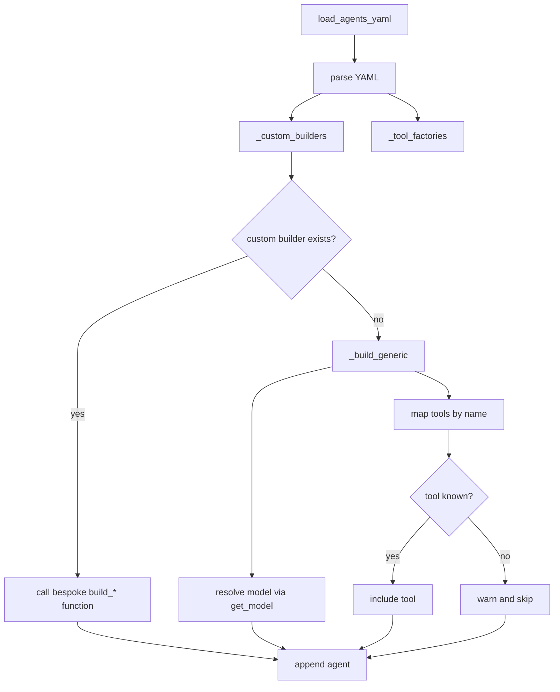
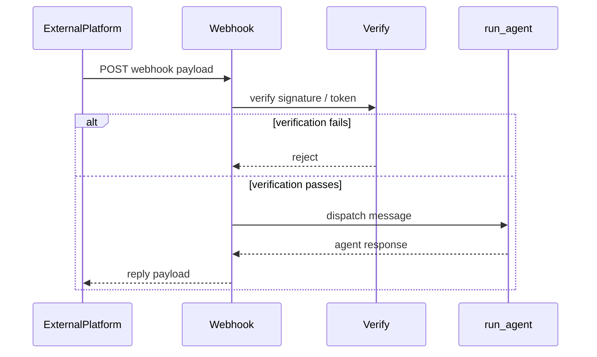
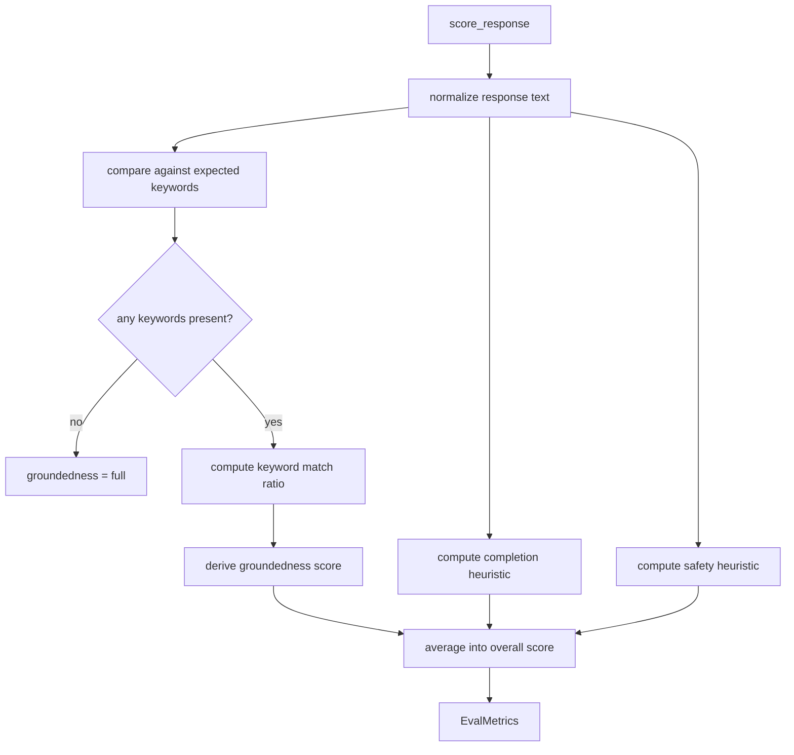
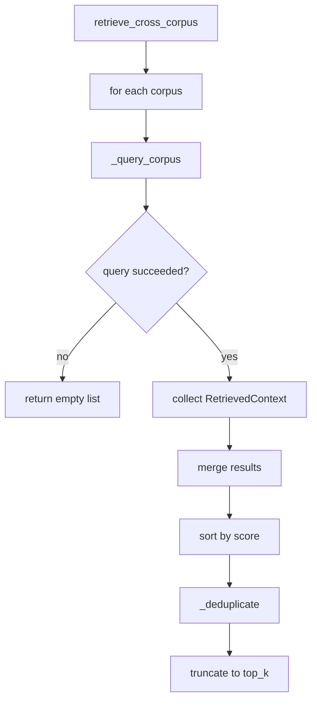

# Internal Algorithms and Decision Logic

## Scope

This page focuses on the nontrivial implementation logic visible in the repository’s symbol graph: agent construction heuristics, webhook authentication and verification, evaluation scoring, and the main routing / data-processing flows. It intentionally avoids repeating high-level architecture and test-only helper details.

The most important algorithmic surfaces are:

- Agent assembly and fallback selection in [`agents/loader.py`](agents/loader.py)
- Slack / Teams request verification in [`connectors/slack.py`](connectors/slack.py) and [`connectors/teams.py`](connectors/teams.py)
- Offline evaluation scoring in [`eval/metrics.py`](eval/metrics.py) and asynchronous quality logging in [`eval/online_monitor.py`](eval/online_monitor.py)
- Memory and text-processing pipelines in [`memory/context_budget.py`](memory/context_budget.py), [`memory/cross_corpus.py`](memory/cross_corpus.py), [`memory/skill_loader.py`](memory/skill_loader.py), and [`memory/skill_store.py`](memory/skill_store.py)

> **Sources:** `agents/loader.py` · `connectors/slack.py` · `connectors/teams.py` · `eval/metrics.py` · `eval/online_monitor.py` · `memory/context_budget.py` · `memory/cross_corpus.py` · `memory/skill_loader.py` · `memory/skill_store.py`

## Agent-Building Heuristics

The agent loader is where the repository decides whether a YAML entry becomes a generic agent or is dispatched to a bespoke constructor. The core flow is driven by [`build_agents_from_yaml`](agents/loader.py#L147), which first parses the YAML via [`load_agents_yaml`](agents/loader.py#L133), then resolves tools and custom builders, and finally falls back to [`_build_generic`](agents/loader.py#L181) when no special-case builder exists.

A key detail is environment substitution. [`_resolve_env_vars`](agents/loader.py#L125) supports `${VAR:-default}` patterns using `os.environ`, so YAML values can remain portable across environments without requiring pre-rendering. This is a small but important heuristic: config is treated as partially templated, not static.

Tool selection is also heuristic-driven. [`_tool_factories`](agents/loader.py#L47) builds a lookup table of tool constructors from `settings`, then the builder logic maps YAML tool names to callables. If a tool name is unknown, the implementation logs a warning and skips it rather than failing the entire agent build. This makes the loader resilient to partially migrated configurations.

The custom-builder shortcut is explicit in [`_custom_builders`](agents/loader.py#L107), which returns the set of known domain-specific constructors. If the YAML `name` matches one of those known builders, the loader uses it; otherwise [`_build_generic`](agents/loader.py#L181) synthesizes an `LlmAgent` from the YAML fields. This gives the system a two-tier policy:

1. Prefer bespoke agents when the repository knows how to build them.
2. Otherwise, interpret YAML as a generic `LlmAgent` spec.

The generic builder also sorts / normalizes tool references and emits warnings when tools are unavailable. That means build success is based on “best effort” completeness rather than strict schema enforcement.

### Key Function Table

| Function | Inputs | Outputs | Decision Logic | Edge Cases |
|---|---|---|---|---|
| [`_resolve_env_vars`](agents/loader.py#L125) | Raw YAML text | YAML text with substitutions applied | Replaces `${VAR:-default}` from `os.environ` | Missing env vars fall back to defaults |
| [`_tool_factories`](agents/loader.py#L47) | `settings` | Tool factory map | Builds tool constructors from runtime config | Tools may be unavailable depending on settings |
| [`_custom_builders`](agents/loader.py#L107) | None | Builder map | Declares known domain-specific agent constructors | Unknown names are not errors |
| [`build_agents_from_yaml`](agents/loader.py#L147) | `settings`, `yaml_path` | List of `LlmAgent` instances | YAML parsing → custom builder lookup → generic fallback | Invalid / partial entries are skipped with warnings |
| [`_build_generic`](agents/loader.py#L181) | Config dict, `settings`, `tool_map` | `LlmAgent` | Converts YAML fields into agent constructor args | Unknown tools logged and omitted |

### Flowchart: YAML-to-Agent Resolution

> **Sources:** `agents/loader.py` · L47–L203 · [`_tool_factories`](agents/loader.py#L47) · [`_custom_builders`](agents/loader.py#L107) · [`_resolve_env_vars`](agents/loader.py#L125) · [`load_agents_yaml`](agents/loader.py#L133) · [`build_agents_from_yaml`](agents/loader.py#L147) · [`_build_generic`](agents/loader.py#L181)

## Webhook Verification Flow

The webhook code uses explicit cryptographic verification before any agent execution is triggered. This is not just input validation; it is the security boundary that decides whether the request is eligible to reach the agent runtime.

### Slack signature verification

[`_verify_slack_signature`](connectors/slack.py#L44) implements Slack’s HMAC-SHA256 request verification. The flow is:

1. Extract the timestamp and raw body.
2. Recompute the expected signature from the signing secret and request contents.
3. Reject requests if the timestamp is too old.
4. Use constant-time comparison to avoid timing leaks.

The function’s design shows two orthogonal checks:
- **freshness** via timestamp skew protection
- **authenticity** via signature matching

The webhook entrypoint [`slack_webhook`](connectors/slack.py#L68) then handles distinct Slack payload classes:
- `url_verification` challenge during app setup
- message events for DMs and app mentions

It ignores the rest rather than trying to be a generic event processor.

### Teams token verification

[`_verify_teams_token`](connectors/teams.py#L66) validates the Bot Framework JWT using a cached JWKS retrieved by [`_get_jwks`](connectors/teams.py#L50). The algorithm is standard token verification with a repository-specific policy check layered on top:

1. Inspect token header to select the key id.
2. Pull the matching JWK from the cached set.
3. Decode and verify the JWT signature and claims.
4. Confirm the token is intended for the configured app identity.

The webhook [`teams_webhook`](connectors/teams.py#L93) only processes `Activity` type `message`; all other activity types are acknowledged silently. That means the routing policy is intentionally narrow and conservative.

### Verification comparison

| Function | Input | Output | Security Check | Failure Mode |
|---|---|---|---|---|
| [`_verify_slack_signature`](connectors/slack.py#L44) | `signing_secret`, `timestamp`, `raw_body`, `signature` | `bool` | HMAC-SHA256 + timestamp freshness | Rejects forged or stale requests |
| [`_verify_teams_token`](connectors/teams.py#L66) | JWT `token`, `app_id` | `bool` | JWKS-backed JWT verification | Rejects invalid / mis-scoped tokens |

### Sequence diagram: webhook gating

> **Sources:** `connectors/slack.py` · L44–L153 · [`_verify_slack_signature`](connectors/slack.py#L44) · [`slack_webhook`](connectors/slack.py#L68) · `connectors/teams.py` · L50–L185 · [`_get_jwks`](connectors/teams.py#L50) · [`_verify_teams_token`](connectors/teams.py#L66) · [`teams_webhook`](connectors/teams.py#L93)

## Evaluation Scoring

The offline evaluator in [`score_response`](eval/metrics.py#L23) uses a deliberately simple, fully local scoring model. Its logic is keyword-centric, which makes the result deterministic and easy to reproduce without any model calls.

The scoring behavior is centered on three dimensions represented by [`EvalMetrics`](eval/metrics.py#L13):
- groundedness
- task completion
- safety
- overall score as an aggregate

The function computes these from the response text and expected keywords. The graph evidence shows case-insensitive comparisons, explicit length-based heuristics, and averaging. The evaluation is therefore not semantic in the LLM sense; it is a rule-based proxy metric.

A notable edge case is the empty keyword set: the implementation treats that as full groundedness rather than a failure, which avoids penalizing prompts that do not define any keyword targets. This is consistent with the test evidence, but the underlying code path in the graph is the important part: the scorer must be able to return sensible values when one or more dimensions are intentionally unspecified.

`log_quality_score` in [`eval/online_monitor.py`](eval/online_monitor.py#L21) takes the same metric object and writes a row to BigQuery asynchronously. The function is explicitly documented as failing silently, which means quality telemetry must never interfere with user-facing latency or correctness.

### Key Function Table

| Function | Inputs | Outputs | Heuristic / Logic | Edge Cases |
|---|---|---|---|---|
| [`score_response`](eval/metrics.py#L23) | `response`, `expected_keywords`, `context` | [`EvalMetrics`](eval/metrics.py#L13) | Case-insensitive keyword matching, length-based completion, safety checks, averaging | Empty keyword lists, short responses |
| [`log_quality_score`](eval/online_monitor.py#L21) | `user_id`, `agent_name`, `query`, `response`, `metrics`, `config` | None | Asynchronous BigQuery insert | Any failure is swallowed |
| [`build_online_monitor`](eval/online_monitor.py#L58) | None | `MonitorConfig` or `None` | Enabled only when project config exists | Returns `None` cleanly when disabled |

### Metrics decision flow

> **Sources:** `eval/metrics.py` · L13–L52 · [`EvalMetrics`](eval/metrics.py#L13) · [`score_response`](eval/metrics.py#L23) · `eval/online_monitor.py` · L21–L66 · [`log_quality_score`](eval/online_monitor.py#L21) · [`build_online_monitor`](eval/online_monitor.py#L58)

## Data-Processing and Routing Logic

Several modules implement compact but nontrivial data-processing pipelines. These are worth reading together because they share a pattern: normalize early, discard invalid records quietly, and preserve ordering or priority where it matters.

### Memory budgeting and prompt assembly

[`build_context_summary`](memory/context_budget.py#L37) constructs a prompt-ready summary from a user profile plus a ranked skill list. The process is budget-aware:
- the profile is included first as Tier 1 if present
- then skills are admitted in priority order
- once the token budget is exhausted, additional items are dropped

[`prioritise_memory`](memory/context_budget.py#L94) performs the trimming step. Its semantics are simple but important: it assumes the caller has already ranked items in priority order, and it returns the largest prefix that fits the budget. This preserves determinism and avoids trying to reshuffle the ranking inside the function.

### Cross-corpus retrieval and deduplication

[`retrieve_cross_corpus`](memory/cross_corpus.py#L64) queries multiple RAG corpora, merges all candidate results, sorts them by score, and then deduplicates them through [`_deduplicate`](memory/cross_corpus.py#L53). The algorithm is intentionally tolerant:
- each corpus query is isolated by [`_query_corpus`](memory/cross_corpus.py#L27)
- failures on one corpus return an empty list instead of aborting the whole search
- duplicate text is removed using normalized text keys

This means the overall query path is “fail-soft” across corpora while still returning a ranked final set.

### Skill loading and parsing

[`load_skills_from_dir`](memory/skill_loader.py#L42) scans `*.md` files via [`_iter_skill_files`](memory/skill_loader.py#L77), ignores `TEMPLATE.md`, and parses each candidate through [`_parse_skill_file`](memory/skill_loader.py#L85). The parsing logic is defensive:
- files with no frontmatter are silently skipped as likely docs/notes
- frontmatter present but missing required fields raises a warning-worthy error
- procedure steps are extracted through [`_extract_procedure`](memory/skill_loader.py#L133)

This approach separates “not a skill file” from “malformed skill file,” which improves operational ergonomics.

### RAG skill serialization and versioning

[`Skill.to_rag_text`](memory/skill_models.py#L34) serializes a skill into a text blob suitable for corpus ingestion. Later, [`_parse_rag_text`](memory/skill_store.py#L73) reconstructs the object from that representation. On top of that, [`upsert_skill`](memory/skill_store.py#L115) uses a near-duplicate heuristic: it searches existing entries, and if one with the same `skill_id` exceeds a version threshold, it archives the older version before inserting the new one.

That makes versioning a content-similarity decision rather than a pure ID overwrite.

### Summary table

| Function | Processed Data | Main Output | Routing / Normalization Rule | Edge Cases |
|---|---|---|---|---|
| [`build_context_summary`](memory/context_budget.py#L37) | Profile + skills | Prompt string | Tiered inclusion under token budget | Returns empty string if nothing fits |
| [`prioritise_memory`](memory/context_budget.py#L94) | Ranked items | Trimmed list | Keeps priority order intact | Empty input / zero budget |
| [`retrieve_cross_corpus`](memory/cross_corpus.py#L64) | Multiple corpora | Deduplicated contexts | Merge → sort → dedupe | One corpus can fail independently |
| [`load_skills_from_dir`](memory/skill_loader.py#L42) | Markdown files | `Skill` list | Skip templates and non-skill docs | Warnings for malformed frontmatter |
| [`upsert_skill`](memory/skill_store.py#L115) | New `Skill` | Inserted / archived version | Duplicate detection by similarity | Falls back on archive-first behavior |

### Flowchart: cross-corpus retrieval

> **Sources:** `memory/context_budget.py` · L37–L111 · [`build_context_summary`](memory/context_budget.py#L37) · [`prioritise_memory`](memory/context_budget.py#L94) · `memory/cross_corpus.py` · L21–L94 · [`RetrievedContext`](memory/cross_corpus.py#L21) · [`_query_corpus`](memory/cross_corpus.py#L27) · [`_deduplicate`](memory/cross_corpus.py#L53) · [`retrieve_cross_corpus`](memory/cross_corpus.py#L64) · `memory/skill_loader.py` · L42–L154 · [`load_skills_from_dir`](memory/skill_loader.py#L42) · [`_iter_skill_files`](memory/skill_loader.py#L77) · [`_parse_skill_file`](memory/skill_loader.py#L85) · [`_extract_procedure`](memory/skill_loader.py#L133) · `memory/skill_models.py` · L15–L61 · [`Skill`](memory/skill_models.py#L15) · [`Skill.to_rag_text`](memory/skill_models.py#L34) · `memory/skill_store.py` · L29–L171 · [`_get_corpus_name`](memory/skill_store.py#L29) · [`_parse_rag_text`](memory/skill_store.py#L73) · [`upsert_skill`](memory/skill_store.py#L115)

## Routing Logic in Connector Replies

The connector-side routing logic is intentionally narrow: each platform gets its own message extraction and reply strategy, but both converge on the same agent execution entrypoint [`run_agent`](connectors/runner.py#L34).

### Slack

[`slack_webhook`](connectors/slack.py#L68) extracts message content from the event payload, ignores non-message events, and replies using Slack’s API. The helper [`_split_text`](connectors/slack.py#L146) breaks long replies into chunks so the platform can accept them without exceeding message-size constraints. This is a simple linear chunking algorithm: it appends slices up to a limit and emits a sequence of text chunks.

### Teams

[`teams_webhook`](connectors/teams.py#L93) only responds to `message` activities and ignores other activity types. Once a response is produced, [`_send_teams_reply`](connectors/teams.py#L150) posts a Bot Framework activity back to the conversation. The response path includes a normalization step that strips protocol prefixes and handles the reply threading identifiers.

### Telegram

[`telegram_webhook`](connectors/telegram.py#L61) follows the same pattern: accept only text message updates, run the agent, then reply via [`_send_message`](connectors/telegram.py#L40). Its own [`_split_text`](connectors/telegram.py#L50) mirrors the Slack chunking utility, which suggests the project treats long-response fragmentation as a platform-level concern rather than an agent concern.

> **Sources:** `connectors/runner.py` · L28–L87 · [`_platform_session_id`](connectors/runner.py#L28) · [`run_agent`](connectors/runner.py#L34) · `connectors/slack.py` · L68–L153 · [`slack_webhook`](connectors/slack.py#L68) · [`_split_text`](connectors/slack.py#L146) · `connectors/teams.py` · L93–L185 · [`teams_webhook`](connectors/teams.py#L93) · [`_send_teams_reply`](connectors/teams.py#L150) · `connectors/telegram.py` · L40–L100 · [`_send_message`](connectors/telegram.py#L40) · [`_split_text`](connectors/telegram.py#L50) · [`telegram_webhook`](connectors/telegram.py#L61)