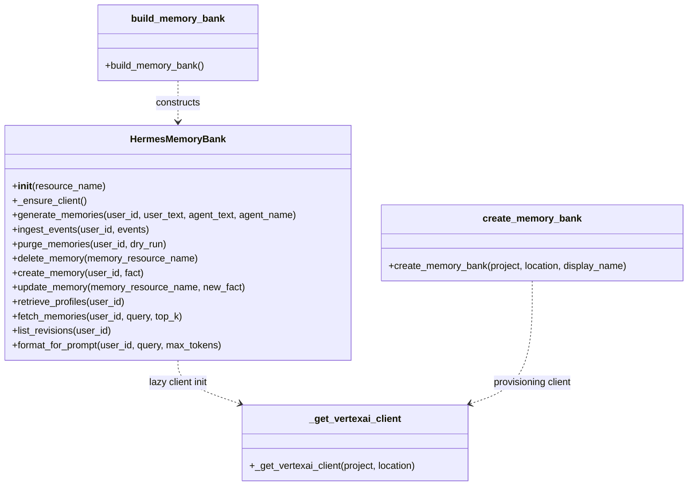
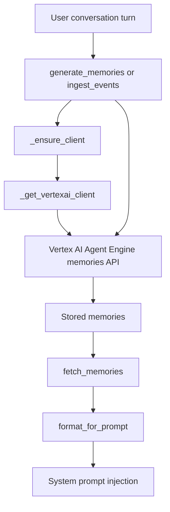

# Memory Bank Algorithms and Data Processing

## Overview

This project solves a focused but important data-processing problem: it turns conversational turns and user-authored facts into durable, queryable memory records backed by Vertex AI Agent Engine memories, then retrieves and formats those memories for prompt injection at session start. The core implementation lives in [`memory.memory_bank`](memory/memory_bank.py#L1), centered around the [`HermesMemoryBank`](memory/memory_bank.py#L79) facade.

From the available symbols, the computational responsibilities fall into three categories:

1. **Memory ingestion / consolidation**
   - Convert a conversation turn or a stream of events into a write to the remote memory store.
   - This includes fire-and-forget generation via [`HermesMemoryBank.generate_memories`](memory/memory_bank.py#L105) and batched event ingestion via [`HermesMemoryBank.ingest_events`](memory/memory_bank.py#L143).

2. **Memory retrieval / ranking**
   - Query the memory store for relevant memories based on a user ID and search query.
   - Implemented by [`HermesMemoryBank.fetch_memories`](memory/memory_bank.py#L331), which returns memory facts as plain strings.

3. **Memory lifecycle management**
   - Create, update, delete, and purge memories.
   - Implemented by [`HermesMemoryBank.create_memory`](memory/memory_bank.py#L250), [`HermesMemoryBank.update_memory`](memory/memory_bank.py#L285), [`HermesMemoryBank.delete_memory`](memory/memory_bank.py#L227), and [`HermesMemoryBank.purge_memories`](memory/memory_bank.py#L187).

A secondary problem solved by the module is **SDK compatibility and graceful degradation**. The helper [`_get_vertexai_client`](memory/memory_bank.py#L41) abstracts Vertex AI client construction and handles missing/older SDK behavior, while [`build_memory_bank`](memory/memory_bank.py#L411) returns `None` when the feature is not configured.

> **Sources:** `memory/memory_bank.py` · L1–L498 · [`memory.memory_bank`](memory/memory_bank.py#L1), [`HermesMemoryBank`](memory/memory_bank.py#L79), [`_get_vertexai_client`](memory/memory_bank.py#L41), [`build_memory_bank`](memory/memory_bank.py#L411)

## Algorithm Descriptions

### 1) Vertex AI client bootstrap and compatibility resolution

- **Input**: optional `project` and `location` values, plus the runtime settings object accessed by [`get_settings`](memory/memory_bank.py#L41).
- **Steps**:
  1. Check whether `project` and `location` were explicitly provided.
  2. If not, fall back to configured settings values.
  3. Construct and return a [`VertexClient`](memory/memory_bank.py#L41)-compatible client.
  4. If the installed SDK is too old or incompatible, raise an `ImportError` with a helpful message.
- **Output**: a configured Vertex AI client instance.
- **Complexity**: `O(1)` time and `O(1)` space; it is pure configuration/bootstrap logic.
- **Code Reference**: [`_get_vertexai_client(project, location)`](memory/memory_bank.py#L41)

This function is foundational because nearly every mutating or read operation in [`HermesMemoryBank`](memory/memory_bank.py#L79) depends on lazy client initialization via [`HermesMemoryBank._ensure_client`](memory/memory_bank.py#L98). Its main algorithmic purpose is not computation, but robust dependency setup.

> **Sources:** `memory/memory_bank.py` · L41–L74 · [`_get_vertexai_client`](memory/memory_bank.py#L41), [`HermesMemoryBank._ensure_client`](memory/memory_bank.py#L98)

### 2) Fire-and-forget memory generation from a conversation turn

- **Input**: `user_id`, `user_text`, `agent_text`, and optional `agent_name` as defined by [`HermesMemoryBank.generate_memories`](memory/memory_bank.py#L105).
- **Steps**:
  1. Lazily initialize the client with [`_ensure_client`](memory/memory_bank.py#L98).
  2. Build a remote call payload from the user’s and agent’s latest utterances.
  3. If an `agent_name` is present, attach it to the event metadata.
  4. Execute the blocking SDK `generate` call inside `asyncio.to_thread` so the async caller is not blocked.
  5. Swallow exceptions and log/debug rather than failing the user request path.
- **Output**: no direct return value; side effect is durable memory generation in the remote backend.
- **Complexity**: `O(1)` local work, plus remote API latency. Space is `O(1)`.
- **Code Reference**: [`HermesMemoryBank.generate_memories(...)`](memory/memory_bank.py#L105)

The tests show this path is intentionally defensive: exceptions are swallowed and the client is initialized lazily, indicating the algorithm is designed for best-effort persistence rather than transactional guarantees.

> **Sources:** `memory/memory_bank.py` · L105–L141 · [`HermesMemoryBank.generate_memories`](memory/memory_bank.py#L105), [`HermesMemoryBank._ensure_client`](memory/memory_bank.py#L98)

### 3) Batched event ingestion for automatic memory generation

- **Input**: `user_id` and `events`, where each event dict contains a `role` and `text` field.
- **Steps**:
  1. Lazily initialize the client.
  2. Normalize each event into the schema required by the SDK.
  3. Convert application roles into SDK-compatible roles; the tests show `agent` is normalized to `model`.
  4. Submit the batched event list to the SDK’s `ingest_events` RPC using `asyncio.to_thread`.
  5. Swallow any exception to preserve application flow.
- **Output**: no direct return value; the remote service batches and triggers memory generation automatically.
- **Complexity**: `O(n)` in the number of input events for normalization, `O(n)` space for the outgoing event payload.
- **Code Reference**: [`HermesMemoryBank.ingest_events(...)`](memory/memory_bank.py#L143)

This is the more production-oriented pipeline compared with [`generate_memories`](memory/memory_bank.py#L105) because it delegates batching and extraction timing to the backend service. The tests explicitly verify role normalization and payload shaping.

> **Sources:** `memory/memory_bank.py` · L143–L185 · [`HermesMemoryBank.ingest_events`](memory/memory_bank.py#L143)

### 4) Bulk purge of a user’s memories

- **Input**: `user_id` and `dry_run` flag.
- **Steps**:
  1. Initialize the client.
  2. List all memories for the user.
  3. If `dry_run` is enabled, return the count without deleting anything.
  4. Otherwise, invoke the SDK purge operation with `force=True` semantics implied by the tests.
  5. Return the number of memories purged, or `0` on failure.
- **Output**: integer count of deleted or would-be-deleted memories.
- **Complexity**: `O(n)` in the number of memories listed; space is `O(n)` if the list is materialized locally.
- **Code Reference**: [`HermesMemoryBank.purge_memories(...)`](memory/memory_bank.py#L187)

The important algorithmic detail here is the two-phase behavior: enumerate first, then optionally delete. That makes `dry_run` cheap and safe for operational inspection.

> **Sources:** `memory/memory_bank.py` · L187–L225 · [`HermesMemoryBank.purge_memories`](memory/memory_bank.py#L187)

### 5) Single-memory CRUD operations

#### Delete a specific memory

- **Input**: `memory_resource_name`
- **Steps**:
  1. Initialize the client.
  2. Call the SDK delete method for the resource name.
  3. Return `True` on success, `False` on exception.
- **Output**: boolean success/failure
- **Complexity**: `O(1)` local work
- **Code Reference**: [`HermesMemoryBank.delete_memory(...)`](memory/memory_bank.py#L227)

#### Create a memory fact directly

- **Input**: `user_id`, `fact`
- **Steps**:
  1. Initialize the client.
  2. Submit a direct create request to the memory service.
  3. Read the created object’s resource name using `getattr`-style defensive access.
  4. Return the new resource name, or `None` if creation fails.
- **Output**: resource name string or `None`
- **Complexity**: `O(1)` local work
- **Code Reference**: [`HermesMemoryBank.create_memory(...)`](memory/memory_bank.py#L250)

#### Update an existing memory

- **Input**: `memory_resource_name`, `new_fact`
- **Steps**:
  1. Initialize the client.
  2. Call the SDK update operation with the corrected fact.
  3. Return `True` on success, `False` on exception.
- **Output**: boolean
- **Complexity**: `O(1)`
- **Code Reference**: [`HermesMemoryBank.update_memory(...)`](memory/memory_bank.py#L285)

> **Sources:** `memory/memory_bank.py` · L227–L313 · [`HermesMemoryBank.delete_memory`](memory/memory_bank.py#L227), [`HermesMemoryBank.create_memory`](memory/memory_bank.py#L250), [`HermesMemoryBank.update_memory`](memory/memory_bank.py#L285)

### 6) Memory retrieval and fact extraction

- **Input**: `user_id`, `query`, `top_k`
- **Steps**:
  1. Initialize the client.
  2. Call the backend retrieval API scoped to the user and query.
  3. Collect the top `k` results.
  4. For each returned object, read `.fact` when present; otherwise fall back to `str(memory)`.
  5. Return a list of plain fact strings.
  6. On error, return an empty list.
- **Output**: list of strings, each a memory fact
- **Complexity**: `O(k)` for the result materialization; space `O(k)`
- **Code Reference**: [`HermesMemoryBank.fetch_memories(...)`](memory/memory_bank.py#L331)

This is the primary read-side algorithm. The tests show a significant robustness feature: if the SDK returns memory objects without a `fact` attribute, the code degrades to stringification rather than failing. That makes downstream prompt formatting predictable.

> **Sources:** `memory/memory_bank.py` · L331–L367 · [`HermesMemoryBank.fetch_memories`](memory/memory_bank.py#L331)

### 7) Prompt snippet assembly with token budget awareness

- **Input**: `user_id`, `query`, `max_tokens`
- **Steps**:
  1. Call [`fetch_memories`](memory/memory_bank.py#L331) to retrieve candidate facts.
  2. If no memories are found, return an empty string.
  3. Build a system-prompt-style snippet with a header and bullet/list formatting.
  4. Truncate or stop appending once the token budget is approached.
  5. Return the final formatted string.
- **Output**: a prompt-ready string for system prompt injection
- **Complexity**: `O(k)` in the number of retrieved memories, plus string assembly cost.
- **Code Reference**: [`HermesMemoryBank.format_for_prompt(...)`](memory/memory_bank.py#L381)

This is the final transformation step in the pipeline. It bridges storage-backed memory retrieval with LLM prompt construction, making memory actionable.

> **Sources:** `memory/memory_bank.py` · L381–L406 · [`HermesMemoryBank.format_for_prompt`](memory/memory_bank.py#L381)

### 8) Memory-bank lifecycle provisioning

- **Input**: configured settings, especially `MEMORY_BANK_RESOURCE_NAME`, and provisioning parameters for project/location/display name.
- **Steps**:
  1. Read runtime settings.
  2. If the resource name is not configured, return `None` to degrade gracefully.
  3. Otherwise create a [`HermesMemoryBank`](memory/memory_bank.py#L79) wrapper around the configured resource.
  4. Catch and suppress failures, returning `None`.
- **Output**: `HermesMemoryBank` instance or `None`
- **Complexity**: `O(1)`
- **Code Reference**: [`build_memory_bank()`](memory/memory_bank.py#L411)

This is a configuration gate rather than a computational algorithm, but it is important in the data path because it decides whether memory processing is active at runtime.

> **Sources:** `memory/memory_bank.py` · L411–L427 · [`build_memory_bank`](memory/memory_bank.py#L411)

### 9) Memory-bank resource creation / idempotent provisioning

- **Input**: `project`, `location`, `display_name`
- **Steps**:
  1. Initialize a Vertex client with [`_get_vertexai_client`](memory/memory_bank.py#L41).
  2. Inspect existing Agent Engine resources via `list`.
  3. Compare each resource’s display name against the target display name.
  4. If a match is found, reuse it and return its resource name.
  5. Otherwise create a new lightweight Agent Engine dedicated to memory storage.
  6. Return the new engine’s resource name.
- **Output**: AgentEngine resource name string
- **Complexity**: `O(n)` in number of existing engines inspected; space `O(1)` excluding SDK objects.
- **Code Reference**: [`create_memory_bank(project, location, display_name)`](memory/memory_bank.py#L432)

This function implements an idempotent provisioning algorithm. Its key property is “reuse if existing,” which prevents duplicate memory banks across repeated setup runs.

> **Sources:** `memory/memory_bank.py` · L432–L498 · [`create_memory_bank`](memory/memory_bank.py#L432), [`_get_vertexai_client`](memory/memory_bank.py#L41)

## Data Structures

The internal data model is intentionally lightweight. The module uses a facade class plus simple dict/list payloads and SDK-returned objects.

| Data Structure | Kind | Fields / Shape | Used By | Notes |
|---|---|---|---|---|
| [`HermesMemoryBank`](memory/memory_bank.py#L79) | class | `resource_name`, cached client, async methods | all algorithms | Main facade over the Vertex AI memories API |
| Event dict | `dict[str, str]` | `role`, `text` | [`ingest_events`](memory/memory_bank.py#L143) | Input is normalized before SDK submission |
| Memory fact string | `str` | raw fact text | [`fetch_memories`](memory/memory_bank.py#L331), [`format_for_prompt`](memory/memory_bank.py#L381) | Output format preferred for prompt injection |
| Resource name string | `str` | full Agent Engine or memory resource path | CRUD/provisioning methods | Example shown in docstrings under `projects/.../reasoningEngines/...` |
| SDK memory object | external object | may expose `.fact` or stringify meaningfully | [`fetch_memories`](memory/memory_bank.py#L331) | Code defensively falls back to `str(memory)` |
| Settings object | config schema | includes `MEMORY_BANK_RESOURCE_NAME`, project, location | [`_get_vertexai_client`](memory/memory_bank.py#L41), [`build_memory_bank`](memory/memory_bank.py#L411) | Observed via `get_settings` and `getattr` |

A class diagram of the main facade and its helper relationship:

> **Sources:** `memory/memory_bank.py` · L79–L498 · [`HermesMemoryBank`](memory/memory_bank.py#L79), [`_get_vertexai_client`](memory/memory_bank.py#L41), [`build_memory_bank`](memory/memory_bank.py#L411), [`create_memory_bank`](memory/memory_bank.py#L432)

## Processing Pipeline

The end-to-end processing pipeline connects conversation data to prompt-ready memory context:

### Pipeline interpretation

1. **Capture**: a user turn or event stream is passed into [`generate_memories`](memory/memory_bank.py#L105) or [`ingest_events`](memory/memory_bank.py#L143).
2. **Initialize**: the first API call triggers lazy client setup through [`_ensure_client`](memory/memory_bank.py#L98) and [`_get_vertexai_client`](memory/memory_bank.py#L41).
3. **Persist**: the SDK writes to the remote Agent Engine memories backend.
4. **Retrieve**: at session start, [`fetch_memories`](memory/memory_bank.py#L331) queries relevant facts.
5. **Format**: [`format_for_prompt`](memory/memory_bank.py#L381) converts facts into a compact prompt snippet.
6. **Inject**: the resulting text is inserted into the system prompt by the caller.

### Algorithmic characteristics of the pipeline

- The **write path** is optimized for resilience and non-blocking behavior.
- The **read path** is optimized for predictable prompt-ready output.
- The only clearly data-dependent algorithmic cost visible in the repository is the linear scan used in [`create_memory_bank`](memory/memory_bank.py#L432) to detect existing engines and the linear processing of retrieved memories in [`fetch_memories`](memory/memory_bank.py#L331) and [`format_for_prompt`](memory/memory_bank.py#L381).

> **Sources:** `memory/memory_bank.py` · L98–L498 · [`HermesMemoryBank.generate_memories`](memory/memory_bank.py#L105), [`HermesMemoryBank.ingest_events`](memory/memory_bank.py#L143), [`HermesMemoryBank.fetch_memories`](memory/memory_bank.py#L331), [`HermesMemoryBank.format_for_prompt`](memory/memory_bank.py#L381), [`create_memory_bank`](memory/memory_bank.py#L432)

## Notes on Observability and Test Coverage

The unit tests in [`tests.memory.test_memory_bank`](tests/memory/test_memory_bank.py#L1) strongly corroborate the inferred pipelines:

- They validate lazy client creation, exception swallowing, and event normalization for [`generate_memories`](memory/memory_bank.py#L105) and [`ingest_events`](memory/memory_bank.py#L143).
- They confirm retrieval fallback behavior for missing `.fact` attributes in [`fetch_memories`](memory/memory_bank.py#L331).
- They verify token-budget-sensitive formatting in [`format_for_prompt`](memory/memory_bank.py#L381).
- They exercise idempotent resource provisioning in [`create_memory_bank`](memory/memory_bank.py#L432).

This gives high confidence that the observable behavior documented above matches the intended processing logic.

> **Sources:** `tests/memory/test_memory_bank.py` · L32–L495 · [`tests.memory.test_memory_bank`](tests/memory/test_memory_bank.py#L1)