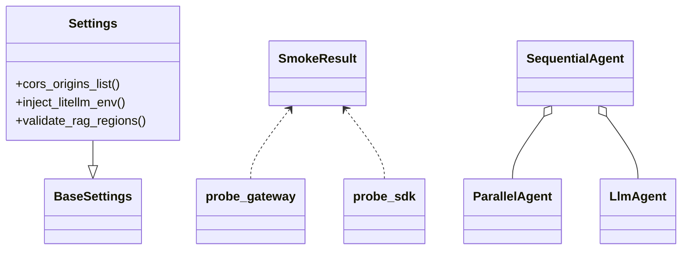
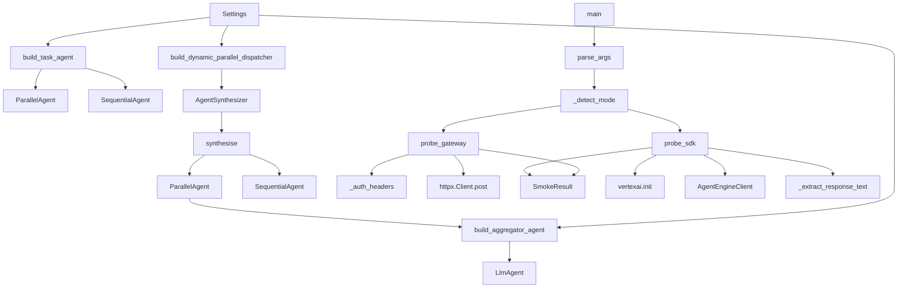

# Core Algorithms and Data Processing Logic

## Overview

This repository is primarily an agent-orchestration system rather than a traditional data-processing application. Its “algorithms” are the runtime pipelines that decide how to build agents, route work, aggregate outputs, and validate configuration before execution. The two most significant processing domains visible in the analysis are:

1. **Agent composition and dispatch**
   - Building a task-oriented agent hierarchy with [`build_task_agent`](agents/task_agent.py#L115) and [`build_dynamic_parallel_dispatcher`](agents/task_agent.py#L191).
   - Building a summary/combiner agent with [`build_aggregator_agent`](agents/aggregator.py#L70).

2. **Cloud smoke-test probing**
   - Exercising either a gateway endpoint or a Vertex AI reasoning engine through [`probe_gateway`](scripts/demo/cloud_smoke_test.py#L47) and [`probe_sdk`](scripts/demo/cloud_smoke_test.py#L118).
   - Normalizing response payloads with [`_extract_response_text`](scripts/demo/cloud_smoke_test.py#L105), then coordinating execution from [`main`](scripts/demo/cloud_smoke_test.py#L183).

Configuration-related logic in [`Settings`](config.py#L7) also performs important validation and transformation, such as CORS parsing, environment injection, and regional consistency checks.

> **Sources:** `agents/task_agent.py` · L115–L237 · [`build_task_agent`](agents/task_agent.py#L115) · [`build_dynamic_parallel_dispatcher`](agents/task_agent.py#L191)  
> **Sources:** `agents/aggregator.py` · L70–L81 · [`build_aggregator_agent`](agents/aggregator.py#L70)  
> **Sources:** `scripts/demo/cloud_smoke_test.py` · L32–L212 · [`probe_gateway`](scripts/demo/cloud_smoke_test.py#L47) · [`probe_sdk`](scripts/demo/cloud_smoke_test.py#L118) · [`main`](scripts/demo/cloud_smoke_test.py#L183)  
> **Sources:** `config.py` · L7–L201 · [`Settings`](config.py#L7) · [`Settings.validate_rag_regions`](config.py#L166)

## Algorithm Descriptions

### 1. Task Agent Composition Pipeline

This is the primary orchestration algorithm for constructing a task-facing agent that can route requests through parallel and sequential execution modes.

- **Input**: a [`Settings`](config.py#L7) instance and a pre-built list of specialist agents (`specialist_agents`) provided to [`build_task_agent`](agents/task_agent.py#L115).
- **Steps**:
  1. Resolve the base model via [`get_model`](agents/aggregator.py#L70) / [`get_model`](agents/task_agent.py#L115) and construct specialist `LlmAgent` instances.
  2. Build a [`ParallelAgent`](agents/task_agent.py#L115) that can fan out work to multiple specialist agents simultaneously.
  3. Build an [`AggregatorAgent`](agents/aggregator.py#L70) via [`build_aggregator_agent`](agents/aggregator.py#L70) to consolidate parallel responses into one reply.
  4. Wrap the parallel stage and aggregator stage in a [`SequentialAgent`](agents/task_agent.py#L115), so that fan-out always finishes with one merged response.
  5. Append specialist agents again for sequential fallback use, enabling `transfer_to_agent` style dependent flows.
  6. Attach the skill-learning callback via [`build_skill_learning_callback`](agents/task_agent.py#L115), so the task agent can preserve or leverage learned behavior.
- **Output**: a composite task agent object with a fixed parallel-then-aggregate front path and a sequential fallback path.
- **Complexity**: 
  - Time: roughly **O(n)** to assemble `n` specialist agents, excluding any model/client initialization cost.
  - Space: **O(n)** for the agent list and pipeline structure.
- **Code Reference**: [`agents/task_agent.py`](agents/task_agent.py#L115) — `build_task_agent(settings, specialist_agents)`

The tests confirm key structural guarantees:
- the first child is a sequential pipeline,
- the pipeline has exactly two children,
- the first child is a parallel dispatcher,
- the second child is an aggregator,
- and four specialists are included in the static build path. See [`TestBuildTaskAgentSequentialPipeline`](tests/agents/test_aggregator.py#L45).

> **Sources:** `agents/task_agent.py` · L115–L188 · [`build_task_agent`](agents/task_agent.py#L115)  
> **Sources:** `tests/agents/test_aggregator.py` · L45–L80 · [`TestBuildTaskAgentSequentialPipeline`](tests/agents/test_aggregator.py#L45)

### 2. Dynamic Parallel Dispatcher Synthesis

This is the request-time synthesis pipeline that creates a task-specific parallel execution plan on demand.

- **Input**: [`Settings`](config.py#L7) and a textual task description passed to [`build_dynamic_parallel_dispatcher`](agents/task_agent.py#L191).
- **Steps**:
  1. Instantiate an [`AgentSynthesizer`](agents/task_agent.py#L191) for the task.
  2. Invoke synthesizer logic (`synthesise`) to create a task-tailored set of specialist agents.
  3. If no agents are produced, return `None`/no pipeline and log a warning.
  4. If agents are produced, construct a `ParallelAgent` from them.
  5. Build an aggregator via [`build_aggregator_agent`](agents/aggregator.py#L70).
  6. Combine the parallel fan-out and aggregator into a [`SequentialAgent`](agents/task_agent.py#L191), ensuring all paths end in a single consolidated output.
- **Output**: either `None` when synthesis finds nothing useful, or a dynamically generated sequential pipeline and a sequential agent list.
- **Complexity**:
  - Time: at least **O(n)** in the number of synthesized agents.
  - Space: **O(n)** for the task-specific dispatch graph.
- **Code Reference**: [`agents/task_agent.py`](agents/task_agent.py#L191) — `build_dynamic_parallel_dispatcher(settings, task)`

This function is the bridge between static deploy-time agent assembly and runtime just-in-time specialization. The tests in [`TestBuildDynamicParallelDispatcher`](tests/agents/test_aggregator.py#L86) cover both the empty and non-empty synthesis branches.

> **Sources:** `agents/task_agent.py` · L191–L237 · [`build_dynamic_parallel_dispatcher`](agents/task_agent.py#L191)  
> **Sources:** `tests/agents/test_aggregator.py` · L86–L127 · [`TestBuildDynamicParallelDispatcher`](tests/agents/test_aggregator.py#L86)

### 3. Aggregation / Response Consolidation

The aggregator’s job is to collapse multiple upstream outputs into a single user-facing answer.

- **Input**: execution context from the parallel dispatch stage.
- **Steps**:
  1. Build an [`LlmAgent`](agents/aggregator.py#L70) through [`build_aggregator_agent`](agents/aggregator.py#L70).
  2. Configure it to use the model returned by [`get_model`](agents/aggregator.py#L70).
  3. Avoid external tools entirely; the aggregator is a reader/combiner, not an action-taker.
  4. Provide a description explaining that it consolidates parallel outputs.
- **Output**: an LLM-backed agent that generates a merged response.
- **Complexity**: essentially **O(k)** in the number of context items or candidate outputs it must summarize; the exact cost is model-dependent.
- **Code Reference**: [`agents/aggregator.py`](agents/aggregator.py#L70) — `build_aggregator_agent(settings)`

The tests explicitly verify that the agent is an LLM agent, has a description, and exposes no tools. See [`TestBuildAggregatorAgent`](tests/agents/test_aggregator.py#L27).

> **Sources:** `agents/aggregator.py` · L70–L81 · [`build_aggregator_agent`](agents/aggregator.py#L70)  
> **Sources:** `tests/agents/test_aggregator.py` · L27–L39 · [`TestBuildAggregatorAgent`](tests/agents/test_aggregator.py#L27)

### 4. Gateway Smoke-Test Probe

This pipeline validates a deployed gateway by sending a message and parsing streamed or JSON responses.

- **Input**: gateway URL, message text, bearer token, API key, and timeout, passed to [`probe_gateway`](scripts/demo/cloud_smoke_test.py#L47).
- **Steps**:
  1. Build auth headers using [`_auth_headers`](scripts/demo/cloud_smoke_test.py#L38).
  2. Issue an HTTP POST request using `httpx.Client`.
  3. Read the response body and split it into lines.
  4. Detect server-sent-event style `data:` lines and parse JSON payloads when present.
  5. Extract the final response text and status metadata.
  6. Package the result into [`SmokeResult`](scripts/demo/cloud_smoke_test.py#L32).
- **Output**: a [`SmokeResult`](scripts/demo/cloud_smoke_test.py#L32) describing success, text, error, and raw response details.
- **Complexity**: linear in the response body size, **O(m)** for `m` lines/characters.
- **Code Reference**: [`scripts/demo/cloud_smoke_test.py`](scripts/demo/cloud_smoke_test.py#L47) — `probe_gateway(gateway_url, message, bearer_token, api_key, timeout_s)`

The tests validate both success parsing and HTTP error handling in [`tests/scripts/test_cloud_smoke_test.py`](tests/scripts/test_cloud_smoke_test.py#L9).

> **Sources:** `scripts/demo/cloud_smoke_test.py` · L32–L102 · [`probe_gateway`](scripts/demo/cloud_smoke_test.py#L47) · [`SmokeResult`](scripts/demo/cloud_smoke_test.py#L32)  
> **Sources:** `tests/scripts/test_cloud_smoke_test.py` · L9–L54 · [`test_probe_gateway_success_parses_sse_done`](tests/scripts/test_cloud_smoke_test.py#L9)

### 5. Vertex AI SDK Smoke-Test Probe

This path validates a Vertex AI reasoning engine via the SDK instead of the HTTP gateway.

- **Input**: project ID, location, reasoning-engine resource name, user ID, message text, and a `client_factory`, passed to [`probe_sdk`](scripts/demo/cloud_smoke_test.py#L118).
- **Steps**:
  1. Initialize Vertex AI with the provided project and location.
  2. Use the client factory to create an `AgentEngineClient`.
  3. Resolve the reasoning engine by name.
  4. Execute a query with the user message.
  5. Extract the response text using [`_extract_response_text`](scripts/demo/cloud_smoke_test.py#L105).
  6. Wrap the result in [`SmokeResult`](scripts/demo/cloud_smoke_test.py#L32), or capture exception details on failure.
- **Output**: a [`SmokeResult`](scripts/demo/cloud_smoke_test.py#L32) containing response text or failure information.
- **Complexity**: dominated by network and SDK calls; local processing is **O(1)** aside from response extraction.
- **Code Reference**: [`scripts/demo/cloud_smoke_test.py`](scripts/demo/cloud_smoke_test.py#L118) — `probe_sdk(project_id, location, reasoning_engine_resource_name, user_id, message, client_factory)`

The test [`test_probe_sdk_success_uses_existing_engine_by_name`](tests/scripts/test_cloud_smoke_test.py#L57) shows the expected “retrieve existing engine, query it, and return success” behavior.

> **Sources:** `scripts/demo/cloud_smoke_test.py` · L105–L155 · [`probe_sdk`](scripts/demo/cloud_smoke_test.py#L118) · [`_extract_response_text`](scripts/demo/cloud_smoke_test.py#L105)  
> **Sources:** `tests/scripts/test_cloud_smoke_test.py` · L57–L80 · [`test_probe_sdk_success_uses_existing_engine_by_name`](tests/scripts/test_cloud_smoke_test.py#L57)

### 6. Response Text Normalization

This helper isolates the text payload from different SDK response shapes.

- **Input**: a response object passed to [`_extract_response_text`](scripts/demo/cloud_smoke_test.py#L105).
- **Steps**:
  1. Check whether the object is already a string-like response.
  2. Inspect common response attributes with `getattr`.
  3. Prefer structured candidate text fields when present.
  4. Fall back to `str(response)` if no better representation exists.
- **Output**: a plain text string suitable for display or smoke-test assertions.
- **Complexity**: **O(1)** with respect to object size, assuming attribute access is constant time.
- **Code Reference**: [`scripts/demo/cloud_smoke_test.py`](scripts/demo/cloud_smoke_test.py#L105) — `_extract_response_text(response)`

The test [`test_extract_response_text_formats`](tests/scripts/test_cloud_smoke_test.py#L88) confirms multiple formatting cases.

> **Sources:** `scripts/demo/cloud_smoke_test.py` · L105–L115 · [`_extract_response_text`](scripts/demo/cloud_smoke_test.py#L105)  
> **Sources:** `tests/scripts/test_cloud_smoke_test.py` · L88–L92 · [`test_extract_response_text_formats`](tests/scripts/test_cloud_smoke_test.py#L88)

### 7. CLI Mode Detection and Dispatch

The smoke-test entry point chooses which probing path to execute.

- **Input**: parsed CLI arguments from [`parse_args`](scripts/demo/cloud_smoke_test.py#L164) and the optional gateway URL.
- **Steps**:
  1. Parse command-line arguments.
  2. Infer mode using [`_detect_mode`](scripts/demo/cloud_smoke_test.py#L158).
  3. Dispatch to [`probe_gateway`](scripts/demo/cloud_smoke_test.py#L47) or [`probe_sdk`](scripts/demo/cloud_smoke_test.py#L118).
  4. Print a human-readable summary and exit appropriately.
- **Output**: console output plus process exit status.
- **Complexity**: negligible local cost; most time is spent in downstream network calls.
- **Code Reference**: [`scripts/demo/cloud_smoke_test.py`](scripts/demo/cloud_smoke_test.py#L183) — `main(argv)`

> **Sources:** `scripts/demo/cloud_smoke_test.py` · L158–L212 · [`_detect_mode`](scripts/demo/cloud_smoke_test.py#L158) · [`parse_args`](scripts/demo/cloud_smoke_test.py#L164) · [`main`](scripts/demo/cloud_smoke_test.py#L183)

## Data Structures

The repository uses a small set of highly purposeful internal structures.

| Data Structure | Type | Purpose | Where Used |
|---|---|---|---|
| [`Settings`](config.py#L7) | class (`BaseSettings` subclass) | Central runtime configuration, including model/provider settings, CORS, and RAG region validation | [`agents/aggregator.py`](agents/aggregator.py#L70), [`agents/task_agent.py`](agents/task_agent.py#L115), [`hermes_app/agent.py`](hermes_app/agent.py#L1), [`agent.py`](agent.py#L1) |
| [`SmokeResult`](scripts/demo/cloud_smoke_test.py#L32) | dataclass-like class | Normalized result object for smoke tests (success flag, response text, error details, raw payload) | [`probe_gateway`](scripts/demo/cloud_smoke_test.py#L47), [`probe_sdk`](scripts/demo/cloud_smoke_test.py#L118), [`main`](scripts/demo/cloud_smoke_test.py#L183) |
| `SequentialAgent` / `ParallelAgent` / `LlmAgent` | imported agent classes | Execution primitives used to assemble orchestration graphs | [`build_task_agent`](agents/task_agent.py#L115), [`build_dynamic_parallel_dispatcher`](agents/task_agent.py#L191), [`build_aggregator_agent`](agents/aggregator.py#L70) |
| `specialist_agents` list | list of agent instances | Static fallback set for sequential or parallel dispatch | [`build_task_agent`](agents/task_agent.py#L115) |
| synthesized agent list | list of agent instances | Request-time result of `AgentSynthesizer` | [`build_dynamic_parallel_dispatcher`](agents/task_agent.py#L191) |

A simplified class relationship view:

The exact internal fields of [`SmokeResult`](scripts/demo/cloud_smoke_test.py#L32) are not enumerated in the analysis payload, so the documentation focuses on its observable role: a unified result container for both gateway and SDK probes.

> **Sources:** `config.py` · L7–L201 · [`Settings`](config.py#L7)  
> **Sources:** `scripts/demo/cloud_smoke_test.py` · L32–L35 · [`SmokeResult`](scripts/demo/cloud_smoke_test.py#L32)  
> **Sources:** `agents/task_agent.py` · L115–L237 · [`build_task_agent`](agents/task_agent.py#L115) · [`build_dynamic_parallel_dispatcher`](agents/task_agent.py#L191)  
> **Sources:** `agents/aggregator.py` · L70–L81 · [`build_aggregator_agent`](agents/aggregator.py#L70)

## Processing Pipeline

The end-to-end processing pipeline in this repository can be understood as two connected flows: configuration/bootstrap for agent orchestration, and runtime smoke-test execution.

### How to read this flow

- **Agent orchestration side**: configuration enters through [`Settings`](config.py#L7), then feeds both static and dynamic agent construction. The static path produces a reusable pipeline, while the dynamic path synthesizes task-specific agents on demand.
- **Smoke-test side**: the CLI entry point [`main`](scripts/demo/cloud_smoke_test.py#L183) parses flags, determines mode, and calls either the HTTP gateway probe or the Vertex AI SDK probe. Both return a [`SmokeResult`](scripts/demo/cloud_smoke_test.py#L32) so downstream reporting remains uniform.

The strongest architectural feature visible here is the project’s consistent use of **pipeline composition**: even when the runtime path differs, the output is normalized into a single result object or a single aggregated reply.

> **Sources:** `config.py` · L7–L201 · [`Settings`](config.py#L7)  
> **Sources:** `agents/task_agent.py` · L115–L237 · [`build_task_agent`](agents/task_agent.py#L115) · [`build_dynamic_parallel_dispatcher`](agents/task_agent.py#L191)  
> **Sources:** `agents/aggregator.py` · L70–L81 · [`build_aggregator_agent`](agents/aggregator.py#L70)  
> **Sources:** `scripts/demo/cloud_smoke_test.py` · L38–L212 · [`main`](scripts/demo/cloud_smoke_test.py#L183) · [`probe_gateway`](scripts/demo/cloud_smoke_test.py#L47) · [`probe_sdk`](scripts/demo/cloud_smoke_test.py#L118)

## Notes on Observable Limits

The analysis payload does not include full function bodies, so complexity claims are intentionally conservative and based on visible structure, call graph shape, and common behavior of the referenced primitives. Where exact control flow or data fields were not visible, this page describes the observable contract rather than inventing details.

> **Sources:** `agents/task_agent.py` · L115–L237 · [`build_task_agent`](agents/task_agent.py#L115) · [`build_dynamic_parallel_dispatcher`](agents/task_agent.py#L191)  
> **Sources:** `scripts/demo/cloud_smoke_test.py` · L32–L212 · [`SmokeResult`](scripts/demo/cloud_smoke_test.py#L32)