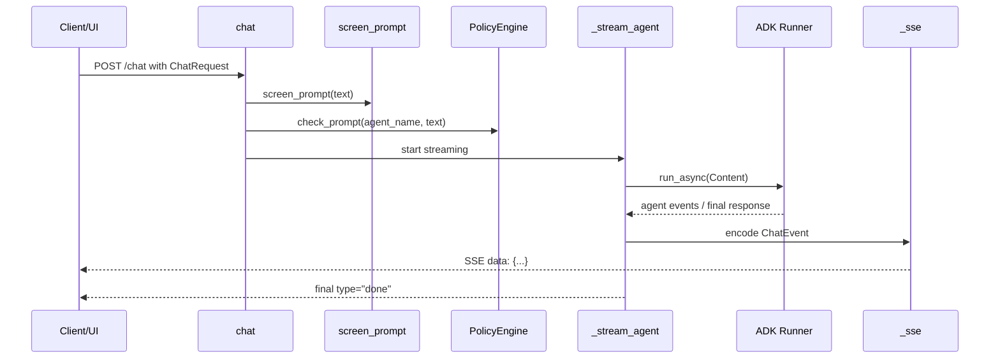
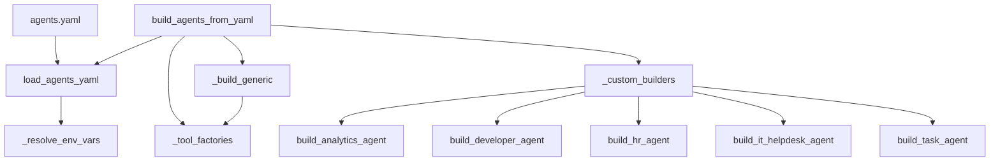

# Runtime and Data Movement

This page focuses on the mechanics of request handling, data handoff, streaming, and background execution. It deliberately avoids package inventory or setup instructions; instead, it traces how data moves through the runtime paths that matter most: user chat, webhook ingestion, evaluation, and deployment/setup orchestration.

## Request Ingestion to Response Streaming

The central interactive path starts in the FastAPI chat endpoint [`chat`](gateway/main.py#L152) and flows through prompt screening, policy checks, agent execution, and SSE framing. The endpoint accepts a [`ChatRequest`](gateway/main.py#L136) and returns an `EventSourceResponse`, so the response is not buffered as a single payload; it is progressively emitted as events.

The key handoff chain is:

`chat → _stream_agent → _sse`

The [`chat`](gateway/main.py#L152) function performs the request-level guardrails before any model call occurs. It invokes [`screen_prompt`](tools/model_armor.py#L122) and [`PolicyEngine.check_prompt`](governance/policy_engine.py#L84) to reject unsafe input early. If the prompt is accepted, it prepares a session and passes control to [`_stream_agent`](gateway/main.py#L203), which drives the actual agent turn.

Inside [`_stream_agent`](gateway/main.py#L203), the code constructs a GenAI [`Content`] event, enters an [`agent_span`](gateway/observability.py#L86) for tracing, and awaits the runner. The runner is wired in startup via [`lifespan`](gateway/main.py#L63), which creates the app-wide [`Runner`](https://cloud.google.com/vertex-ai/generative-ai/docs/reference/python/latest/google.adk.runners) instance from the assembled agent graph. The stream function then yields SSE-compatible JSON strings through [`_sse`](gateway/main.py#L242), which serialises a [`ChatEvent`](gateway/main.py#L141) using `model_dump_json()`.

A useful mental model is that `_stream_agent` is both a translator and a filter:
- it converts ADK/agent events into `ChatEvent` records
- it emits a terminal `"done"` event
- it intercepts failures and turns them into structured error events instead of breaking the stream

### Sequence diagram

### Major runtime handoff table

| Stage | Mediating symbol | Input | Output | Notes |
|------|------------------|-------|--------|------|
| HTTP request intake | [`chat`](gateway/main.py#L152) | `ChatRequest` | `EventSourceResponse` | Enforces prompt screening and policy checks first |
| Prompt safety | [`screen_prompt`](tools/model_armor.py#L122) | user text | allow/block decision | Blocks before agent execution |
| Policy gate | [`PolicyEngine.check_prompt`](governance/policy_engine.py#L84) | user text + agent name | `PolicyResult` | Supports agent-scoped policy application |
| Streaming turn | [`_stream_agent`](gateway/main.py#L203) | user/session/message | event iterator | Converts agent events into streamable records |
| SSE encoding | [`_sse`](gateway/main.py#L242) | `ChatEvent` | JSON string | Final wire-format serializer |

> **Sources:** `gateway/main.py` · L136–L243 · [`chat`](gateway/main.py#L152) · [`_stream_agent`](gateway/main.py#L203) · [`_sse`](gateway/main.py#L242); `tools/model_armor.py` · L122–L143 · [`screen_prompt`](tools/model_armor.py#L122) · [`screen_response`](tools/model_armor.py#L134); `governance/policy_engine.py` · L54–L86 · [`PolicyEngine`](governance/policy_engine.py#L54)

---

## Webhook Flow: Connector Ingestion to Agent Reply

Webhook handling follows the same runtime principle as chat, but the entrypoints are platform-specific adapters. The repo contains separate webhook handlers for Slack, Teams, and Telegram, each of which validates the incoming payload, extracts text, and hands the message to [`run_agent`](connectors/runner.py#L34).

The common path is:

`slack_webhook / teams_webhook / telegram_webhook → run_agent → platform reply API`

The platform-specific handlers are:
- [`slack_webhook`](connectors/slack.py#L68)
- [`teams_webhook`](connectors/teams.py#L93)
- [`telegram_webhook`](connectors/telegram.py#L61)

Each handler performs authentication or signature validation before it forwards user text. For example, Slack uses [`_verify_slack_signature`](connectors/slack.py#L44), Teams uses [`_verify_teams_token`](connectors/teams.py#L66), and Telegram validates the bot secret token through its FastAPI parameter. Once validated, the message is passed to [`run_agent`](connectors/runner.py#L34), which namespaces the session using [`_platform_session_id`](connectors/runner.py#L28) so platform conversations do not collide.

The reply path then differs by channel:
- Slack posts via its async client
- Teams uses [`_send_teams_reply`](connectors/teams.py#L150)
- Telegram uses [`_send_message`](connectors/telegram.py#L40)

This is important because the webhooks are not streaming endpoints. They are request/response adapters that synchronously obtain the full agent reply and then submit it back to the platform.

### Webhook flow table

| Platform | Ingest function | Validation step | Agent handoff | Reply function |
|---------|-----------------|-----------------|--------------|----------------|
| Slack | [`slack_webhook`](connectors/slack.py#L68) | [`_verify_slack_signature`](connectors/slack.py#L44) | [`run_agent`](connectors/runner.py#L34) | Slack client `chat_postMessage` |
| Teams | [`teams_webhook`](connectors/teams.py#L93) | [`_verify_teams_token`](connectors/teams.py#L66) | [`run_agent`](connectors/runner.py#L34) | [`_send_teams_reply`](connectors/teams.py#L150) |
| Telegram | [`telegram_webhook`](connectors/telegram.py#L61) | secret token parameter | [`run_agent`](connectors/runner.py#L34) | [`_send_message`](connectors/telegram.py#L40) |

### Data movement notes

- [`run_agent`](connectors/runner.py#L34) creates an ADK [`Content`] object from the incoming text.
- The runner call is awaited in-process, so the webhook waits for completion before replying.
- The connector layer is responsible for any message splitting or formatting before posting back to the platform.

> **Sources:** `connectors/slack.py` · L44–L153 · [`_verify_slack_signature`](connectors/slack.py#L44) · [`slack_webhook`](connectors/slack.py#L68); `connectors/teams.py` · L66–L185 · [`_verify_teams_token`](connectors/teams.py#L66) · [`teams_webhook`](connectors/teams.py#L93) · [`_send_teams_reply`](connectors/teams.py#L150); `connectors/telegram.py` · L40–L100 · [`_send_message`](connectors/telegram.py#L40) · [`telegram_webhook`](connectors/telegram.py#L61); `connectors/runner.py` · L28–L87 · [`_platform_session_id`](connectors/runner.py#L28) · [`run_agent`](connectors/runner.py#L34)

---

## Agent Configuration Loading and Tool Resolution

Agent composition is built in two layers: YAML-driven configuration loading and Python-based custom builders. The most important loader entrypoint is [`build_agents_from_yaml`](agents/loader.py#L147), which reads the YAML file, resolves environment variables, builds tool lists, and constructs the requested agents in order.

The loader pipeline is:

`load_agents_yaml → _tool_factories → _custom_builders → _build_generic → build_agents_from_yaml`

The sequence starts with [`load_agents_yaml`](agents/loader.py#L133), which parses the file and normalises `${VAR:-default}` expressions via [`_resolve_env_vars`](agents/loader.py#L125). It then uses [`_tool_factories`](agents/loader.py#L47) to create a name-to-factory mapping for standard tools such as search, BigQuery, storage, memory preload, MCP toolsets, and code execution. Next, [`_custom_builders`](agents/loader.py#L107) exposes known agent-specific builder functions like [`build_analytics_agent`](agents/analytics.py#L37), [`build_developer_agent`](agents/developer.py#L54), [`build_hr_agent`](agents/hr.py#L42), [`build_it_helpdesk_agent`](agents/it_helpdesk.py#L42), and [`build_task_agent`](agents/task_agent.py#L160).

When the YAML entry matches a known custom builder, that builder is used directly. Otherwise, [`_build_generic`](agents/loader.py#L181) constructs an [`LlmAgent`](https://cloud.google.com/vertex-ai/generative-ai/docs/reference/python/latest/google.adk.agents.LlmAgent) with:
- a model resolved by [`get_model`](models/provider.py#L75)
- tools created through the factory map
- optional sub-agents and memory/preload support

### Configuration loading diagram

### Tool resolution table

| Resolver | Purpose | Returns | Used by |
|---------|---------|---------|---------|
| [`_tool_factories`](agents/loader.py#L47) | Map YAML tool names to constructors | `dict[str, factory]` | [`build_agents_from_yaml`](agents/loader.py#L147), [`_build_generic`](agents/loader.py#L181) |
| [`_custom_builders`](agents/loader.py#L107) | Map agent names to bespoke builders | `dict[str, builder]` | [`build_agents_from_yaml`](agents/loader.py#L147) |
| [`_build_generic`](agents/loader.py#L181) | Construct fallback `LlmAgent` from config dict | `LlmAgent` | [`build_agents_from_yaml`](agents/loader.py#L147) |

### Why this matters at runtime

This loader is not just configuration plumbing: it determines the live agent graph that the gateway runner executes. Tool selection changes what the agent can do during a turn, while custom builders can inject additional callbacks, memory preload tools, or agent-specific tool combinations. Because the loader resolves env vars before agent construction, deployment-time settings propagate into runtime behavior without code changes.

> **Sources:** `agents/loader.py` · L47–L203 · [`_tool_factories`](agents/loader.py#L47) · [`_custom_builders`](agents/loader.py#L107) · [`load_agents_yaml`](agents/loader.py#L133) · [`build_agents_from_yaml`](agents/loader.py#L147) · [`_build_generic`](agents/loader.py#L181); `agents/analytics.py` · L37–L53 · [`build_analytics_agent`](agents/analytics.py#L37); `agents/developer.py` · L54–L79 · [`build_developer_agent`](agents/developer.py#L54); `agents/hr.py` · L42–L70 · [`build_hr_agent`](agents/hr.py#L42); `agents/it_helpdesk.py` · L42–L71 · [`build_it_helpdesk_agent`](agents/it_helpdesk.py#L42); `agents/task_agent.py` · L160–L180 · [`build_task_agent`](agents/task_agent.py#L160); `models/provider.py` · L75–L108 · [`get_model`](models/provider.py#L75)

---

## Evaluation Flow

The evaluation path is intentionally offline. The key scoring function is [`score_response`](eval/metrics.py#L23), which compares a generated response against expected keywords and contextual hints. It returns an [`EvalMetrics`](eval/metrics.py#L13) instance that aggregates groundedness, task completion, safety, and overall score.

The CLI entrypoint [`eval/run_eval.py`](eval/run_eval.py#L1) uses [`parse_args`](eval/run_eval.py#L16) to accept an evalset path and output path, loads the evalset JSON, and iterates through test cases. For each item, it calls [`score_response`](eval/metrics.py#L23) and accumulates the metric dicts into a report written to disk.

The important aspect of this flow is that it does not call the agent runtime. It is a pure scoring pipeline operating on saved responses, which makes it deterministic and cheap to run in CI.

### Evaluation flow table

| Stage | Mediating symbol | Input | Output |
|------|------------------|-------|--------|
| CLI parse | [`parse_args`](eval/run_eval.py#L16) | argv | parsed options |
| Evalset load | [`main`](eval/run_eval.py#L25) | JSON evalset file | test cases |
| Scoring | [`score_response`](eval/metrics.py#L23) | response + keywords + context | [`EvalMetrics`](eval/metrics.py#L13) |
| Report write | [`main`](eval/run_eval.py#L25) | aggregated scores | JSON output file |

### Observed mechanics

- `score_response` lowercases text and counts keyword matches.
- [`EvalMetrics.__post_init__`](eval/metrics.py#L19) provides derived aggregation behavior.
- The overall score is computed from the component metrics, so changes to the keyword rubric change the final score directly.

> **Sources:** `eval/metrics.py` · L13–L52 · [`EvalMetrics`](eval/metrics.py#L13) · [`score_response`](eval/metrics.py#L23); `eval/run_eval.py` · L16–L78 · [`parse_args`](eval/run_eval.py#L16) · [`main`](eval/run_eval.py#L25)

---

## Deployment and Setup Flow

The deployment/setup path is an orchestration flow, not a runtime request path. Its job is to materialise configuration and infrastructure so the runtime paths above can function. The main coordinator is [`setup_wizard.main`](setup_wizard.py#L557), which sequences a series of steps that collect configuration, bootstrap resources, seed optional demo data, and write the resulting values into the environment file.

The key setup path is:

`main → preflight → gather_config → bootstrap_gcp → setup_rag → setup_memory_bank → deploy_agent → deploy_cloud_run → print_summary`

This flow is interactive and stateful. Functions like [`gather_config`](setup_wizard.py#L171) and [`ask`](setup_wizard.py#L75) collect values, while helpers like [`write_env`](setup_wizard.py#L98) persist them. At the resource level, [`setup_rag`](setup_wizard.py#L320) calls [`create_corpus`](scripts/setup_rag.py#L29), and [`setup_memory_bank`](setup_wizard.py#L433) uses [`create_memory_bank`](memory/memory_bank.py#L434). The important point is not the shell commands themselves, but the dependency chain they establish for the runtime paths: agent loading depends on settings, memory retrieval depends on memory-bank configuration, and runtime startup depends on those values being available in `config.Settings`.

### Deployment/setup table

| Stage | Mediating symbol | Data moved | Runtime effect |
|------|------------------|------------|----------------|
| Configuration capture | [`gather_config`](setup_wizard.py#L171) | project IDs, regions, model choices | populates environment state |
| RAG setup | [`setup_rag`](setup_wizard.py#L320) | corpus resource names | enables retrieval-backed agents |
| Memory setup | [`setup_memory_bank`](setup_wizard.py#L433) | memory bank resource name | enables memory preload/fetch paths |
| Agent deployment | [`deploy_agent`](setup_wizard.py#L375) | build/deploy metadata | makes agent graph available to runtime |
| Cloud Run deployment | [`deploy_cloud_run`](setup_wizard.py#L458) | service settings | exposes the gateway endpoints |

### Boundary between setup and runtime

The setup flow ends by writing values into the environment file, which are then consumed by `config.Settings` and materialised during gateway startup. In other words, setup does not directly serve users; it creates the configuration artifacts that the live request-handling and streaming flows depend on.

> **Sources:** `setup_wizard.py` · L171–L611 · [`gather_config`](setup_wizard.py#L171) · [`bootstrap_gcp`](setup_wizard.py#L244) · [`setup_rag`](setup_wizard.py#L320) · [`setup_memory_bank`](setup_wizard.py#L433) · [`deploy_agent`](setup_wizard.py#L375) · [`deploy_cloud_run`](setup_wizard.py#L458) · [`main`](setup_wizard.py#L557); `scripts/setup_rag.py` · L29–L59 · [`create_corpus`](scripts/setup_rag.py#L29); `memory/memory_bank.py` · L413–L458 · [`build_memory_bank`](memory/memory_bank.py#L413) · [`create_memory_bank`](memory/memory_bank.py#L434); `config.py` · L7–L164 · [`Settings`](config.py#L7) · [`get_settings`](config.py#L163)

---

## Cross-Flow Summary

Across all four flows, the repository uses a consistent pattern:

1. validate early,
2. transform into a canonical internal object,
3. hand off to the next specialized layer,
4. serialise only at the edge.

That pattern is visible in:
- chat streaming with [`chat`](gateway/main.py#L152) and [`_stream_agent`](gateway/main.py#L203)
- webhook adapters using [`run_agent`](connectors/runner.py#L34)
- configuration loading through [`build_agents_from_yaml`](agents/loader.py#L147)
- offline scoring via [`score_response`](eval/metrics.py#L23)
- setup orchestration through [`setup_wizard.main`](setup_wizard.py#L557)

In practice, this means the codebase separates wire formats from internal data structures very cleanly: `ChatRequest`, `ChatEvent`, `EvalMetrics`, and YAML config dicts are converted at the boundary, then passed through specialised layers with minimal leakage between them.

> **Sources:** `gateway/main.py` · L136–L243 · [`chat`](gateway/main.py#L152) · [`_stream_agent`](gateway/main.py#L203) · [`_sse`](gateway/main.py#L242); `connectors/runner.py` · L34–L87 · [`run_agent`](connectors/runner.py#L34); `agents/loader.py` · L133–L203 · [`build_agents_from_yaml`](agents/loader.py#L147); `eval/metrics.py` · L23–L52 · [`score_response`](eval/metrics.py#L23); `setup_wizard.py` · L557–L611 · [`main`](setup_wizard.py#L557)