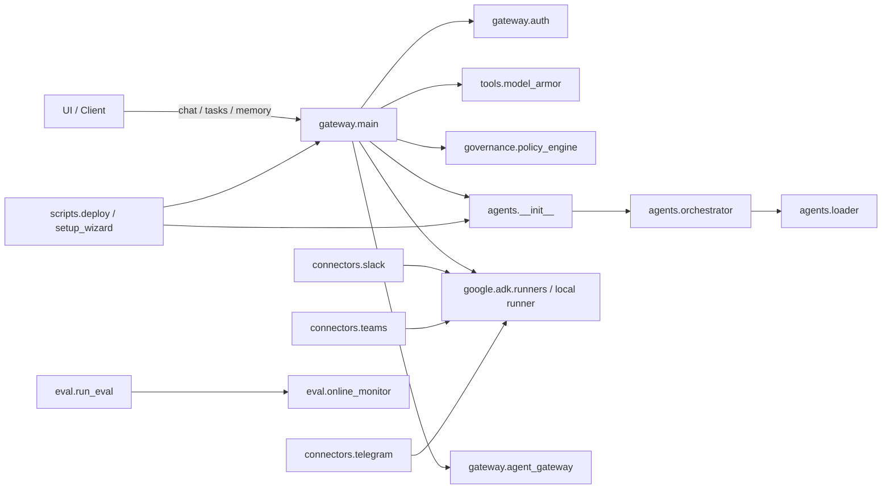
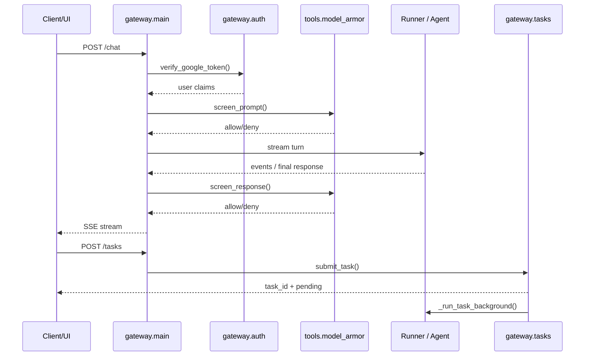

# Architecture Overview

This page gives a high-level explanation of how the system is assembled and how the major runtime paths fit together. The codebase is organised around three primary concerns:

1. **Agent construction** — building domain-specific agents and the top-level orchestrator.
2. **Runtime serving** — the FastAPI gateway that handles chat, memory, tasks, authentication, and tracing.
3. **Operational workflows** — webhook connectors, eval tooling, and deployment/setup scripts.

The core architectural entry points are [`agents.__init__`](agents/__init__.py#L1), [`agents.loader`](agents/loader.py#L1), [`agents.orchestrator`](agents/orchestrator.py#L1), [`gateway.main`](gateway/main.py#L1), [`gateway.agent_gateway`](gateway/agent_gateway.py#L1), [`gateway.auth`](gateway/auth.py#L1), [`connectors.runner`](connectors/runner.py#L1), [`connectors.slack`](connectors/slack.py#L1), [`connectors.teams`](connectors/teams.py#L1), [`connectors.telegram`](connectors/telegram.py#L1), [`eval.run_eval`](eval/run_eval.py#L1), [`eval.online_monitor`](eval/online_monitor.py#L1), and the deployment/setup scripts such as [`setup_wizard`](setup_wizard.py#L1), [`scripts.deploy`](scripts/deploy.py#L1), and [`scripts.register_agents`](scripts/register_agents.py#L1).

## System at a Glance

At runtime, the system can be understood as a layered flow:

- **Client/UI or connector input** enters via the gateway or webhook handlers.
- The gateway validates identity and policy, optionally consults Model Armor and memory services, and then routes the request.
- The request is executed either through the local ADK runner or an external Agent Gateway.
- Responses are streamed back to the caller, and optional background services record traces, task state, memory updates, and online metrics.

A useful mental model is that the codebase separates **agent definition** from **agent execution**. Agent definitions live in the `agents/` package and are composed into a top-level orchestrator by [`build_agent`](agents/__init__.py#L11) and [`build_adk_app`](agents/__init__.py#L17), while execution is handled by the gateway runtime and connector entry points.

### Runtime Path Flowchart

> **Sources:** `agents/__init__.py` · L1–L19 · [`build_agent`](agents/__init__.py#L11) · [`build_adk_app`](agents/__init__.py#L17); `agents/loader.py` · L1–L203 · [`build_agents_from_yaml`](agents/loader.py#L147); `agents/orchestrator.py` · L1–L44 · [`build_orchestrator`](agents/orchestrator.py#L34); `gateway/main.py` · L1–L489 · [`chat`](gateway/main.py#L152) · [`submit_task`](gateway/main.py#L345) · [`scheduler_trigger`](gateway/main.py#L430); `gateway/agent_gateway.py` · L1–L211 · [`build_agent_gateway`](gateway/agent_gateway.py#L184); `gateway/auth.py` · L1–L110 · [`verify_google_token`](gateway/auth.py#L42); `connectors/runner.py` · L1–L87 · [`run_agent`](connectors/runner.py#L34); `connectors/slack.py` · L1–L153 · [`slack_webhook`](connectors/slack.py#L68); `connectors/teams.py` · L1–L185 · [`teams_webhook`](connectors/teams.py#L93); `connectors/telegram.py` · L1–L100 · [`telegram_webhook`](connectors/telegram.py#L61); `eval/run_eval.py` · L1–L78 · [`main`](eval/run_eval.py#L25); `eval/online_monitor.py` · L1–L66 · [`build_online_monitor`](eval/online_monitor.py#L58); `setup_wizard.py` · L1–L611 · [`main`](setup_wizard.py#L557); `scripts/deploy.py` · L1–L111 · [`main`](scripts/deploy.py#L31)

## Component Responsibilities

### Agent Construction

The agent construction layer is centered on [`agents.__init__`](agents/__init__.py#L1), which exposes two important entry points:

- [`build_agent`](agents/__init__.py#L11) returns the raw ADK Agent used by the local gateway runner.
- [`build_adk_app`](agents/__init__.py#L17) returns an `AdkApp` wrapper for deployment to Agent Runtime.

That distinction is important: the code supports both **local gateway execution** and **deployed runtime execution** without duplicating the underlying graph. The top-level orchestrator is created by [`build_orchestrator`](agents/orchestrator.py#L34), which in turn loads sub-agents from YAML via [`build_agents_from_yaml`](agents/loader.py#L147). The loader also resolves environment-variable placeholders through [`_resolve_env_vars`](agents/loader.py#L125), which keeps the YAML configuration portable across environments.

The system’s agent families are implemented in domain-specific modules such as [`build_analytics_agent`](agents/analytics.py#L37), [`build_developer_agent`](agents/developer.py#L54), [`build_hr_agent`](agents/hr.py#L42), [`build_it_helpdesk_agent`](agents/it_helpdesk.py#L42), and the long-running task loop in [`build_task_agent`](agents/task_agent.py#L160). These builders are the concrete architectural units that define capabilities, tools, and memory callbacks.

### Gateway Runtime

[`gateway.main`](gateway/main.py#L1) is the main serving surface. It builds the FastAPI app, configures lifespan startup/shutdown, installs tracing, binds the runner, and exposes the public endpoints. The most important runtime responsibilities are:

- request authentication via [`verify_google_token`](gateway/auth.py#L42)
- policy and prompt safety checks via [`build_policy_engine`](governance/policy_engine.py#L111) and [`screen_prompt`](tools/model_armor.py#L122)
- chat streaming through [`chat`](gateway/main.py#L152) and [`_stream_agent`](gateway/main.py#L203)
- memory access through [`list_memories`](gateway/main.py#L287), [`clear_memories`](gateway/main.py#L268), and [`create_memory`](gateway/main.py#L314)
- background task orchestration through [`submit_task`](gateway/main.py#L345), [`get_task`](gateway/main.py#L368), and [`cancel_task`](gateway/main.py#L399)
- scheduler-triggered automation via [`scheduler_trigger`](gateway/main.py#L430)

[`gateway.agent_gateway`](gateway/agent_gateway.py#L1) provides a fallback path when the system is configured to route requests to an external Agent Gateway instead of using the local ADK runner. Its design is intentionally graceful: [`build_agent_gateway`](gateway/agent_gateway.py#L184) returns a disabled client when no endpoint is configured, so local execution keeps working transparently.

### Connectors

The connector modules adapt external chat platforms into the same internal execution model:

- [`connectors.slack`](connectors/slack.py#L1) receives Slack Events API webhooks, verifies signatures with [`_verify_slack_signature`](connectors/slack.py#L44), and forwards user text to [`run_agent`](connectors/runner.py#L34).
- [`connectors.teams`](connectors/teams.py#L1) validates Bot Framework JWTs with [`_verify_teams_token`](connectors/teams.py#L66) and replies using [`_send_teams_reply`](connectors/teams.py#L150).
- [`connectors.telegram`](connectors/telegram.py#L1) processes Telegram updates in [`telegram_webhook`](connectors/telegram.py#L61), then posts the response back through [`_send_message`](connectors/telegram.py#L40).

These modules are thin adapters rather than alternate application layers. They standardise the incoming message into platform/user identifiers and call the common runner.

### Evaluation and Monitoring

The offline evaluation path is defined by [`eval.run_eval`](eval/run_eval.py#L1), whose [`main`](eval/run_eval.py#L25) reads an evalset and computes metrics via [`score_response`](eval/metrics.py#L23). The metric computation itself is intentionally simple and fully offline, using [`EvalMetrics`](eval/metrics.py#L13) as a compact score container.

For online observability, [`eval.online_monitor`](eval/online_monitor.py#L1) provides [`build_online_monitor`](eval/online_monitor.py#L58) and [`log_quality_score`](eval/online_monitor.py#L21). The monitor is optional and degrades safely when project settings are absent.

### Deployment and Ops Scripts

Operational entry points include [`setup_wizard`](setup_wizard.py#L1), [`teardown_wizard`](teardown_wizard.py#L1), [`scripts.deploy`](scripts/deploy.py#L1), [`scripts.register_agents`](scripts/register_agents.py#L1), and [`scripts.setup_rag`](scripts/setup_rag.py#L1). These scripts are not part of request serving, but they define how the system is bootstrapped, provisioned, and cleaned up.

In particular, the setup/teardown wizards orchestrate GCP resource creation and deletion, while deployment scripts register agents and deploy runtime services. This separation keeps operational logic out of request-path code.

> **Sources:** `agents/__init__.py` · L1–L19 · [`build_agent`](agents/__init__.py#L11) · [`build_adk_app`](agents/__init__.py#L17); `agents/loader.py` · L1–L203 · [`load_agents_yaml`](agents/loader.py#L133) · [`build_agents_from_yaml`](agents/loader.py#L147); `agents/orchestrator.py` · L1–L44 · [`build_orchestrator`](agents/orchestrator.py#L34); `agents/analytics.py` · L1–L53 · [`build_analytics_agent`](agents/analytics.py#L37); `agents/developer.py` · L1–L79 · [`build_developer_agent`](agents/developer.py#L54); `agents/hr.py` · L1–L70 · [`build_hr_agent`](agents/hr.py#L42); `agents/it_helpdesk.py` · L1–L71 · [`build_it_helpdesk_agent`](agents/it_helpdesk.py#L42); `agents/task_agent.py` · L1–L180 · [`build_task_agent`](agents/task_agent.py#L160); `gateway/main.py` · L1–L489 · [`chat`](gateway/main.py#L152) · [`submit_task`](gateway/main.py#L345) · [`scheduler_trigger`](gateway/main.py#L430); `gateway/agent_gateway.py` · L1–L211 · [`AgentGatewayClient`](gateway/agent_gateway.py#L63); `connectors/runner.py` · L1–L87 · [`run_agent`](connectors/runner.py#L34); `connectors/slack.py` · L1–L153 · [`slack_webhook`](connectors/slack.py#L68); `connectors/teams.py` · L1–L185 · [`teams_webhook`](connectors/teams.py#L93); `connectors/telegram.py` · L1–L100 · [`telegram_webhook`](connectors/telegram.py#L61); `eval/run_eval.py` · L1–L78 · [`main`](eval/run_eval.py#L25); `eval/online_monitor.py` · L1–L66 · [`log_quality_score`](eval/online_monitor.py#L21); `setup_wizard.py` · L1–L611 · [`main`](setup_wizard.py#L557); `teardown_wizard.py` · L1–L441 · [`main`](teardown_wizard.py#L337); `scripts/deploy.py` · L1–L111 · [`main`](scripts/deploy.py#L31); `scripts/register_agents.py` · L1–L82 · [`main`](scripts/register_agents.py#L69); `scripts/setup_rag.py` · L1–L59 · [`main`](scripts/setup_rag.py#L43)

## End-to-End Request Flow

### Chat Request Flow

The canonical request path begins in [`gateway.main.chat`](gateway/main.py#L152). A request is authenticated by [`gateway.auth.verify_google_token`](gateway/auth.py#L42), then screened by Model Armor through [`screen_prompt`](tools/model_armor.py#L122). If the prompt is acceptable, the gateway prepares the request context and dispatches the turn to either the local runner or the external Agent Gateway client from [`gateway.agent_gateway.AgentGatewayClient`](gateway/agent_gateway.py#L63).

The gateway’s streaming helper [`_stream_agent`](gateway/main.py#L203) converts agent events into SSE payloads and publishes them to the browser or client. The response is also checked via [`screen_response`](tools/model_armor.py#L134) and [`PolicyEngine.check_response`](governance/policy_engine.py#L80) before the final event is emitted.

In broad terms, the flow is:

1. client sends chat message
2. authenticate user
3. screen prompt
4. optionally build memory context
5. stream agent execution
6. screen response and policy-check it
7. return SSE events

### Connector Webhook Flow

The connector path is structurally the same, but the gateway is bypassed. For example, [`slack_webhook`](connectors/slack.py#L68), [`teams_webhook`](connectors/teams.py#L93), and [`telegram_webhook`](connectors/telegram.py#L61) extract a message from the platform payload, determine a stable platform user ID, and pass the message into [`run_agent`](connectors/runner.py#L34).

[`run_agent`](connectors/runner.py#L34) constructs a session namespace using [`_platform_session_id`](connectors/runner.py#L28), creates a short-lived conversation session, and returns the final plain-text response. The connector then posts that response back to the platform via the platform-specific API call.

### Task and Scheduler Flow

Long-running tasks use a different path. [`submit_task`](gateway/main.py#L345) stores the task and hands it to [`gateway.tasks.submit_task`](gateway/tasks.py#L229), which persists it in Firestore and launches [`_run_task_background`](gateway/tasks.py#L126) as a fire-and-forget coroutine. That background worker executes the task agent and writes progress back to storage.

Scheduler-triggered work follows a similar background pattern: [`scheduler_trigger`](gateway/main.py#L430) verifies the OIDC token through [`_verify_scheduler_oidc_token`](gateway/main.py#L460), then submits an agent task as a server-to-server workflow rather than a human chat turn.

### Sequence Diagram

> **Sources:** `gateway/main.py` · L152–L200 · [`chat`](gateway/main.py#L152) · [`_stream_agent`](gateway/main.py#L203); `gateway/auth.py` · L42–L110 · [`verify_google_token`](gateway/auth.py#L42); `tools/model_armor.py` · L122–L143 · [`screen_prompt`](tools/model_armor.py#L122) · [`screen_response`](tools/model_armor.py#L134); `gateway/agent_gateway.py` · L63–L211 · [`AgentGatewayClient`](gateway/agent_gateway.py#L63) · [`stream_message`](gateway/agent_gateway.py#L137); `connectors/runner.py` · L28–L87 · [`_platform_session_id`](connectors/runner.py#L28) · [`run_agent`](connectors/runner.py#L34); `gateway/tasks.py` · L126–L267 · [`_run_task_background`](gateway/tasks.py#L126) · [`submit_task`](gateway/tasks.py#L229)

## Design Decisions and Tradeoffs

### Local Runner Fallback vs. External Gateway

A notable design choice is the dual execution model in [`gateway.agent_gateway`](gateway/agent_gateway.py#L1). When configured, the client can send turns to an external gateway; when unconfigured or unavailable, it falls back to local ADK execution. This reduces operational coupling and makes local development, tests, and partial deployments much easier to support.

The tradeoff is that request execution can happen in two places, which increases the importance of consistent contract handling. The code mitigates this by making the disabled state explicit in [`AgentGatewayConfig`](gateway/agent_gateway.py#L30) and by designing [`AgentGatewayClient.stream_message`](gateway/agent_gateway.py#L137) to return an empty iterator on failure so the caller can transparently fall back.

### Central Gateway vs. Thin Connectors

Another clear decision is to keep Slack, Teams, and Telegram handlers very thin. Each connector validates platform-specific identity, extracts the message, and delegates to [`connectors.runner.run_agent`](connectors/runner.py#L34). This avoids duplicating agent/session logic across platforms and keeps the gateway the canonical place for policy, auth, and observability.

The downside is that connector code remains platform-specific at the edges, so each webhook has to implement its own verification and reply formatting. However, that is a reasonable tradeoff because the protocols themselves are distinct.

### YAML-Driven Agent Composition

[`agents.loader`](agents/loader.py#L1) and [`build_agents_from_yaml`](agents/loader.py#L147) make the agent graph configurable from declarative YAML. This is a strong choice for maintainability because new agents can be introduced without changing the core orchestration code.

The tradeoff is weaker compile-time visibility: the actual graph depends on runtime configuration. The code offsets that by keeping custom builders for known agents and by emitting warnings when YAML entries are incomplete or tools are unknown.

### Graceful Degradation Everywhere

A repeated pattern across the codebase is **graceful degradation**:

- [`build_agent_gateway`](gateway/agent_gateway.py#L184) disables itself when endpoint config is absent.
- [`build_online_monitor`](eval/online_monitor.py#L58) returns `None` if project settings are missing.
- [`build_memory_bank`](memory/memory_bank.py#L413) returns `None` when the memory bank resource is not configured.
- [`verify_google_token`](gateway/auth.py#L42) can be bypassed in local dev when `DISABLE_AUTH=true`.

This makes the system easy to run in partial environments. The tradeoff is that runtime behavior can vary significantly by environment, so deployment/configuration must be explicit and well understood.

### Operational Scripts vs. Runtime Code

The setup and teardown scripts are intentionally outside the serving path. That separation reduces risk: provisioning logic can be verbose, imperative, and destructive without polluting request handling code. The cost is a larger surface area for operators to understand, but it keeps the runtime code cleaner and more testable.

> **Sources:** `gateway/agent_gateway.py` · L30–L211 · [`AgentGatewayConfig`](gateway/agent_gateway.py#L30) · [`AgentGatewayClient`](gateway/agent_gateway.py#L63) · [`build_agent_gateway`](gateway/agent_gateway.py#L184); `connectors/runner.py` · L28–L87 · [`run_agent`](connectors/runner.py#L34); `agents/loader.py` · L1–L203 · [`build_agents_from_yaml`](agents/loader.py#L147); `eval/online_monitor.py` · L15–L66 · [`build_online_monitor`](eval/online_monitor.py#L58); `memory/memory_bank.py` · L413–L458 · [`build_memory_bank`](memory/memory_bank.py#L413); `gateway/auth.py` · L42–L110 · [`verify_google_token`](gateway/auth.py#L42); `setup_wizard.py` · L1–L611 · [`main`](setup_wizard.py#L557); `teardown_wizard.py` · L1–L441 · [`main`](teardown_wizard.py#L337)

## Cross-Module Dependency Summary

The following table summarises the most important module-to-module relationships visible in the architecture.

| Module | Imports From | Called By | Calls Into | Inherits From |
|--------|-------------|-----------|------------|---------------|
| `agents.__init__` | `agents.orchestrator`, `config`, `vertexai` | `gateway.main`, deployment scripts | `build_orchestrator`, `AdkApp`, `get_settings` | — |
| `agents.loader` | `config`, `models.provider`, `tools.*`, `agents.*`, `yaml` | `agents.orchestrator` | `load_agents_yaml`, `build_agents_from_yaml`, tool factories | — |
| `agents.orchestrator` | `agents.loader`, `config`, `models.provider` | `agents.__init__` | `build_agents_from_yaml`, `LlmAgent`, `get_model` | — |
| `gateway.main` | `agents`, `config`, `gateway.auth`, `gateway.agent_gateway`, `gateway.observability`, `memory.memory_bank`, `tools.model_armor`, `governance.policy_engine` | HTTP clients, connectors via common runner | chat, tasks, memories, scheduler, tracing | `BaseModel` for request/response models |
| `gateway.agent_gateway` | `config`, `httpx` | `gateway.main` | external Agent Gateway HTTP calls | — |
| `gateway.auth` | `config`, `httpx`, `cachetools`, `fastapi.security` | `gateway.main` | Google token verification | — |
| `connectors.runner` | `gateway.main`, `google.genai.types` | `connectors.slack`, `connectors.teams`, `connectors.telegram` | session creation and `run_async` | — |
| `connectors.slack` | `connectors.runner`, `config`, `slack_sdk` | Slack Events API | Slack signature verification, reply posting | — |
| `connectors.teams` | `connectors.runner`, `config`, `httpx`, `jose` | Microsoft Teams | JWT verification, Bot Framework reply posting | — |
| `connectors.telegram` | `connectors.runner`, `config`, `httpx` | Telegram webhook | Telegram Bot API replies | — |
| `eval.run_eval` | `eval.metrics` | CLI entrypoint | `score_response` | — |
| `eval.online_monitor` | `config`, `eval.metrics`, `google.cloud` | gateway/background runtime | BigQuery logging | — |

> **Sources:** `agents/__init__.py` · L1–L19 · [`build_agent`](agents/__init__.py#L11) · [`build_adk_app`](agents/__init__.py#L17); `agents/loader.py` · L1–L203 · [`build_agents_from_yaml`](agents/loader.py#L147); `agents/orchestrator.py` · L1–L44 · [`build_orchestrator`](agents/orchestrator.py#L34); `gateway/main.py` · L1–L489 · [`chat`](gateway/main.py#L152) · [`submit_task`](gateway/main.py#L345) · [`scheduler_trigger`](gateway/main.py#L430); `gateway/agent_gateway.py` · L1–L211 · [`build_agent_gateway`](gateway/agent_gateway.py#L184); `gateway/auth.py` · L1–L110 · [`verify_google_token`](gateway/auth.py#L42); `connectors/runner.py` · L1–L87 · [`run_agent`](connectors/runner.py#L34); `connectors/slack.py` · L1–L153 · [`slack_webhook`](connectors/slack.py#L68); `connectors/teams.py` · L1–L185 · [`teams_webhook`](connectors/teams.py#L93); `connectors/telegram.py` · L1–L100 · [`telegram_webhook`](connectors/telegram.py#L61); `eval/run_eval.py` · L1–L78 · [`main`](eval/run_eval.py#L25); `eval/online_monitor.py` · L1–L66 · [`build_online_monitor`](eval/online_monitor.py#L58)

## Relationship Statistics

The relationship graph in the analysis data is broad and mixed, spanning configuration, agent-building, runtime serving, memory, governance, tools, and scripts. The extracted graph contains a large number of import and call relationships, with especially dense coupling around `gateway.main`, `agents.loader`, `memory.*`, and `tools.*`.

At a high level, the strongest runtime coupling is:

- `gateway.main` → `gateway.auth` / `tools.model_armor` / `memory.memory_bank` / `gateway.tasks`
- `agents.__init__` → `agents.orchestrator` → `agents.loader`
- connector modules → `connectors.runner`
- task background flow → `agents.task_agent` and `google.adk.runners`

The architecture is intentionally modular, but not isolated: the gateway is the integration point, while the agent and memory subsystems are designed to be composed into that runtime.

> **Sources:** `gateway/main.py` · L1–L489; `agents/__init__.py` · L1–L19; `agents/orchestrator.py` · L1–L44; `agents/loader.py` · L1–L203; `connectors/runner.py` · L1–L87; `gateway/tasks.py` · L1–L267