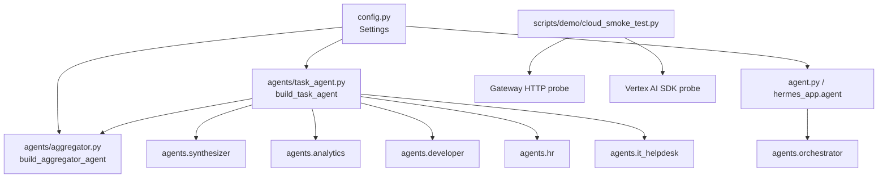
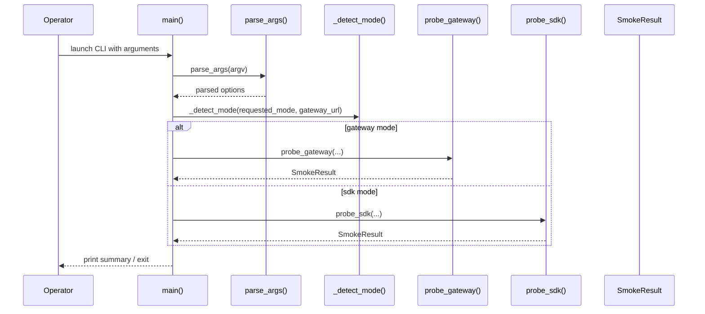

# Deep Architectural Overview

## System Architecture

This repository is structured around two primary subsystems: an **agent orchestration stack** and a **cloud smoke-test utility**. The orchestration side builds task-specialized agent pipelines via [`build_task_agent`](agents/task_agent.py#L115) and [`build_dynamic_parallel_dispatcher`](agents/task_agent.py#L191), while the smoke-test side validates either a gateway endpoint or a Vertex AI reasoning engine through [`main`](scripts/demo/cloud_smoke_test.py#L183). Configuration is centralized in [`Settings`](config.py#L7), which is consumed by both agent builders and application entry modules.

At a high level, the architecture separates:
- **Runtime orchestration**: task agents, aggregator agent, dynamic synthesis, and provider-backed model selection.
- **Application bootstrap**: `agent.py` and [`hermes_app.agent`](hermes_app/agent.py#L1) load env/config and import orchestrator startup code.
- **Operational tooling**: the smoke test script probes deployment readiness in gateway or SDK mode.

The relationship data shows 246 total relationships, split into 62 imports, 182 calls, and 2 inheritance edges. That suggests a system dominated by functional composition and orchestration rather than deep class hierarchies.

> **Sources:** `agents/aggregator.py` · L1–L81 · [`build_aggregator_agent`](agents/aggregator.py#L70)  
> `agents/task_agent.py` · L1–L237 · [`build_task_agent`](agents/task_agent.py#L115) · [`build_dynamic_parallel_dispatcher`](agents/task_agent.py#L191)  
> `config.py` · L1–L201 · [`Settings`](config.py#L7) · [`get_settings`](config.py#L200)  
> `scripts/demo/cloud_smoke_test.py` · L1–L212 · [`main`](scripts/demo/cloud_smoke_test.py#L183)

## Component Breakdown

### Configuration Layer

The configuration layer is implemented in [`config.py`](config.py#L1) around the [`Settings`](config.py#L7) class, which inherits from `BaseSettings`. It provides:
- CORS parsing via [`Settings.cors_origins_list`](config.py#L143)
- Environment export for provider credentials via [`Settings.inject_litellm_env`](config.py#L146)
- Region consistency validation via [`Settings.validate_rag_regions`](config.py#L166)
- A singleton-style accessor via [`get_settings`](config.py#L200)

This component is the shared dependency for agent builders and app bootstraps. Its role is not just storing values; it actively validates operational constraints and mutates process environment for downstream libraries.

### Aggregator Component

[`agents/aggregator.py`](agents/aggregator.py#L1) implements [`build_aggregator_agent`](agents/aggregator.py#L70), a factory that constructs the aggregator LLM agent. The docstring states it consolidates parallel outputs, and the tests confirm it should return an LLM agent with a description and no external tools. The aggregator is therefore a pure synthesis component: it reads context and produces a single consolidated response.

### Task Orchestration Component

[`agents/task_agent.py`](agents/task_agent.py#L1) is the central orchestration module. It imports specialist builders and the aggregator module, then composes them into multi-agent flows:
- [`build_task_agent`](agents/task_agent.py#L115) builds the deploy-time static pipeline.
- [`build_dynamic_parallel_dispatcher`](agents/task_agent.py#L191) performs request-time synthesis and returns a synthesized pipeline when task-specific agents are available.

This module is the main bridge between configuration, model providers, specialist agents, and aggregation.

### Smoke Test CLI

[`scripts/demo/cloud_smoke_test.py`](scripts/demo/cloud_smoke_test.py#L1) provides the operational validation tool. Core symbols include:
- [`SmokeResult`](scripts/demo/cloud_smoke_test.py#L32)
- [`_auth_headers`](scripts/demo/cloud_smoke_test.py#L38)
- [`probe_gateway`](scripts/demo/cloud_smoke_test.py#L47)
- [`_extract_response_text`](scripts/demo/cloud_smoke_test.py#L105)
- [`probe_sdk`](scripts/demo/cloud_smoke_test.py#L118)
- [`parse_args`](scripts/demo/cloud_smoke_test.py#L164)
- [`main`](scripts/demo/cloud_smoke_test.py#L183)

It validates deployment using either HTTP streaming or Vertex AI SDK calls.

### Application Bootstrap

`agent.py` and [`hermes_app.agent`](hermes_app/agent.py#L1) are lightweight startup modules. They import dotenv, config, and [`agents.orchestrator`](agent.py#L1), indicating that orchestration startup is centralized elsewhere. The observed behavior is bootstrap-oriented rather than business logic heavy.

| Component | Implementing Files | Responsibilities |
|---|---|---|
| Configuration | [`config.py`](config.py) | Load, validate, and export environment settings |
| Aggregation | [`agents/aggregator.py`](agents/aggregator.py) | Consolidate parallel outputs into one response |
| Task orchestration | [`agents/task_agent.py`](agents/task_agent.py) | Build static and dynamic agent pipelines |
| Smoke testing | [`scripts/demo/cloud_smoke_test.py`](scripts/demo/cloud_smoke_test.py) | Probe gateway or Vertex SDK readiness |
| Bootstrap | [`agent.py`](agent.py), [`hermes_app/agent.py`](hermes_app/agent.py) | Load environment and import orchestrator startup code |

> **Sources:** `config.py` · L1–L201 · [`Settings`](config.py#L7) · [`Settings.cors_origins_list`](config.py#L143) · [`Settings.inject_litellm_env`](config.py#L146) · [`Settings.validate_rag_regions`](config.py#L166)  
> `agents/aggregator.py` · L1–L81 · [`build_aggregator_agent`](agents/aggregator.py#L70)  
> `agents/task_agent.py` · L1–L237 · [`build_task_agent`](agents/task_agent.py#L115) · [`build_dynamic_parallel_dispatcher`](agents/task_agent.py#L191)  
> `scripts/demo/cloud_smoke_test.py` · L1–L212 · [`SmokeResult`](scripts/demo/cloud_smoke_test.py#L32) · [`probe_gateway`](scripts/demo/cloud_smoke_test.py#L47) · [`probe_sdk`](scripts/demo/cloud_smoke_test.py#L118)  
> `agent.py` · L1–L1  
> `hermes_app/agent.py` · L1–L1

## Entry Points

The only explicit entry point provided in the analysis data is [`scripts/demo/cloud_smoke_test.py`](scripts/demo/cloud_smoke_test.py#L1). Its `main` function is the operational trigger.

### `scripts/demo/cloud_smoke_test.py`
- **Trigger:** Executed as a CLI/demo script, likely via `python scripts/demo/cloud_smoke_test.py ...`.
- **What it does:** Parses command-line arguments through [`parse_args`](scripts/demo/cloud_smoke_test.py#L164), determines whether to use gateway or SDK mode via [`_detect_mode`](scripts/demo/cloud_smoke_test.py#L158), then calls [`probe_gateway`](scripts/demo/cloud_smoke_test.py#L47) or [`probe_sdk`](scripts/demo/cloud_smoke_test.py#L118). It prints summarized results and exits with a status code implied by the result path.
- **Why it matters:** This script is the repository’s visible operational check for cloud connectivity and reasoning-engine availability.

A subtle but important design detail is that the entry point is mode-aware rather than hardcoded to one runtime integration. That makes it useful both for gateway-based deployments and direct Vertex AI SDK validation.

> **Sources:** `scripts/demo/cloud_smoke_test.py` · L1–L212 · [`parse_args`](scripts/demo/cloud_smoke_test.py#L164) · [`_detect_mode`](scripts/demo/cloud_smoke_test.py#L158) · [`probe_gateway`](scripts/demo/cloud_smoke_test.py#L47) · [`probe_sdk`](scripts/demo/cloud_smoke_test.py#L118) · [`main`](scripts/demo/cloud_smoke_test.py#L183)

## Data Flow

The clearest observable data flow is in the smoke-test path, which branches by mode. The same general shape also applies to the agent system: configuration loads first, then model-backed components are assembled, then requests are routed into parallel or sequential agent execution.

### Step-by-step flow

1. **Startup and argument parsing**  
   [`main`](scripts/demo/cloud_smoke_test.py#L183) delegates to [`parse_args`](scripts/demo/cloud_smoke_test.py#L164), which collects runtime parameters such as gateway URL, project, location, user ID, timeout, and mode-related flags.

2. **Mode resolution**  
   [`_detect_mode`](scripts/demo/cloud_smoke_test.py#L158) determines whether the script should probe the gateway or use the SDK path. This guards the rest of execution from ambiguity.

3. **Gateway probe path**  
   [`probe_gateway`](scripts/demo/cloud_smoke_test.py#L47) builds auth headers through [`_auth_headers`](scripts/demo/cloud_smoke_test.py#L38), sends an HTTP request using `httpx`, parses streamed SSE-style lines, extracts the final response payload, and returns a [`SmokeResult`](scripts/demo/cloud_smoke_test.py#L32).

4. **SDK probe path**  
   [`probe_sdk`](scripts/demo/cloud_smoke_test.py#L118) initializes Vertex AI, obtains a reasoning engine client, performs a query, and normalizes the response using [`_extract_response_text`](scripts/demo/cloud_smoke_test.py#L105).

5. **Result normalization**  
   In both paths, output is condensed into the [`SmokeResult`](scripts/demo/cloud_smoke_test.py#L32) dataclass, which standardizes success/failure metadata for reporting.

For the agent system, the analogous flow is: `Settings` → model/provider setup → task-agent assembly → parallel dispatch or sequential fallback → aggregator consolidation.

> **Sources:** `scripts/demo/cloud_smoke_test.py` · L32–L212 · [`SmokeResult`](scripts/demo/cloud_smoke_test.py#L32) · [`_auth_headers`](scripts/demo/cloud_smoke_test.py#L38) · [`probe_gateway`](scripts/demo/cloud_smoke_test.py#L47) · [`_extract_response_text`](scripts/demo/cloud_smoke_test.py#L105) · [`probe_sdk`](scripts/demo/cloud_smoke_test.py#L118) · [`main`](scripts/demo/cloud_smoke_test.py#L183)

## Key Design Decisions

### 1. Factory-based agent construction
The agent layer uses factory functions rather than direct instantiation. [`build_aggregator_agent`](agents/aggregator.py#L70) and [`build_task_agent`](agents/task_agent.py#L115) encapsulate assembly logic. This makes configuration-driven injection and test-time substitution straightforward.

### 2. Parallel-then-aggregate architecture
The docstring of [`build_task_agent`](agents/task_agent.py#L115) explicitly describes a `SequentialPipeline` whose first stage is a `ParallelDispatcher` and whose second stage is the aggregator. This is a strong signal that the system is designed for fan-out/fan-in processing: run specialist agents in parallel, then consolidate into a single user-facing answer.

### 3. Dynamic request-time synthesis
[`build_dynamic_parallel_dispatcher`](agents/task_agent.py#L191) is documented as request-time JIT synthesis. That means the system can adapt the agent set per task instead of relying solely on a fixed deploy-time graph. This is a notable architectural choice because it trades some runtime complexity for flexibility.

### 4. Configuration as operational policy
[`Settings.validate_rag_regions`](config.py#L166) validates that RAG corpus resource names are in the same region as `gcp_location`. That shows the configuration layer is enforcing deployment policy, not merely storing values.

### 5. Dual integration path for cloud validation
The smoke test supports both gateway and SDK modes. [`probe_gateway`](scripts/demo/cloud_smoke_test.py#L47) uses HTTP and SSE parsing, while [`probe_sdk`](scripts/demo/cloud_smoke_test.py#L118) uses Vertex AI client APIs. This dual-path design is useful for debugging and deployment verification across environments.

### 6. Testability through lightweight stubs
The test support module [`tests/conftest.py`](tests/conftest.py#L1) defines fake agents like [`_FakeLlmAgent`](tests/conftest.py#L30) and [`_FakeSequentialAgent`](tests/conftest.py#L52), which indicates the codebase is designed to be unit tested without heavy external dependencies.

> **Sources:** `agents/aggregator.py` · L70–L81 · [`build_aggregator_agent`](agents/aggregator.py#L70)  
> `agents/task_agent.py` · L115–L237 · [`build_task_agent`](agents/task_agent.py#L115) · [`build_dynamic_parallel_dispatcher`](agents/task_agent.py#L191)  
> `config.py` · L7–L201 · [`Settings`](config.py#L7) · [`Settings.validate_rag_regions`](config.py#L166)  
> `scripts/demo/cloud_smoke_test.py` · L32–L212 · [`probe_gateway`](scripts/demo/cloud_smoke_test.py#L47) · [`probe_sdk`](scripts/demo/cloud_smoke_test.py#L118)  
> `tests/conftest.py` · L30–L57 · [`_FakeLlmAgent`](tests/conftest.py#L30) · [`_FakeSequentialAgent`](tests/conftest.py#L52)

## Inter-Module Dependencies

The pre-built dependency graph is not provided, so the major import relationships can be summarized directly from the analysis data.

### Major dependency table

| Module | Imports From | Called By | Calls Into | Inherits From |
|---|---|---|---|---|
| `agents.aggregator` | `config`, `models.provider`, `google.adk.agents` | `agents.task_agent`, `tests.agents.test_aggregator` | `LlmAgent`, `get_model` | — |
| `agents.task_agent` | `config`, `models.provider`, `memory.skill_learning`, `agents.aggregator`, `agents.analytics`, `agents.developer`, `agents.hr`, `agents.it_helpdesk`, `agents.synthesizer`, `google.adk.agents` | `tests.agents.test_aggregator` | `ParallelAgent`, `SequentialAgent`, `LlmAgent`, `build_aggregator_agent`, specialist builders, `AgentSynthesizer` | — |
| `config` | `functools`, `pydantic_settings`, `os`, `re` | `agents.aggregator`, `agents.task_agent`, `hermes_app.agent`, `agent`, tests | `Settings` | `BaseSettings` |
| `scripts.demo.cloud_smoke_test` | `argparse`, `json`, `logging`, `os`, `sys`, `dataclasses`, `typing`, `httpx`, `vertexai` | tests in `tests/scripts/test_cloud_smoke_test.py` | `probe_gateway`, `probe_sdk`, `main` | — |
| `hermes_app.agent` | `sys`, `os`, `dotenv`, `config`, `agents.orchestrator` | external startup | bootstrap imports | — |
| `agent` | `os`, `dotenv`, `config`, `agents.orchestrator` | external startup | bootstrap imports | — |

### Observations on coupling

- **Tightly coupled pair:** `agents.task_agent` and `agents.aggregator` are strongly linked. The task orchestrator directly depends on the aggregator factory and reuses it in both static and dynamic dispatch flows.
- **Moderately coupled:** `agents.task_agent` and `config` are coupled through settings and provider configuration.
- **Loosely coupled / isolated:** `scripts.demo.cloud_smoke_test` is operationally independent from the agent-building modules; it only shares the broad repository context and external cloud dependencies.
- **Possible external circularity risk:** The analysis data indicates `hermes_app.agent` and `agent` both import `agents.orchestrator`, but the graph does not provide enough detail to confirm cycles. No concrete internal circular dependency is evidenced in the supplied data.

> **Sources:** `agents/aggregator.py` · L1–L81  
> `agents/task_agent.py` · L1–L237  
> `config.py` · L1–L201  
> `scripts/demo/cloud_smoke_test.py` · L1–L212  
> `hermes_app/agent.py` · L1–L1  
> `agent.py` · L1–L1