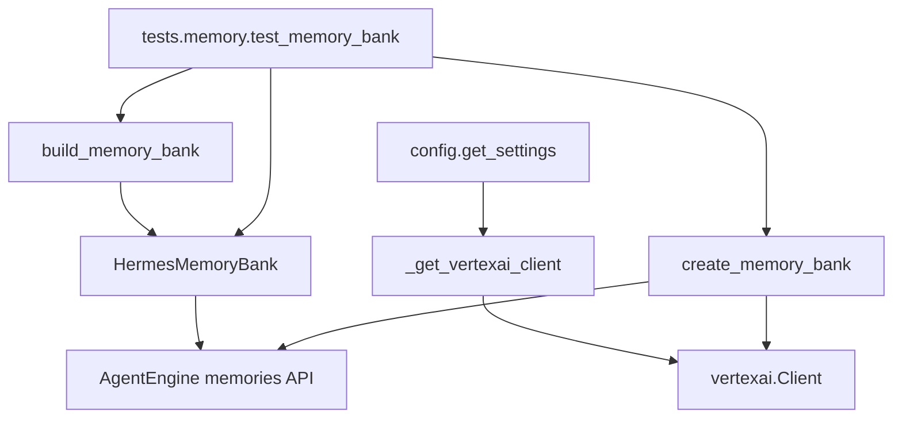
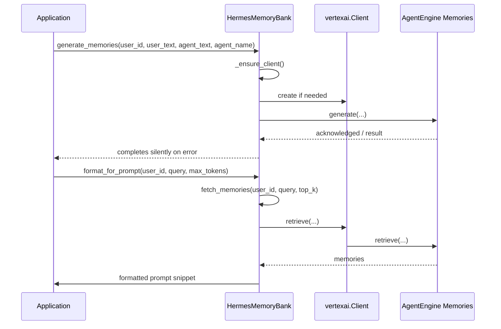

# Memory Bank Architecture Overview

## System Architecture

The repository analyzed here is intentionally narrow in scope: it centers on a single implementation module, [`memory.memory_bank`](memory/memory_bank.py#L1), and a comprehensive test suite in [`tests.memory.test_memory_bank`](tests/memory/test_memory_bank.py#L1). The architecture is best understood as a thin application facade around the Vertex AI Agent Engine memories API, with lazy client initialization, graceful degradation when configuration is absent, and explicit compatibility handling for newer SDK versions.

At the heart of the system is [`HermesMemoryBank`](memory/memory_bank.py#L79), a class that encapsulates all user-facing memory operations such as generation, ingestion, retrieval, deletion, and prompt formatting. Client creation is centralized in [`_get_vertexai_client`](memory/memory_bank.py#L41), while higher-level helpers such as [`build_memory_bank`](memory/memory_bank.py#L411) and [`create_memory_bank`](memory/memory_bank.py#L432) handle configuration-based construction and remote resource provisioning.

The design is deliberately procedural at the edges but object-oriented at the main integration boundary. The public API of the module is a set of methods on `HermesMemoryBank` that each map closely to a single SDK operation, with a small amount of normalization and error handling around each call. This is reflected in the test suite, which mocks the SDK client and asserts the wrapper behavior rather than the SDK itself.

> **Sources:** `memory/memory_bank.py` · L1–L498 · [`memory.memory_bank`](memory/memory_bank.py#L1), [`HermesMemoryBank`](memory/memory_bank.py#L79), [`_get_vertexai_client`](memory/memory_bank.py#L41), [`build_memory_bank`](memory/memory_bank.py#L411), [`create_memory_bank`](memory/memory_bank.py#L432)

## Component Breakdown

### 1) Vertex AI Client Bootstrap

[`_get_vertexai_client`](memory/memory_bank.py#L41) is the module’s lowest-level construction helper. It returns a `vertexai.Client` instance and falls back to configuration values from [`get_settings`](memory/memory_bank.py#L41) when `project` or `location` are not explicitly provided. The docstring also shows a defensive compatibility posture: the function raises an `ImportError` with a helpful message if the SDK version is too old.

This helper exists to isolate SDK initialization from the rest of the codebase. That separation matters because the module’s higher-level operations are all written in terms of a client object that can be replaced by tests or created from config.

### 2) Memory Facade

[`HermesMemoryBank`](memory/memory_bank.py#L79) is the main application-level abstraction. It wraps the Agent Engine memories API and exposes a cohesive set of methods:

- [`generate_memories`](memory/memory_bank.py#L105) distills a single conversation turn into durable memory.
- [`ingest_events`](memory/memory_bank.py#L143) streams structured events for batched memory generation.
- [`purge_memories`](memory/memory_bank.py#L187) bulk-deletes a user’s memories.
- [`delete_memory`](memory/memory_bank.py#L227) deletes a single memory by resource name.
- [`create_memory`](memory/memory_bank.py#L250) writes a fact directly without LLM extraction.
- [`update_memory`](memory/memory_bank.py#L285) updates an existing memory.
- [`retrieve_profiles`](memory/memory_bank.py#L315) is intentionally stubbed out for SDK compatibility.
- [`fetch_memories`](memory/memory_bank.py#L331) retrieves relevant memories.
- [`list_revisions`](memory/memory_bank.py#L369) is also a compatibility stub.
- [`format_for_prompt`](memory/memory_bank.py#L381) turns memory results into a system prompt snippet.

Responsibility-wise, this class is doing three jobs:
1. translating application-level intents into SDK calls,
2. normalizing return values and fallback behavior,
3. hiding transient SDK incompatibilities from the rest of the application.

### 3) Configuration-Aware Construction

[`build_memory_bank`](memory/memory_bank.py#L411) creates a `HermesMemoryBank` only if `MEMORY_BANK_RESOURCE_NAME` is configured. It returns `None` when memory is not configured, allowing the application to degrade gracefully.

This is an important architectural choice: memory is optional, not required. That reduces startup fragility and makes the feature opt-in.

### 4) Remote Resource Provisioning

[`create_memory_bank`](memory/memory_bank.py#L432) provisions a dedicated AgentEngine resource to serve as the memory bank. The docstring states that, in SDK `>= 1.112`, there is no standalone `VertexAiMemoryBank` resource; instead, memories are attached to an AgentEngine. This function encodes the migration strategy by creating a lightweight AgentEngine dedicated to memory storage.

### 5) Tests as Behavioral Specification

The test module [`tests.memory.test_memory_bank`](tests/memory/test_memory_bank.py#L1) contains the behavioral contract for every public method. Helpers like [`_make_mock_client`](tests/memory/test_memory_bank.py#L32), [`_make_engine`](tests/memory/test_memory_bank.py#L42), and [`_make_memory`](tests/memory/test_memory_bank.py#L52) construct SDK-shaped doubles. The tests validate lazy initialization, event normalization, fallback return values, and provisioning behavior.

> **Sources:** `memory/memory_bank.py` · L41–L498 · [`_get_vertexai_client`](memory/memory_bank.py#L41), [`HermesMemoryBank`](memory/memory_bank.py#L79), [`generate_memories`](memory/memory_bank.py#L105), [`ingest_events`](memory/memory_bank.py#L143), [`purge_memories`](memory/memory_bank.py#L187), [`delete_memory`](memory/memory_bank.py#L227), [`create_memory`](memory/memory_bank.py#L250), [`update_memory`](memory/memory_bank.py#L285), [`fetch_memories`](memory/memory_bank.py#L331), [`format_for_prompt`](memory/memory_bank.py#L381), [`build_memory_bank`](memory/memory_bank.py#L411), [`create_memory_bank`](memory/memory_bank.py#L432)

## Entry Points

No explicit runtime entry points are listed in the analysis data (`entry_points` is empty). That means there is no CLI entry script, console command, or standalone server bootstrap visible from the scanned files.

What is observable instead is a set of callable integration entry points inside the module:

| Entry-like API | Trigger | Purpose |
|---|---|---|
| [`build_memory_bank`](memory/memory_bank.py#L411) | Application startup or dependency wiring | Returns a configured `HermesMemoryBank` if memory is enabled |
| [`create_memory_bank`](memory/memory_bank.py#L432) | Administrative or provisioning workflow | Creates or reuses an AgentEngine resource for memory storage |
| [`HermesMemoryBank.format_for_prompt`](memory/memory_bank.py#L381) | Session setup / prompt construction | Produces prompt text for injecting memory context |
| [`HermesMemoryBank.generate_memories`](memory/memory_bank.py#L105) | Post-turn callback | Generates durable memories from a user/agent exchange |
| [`HermesMemoryBank.ingest_events`](memory/memory_bank.py#L143) | Event-stream ingestion | Sends conversation events for batched memory generation |

Because the module is a library component rather than an executable application, its “entry points” are really integration hooks that another layer of the system would call. The docstrings explicitly identify two such hooks: [`generate_memories`](memory/memory_bank.py#L105) is “Called from skill_learning_callback (fire-and-forget) after every agent turn,” and [`format_for_prompt`](memory/memory_bank.py#L381) is “The caller (gateway/main.py) injects this into the session system prompt.”

> **Sources:** `memory/memory_bank.py` · L105–L141 · L381–L406 · L411–L498 · [`generate_memories`](memory/memory_bank.py#L105), [`format_for_prompt`](memory/memory_bank.py#L381), [`build_memory_bank`](memory/memory_bank.py#L411), [`create_memory_bank`](memory/memory_bank.py#L432)

## Data Flow

The data flow is centered on two lifecycle moments: memory creation during or after an agent interaction, and memory retrieval at the start of a session.

Step by step, the pipeline works like this:

1. A higher layer obtains or constructs a [`HermesMemoryBank`](memory/memory_bank.py#L79), usually through [`build_memory_bank`](memory/memory_bank.py#L411).
2. When a user turn completes, [`generate_memories`](memory/memory_bank.py#L105) or [`ingest_events`](memory/memory_bank.py#L143) obtains a client lazily via [`_ensure_client`](memory/memory_bank.py#L98).
3. The wrapper then delegates to the Vertex AI memories API, using `asyncio.to_thread` to keep the blocking SDK call from stalling the event loop.
4. For retrieval, [`fetch_memories`](memory/memory_bank.py#L331) again lazily initializes the client, performs retrieval, and normalizes each result to a plain string.
5. [`format_for_prompt`](memory/memory_bank.py#L381) truncates or formats the retrieved facts into a prompt-ready snippet, which the caller can inject into a system prompt.
6. Administrative paths such as [`purge_memories`](memory/memory_bank.py#L187), [`delete_memory`](memory/memory_bank.py#L227), [`create_memory`](memory/memory_bank.py#L250), and [`update_memory`](memory/memory_bank.py#L285) follow the same client-then-SDK pattern.

A notable characteristic is that the module favors “fail closed but non-disruptive” behavior: most operations swallow exceptions and return a harmless fallback (`[]`, `None`, `False`, `0`, or `""`). That makes memory integration resilient but also means callers must not treat these methods as strongly signaling success.

> **Sources:** `memory/memory_bank.py` · L79–L406 · [`HermesMemoryBank`](memory/memory_bank.py#L79), [`_ensure_client`](memory/memory_bank.py#L98), [`generate_memories`](memory/memory_bank.py#L105), [`ingest_events`](memory/memory_bank.py#L143), [`fetch_memories`](memory/memory_bank.py#L331), [`format_for_prompt`](memory/memory_bank.py#L381), [`purge_memories`](memory/memory_bank.py#L187), [`delete_memory`](memory/memory_bank.py#L227), [`create_memory`](memory/memory_bank.py#L250), [`update_memory`](memory/memory_bank.py#L285)

## Key Design Decisions

### 1) Lazy client initialization

The class does not create a Vertex AI client in `__init__`; instead it defers setup to [`_ensure_client`](memory/memory_bank.py#L98). The tests explicitly verify this with [`TestGenerateMemories.test_client_is_lazily_initialised`](tests/memory/test_memory_bank.py#L104). This choice reduces startup cost and lets a memory bank instance exist even when configuration is incomplete.

### 2) Async wrapper over blocking SDK calls

Multiple methods use `asyncio.to_thread` to run SDK calls off the event loop, including [`generate_memories`](memory/memory_bank.py#L105), [`ingest_events`](memory/memory_bank.py#L143), [`purge_memories`](memory/memory_bank.py#L187), [`delete_memory`](memory/memory_bank.py#L227), [`create_memory`](memory/memory_bank.py#L250), [`update_memory`](memory/memory_bank.py#L285), and [`fetch_memories`](memory/memory_bank.py#L331). This indicates a deliberate async façade over a synchronous SDK.

### 3) Graceful degradation and backward compatibility

[`retrieve_profiles`](memory/memory_bank.py#L315) and [`list_revisions`](memory/memory_bank.py#L369) are explicitly unsupported in the current SDK and return empty lists for backward compatibility. [`build_memory_bank`](memory/memory_bank.py#L411) returns `None` when configuration is absent. These decisions keep the system operational across SDK and deployment states.

### 4) Event normalization

[`ingest_events`](memory/memory_bank.py#L143) normalizes event roles, and the tests confirm that `"agent"` is normalized to `"model"` in [`TestIngestEvents.test_normalises_agent_role_to_model`](tests/memory/test_memory_bank.py#L356). That is a small but important domain adaptation layer between application concepts and SDK expectations.

### 5) Prompt-oriented retrieval

[`format_for_prompt`](memory/memory_bank.py#L381) is a design choice that turns memory retrieval into prompt construction, not just data access. This reveals the intended use of memory: it is not a standalone record system; it is context for an LLM system prompt.

> **Sources:** `memory/memory_bank.py` · L98–L406 · [`_ensure_client`](memory/memory_bank.py#L98), [`generate_memories`](memory/memory_bank.py#L105), [`ingest_events`](memory/memory_bank.py#L143), [`purge_memories`](memory/memory_bank.py#L187), [`delete_memory`](memory/memory_bank.py#L227), [`create_memory`](memory/memory_bank.py#L250), [`update_memory`](memory/memory_bank.py#L285), [`fetch_memories`](memory/memory_bank.py#L331), [`retrieve_profiles`](memory/memory_bank.py#L315), [`list_revisions`](memory/memory_bank.py#L369), [`format_for_prompt`](memory/memory_bank.py#L381), [`build_memory_bank`](memory/memory_bank.py#L411); `tests/memory/test_memory_bank.py` · L104–L111 · L356–L365 · [`TestGenerateMemories.test_client_is_lazily_initialised`](tests/memory/test_memory_bank.py#L104), [`TestIngestEvents.test_normalises_agent_role_to_model`](tests/memory/test_memory_bank.py#L356)

## Inter-Module Dependencies

No pre-built dependency graph was provided in `pre_built_dependency_graph`, so the dependency view below is derived from the analyzed relationships.

The dependency picture is intentionally simple:

- [`memory.memory_bank`](memory/memory_bank.py#L1) imports standard library modules, `vertexai`, and `config`.
- [`tests.memory.test_memory_bank`](tests/memory/test_memory_bank.py#L1) imports [`memory.memory_bank`](memory/memory_bank.py#L1) and `config`.
- The test module is the only observed internal consumer of the implementation module.

### Cross-Module Dependency Table

| Module | Imports From | Called By | Calls Into | Inherits From |
|--------|-------------|-----------|------------|---------------|
| `memory.memory_bank` | `__future__`, `asyncio`, `logging`, `typing`, `vertexai`, `config` | `tests.memory.test_memory_bank` | `vertexai.Client`, `config.get_settings`, SDK memory methods | — |
| `tests.memory.test_memory_bank` | `__future__`, `types`, `unittest.mock`, `pytest`, `memory.memory_bank`, `config` | — | `memory.memory_bank.HermesMemoryBank`, `build_memory_bank`, `create_memory_bank` | — |

The most significant coupling is between [`tests.memory.test_memory_bank`](tests/memory/test_memory_bank.py#L1) and [`HermesMemoryBank`](memory/memory_bank.py#L79): the test suite repeatedly patches the client and invokes each method, making the tests a full behavioral mirror of the implementation. The bridge helpers [`_make_mock_client`](tests/memory/test_memory_bank.py#L32) and [`_make_engine`](tests/memory/test_memory_bank.py#L42) are the glue that makes this possible.

There are no inheritance relationships in the visible code. The architecture is composition-based: a wrapper class owns a client and delegates to SDK objects.

> **Sources:** `memory/memory_bank.py` · L1–L498 · `tests/memory/test_memory_bank.py` · L1–L495 · [`memory.memory_bank`](memory/memory_bank.py#L1), [`HermesMemoryBank`](memory/memory_bank.py#L79), [`build_memory_bank`](memory/memory_bank.py#L411), [`create_memory_bank`](memory/memory_bank.py#L432), [`tests.memory.test_memory_bank`](tests/memory/test_memory_bank.py#L1), [`_make_mock_client`](tests/memory/test_memory_bank.py#L32), [`_make_engine`](tests/memory/test_memory_bank.py#L42)