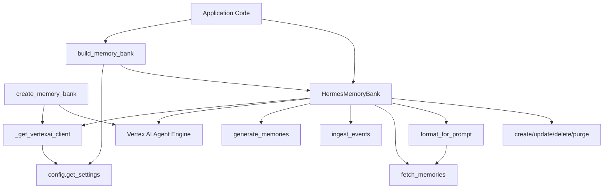
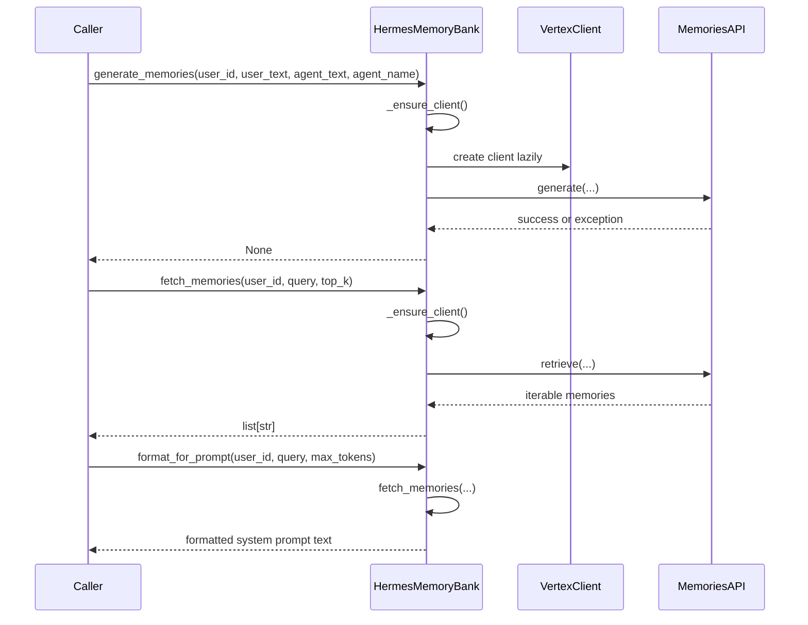

# Architectural Overview

## System Architecture

This repository is intentionally small and centered around a single implementation module: [`memory.memory_bank`](memory/memory_bank.py#L1). The architecture is best understood as a thin application-facing facade over Google Vertex AI Agent Engine memory APIs, with a separate test harness validating behavior through mocks and monkeypatching.

At the core is the [`HermesMemoryBank`](memory/memory_bank.py#L79) class, which encapsulates all memory lifecycle operations: generation, ingestion, retrieval, prompt formatting, creation, update, deletion, and purge. Supporting it is the helper [`_get_vertexai_client`](memory/memory_bank.py#L41), which lazily constructs a Vertex AI client and resolves configuration from settings when direct parameters are absent. A second top-level factory, [`build_memory_bank`](memory/memory_bank.py#L411), turns runtime configuration into a ready-to-use facade, while [`create_memory_bank`](memory/memory_bank.py#L432) provisions the underlying Agent Engine resource used to store memories.

The observable design is deliberately service-oriented rather than framework-heavy: application code interacts with one well-defined facade, and the facade hides SDK specifics, retries, blocking calls, and compatibility gaps.

> **Sources:** `memory/memory_bank.py` · L1–L470 · [`memory.memory_bank`](memory/memory_bank.py#L1), [`HermesMemoryBank`](memory/memory_bank.py#L79), [`_get_vertexai_client`](memory/memory_bank.py#L41), [`build_memory_bank`](memory/memory_bank.py#L411), [`create_memory_bank`](memory/memory_bank.py#L432)

## Component Breakdown

### Memory facade: `HermesMemoryBank`

[`HermesMemoryBank`](memory/memory_bank.py#L79) is the central abstraction. It wraps all memory operations behind a stable API so the rest of the application does not need to know the exact Vertex AI SDK details. Its responsibilities include:

- lazily initializing the client via [`_ensure_client`](memory/memory_bank.py#L98)
- writing extracted memories after an agent turn via [`generate_memories`](memory/memory_bank.py#L105)
- streaming event batches into the SDK via [`ingest_events`](memory/memory_bank.py#L143)
- deleting data via [`purge_memories`](memory/memory_bank.py#L187), [`delete_memory`](memory/memory_bank.py#L227), [`create_memory`](memory/memory_bank.py#L250), and [`update_memory`](memory/memory_bank.py#L285)
- reading back context via [`fetch_memories`](memory/memory_bank.py#L331)
- returning compatibility stubs for unsupported SDK features via [`retrieve_profiles`](memory/memory_bank.py#L315) and [`list_revisions`](memory/memory_bank.py#L369)
- preparing prompt-ready context via [`format_for_prompt`](memory/memory_bank.py#L381)

This class is the primary “component” in the codebase because it concentrates the repository’s domain behavior in a single place.

### SDK client construction: `_get_vertexai_client`

[`_get_vertexai_client`](memory/memory_bank.py#L41) is a narrow but important helper. It resolves project and location, falling back to settings from [`config.get_settings`](memory/memory_bank.py#L41), and constructs the Vertex AI client object. Its docstring explicitly notes compatibility handling: if the SDK is too old, it raises a helpful `ImportError`. That makes this function the repository’s main compatibility boundary.

### Configuration-driven factory: `build_memory_bank`

[`build_memory_bank`](memory/memory_bank.py#L411) reads configuration and returns `None` when the memory subsystem is not configured. This is a graceful degradation pattern: memory support is optional rather than mandatory. The test suite validates that empty or missing resource names do not produce an object, and that exceptions are swallowed rather than breaking startup.

### Resource provisioning: `create_memory_bank`

[`create_memory_bank`](memory/memory_bank.py#L432) provisions the backing Agent Engine resource and reuses an existing one if a matching display name is found. This function acts like an idempotent setup utility for the memory backend. It is also the clearest evidence that the system treats memories as an Agent Engine-backed capability rather than a standalone storage object in the newer SDK.

### Test support and stubs

The test suite provides the only other visible component layer. [`tests.conftest`](tests/conftest.py#L1) defines fake agent and response objects such as [`_FakeLlmAgent`](tests/conftest.py#L30), [`_FakeParallelAgent`](tests/conftest.py#L44), and [`_FakeEventSourceResponse`](tests/conftest.py#L177) to stabilize imports and mimic runtime dependencies. [`tests.memory.test_memory_bank`](tests/memory/test_memory_bank.py#L1) then exercises the full surface area of [`HermesMemoryBank`](memory/memory_bank.py#L79) and the factories.

| Component | Responsibilities | Implementing files |
|---|---|---|
| Memory facade | Memory CRUD, ingestion, fetch, prompt formatting, compatibility stubs | [`memory/memory_bank.py`](memory/memory_bank.py#L79) |
| Client factory | Build Vertex client with settings fallback and compatibility handling | [`memory/memory_bank.py`](memory/memory_bank.py#L41) |
| Configuration factory | Create or skip the memory bank based on settings | [`memory/memory_bank.py`](memory/memory_bank.py#L411) |
| Provisioning utility | Create or reuse Agent Engine resource backing memory storage | [`memory/memory_bank.py`](memory/memory_bank.py#L432) |
| Test harness | Mock client, fake agents, behavioral tests | [`tests/conftest.py`](tests/conftest.py#L1), [`tests/memory/test_memory_bank.py`](tests/memory/test_memory_bank.py#L1) |

> **Sources:** `memory/memory_bank.py` · L41–L470 · [`_get_vertexai_client`](memory/memory_bank.py#L41), [`HermesMemoryBank`](memory/memory_bank.py#L79), [`build_memory_bank`](memory/memory_bank.py#L411), [`create_memory_bank`](memory/memory_bank.py#L432)

## Entry Points

No explicit CLI, web, or job entry points are declared in the analysis payload. The repository’s executable surface is therefore implied rather than registered: callers are expected to import and instantiate the memory facade directly.

### Config-backed construction

[`build_memory_bank`](memory/memory_bank.py#L411) is the nearest thing to an application entry point. It is triggered whenever application startup code wants to conditionally enable memory support. The function inspects settings, and if `MEMORY_BANK_RESOURCE_NAME` is missing or blank, it returns `None` instead of raising.

### Resource creation utility

[`create_memory_bank`](memory/memory_bank.py#L432) is a setup-oriented entry point. It would be triggered by operator tooling, provisioning scripts, or an administrative bootstrap path that needs to create the backing Agent Engine resource.

### Direct facade usage

[`HermesMemoryBank`](memory/memory_bank.py#L79) itself is the runtime entry surface. Its methods are called by higher-level application code, as reflected in the docstrings:
- [`generate_memories`](memory/memory_bank.py#L105) is intended to run after an agent turn
- [`fetch_memories`](memory/memory_bank.py#L331) is intended to preload context at session start
- [`format_for_prompt`](memory/memory_bank.py#L381) prepares the final prompt snippet for injection

Because `entry_points` is empty in the provided analysis, the above list is derived strictly from the exported functions and class API, not from any registered application launcher.

> **Sources:** `memory/memory_bank.py` · L79–L470 · [`HermesMemoryBank`](memory/memory_bank.py#L79), [`build_memory_bank`](memory/memory_bank.py#L411), [`create_memory_bank`](memory/memory_bank.py#L432)

## Data Flow

The data flow is a simple but important pipeline: user/agent conversation data is captured, transformed into memory events or facts, persisted to Vertex AI Agent Engine, and later retrieved to enrich prompts.

### 1. Session or conversation data enters the memory layer
A caller passes `user_id` plus either raw turn text or structured event records into [`generate_memories`](memory/memory_bank.py#L105) or [`ingest_events`](memory/memory_bank.py#L143).

### 2. The facade ensures a client exists
Each public method calls [`_ensure_client`](memory/memory_bank.py#L98), which constructs a Vertex client on demand through [`_get_vertexai_client`](memory/memory_bank.py#L41). This makes memory operations lazy and avoids startup failures when the memory subsystem is unused.

### 3. SDK calls are offloaded from the event loop
Blocking SDK interactions are wrapped in `asyncio.to_thread`, which preserves async responsiveness while still invoking the synchronous Vertex APIs. This is evident in the method implementations for [`generate_memories`](memory/memory_bank.py#L105), [`ingest_events`](memory/memory_bank.py#L143), [`purge_memories`](memory/memory_bank.py#L187), [`delete_memory`](memory/memory_bank.py#L227), [`create_memory`](memory/memory_bank.py#L250), [`update_memory`](memory/memory_bank.py#L285), and [`fetch_memories`](memory/memory_bank.py#L331).

### 4. Memory facts are persisted or mutated
Depending on the operation, the SDK’s `generate`, `ingest_events`, `create`, `update`, `delete`, or `purge` method is called on the memories interface returned by the client.

### 5. Retrieval is converted into prompt-ready text
[`fetch_memories`](memory/memory_bank.py#L331) returns memory strings, and [`format_for_prompt`](memory/memory_bank.py#L381) turns them into a system prompt snippet.

> **Sources:** `memory/memory_bank.py` · L98–L406 · [`HermesMemoryBank._ensure_client`](memory/memory_bank.py#L98), [`HermesMemoryBank.generate_memories`](memory/memory_bank.py#L105), [`HermesMemoryBank.ingest_events`](memory/memory_bank.py#L143), [`HermesMemoryBank.fetch_memories`](memory/memory_bank.py#L331), [`HermesMemoryBank.format_for_prompt`](memory/memory_bank.py#L381)

## Key Design Decisions

### 1. Facade over a vendor SDK

The most obvious design choice is the use of [`HermesMemoryBank`](memory/memory_bank.py#L79) as a facade. Rather than exposing the Vertex SDK directly, the module offers domain-shaped methods like `generate_memories`, `fetch_memories`, and `format_for_prompt`. This simplifies the rest of the application and centralizes SDK churn in one file.

### 2. Lazy initialization and graceful degradation

[`_ensure_client`](memory/memory_bank.py#L98) and [`build_memory_bank`](memory/memory_bank.py#L411) both emphasize laziness and optionality. The memory subsystem only initializes when needed, and missing configuration returns `None` instead of crashing the app. This is a practical production pattern for a non-critical subsystem.

### 3. Async wrapper around blocking SDK calls

The repeated use of `asyncio.to_thread` in methods like [`generate_memories`](memory/memory_bank.py#L105) and [`fetch_memories`](memory/memory_bank.py#L331) shows a deliberate choice to preserve async application behavior while integrating with a synchronous SDK. That suggests the surrounding application is async-first, even though the memory vendor API is not.

### 4. Backward-compatibility shims

[`retrieve_profiles`](memory/memory_bank.py#L315) and [`list_revisions`](memory/memory_bank.py#L369) are explicit no-op compatibility stubs that return empty lists. Their docstrings state that these operations are not available in the newer AgentEngine memories API. This is a strong signal that the module is designed to survive SDK evolution without forcing upstream callers to special-case feature availability.

### 5. “Memory-as-a-tool” support

[`create_memory`](memory/memory_bank.py#L250) is notable because it writes a memory fact directly without LLM extraction or consolidation. The docstring explicitly identifies this as the “memory-as-a-tool” pattern. That is a real architectural choice: the system supports both automated memory extraction and explicit agent-authored persistence.

### 6. Resource provisioning is idempotent

[`create_memory_bank`](memory/memory_bank.py#L432) searches existing engines by display name before creating a new one. That indicates provisioning is intended to be safe to repeat, which is a useful operational characteristic for bootstrap scripts and deployment automation.

> **Sources:** `memory/memory_bank.py` · L79–L470 · [`HermesMemoryBank`](memory/memory_bank.py#L79), [`_get_vertexai_client`](memory/memory_bank.py#L41), [`build_memory_bank`](memory/memory_bank.py#L411), [`create_memory_bank`](memory/memory_bank.py#L432), [`retrieve_profiles`](memory/memory_bank.py#L315), [`list_revisions`](memory/memory_bank.py#L369), [`create_memory`](memory/memory_bank.py#L250)

## Inter-Module Dependencies

The repository has a very small module graph. The only implementation module is [`memory.memory_bank`](memory/memory_bank.py#L1), which imports from `config`, `asyncio`, `logging`, `typing`, and `vertexai`. The test module [`tests.memory.test_memory_bank`](tests/memory/test_memory_bank.py#L1) imports the implementation module and patches its dependencies extensively.

### Dependency summary

| Module | Imports From | Called By | Calls Into | Inherits From |
|--------|-------------|-----------|------------|---------------|
| `memory.memory_bank` | `__future__`, `asyncio`, `logging`, `typing`, `vertexai`, `config` | `tests.memory.test_memory_bank` | Vertex AI SDK methods, `config.get_settings` | — |
| `tests.conftest` | `__future__`, `os`, `sys`, `types`, `unittest.mock`, `functools`, `starlette.responses` | test discovery/runtime | helper module registration utilities | `_StarletteResponse` |
| `tests.memory.test_memory_bank` | `__future__`, `types`, `unittest.mock`, `pytest`, `memory.memory_bank`, `config` | pytest | `HermesMemoryBank`, `build_memory_bank`, `create_memory_bank` | — |

### Major import relationships

The important relationship is straightforward:
- [`memory.memory_bank`](memory/memory_bank.py#L1) imports [`config`](memory/memory_bank.py) to read runtime settings.
- [`tests.memory.test_memory_bank`](tests/memory/test_memory_bank.py#L1) imports [`memory.memory_bank`](memory/memory_bank.py#L1) and patches the runtime dependencies with mocks.

There is no evidence of deeper inter-module coupling inside the implementation layer. The design is intentionally flat: one feature module, one factory module, and tests.

> **Sources:** `memory/memory_bank.py` · L1–L470 · [`memory.memory_bank`](memory/memory_bank.py#L1), [`build_memory_bank`](memory/memory_bank.py#L411), [`create_memory_bank`](memory/memory_bank.py#L432); `tests/memory/test_memory_bank.py` · L1–L490 · [`tests.memory.test_memory_bank`](tests/memory/test_memory_bank.py#L1)