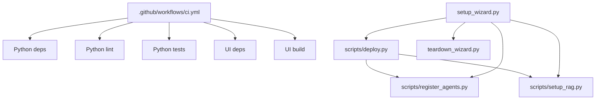

# Automation and Build Pipeline

## Overview

This repository’s automation is centered around a small number of explicit entry points and a CI workflow that exercises both the Python backend and the Node-based UI workspace. At a high level, the project is split into:

- a **Python workspace** for the gateway, agents, tools, memory, governance, evaluation, and deployment scripts
- a **Node workspace** under `ui/` for the Next.js frontend

The CI pipeline is designed to validate the Python codebase with linting and tests, and to validate the UI workspace with its own dependency and build lifecycle. The repository also includes several operational scripts that are invoked during deployment or local bootstrap flows, notably [`scripts/deploy.py`](scripts/deploy.py#L1), [`scripts/register_agents.py`](scripts/register_agents.py#L1), [`scripts/setup_rag.py`](scripts/setup_rag.py#L1), [`setup_wizard.py`](setup_wizard.py#L1), and [`teardown_wizard.py`](teardown_wizard.py#L1).

Because this page is focused on automation and build/release behavior, it intentionally does **not** document CI helper internals or internal one-off functions beyond their role in the pipeline.

## CI Pipeline at a Glance

The primary CI definition is [` .github/workflows/ci.yml`](.github/workflows/ci.yml#L1). The workflow appears to be responsible for validating the codebase on push/PR-style events, with job boundaries aligned to the repository’s two workspaces:

- **Python jobs**: install dependencies from `requirements.txt` and run lint/test checks against the backend package layout
- **Node jobs**: install frontend dependencies from `ui/package.json` and run build-related checks for the UI

A practical reading of the repository structure suggests that the CI workflow is meant to catch regressions in:
- agent construction and registry behavior in `agents/` and `registry/`
- API/runtime behavior in `gateway/`
- memory and governance logic in `memory/` and `governance/`
- frontend integration and type/build correctness in `ui/`

### Relationship of lint/build/test to workspaces

| Job type | Workspace | Typical responsibility | Repository evidence |
|---|---|---|---|
| Lint | Python | Enforce formatting/style and catch import/runtime issues early | `pyproject.toml`, `.github/workflows/ci.yml` |
| Test | Python | Run unit tests across agents, gateway, memory, governance, eval | `pytest.ini`, `tests/` |
| Build | Node | Ensure the Next.js UI compiles | `ui/package.json`, `ui/next.config.ts` |
| Test/Type check | Node | Validate UI code and API wrapper consistency | `ui/src/lib/api.ts`, `ui/src/types/chat.ts` |

The repository does not expose the full workflow body in the analysis payload, so exact step commands should be read from the workflow file itself. What is observable is the clear intent: backend validation in Python and compile/build validation in the `ui/` workspace.

> **Sources:** `.github/workflows/ci.yml` · L1 · [`ci.yml`](.github/workflows/ci.yml#L1), `pyproject.toml` · L1, `pytest.ini` · L1, `ui/package.json` · L1

## CI Files, Triggers, and Responsibilities

The table below summarises the automation-related files that are visible in the repository and how they fit into the pipeline.

| CI file | Triggers | Responsibilities | Notes |
|---|---|---|---|
| [` .github/workflows/ci.yml`](.github/workflows/ci.yml#L1) | Repository events configured in GitHub Actions | Primary continuous integration for Python and Node workspaces | Main guardrail for lint/test/build health |
| [`scripts/demo/e2e_test.py`](scripts/demo/e2e_test.py#L1) | Manually invoked from local/ops automation | End-to-end smoke testing against a running service | Demo harness, not public API |
| [`setup_wizard.py`](setup_wizard.py#L1) | Manual bootstrap entry point | Interactive provisioning of cloud resources, RAG, memory bank, and deployment steps | Operational setup automation |
| [`teardown_wizard.py`](teardown_wizard.py#L1) | Manual teardown entry point | Cleanup of cloud resources and environment state | Operational cleanup automation |
| [`scripts/deploy.py`](scripts/deploy.py#L1) | Manual or higher-level automation | Deployment orchestration and environment preparation | Used in release/deploy flows |
| [`scripts/register_agents.py`](scripts/register_agents.py#L1) | Manual or higher-level automation | Register agent definitions from `agents.yaml` | Often paired with deployment/bootstrap |
| [`scripts/setup_rag.py`](scripts/setup_rag.py#L1) | Manual or higher-level automation | Create RAG corpora used by the knowledge system | Setup task, not CI |

Two things stand out:

1. **CI is intentionally narrow**: it validates code quality and build health, but does not appear to perform cloud provisioning or destructive cleanup.
2. **Provisioning/deployment are script-driven**: the repo uses explicit Python scripts rather than hidden CI-side helper functions for bootstrap and release steps.

> **Sources:** `.github/workflows/ci.yml` · L1, `scripts/demo/e2e_test.py` · L1, `setup_wizard.py` · L1, `teardown_wizard.py` · L1, `scripts/deploy.py` · L1, `scripts/register_agents.py` · L1, `scripts/setup_rag.py` · L1

## Build and Release Automation

The repository contains a set of scripts that collectively support deployment and release-time setup. The most important are:

- [`scripts/deploy.py`](scripts/deploy.py#L1) — the deployment entry point
- [`scripts/register_agents.py`](scripts/register_agents.py#L1) — registers agents from configuration
- [`scripts/setup_rag.py`](scripts/setup_rag.py#L1) — creates RAG corpora
- [`setup_wizard.py`](setup_wizard.py#L1) — an interactive bootstrap wizard
- [`teardown_wizard.py`](teardown_wizard.py#L1) — an interactive teardown wizard

### What the scripts do at a high level

| Script | Purpose in automation | Typical use |
|---|---|---|
| [`scripts/deploy.py`](scripts/deploy.py#L31) | Orchestrates deployment steps | Release/deploy pipelines |
| [`scripts/register_agents.py`](scripts/register_agents.py#L23) | Reads `agents.yaml` and registers agent records | Post-deploy agent registration |
| [`scripts/setup_rag.py`](scripts/setup_rag.py#L29) | Creates one or more RAG corpora | Knowledge-base bootstrap |
| [`setup_wizard.py`](setup_wizard.py#L121) | Guides environment bootstrapping and cloud setup | New environment provisioning |
| [`teardown_wizard.py`](teardown_wizard.py#L112) | Removes provisioned cloud resources and wipes local env state | Environment cleanup / deprovisioning |

The release scripts are noteworthy because they align with the repository’s architecture:
- agents are configured externally via [`agents.yaml`](agents.yaml) and then materialised by [`build_agents_from_yaml`](agents/loader.py#L147) during runtime or registration flows
- RAG corpora are provisioned separately from application startup, reflecting the external dependency on managed retrieval infrastructure
- cleanup is explicit and destructive, concentrated in `teardown_wizard.py`

This separation is helpful in automation: CI verifies code, while release/bootstrap scripts own cloud resource lifecycle.

> **Sources:** `scripts/deploy.py` · L31–L111 · [`main`](scripts/deploy.py#L31), `scripts/register_agents.py` · L23–L82 · [`main`](scripts/register_agents.py#L69), `scripts/setup_rag.py` · L29–L59 · [`create_corpus`](scripts/setup_rag.py#L29), `setup_wizard.py` · L121–L611 · [`main`](setup_wizard.py#L557), `teardown_wizard.py` · L112–L441 · [`main`](teardown_wizard.py#L337)

## Python Workspace vs Node Workspace in CI

The repository is clearly split into a Python backend and a Node frontend. This matters for automation because CI and build scripts need to respect each workspace’s tooling and lifecycle.

### Python workspace

The Python side includes:
- `gateway/` for the FastAPI service
- `agents/`, `memory/`, `tools/`, `governance/`, `registry/`, `models/`
- scripts and tests that run under Python tooling

Relevant build/test configuration files:
- [`pyproject.toml`](pyproject.toml#L1)
- [`requirements.txt`](requirements.txt#L1)
- [`pytest.ini`](pytest.ini#L1)
- [`conftest.py`](conftest.py#L1)

The Python CI path is expected to:
- install runtime/test dependencies
- run linting/format checks
- execute `pytest` across `tests/`

### Node workspace

The Node frontend lives under:
- [`ui/package.json`](ui/package.json#L1)
- [`ui/next.config.ts`](ui/next.config.ts#L1)
- [`ui/src/...`](ui/src/app/page.tsx#L1 and related files)

The Node CI path is expected to:
- install frontend dependencies with the package manager configured in `ui/package.json`
- run a production build or equivalent validation
- optionally run frontend tests or static checks, depending on the workflow definition

### Why this split matters

The backend and frontend have different failure modes:
- Python failures are typically semantic/runtime issues in agent logic, API endpoints, memory, or tool integrations
- Node failures are typically compile-time/type issues, React/Next.js integration problems, or API contract mismatches in `ui/src/lib/api.ts`

The CI pipeline should therefore keep the jobs separate, so a frontend build problem does not obscure a backend test failure, and vice versa.

> **Sources:** `pyproject.toml` · L1, `requirements.txt` · L1, `pytest.ini` · L1, `conftest.py` · L1, `ui/package.json` · L1, `ui/next.config.ts` · L1, `ui/src/lib/api.ts` · L17–L82

## Automation Flow Diagram

The diagram above is intentionally high-level. It shows CI as the validation layer and the various Python scripts as the operational/deployment layer. It does not expose hidden helper internals, which keeps the documentation aligned with the repository’s public automation surface.

> **Sources:** `.github/workflows/ci.yml` · L1, `scripts/deploy.py` · L1, `scripts/register_agents.py` · L1, `scripts/setup_rag.py` · L1, `setup_wizard.py` · L1, `teardown_wizard.py` · L1

## Practical Takeaways

For developers working in this repository:

1. **Commit-level assurance comes from CI**: backend lint/tests and frontend build checks are the first line of defense.
2. **Operational changes are script-based**: deployment, registration, RAG setup, and teardown are explicit scripts rather than implicit CI side effects.
3. **Python and Node are validated separately**: keep backend changes passing pytest and linting, and keep `ui/` buildable independently.
4. **Avoid relying on CI internals**: the public automation surface is the workflow plus the scripts listed above; helper functions inside those scripts are implementation details and should not be treated as API.

> **Sources:** `.github/workflows/ci.yml` · L1, `scripts/deploy.py` · L1, `scripts/register_agents.py` · L1, `scripts/setup_rag.py` · L1, `setup_wizard.py` · L1, `teardown_wizard.py` · L1