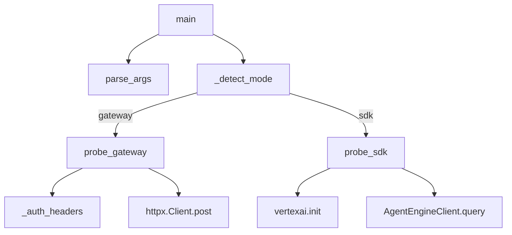

# CLI Reference and Programmatic API

## Overview

This page documents the repository’s externally useful command-line entry points and programmatic APIs that are visible in the static analysis data. The primary CLI surface is the smoke-test utility [`scripts.demo.cloud_smoke_test`](scripts/demo/cloud_smoke_test.py#L1) with its [`main(argv)`](scripts/demo/cloud_smoke_test.py#L183) entry point and argument parser [`parse_args(argv)`](scripts/demo/cloud_smoke_test.py#L164). The main programmatic APIs are the agent builders [`build_aggregator_agent(settings)`](agents/aggregator.py#L70), [`build_task_agent(settings, specialist_agents)`](agents/task_agent.py#L115), [`build_dynamic_parallel_dispatcher(settings, task)`](agents/task_agent.py#L191), and the configuration helpers on [`Settings`](config.py#L7). The page also includes a realistic integration workflow showing how configuration, agent construction, and the smoke test fit together.

> **Sources:** `scripts/demo/cloud_smoke_test.py` · L1–L212 · [`scripts.demo.cloud_smoke_test`](scripts/demo/cloud_smoke_test.py#L1) · [`parse_args`](scripts/demo/cloud_smoke_test.py#L164) · [`main`](scripts/demo/cloud_smoke_test.py#L183); `agents/aggregator.py` · L70–L81 · [`build_aggregator_agent`](agents/aggregator.py#L70); `agents/task_agent.py` · L115–L237 · [`build_task_agent`](agents/task_agent.py#L115) · [`build_dynamic_parallel_dispatcher`](agents/task_agent.py#L191); `config.py` · L7–L201 · [`Settings`](config.py#L7) · [`get_settings`](config.py#L200)

## CLI Reference

The analysis data shows one explicit CLI entry point: the smoke test script [`scripts/demo/cloud_smoke_test.py`](scripts/demo/cloud_smoke_test.py#L1), which is designed to run in either “gateway” or “SDK” mode. Its command-line interface is assembled in [`parse_args(argv)`](scripts/demo/cloud_smoke_test.py#L164), and execution begins in [`main(argv)`](scripts/demo/cloud_smoke_test.py#L183).

### `cloud_smoke_test.py`

The CLI is not exposed as a `console_scripts` entry in the static data, but the script is clearly intended to be run directly:

```bash
python scripts/demo/cloud_smoke_test.py --help
```

The parser defined in [`parse_args(argv)`](scripts/demo/cloud_smoke_test.py#L164) registers the following flags and arguments.

| Option | Type | Default | Description |
|--------|------|---------|-------------|
| `--mode` | string / enum-like | auto-detected by [`_detect_mode(requested_mode, gateway_url)`](scripts/demo/cloud_smoke_test.py#L158) | Chooses the execution path. The script supports gateway probing and SDK probing. |
| `--gateway-url` | string | unset | HTTP endpoint for the gateway smoke test. If omitted, mode detection may choose SDK mode instead. |
| `--message` | string | implementation-dependent default from parser | Message sent to the gateway or SDK reasoning engine. |
| `--bearer-token` | string | unset | Bearer token used when building auth headers for gateway requests via [`_auth_headers`](scripts/demo/cloud_smoke_test.py#L38). |
| `--api-key` | string | unset | API key used as an alternate credential for gateway auth. |
| `--timeout-s` | integer | implementation-dependent default from parser | Request timeout used by [`probe_gateway`](scripts/demo/cloud_smoke_test.py#L47). |
| `--project-id` | string | unset | GCP project identifier passed to [`probe_sdk`](scripts/demo/cloud_smoke_test.py#L118). |
| `--location` | string | unset | Vertex AI region used by [`probe_sdk`](scripts/demo/cloud_smoke_test.py#L118). |
| `--reasoning-engine-resource-name` | string | unset | Full reasoning engine resource name passed to [`probe_sdk`](scripts/demo/cloud_smoke_test.py#L118). |
| `--user-id` | string | unset | End-user identifier used for SDK queries. |

Because the analysis only includes the parser function and not the raw source, the exact defaults for some arguments are not visible here. What is observable is that `main(argv)` uses [`parse_args`](scripts/demo/cloud_smoke_test.py#L164), then derives the effective mode with [`_detect_mode`](scripts/demo/cloud_smoke_test.py#L158), and dispatches to either [`probe_gateway`](scripts/demo/cloud_smoke_test.py#L47) or [`probe_sdk`](scripts/demo/cloud_smoke_test.py#L118).

#### Usage example

```bash
python scripts/demo/cloud_smoke_test.py \
  --mode gateway \
  --gateway-url "https://example.com/gateway" \
  --message "Hello, world" \
  --bearer-token "$TOKEN" \
  --timeout-s 30
```

Or, for the SDK path:

```bash
python scripts/demo/cloud_smoke_test.py \
  --mode sdk \
  --project-id "my-project" \
  --location "us-central1" \
  --reasoning-engine-resource-name "projects/my-project/locations/us-central1/reasoningEngines/123" \
  --user-id "demo-user" \
  --message "Summarize the latest task"
```

### CLI execution flow

The top-level orchestration is:

1. [`main(argv)`](scripts/demo/cloud_smoke_test.py#L183) parses the arguments.
2. [`_detect_mode(requested_mode, gateway_url)`](scripts/demo/cloud_smoke_test.py#L158) determines which backend to call.
3. If gateway mode is selected, [`probe_gateway(...)`](scripts/demo/cloud_smoke_test.py#L47) performs an HTTP POST using [`httpx.Client`](scripts/demo/cloud_smoke_test.py#L1).
4. If SDK mode is selected, [`probe_sdk(...)`](scripts/demo/cloud_smoke_test.py#L118) initializes Vertex AI with [`vertexai.init`](scripts/demo/cloud_smoke_test.py#L1) and queries an [`AgentEngineClient`](scripts/demo/cloud_smoke_test.py#L118) instance.



> **Sources:** `scripts/demo/cloud_smoke_test.py` · L38–L212 · [`_auth_headers`](scripts/demo/cloud_smoke_test.py#L38) · [`probe_gateway`](scripts/demo/cloud_smoke_test.py#L47) · [`probe_sdk`](scripts/demo/cloud_smoke_test.py#L118) · [`_detect_mode`](scripts/demo/cloud_smoke_test.py#L158) · [`parse_args`](scripts/demo/cloud_smoke_test.py#L164) · [`main`](scripts/demo/cloud_smoke_test.py#L183)

## Programmatic API

The repository exposes several public functions and a configuration class that are intended for programmatic consumption. The analysis does not show explicit `__all__` exports, so the APIs below are inferred from naming, docstrings, call relationships, and test coverage.

### `SmokeResult`

[`SmokeResult`](scripts/demo/cloud_smoke_test.py#L32) is a dataclass-like result container used by both [`probe_gateway`](scripts/demo/cloud_smoke_test.py#L47) and [`probe_sdk`](scripts/demo/cloud_smoke_test.py#L118).

- **Signature:** class `SmokeResult`
- **Parameters:** not visible in the analysis payload
- **Return value:** instances carry the outcome of the probe, including the response text or error state
- **Example usage:**

```python
from scripts.demo.cloud_smoke_test import SmokeResult

result = SmokeResult(ok=True, text="done")
print(result)
```

> **Sources:** `scripts/demo/cloud_smoke_test.py` · L32–L35 · [`SmokeResult`](scripts/demo/cloud_smoke_test.py#L32)

### `probe_gateway(gateway_url, message, bearer_token, api_key, timeout_s)`

[`probe_gateway`](scripts/demo/cloud_smoke_test.py#L47) sends a request to the gateway and parses a streamed response. The call relationships show it uses [`_auth_headers`](scripts/demo/cloud_smoke_test.py#L38), [`httpx.Client`](scripts/demo/cloud_smoke_test.py#L1), and response parsing utilities such as `splitlines()`, `startswith()`, and JSON loading.

- **Signature:** `probe_gateway(gateway_url, message, bearer_token, api_key, timeout_s)`
- **Parameters:**
  
  | Parameter | Meaning |
  |-----------|---------|
  | `gateway_url` | URL of the gateway endpoint to probe |
  | `message` | Prompt or input sent to the gateway |
  | `bearer_token` | Optional bearer token for authorization |
  | `api_key` | Optional API key for authorization |
  | `timeout_s` | HTTP timeout in seconds |

- **Return value:** [`SmokeResult`](scripts/demo/cloud_smoke_test.py#L32)
- **Example usage:**

```python
from scripts.demo.cloud_smoke_test import probe_gateway

result = probe_gateway(
    gateway_url="https://example.com/gateway",
    message="Ping",
    bearer_token="secret-token",
    api_key=None,
    timeout_s=30,
)
print(result.text)
```

> **Sources:** `scripts/demo/cloud_smoke_test.py` · L38–L102 · [`_auth_headers`](scripts/demo/cloud_smoke_test.py#L38) · [`probe_gateway`](scripts/demo/cloud_smoke_test.py#L47) · [`SmokeResult`](scripts/demo/cloud_smoke_test.py#L32)

### `probe_sdk(project_id, location, reasoning_engine_resource_name, user_id, message, client_factory)`

[`probe_sdk`](scripts/demo/cloud_smoke_test.py#L118) is the programmatic SDK path. It initializes Vertex AI, obtains a reasoning engine with [`get_reasoning_engine`](scripts/demo/cloud_smoke_test.py#L118), and queries it. The analysis also shows that `client_factory` is used to construct an [`AgentEngineClient`](scripts/demo/cloud_smoke_test.py#L118), which makes the function easy to test and mock.

- **Signature:** `probe_sdk(project_id, location, reasoning_engine_resource_name, user_id, message, client_factory)`
- **Parameters:**
  
  | Parameter | Meaning |
  |-----------|---------|
  | `project_id` | GCP project ID |
  | `location` | Vertex AI region |
  | `reasoning_engine_resource_name` | Resource name or engine identifier |
  | `user_id` | User identifier passed to the engine query |
  | `message` | Query text |
  | `client_factory` | Factory used to instantiate the SDK client |

- **Return value:** [`SmokeResult`](scripts/demo/cloud_smoke_test.py#L32)
- **Example usage:**

```python
from scripts.demo.cloud_smoke_test import probe_sdk

def make_client():
    from vertexai.preview.reasoning_engines import AgentEngineClient
    return AgentEngineClient()

result = probe_sdk(
    project_id="my-project",
    location="us-central1",
    reasoning_engine_resource_name="projects/my-project/locations/us-central1/reasoningEngines/123",
    user_id="demo-user",
    message="Summarize this session",
    client_factory=make_client,
)
print(result.text)
```

> **Sources:** `scripts/demo/cloud_smoke_test.py` · L118–L155 · [`probe_sdk`](scripts/demo/cloud_smoke_test.py#L118) · [`SmokeResult`](scripts/demo/cloud_smoke_test.py#L32)

### `build_aggregator_agent(settings)`

[`build_aggregator_agent`](agents/aggregator.py#L70) constructs the `AggregatorAgent`, described in its docstring as the component that “consolidates parallel outputs.” The relationship data shows it calls `LlmAgent` and `get_model`.

- **Signature:** `build_aggregator_agent(settings)`
- **Parameters:**
  
  | Parameter | Meaning |
  |-----------|---------|
  | `settings` | Application configuration object, typically [`Settings`](config.py#L7) |

- **Return value:** an ADK `LlmAgent` instance configured for aggregation
- **Example usage:**

```python
from config import get_settings
from agents.aggregator import build_aggregator_agent

settings = get_settings()
aggregator = build_aggregator_agent(settings)
```

> **Sources:** `agents/aggregator.py` · L70–L81 · [`build_aggregator_agent`](agents/aggregator.py#L70); `config.py` · L200–L201 · [`get_settings`](config.py#L200)

### `build_task_agent(settings, specialist_agents)`

[`build_task_agent`](agents/task_agent.py#L115) creates the higher-level task orchestration agent. Its docstring is especially informative: it supports both a static deploy-time build and a sequential fallback path, and it composes a [`SequentialAgent`](agents/task_agent.py#L115) that contains a [`ParallelAgent`](agents/task_agent.py#L115) plus the [`AggregatorAgent`](agents/aggregator.py#L70). The builder also wires in a skill-learning callback.

- **Signature:** `build_task_agent(settings, specialist_agents)`
- **Parameters:**
  
  | Parameter | Meaning |
  |-----------|---------|
  | `settings` | Application settings |
  | `specialist_agents` | Default specialist agent set used for fallback sequential/parallel composition |

- **Return value:** a top-level task agent object composed from specialists and aggregator pipeline
- **Example usage:**

```python
from config import get_settings
from agents.task_agent import build_task_agent

settings = get_settings()
specialists = []  # supply agent instances from your deployment setup
task_agent = build_task_agent(settings, specialists)
```

> **Sources:** `agents/task_agent.py` · L115–L188 · [`build_task_agent`](agents/task_agent.py#L115) · `agents/aggregator.py` · L70–L81 · [`build_aggregator_agent`](agents/aggregator.py#L70)

### `build_dynamic_parallel_dispatcher(settings, task)`

[`build_dynamic_parallel_dispatcher`](agents/task_agent.py#L191) is the request-time JIT synthesis API. Its docstring explains that it returns a `SequentialPipeline` plus a sequential agent list, and the tests show it can return `None` when no agents are synthesized.

- **Signature:** `build_dynamic_parallel_dispatcher(settings, task)`
- **Parameters:**
  
  | Parameter | Meaning |
  |-----------|---------|
  | `settings` | Application settings |
  | `task` | Task description or request context used by [`AgentSynthesizer`](agents/task_agent.py#L191) |

- **Return value:** either `None` or a tuple like `(SequentialPipeline, sequential_agents)`
- **Example usage:**

```python
from config import get_settings
from agents.task_agent import build_dynamic_parallel_dispatcher

settings = get_settings()
pipeline_and_agents = build_dynamic_parallel_dispatcher(settings, task="draft a response")
if pipeline_and_agents is None:
    print("No synthesized agents available")
else:
    pipeline, sequential_agents = pipeline_and_agents
    print(pipeline, sequential_agents)
```

> **Sources:** `agents/task_agent.py` · L191–L237 · [`build_dynamic_parallel_dispatcher`](agents/task_agent.py#L191)

### `Settings`

[`Settings`](config.py#L7) is the repository’s configuration class and inherits from `BaseSettings`. It provides reusable environment/configuration logic for the rest of the codebase.

- **Signature:** class `Settings(BaseSettings)`
- **Parameters:** configuration fields are defined in `config.py` but not enumerated in the analysis payload
- **Return value:** a configuration instance populated from environment and defaults
- **Example usage:**

```python
from config import Settings

settings = Settings()
print(settings.cors_origins_list())
```

#### `Settings.cors_origins_list(self)`

- **Signature:** `cors_origins_list(self)`
- **Parameters:** none
- **Return value:** list of trimmed CORS origin strings
- **Example usage:**

```python
origins = settings.cors_origins_list()
```

#### `Settings.inject_litellm_env(self)`

- **Signature:** `inject_litellm_env(self)`
- **Parameters:** none
- **Return value:** none
- **Example usage:**

```python
settings.inject_litellm_env()
```

This method is explicitly documented in the source as exporting provider API keys into process environment variables so LiteLLM can pick them up automatically.

#### `Settings.validate_rag_regions(self)`

- **Signature:** `validate_rag_regions(self)`
- **Parameters:** none
- **Return value:** list of warning strings
- **Example usage:**

```python
warnings = settings.validate_rag_regions()
for warning in warnings:
    print(warning)
```

> **Sources:** `config.py` · L7–L201 · [`Settings`](config.py#L7) · [`Settings.cors_origins_list`](config.py#L143) · [`Settings.inject_litellm_env`](config.py#L146) · [`Settings.validate_rag_regions`](config.py#L166)

## Integration Examples

The most realistic workflow in this repository is:

1. Load application settings with [`get_settings`](config.py#L200) or instantiate [`Settings`](config.py#L7) directly.
2. Validate/prepare environment with [`Settings.inject_litellm_env`](config.py#L146) and [`Settings.validate_rag_regions`](config.py#L166).
3. Build the agent stack with [`build_aggregator_agent`](agents/aggregator.py#L70), [`build_task_agent`](agents/task_agent.py#L115), or [`build_dynamic_parallel_dispatcher`](agents/task_agent.py#L191).
4. Smoke-test the deployment using [`scripts.demo.cloud_smoke_test.main`](scripts/demo/cloud_smoke_test.py#L183) or its lower-level helpers.

### Example: deploy-time agent wiring plus smoke test

```python
from config import get_settings
from agents.aggregator import build_aggregator_agent
from agents.task_agent import build_task_agent
from scripts.demo.cloud_smoke_test import probe_gateway

settings = get_settings()
settings.inject_litellm_env()

warnings = settings.validate_rag_regions()
if warnings:
    for warning in warnings:
        print(f"Config warning: {warning}")

aggregator = build_aggregator_agent(settings)
task_agent = build_task_agent(settings, specialist_agents=[])

result = probe_gateway(
    gateway_url="https://example.com/gateway",
    message="Hello from integration test",
    bearer_token=None,
    api_key="my-api-key",
    timeout_s=20,
)

print("Aggregator:", aggregator)
print("Task agent:", task_agent)
print("Smoke result:", result.text)
```

### Example: request-time dynamic synthesis

```python
from config import get_settings
from agents.task_agent import build_dynamic_parallel_dispatcher

settings = get_settings()
synth = build_dynamic_parallel_dispatcher(settings, task="write a release note")
if synth is None:
    print("Fallback to default task handling")
else:
    pipeline, seq_agents = synth
    print("Pipeline:", pipeline)
    print("Sequential agents:", seq_agents)
```

### Recommended workflow pattern

| Step | API | Purpose |
|------|-----|---------|
| 1 | [`get_settings`](config.py#L200) | Load configuration consistently |
| 2 | [`Settings.inject_litellm_env`](config.py#L146) | Export provider credentials |
| 3 | [`Settings.validate_rag_regions`](config.py#L166) | Catch region mismatches early |
| 4 | [`build_task_agent`](agents/task_agent.py#L115) | Construct the orchestrating agent |
| 5 | [`main`](scripts/demo/cloud_smoke_test.py#L183) or [`probe_gateway`](scripts/demo/cloud_smoke_test.py#L47) | Verify the deployment end-to-end |

The test suite corroborates these integration points: `tests/scripts/test_cloud_smoke_test.py` exercises [`probe_gateway`](scripts/demo/cloud_smoke_test.py#L47), [`probe_sdk`](scripts/demo/cloud_smoke_test.py#L118), [`_extract_response_text`](scripts/demo/cloud_smoke_test.py#L105), and [`main`](scripts/demo/cloud_smoke_test.py#L183), while `tests/agents/test_aggregator.py` validates the agent builders.

> **Sources:** `config.py` · L7–L201 · [`Settings`](config.py#L7) · [`get_settings`](config.py#L200); `agents/aggregator.py` · L70–L81 · [`build_aggregator_agent`](agents/aggregator.py#L70); `agents/task_agent.py` · L115–L237 · [`build_task_agent`](agents/task_agent.py#L115) · [`build_dynamic_parallel_dispatcher`](agents/task_agent.py#L191); `scripts/demo/cloud_smoke_test.py` · L32–L212 · [`probe_gateway`](scripts/demo/cloud_smoke_test.py#L47) · [`probe_sdk`](scripts/demo/cloud_smoke_test.py#L118) · [`main`](scripts/demo/cloud_smoke_test.py#L183)