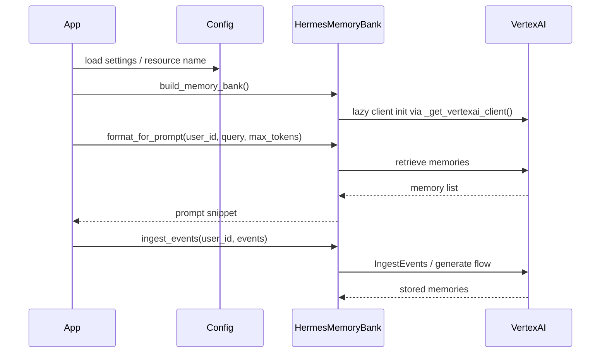

# CLI Reference and Programmatic API for `memory.memory_bank`

## Overview

This repository snapshot exposes a focused memory-management module rather than a full command-line application. The analysis data contains one implementation module, [`memory.memory_bank`](memory/memory_bank.py#L1), plus a set of tests that exercise its public surface. No CLI entry points were detected in the analysis payload (`entry_points` is empty, and no command/subcommand symbols are present), so this page documents the **programmatic API** in depth and explicitly notes the absence of documented CLI commands.

The central abstraction is [`HermesMemoryBank`](memory/memory_bank.py#L79), a facade over Vertex AI Agent Engine memories. Supporting it are helper/build functions such as [`_get_vertexai_client(project, location)`](memory/memory_bank.py#L41), [`build_memory_bank()`](memory/memory_bank.py#L411), and [`create_memory_bank(project, location, display_name)`](memory/memory_bank.py#L432). The implementation is validated by [`tests/memory/test_memory_bank.py`](tests/memory/test_memory_bank.py#L1), which gives useful clues about expected behavior and edge cases.

> **Sources:** `memory/memory_bank.py` · L1–L470 · [`memory.memory_bank`](memory/memory_bank.py#L1) · [`HermesMemoryBank`](memory/memory_bank.py#L79)

---

## CLI Reference

### No CLI commands discovered

The provided static analysis does not include any command-line entry points, subcommands, or parser definitions. There are no symbols corresponding to CLI handlers, and the `entry_points` field is empty. As a result, this codebase snapshot does not currently document a user-facing CLI surface.

If a CLI exists in another part of the repository not included in the analysis, it is not observable here and therefore cannot be documented without speculation. The closest observable operational interfaces are the asynchronous methods on [`HermesMemoryBank`](memory/memory_bank.py#L79) and the resource-creation helper [`create_memory_bank(project, location, display_name)`](memory/memory_bank.py#L432), both of which would be natural candidates for future CLI wiring.

> **Sources:** `memory/memory_bank.py` · L1–L470 · [`build_memory_bank()`](memory/memory_bank.py#L411) · [`create_memory_bank()`](memory/memory_bank.py#L432)

---

## Programmatic API

### `_get_vertexai_client(project, location)`

**Signature**

```python
_get_vertexai_client(project, location)
```

This internal helper constructs a `vertexai.Client` instance and falls back to configuration values when `project` or `location` are not explicitly provided. The docstring notes an important compatibility behavior: if the installed SDK is too old, the function raises `ImportError` with a helpful message rather than failing cryptically.

**Parameters**

| Parameter | Type | Default | Description |
|-----------|------|---------|-------------|
| `project` | unknown / string-like | `None`-aware | Google Cloud project identifier. If not supplied, the function falls back to settings via `get_settings()`. |
| `location` | unknown / string-like | `None`-aware | Vertex AI region/location. If not supplied, the function falls back to settings via `get_settings()`. |

**Return value**

- A `VertexClient` / `vertexai.Client` instance.

**Example usage**

```python
from memory.memory_bank import _get_vertexai_client

client = _get_vertexai_client(project="my-project", location="us-central1")
```

> **Sources:** `memory/memory_bank.py` · L41–L74 · [`_get_vertexai_client(project, location)`](memory/memory_bank.py#L41)

---

### `HermesMemoryBank`

**Signature**

```python
class HermesMemoryBank
```

[`HermesMemoryBank`](memory/memory_bank.py#L79) is the main public-facing facade. Its docstring describes it as an “Application-level facade over Vertex AI Agent Engine memories,” and its `resource_name` must be the full AgentEngine resource path, for example:

```text
projects/my-project/locations/us-central1/reasoningEngines/1234567890
```

The class encapsulates lazy client creation and provides methods for memory generation, ingestion, retrieval, creation, update, deletion, and prompt formatting. The tests show that most methods are designed to fail gracefully: many swallow exceptions and return safe defaults (`False`, `0`, `[]`, or `""`) rather than raising.

#### `HermesMemoryBank.__init__(self, resource_name)`

**Signature**

```python
__init__(self, resource_name)
```

**Parameters**

| Parameter | Type | Default | Description |
|-----------|------|---------|-------------|
| `resource_name` | string | required | Full Agent Engine resource name backing the memory bank. |

**Return value**

- Constructor; returns `None` implicitly.

#### `HermesMemoryBank.generate_memories(self, user_id, user_text, agent_text, agent_name)`

**Signature**

```python
generate_memories(self, user_id, user_text, agent_text, agent_name)
```

This method distills a conversation turn into durable memories. The docstring states it is called from `skill_learning_callback` after every agent turn and that the SDK call is blocking, so the implementation wraps the client work in `asyncio.to_thread(...)`.

**Parameters**

| Parameter | Type | Default | Description |
|-----------|------|---------|-------------|
| `user_id` | string | required | Authenticated user identifier. |
| `user_text` | string | required | The user’s message text. |
| `agent_text` | string | required | The agent’s response text. |
| `agent_name` | string / optional | required by signature | Optional agent name for metadata. |

**Return value**

- `None` implicitly; errors are swallowed and logged.

**Example usage**

```python
bank = HermesMemoryBank(resource_name="projects/p/locations/l/reasoningEngines/e")

await bank.generate_memories(
    user_id="u123",
    user_text="I need help with VPN setup",
    agent_text="Go to Settings > VPN and follow the wizard.",
    agent_name="support-assistant",
)
```

#### `HermesMemoryBank.ingest_events(self, user_id, events)`

**Signature**

```python
ingest_events(self, user_id, events)
```

This method is the more production-oriented ingestion path. The docstring says it streams conversation events to Memory Bank for automatic batched memory generation via `IngestEvents`. The tests indicate that event dictionaries use keys like `role` and `text`, and that the method normalizes the role `"agent"` to `"model"` before sending to the SDK.

**Parameters**

| Parameter | Type | Default | Description |
|-----------|------|---------|-------------|
| `user_id` | string | required | Authenticated user identifier. |
| `events` | list[dict] | required | Event dicts with `role` and `text`. |

**Return value**

- `None` implicitly; errors are swallowed.

**Example usage**

```python
await bank.ingest_events(
    user_id="u1",
    events=[
        {"role": "user", "text": "How do I reset my VPN?"},
        {"role": "agent", "text": "Go to Settings > VPN > Reset."},
    ],
)
```

#### `HermesMemoryBank.purge_memories(self, user_id, dry_run)`

**Signature**

```python
purge_memories(self, user_id, dry_run)
```

Bulk-deletes all memories for a user. The docstring explicitly documents `dry_run` support, and the tests confirm that dry-run avoids the destructive SDK call.

**Parameters**

| Parameter | Type | Default | Description |
|-----------|------|---------|-------------|
| `user_id` | string | required | User whose memories should be deleted. |
| `dry_run` | bool | required | If `True`, count memories without deleting them. |

**Return value**

- Integer count of memories deleted, or the number that would be deleted when `dry_run=True`.
- Returns `0` on failure.

**Example usage**

```python
count = await bank.purge_memories(user_id="u123", dry_run=True)
print(f"Would delete {count} memories")
```

#### `HermesMemoryBank.delete_memory(self, memory_resource_name)`

**Signature**

```python
delete_memory(self, memory_resource_name)
```

Deletes a specific memory by full resource name.

**Parameters**

| Parameter | Type | Default | Description |
|-----------|------|---------|-------------|
| `memory_resource_name` | string | required | Full resource name of the memory to delete. |

**Return value**

- `True` on success, `False` on failure.

**Example usage**

```python
ok = await bank.delete_memory(
    "projects/p/locations/l/reasoningEngines/e/memories/m"
)
```

#### `HermesMemoryBank.create_memory(self, user_id, fact)`

**Signature**

```python
create_memory(self, user_id, fact)
```

Directly stores a memory fact without LLM extraction or consolidation. The docstring frames this as useful for the “memory-as-a-tool” pattern.

**Parameters**

| Parameter | Type | Default | Description |
|-----------|------|---------|-------------|
| `user_id` | string | required | User who owns the memory. |
| `fact` | string | required | Plain-text fact to store. |

**Return value**

- New memory resource name, or `None` on failure.

**Example usage**

```python
name = await bank.create_memory(user_id="u123", fact="User prefers dark mode.")
```

#### `HermesMemoryBank.update_memory(self, memory_resource_name, new_fact)`

**Signature**

```python
update_memory(self, memory_resource_name, new_fact)
```

Updates an existing memory with corrected text.

**Parameters**

| Parameter | Type | Default | Description |
|-----------|------|---------|-------------|
| `memory_resource_name` | string | required | Full memory resource name. |
| `new_fact` | string | required | Updated fact text. |

**Return value**

- `True` on success, `False` on failure.

**Example usage**

```python
ok = await bank.update_memory(
    "projects/p/locations/l/reasoningEngines/e/memories/m",
    "User prefers light mode.",
)
```

#### `HermesMemoryBank.retrieve_profiles(self, user_id)`

**Signature**

```python
retrieve_profiles(self, user_id)
```

This method is intentionally a compatibility stub. The docstring notes that `RetrieveProfiles` is not available in the Agent Engine memories API as of SDK `>= 1.112`, so the method always returns an empty list.

**Parameters**

| Parameter | Type | Default | Description |
|-----------|------|---------|-------------|
| `user_id` | string | required | User identifier. |

**Return value**

- Empty list `[]`.

**Example usage**

```python
profiles = await bank.retrieve_profiles(user_id="u123")
```

#### `HermesMemoryBank.fetch_memories(self, user_id, query, top_k)`

**Signature**

```python
fetch_memories(self, user_id, query, top_k)
```

Retrieves relevant memories for a user. The docstring says this is called at session start by `PreloadMemoryTool` to inject context into the system prompt.

**Parameters**

| Parameter | Type | Default | Description |
|-----------|------|---------|-------------|
| `user_id` | string | required | User identifier. |
| `query` | string | required | Search query for relevant memories. |
| `top_k` | integer | required | Maximum number of results to return. |

**Return value**

- A list of memory strings ready for prompt injection.
- Returns `[]` on error.

**Example usage**

```python
memories = await bank.fetch_memories(
    user_id="u123",
    query="VPN setup",
    top_k=5,
)
```

#### `HermesMemoryBank.list_revisions(self, user_id)`

**Signature**

```python
list_revisions(self, user_id)
```

Another compatibility stub. The docstring states memory revision history is not directly exposed in the current SDK and therefore the method returns an empty list.

**Parameters**

| Parameter | Type | Default | Description |
|-----------|------|---------|-------------|
| `user_id` | string | required | User identifier. |

**Return value**

- Empty list `[]`.

**Example usage**

```python
revisions = await bank.list_revisions(user_id="u123")
```

#### `HermesMemoryBank.format_for_prompt(self, user_id, query, max_tokens)`

**Signature**

```python
format_for_prompt(self, user_id, query, max_tokens)
```

Fetches memories and formats them into a prompt snippet. The docstring notes that it returns an empty string if no memories are found or if the memory bank is unavailable, and that the caller (notably `gateway/main.py`, per docstring) injects the output into the session system prompt.

**Parameters**

| Parameter | Type | Default | Description |
|-----------|------|---------|-------------|
| `user_id` | string | required | User identifier. |
| `query` | string | required | Search query for memory retrieval. |
| `max_tokens` | integer | required | Token budget for the formatted snippet. |

**Return value**

- A string containing a formatted memory block, or `""` when no relevant memories are found.

**Example usage**

```python
snippet = await bank.format_for_prompt(
    user_id="u123",
    query="VPN setup",
    max_tokens=200,
)
```

> **Sources:** `memory/memory_bank.py` · L79–L406 · [`HermesMemoryBank`](memory/memory_bank.py#L79) · [`generate_memories`](memory/memory_bank.py#L105) · [`ingest_events`](memory/memory_bank.py#L143) · [`purge_memories`](memory/memory_bank.py#L187) · [`delete_memory`](memory/memory_bank.py#L227) · [`create_memory`](memory/memory_bank.py#L250) · [`update_memory`](memory/memory_bank.py#L285) · [`retrieve_profiles`](memory/memory_bank.py#L315) · [`fetch_memories`](memory/memory_bank.py#L331) · [`list_revisions`](memory/memory_bank.py#L369) · [`format_for_prompt`](memory/memory_bank.py#L381)

---

### `build_memory_bank()`

**Signature**

```python
build_memory_bank()
```

This helper constructs a [`HermesMemoryBank`](memory/memory_bank.py#L79) from configuration. Its docstring says it returns `None` if `MEMORY_BANK_RESOURCE_NAME` is not configured, allowing graceful degradation when the feature is disabled.

**Parameters**

- None.

**Return value**

- A configured [`HermesMemoryBank`](memory/memory_bank.py#L79) instance, or `None`.

**Example usage**

```python
from memory.memory_bank import build_memory_bank

bank = build_memory_bank()
if bank is None:
    print("Memory bank is disabled")
```

> **Sources:** `memory/memory_bank.py` · L411–L427 · [`build_memory_bank()`](memory/memory_bank.py#L411)

---

### `create_memory_bank(project, location, display_name)`

**Signature**

```python
create_memory_bank(project, location, display_name)
```

This helper provisions a new Agent Engine resource for use as the memory bank. The docstring highlights an SDK migration detail: in `vertexai` SDK `>= 1.112`, there is no standalone `VertexAiMemoryBank` resource class, so the implementation creates a lightweight AgentEngine dedicated to memory storage.

The tests show several important behavioral guarantees:

- If an existing engine with the matching display name is found, it is reused.
- If the list call fails, the function proceeds to create a new resource.
- A custom `display_name` is supported.
- The return value is the resource name of the created or reused engine.

**Parameters**

| Parameter | Type | Default | Description |
|-----------|------|---------|-------------|
| `project` | string | required | Google Cloud project ID. |
| `location` | string | required | Vertex AI location/region. |
| `display_name` | string | required | Desired display name for the memory engine. |

**Return value**

- Resource name string for the Agent Engine memory bank.

**Example usage**

```python
from memory.memory_bank import create_memory_bank

resource_name = create_memory_bank(
    project="my-project",
    location="us-central1",
    display_name="hermes-memory-bank",
)
print(resource_name)
```

> **Sources:** `memory/memory_bank.py` · L432–L470 · [`create_memory_bank(project, location, display_name)`](memory/memory_bank.py#L432)

---

## Integration Examples

### Typical application startup workflow

A realistic integration pattern is:

1. Load app settings.
2. Build the memory facade with [`build_memory_bank()`](memory/memory_bank.py#L411).
3. If present, use [`format_for_prompt()`](memory/memory_bank.py#L381) to preload relevant memories into the system prompt.
4. After each user/assistant turn, persist new context with [`ingest_events()`](memory/memory_bank.py#L143) or [`generate_memories()`](memory/memory_bank.py#L105).

```python
from memory.memory_bank import build_memory_bank

async def start_session(user_id: str, query: str):
    bank = build_memory_bank()
    system_prompt = "You are a helpful assistant."

    if bank is not None:
        memory_snippet = await bank.format_for_prompt(
            user_id=user_id,
            query=query,
            max_tokens=250,
        )
        if memory_snippet:
            system_prompt += "\n\n" + memory_snippet

    return system_prompt
```

### Persisting conversation history

When the conversation ends, store the turn as events so the backend can consolidate memory automatically:

```python
async def save_turn(bank, user_id: str, user_text: str, agent_text: str):
    await bank.ingest_events(
        user_id=user_id,
        events=[
            {"role": "user", "text": user_text},
            {"role": "agent", "text": agent_text},
        ],
    )
```

If your application needs explicit control, use [`create_memory()`](memory/memory_bank.py#L250) instead:

```python
await bank.create_memory(user_id="u123", fact="User is migrating to a new VPN profile.")
```

### Provisioning the memory backend

For setup scripts or admin tooling, call [`create_memory_bank(project, location, display_name)`](memory/memory_bank.py#L432) once and store the resulting resource name in configuration. Then runtime code can use [`build_memory_bank()`](memory/memory_bank.py#L411) to create a facade over that provisioned resource.

```python
from memory.memory_bank import create_memory_bank

resource_name = create_memory_bank(
    project="my-project",
    location="us-central1",
    display_name="hermes-memory-bank",
)
print(f"Configure MEMORY_BANK_RESOURCE_NAME={resource_name}")
```

### End-to-end sequence



This flow matches the observable API design: lazy client creation, safe prompt-time retrieval, and asynchronous post-turn ingestion.

> **Sources:** `memory/memory_bank.py` · L41–L470 · [`_get_vertexai_client`](memory/memory_bank.py#L41) · [`build_memory_bank`](memory/memory_bank.py#L411) · [`format_for_prompt`](memory/memory_bank.py#L381) · [`ingest_events`](memory/memory_bank.py#L143)