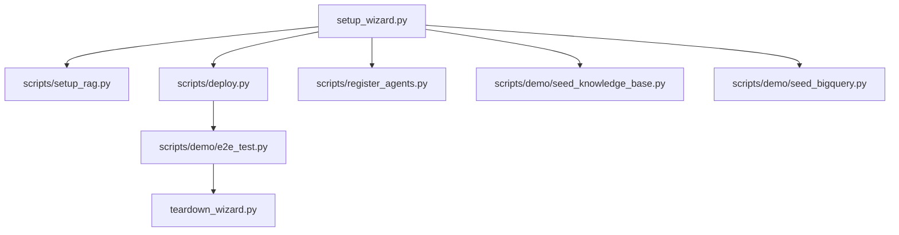

# Command-Line Entry Points Reference

This page documents the repository’s visible command-line entry points and operational scripts. It focuses on the top-level executables and intended usage, rather than internal helper routines. The entry points covered here are the ones surfaced in the analysis data: [`eval/run_eval.py`](eval/run_eval.py#L1), [`scripts/deploy.py`](scripts/deploy.py#L1), [`scripts/register_agents.py`](scripts/register_agents.py#L1), [`scripts/setup_rag.py`](scripts/setup_rag.py#L1), [`scripts/demo/e2e_test.py`](scripts/demo/e2e_test.py#L1), [`scripts/demo/seed_bigquery.py`](scripts/demo/seed_bigquery.py#L1), [`scripts/demo/seed_knowledge_base.py`](scripts/demo/seed_knowledge_base.py#L1), [`setup_wizard.py`](setup_wizard.py#L1), and [`teardown_wizard.py`](teardown_wizard.py#L1).

## Overview

The repository exposes two broad categories of CLI entry points:

1. **Provisioning and lifecycle scripts** — used to create, deploy, configure, and tear down cloud resources and demo infrastructure.
2. **Evaluation and demo scripts** — used to run offline evaluation, seed demo data, and execute end-to-end checks against a deployed system.

A notable pattern is that many of these scripts are thin orchestration layers over the main application modules. For example, the setup wizard coordinates [`setup_rag`](setup_wizard.py#L320) and [`deploy_cloud_run`](setup_wizard.py#L458), while the teardown wizard mirrors that lifecycle with deletion functions such as [`delete_cloud_run`](teardown_wizard.py#L112) and [`wipe_env_file`](teardown_wizard.py#L323). The eval script is similarly concise, exposing argument parsing through [`parse_args`](eval/run_eval.py#L16) and execution through [`main`](eval/run_eval.py#L25).

### Execution model

Most entry points are designed to be run directly with Python:

```bash
python eval/run_eval.py --help
python scripts/deploy.py
python setup_wizard.py
python teardown_wizard.py
```

A few are more task-oriented and are usually invoked when bringing up or validating the system:

```bash
python scripts/setup_rag.py
python scripts/register_agents.py
python scripts/demo/seed_bigquery.py
python scripts/demo/seed_knowledge_base.py
python scripts/demo/e2e_test.py
```

> **Sources:** `eval/run_eval.py` · `scripts/deploy.py` · `scripts/register_agents.py` · `scripts/setup_rag.py` · `scripts/demo/e2e_test.py` · `scripts/demo/seed_bigquery.py` · `scripts/demo/seed_knowledge_base.py` · `setup_wizard.py` · `teardown_wizard.py`

## Command Reference

The table below summarises each visible command-line entry point, its purpose, the inputs it expects, the outputs or side effects it produces, and the most relevant modules it touches.

| Command | Purpose | Inputs | Outputs | Related Modules |
|--------|---------|--------|---------|-----------------|
| `python eval/run_eval.py` | Run offline evaluation / dry-run evaluation flows for the agent system. | CLI args parsed by [`parse_args`](eval/run_eval.py#L16); evaluation set / flags inferred by script logic. | Exit code; printed evaluation status/results. | [`eval.metrics`](eval/metrics.py#L1), [`eval.online_monitor`](eval/online_monitor.py#L1), [`eval.run_eval`](eval/run_eval.py#L1) |
| `python scripts/deploy.py` | Deploy application components and cloud resources. | Environment / runtime settings read by the script; cloud credentials. | Deployment side effects; printed deployment progress. | [`config`](config.py#L1), [`agents`](agents/__init__.py#L1), [`gateway.main`](gateway/main.py#L1), [`scripts.deploy`](scripts/deploy.py#L1) |
| `python scripts/register_agents.py` | Register agents from configuration into the agent registry. | YAML config, typically `agents.yaml`; runtime settings. | Registry entries created/updated; printed registration summary. | [`agents.loader`](agents/loader.py#L1), [`registry.agent_registry`](registry/agent_registry.py#L1), [`scripts.register_agents`](scripts/register_agents.py#L1) |
| `python scripts/setup_rag.py` | Create or initialise the RAG corpus used by the repository. | Cloud project/region and corpus metadata. | A created corpus resource name and console output. | [`scripts.setup_rag`](scripts/setup_rag.py#L1), [`memory.skill_store`](memory/skill_store.py#L1), [`config`](config.py#L1) |
| `python scripts/demo/e2e_test.py` | Run end-to-end demo validation against a running deployment. | Base URL, auth token, and test environment state. | Pass/fail results for multiple chat/task/demo scenarios. | [`gateway.main`](gateway/main.py#L1), [`connectors.runner`](connectors/runner.py#L1), [`scripts.demo.e2e_test`](scripts/demo/e2e_test.py#L1) |
| `python scripts/demo/seed_bigquery.py` | Seed sample BigQuery demo datasets. | BigQuery project/dataset context. | Dataset/table creation and inserted rows. | [`tools.bigquery_tool`](tools/bigquery_tool.py#L1), [`scripts.demo.seed_bigquery`](scripts/demo/seed_bigquery.py#L1) |
| `python scripts/demo/seed_knowledge_base.py` | Seed the knowledge base with demo documents and skills. | Corpus names and local demo content. | Uploaded documents/skills in RAG corpora. | [`memory.skill_models`](memory/skill_models.py#L1), [`memory.skill_store`](memory/skill_store.py#L1), [`scripts.demo.seed_knowledge_base`](scripts/demo/seed_knowledge_base.py#L1) |
| `python setup_wizard.py` | Guided bootstrap for configuring, provisioning, and deploying the full stack. | Interactive answers, `.env` path, cloud configuration, feature choices. | Updated env file, provisioned cloud resources, deployment summary. | [`config`](config.py#L1), [`setup_wizard`](setup_wizard.py#L1), [`scripts.setup_rag`](scripts/setup_rag.py#L1) |
| `python teardown_wizard.py` | Guided teardown for removing provisioned resources and cleaning up environment state. | Confirmation prompts, `.env` file, project/region/resource identifiers. | Deleted cloud resources; env file optionally wiped. | [`teardown_wizard`](teardown_wizard.py#L1), [`memory.memory_bank`](memory/memory_bank.py#L1), [`registry.agent_registry`](registry/agent_registry.py#L1) |

> **Sources:** `eval/run_eval.py` · `scripts/deploy.py` · `scripts/register_agents.py` · `scripts/setup_rag.py` · `scripts/demo/e2e_test.py` · `scripts/demo/seed_bigquery.py` · `scripts/demo/seed_knowledge_base.py` · `setup_wizard.py` · `teardown_wizard.py`

## Entry Point Details

### `eval/run_eval.py`

The evaluation entry point is implemented as a standard Python CLI module with explicit argument parsing in [`parse_args(argv)`](eval/run_eval.py#L16) and a top-level [`main(argv)`](eval/run_eval.py#L25). Based on the surrounding eval package, it likely coordinates offline scoring using [`score_response`](eval/metrics.py#L23) and can optionally integrate online monitoring via [`build_online_monitor`](eval/online_monitor.py#L58). The analysis data shows test coverage for dry-run behavior and missing eval-set failure paths, which suggests the script is used as a gate for validating evaluation inputs before running a full evaluation pass.

Example usage:

```bash
python eval/run_eval.py --dry-run
python eval/run_eval.py --evalset path/to/evalset.json
```

Observed intent:
- validate an evaluation set or configuration
- print pass/fail information
- exit non-zero when required inputs are missing

> **Sources:** `eval/run_eval.py` · L1–L78 · [`parse_args`](eval/run_eval.py#L16) · [`main`](eval/run_eval.py#L25) · [`score_response`](eval/metrics.py#L23) · [`build_online_monitor`](eval/online_monitor.py#L58)

### `scripts/deploy.py`

This script is the repository’s direct deployment entry point. Its [`main()`](scripts/deploy.py#L31) function spans the file, indicating it likely drives a multi-step deployment workflow. The analysis does not expose the full internal breakdown of the steps, but the placement under `scripts/` and its size suggest orchestration of build, configuration, and cloud deployment tasks rather than application logic. It is the main non-interactive deployment command surfaced in the repository.

Example usage:

```bash
python scripts/deploy.py
```

Common expectations:
- read project settings from the environment or config
- deploy application services
- print deployment status and any resulting URLs or identifiers

> **Sources:** `scripts/deploy.py` · L1–L111 · [`main`](scripts/deploy.py#L31)

### `scripts/register_agents.py`

This entry point registers agents defined in YAML into the agent registry. It exposes [`load_agents_yaml(path)`](scripts/register_agents.py#L23), [`build_record(raw)`](scripts/register_agents.py#L32), [`run(args)`](scripts/register_agents.py#L43), and [`main()`](scripts/register_agents.py#L69). The presence of a YAML loader and record builder makes the purpose clear: transform configuration into registry records and push them into the backing registry service.

Related modules are especially important here:
- [`agents.loader`](agents/loader.py#L1) for building agent definitions from config
- [`registry.agent_registry`](registry/agent_registry.py#L1) for persistence/registration
- [`config`](config.py#L1) for runtime settings

Example usage:

```bash
python scripts/register_agents.py --yaml agents.yaml
```

> **Sources:** `scripts/register_agents.py` · L1–L82 · [`load_agents_yaml`](scripts/register_agents.py#L23) · [`build_record`](scripts/register_agents.py#L32) · [`run`](scripts/register_agents.py#L43) · [`main`](scripts/register_agents.py#L69)

### `scripts/setup_rag.py`

This script creates a RAG corpus and reports the resulting resource name. Its primary exposed function, [`create_corpus(display_name, description)`](scripts/setup_rag.py#L29), and the top-level [`main()`](scripts/setup_rag.py#L43) show that it is a provisioning helper rather than a general-purpose RAG tool. It is likely used during bootstrap to ensure the required corpus exists before skills or documents are seeded.

Example usage:

```bash
python scripts/setup_rag.py
```

Expected output:
- a created or discovered corpus resource identifier
- console logging suitable for copy/pasting into environment configuration

> **Sources:** `scripts/setup_rag.py` · L1–L59 · [`create_corpus`](scripts/setup_rag.py#L29) · [`main`](scripts/setup_rag.py#L43)

### `scripts/demo/e2e_test.py`

This is the repository’s end-to-end verification script for the demo deployment. The file exposes utility functions such as [`chat_sse`](scripts/demo/e2e_test.py#L91), [`submit_task`](scripts/demo/e2e_test.py#L138), [`poll_until_done`](scripts/demo/e2e_test.py#L181), and numerous scenario tests like [`test_health`](scripts/demo/e2e_test.py#L201), [`test_self_scheduling`](scripts/demo/e2e_test.py#L391), and [`test_workspace_drive`](scripts/demo/e2e_test.py#L461). Its [`main()`](scripts/demo/e2e_test.py#L513) likely orchestrates all checks and aggregates results using [`TestResult`](scripts/demo/e2e_test.py#L69).

This script is best understood as a smoke-test harness for a live environment:
- authenticates with an ID token via [`get_token`](scripts/demo/e2e_test.py#L46)
- exercises chat, task, scheduling, and workspace integration flows
- prints a summary of passed and failed checks

Example usage:

```bash
python scripts/demo/e2e_test.py
```

> **Sources:** `scripts/demo/e2e_test.py` · L1–L568 · [`get_token`](scripts/demo/e2e_test.py#L46) · [`chat_sse`](scripts/demo/e2e_test.py#L91) · [`submit_task`](scripts/demo/e2e_test.py#L138) · [`poll_until_done`](scripts/demo/e2e_test.py#L181) · [`main`](scripts/demo/e2e_test.py#L513)

### `scripts/demo/seed_bigquery.py`

This script seeds demo BigQuery data. The analysis shows [`get_client`](scripts/demo/seed_bigquery.py#L36), [`ensure_dataset`](scripts/demo/seed_bigquery.py#L46), [`generate_sales_data`](scripts/demo/seed_bigquery.py#L147), [`seed_table`](scripts/demo/seed_bigquery.py#L266), and [`main()`](scripts/demo/seed_bigquery.py#L291). The documented `generate_sales_data()` suggests the script creates a deterministic sales dataset suitable for analytics demos and query examples.

Example usage:

```bash
python scripts/demo/seed_bigquery.py
```

Likely side effects:
- create or validate a dataset
- generate and upload sample rows
- populate tables for demo analytics workflows

> **Sources:** `scripts/demo/seed_bigquery.py` · L1–L311 · [`get_client`](scripts/demo/seed_bigquery.py#L36) · [`ensure_dataset`](scripts/demo/seed_bigquery.py#L46) · [`generate_sales_data`](scripts/demo/seed_bigquery.py#L147) · [`seed_table`](scripts/demo/seed_bigquery.py#L266) · [`main`](scripts/demo/seed_bigquery.py#L291)

### `scripts/demo/seed_knowledge_base.py`

This entry point uploads demo content into knowledge-base and skills corpora. The script exposes [`get_settings`](scripts/demo/seed_knowledge_base.py#L131), [`upload_doc`](scripts/demo/seed_knowledge_base.py#L144), [`upload_skill`](scripts/demo/seed_knowledge_base.py#L159), and [`main()`](scripts/demo/seed_knowledge_base.py#L181). The presence of both document and skill upload flows indicates it seeds both generic RAG documents and structured skill artifacts.

Example usage:

```bash
python scripts/demo/seed_knowledge_base.py
```

Expected results:
- documents uploaded to a corpus
- skills serialized and uploaded
- console confirmation of seeded content

> **Sources:** `scripts/demo/seed_knowledge_base.py` · L1–L223 · [`get_settings`](scripts/demo/seed_knowledge_base.py#L131) · [`upload_doc`](scripts/demo/seed_knowledge_base.py#L144) · [`upload_skill`](scripts/demo/seed_knowledge_base.py#L159) · [`main`](scripts/demo/seed_knowledge_base.py#L181)

### `setup_wizard.py`

The setup wizard is the most comprehensive bootstrap entry point in the repository. It includes interactive prompting helpers such as [`ask`](setup_wizard.py#L75), [`ask_yn`](setup_wizard.py#L89), environment-file management with [`write_env`](setup_wizard.py#L98) and [`read_env_value`](setup_wizard.py#L110), and high-level orchestration steps like [`preflight`](setup_wizard.py#L121), [`gather_config`](setup_wizard.py#L171), [`bootstrap_gcp`](setup_wizard.py#L244), [`setup_rag`](setup_wizard.py#L320), [`deploy_agent`](setup_wizard.py#L375), [`seed_demo_data`](setup_wizard.py#L418), [`setup_memory_bank`](setup_wizard.py#L433), [`deploy_cloud_run`](setup_wizard.py#L458), and [`print_summary`](setup_wizard.py#L516). The top-level [`main()`](setup_wizard.py#L557) coordinates these steps.

This script appears to provide a guided, opinionated setup flow for a full deployment. It likely:
- checks local prerequisites
- collects cloud and runtime settings
- writes `.env` values
- provisions GCP resources
- sets up RAG and memory infrastructure
- deploys the application
- prints a final summary for the user

Example usage:

```bash
python setup_wizard.py
```

> **Sources:** `setup_wizard.py` · L1–L611 · [`preflight`](setup_wizard.py#L121) · [`gather_config`](setup_wizard.py#L171) · [`bootstrap_gcp`](setup_wizard.py#L244) · [`setup_rag`](setup_wizard.py#L320) · [`deploy_agent`](setup_wizard.py#L375) · [`setup_memory_bank`](setup_wizard.py#L433) · [`deploy_cloud_run`](setup_wizard.py#L458) · [`print_summary`](setup_wizard.py#L516) · [`main`](setup_wizard.py#L557)

### `teardown_wizard.py`

The teardown wizard is the inverse of the setup flow. It exposes support functions such as [`confirm`](teardown_wizard.py#L98), resource-removal operations like [`delete_cloud_run`](teardown_wizard.py#L112), [`delete_reasoning_engine`](teardown_wizard.py#L126), [`delete_memory_bank`](teardown_wizard.py#L150), [`delete_rag_corpora`](teardown_wizard.py#L179), [`delete_gcs_bucket`](teardown_wizard.py#L201), [`delete_firestore`](teardown_wizard.py#L217), [`delete_service_account`](teardown_wizard.py#L236), [`delete_container_image`](teardown_wizard.py#L249), [`delete_scheduler_jobs`](teardown_wizard.py#L270), [`disable_apis`](teardown_wizard.py#L305), and [`wipe_env_file`](teardown_wizard.py#L323). Its [`main()`](teardown_wizard.py#L337) provides the interactive control flow.

The intent is clearly lifecycle cleanup:
- confirm destructive actions
- identify resources from the environment file
- delete cloud and app resources
- optionally clear local environment state

Example usage:

```bash
python teardown_wizard.py
```

> **Sources:** `teardown_wizard.py` · L1–L441 · [`confirm`](teardown_wizard.py#L98) · [`delete_cloud_run`](teardown_wizard.py#L112) · [`delete_reasoning_engine`](teardown_wizard.py#L126) · [`delete_memory_bank`](teardown_wizard.py#L150) · [`delete_rag_corpora`](teardown_wizard.py#L179) · [`delete_gcs_bucket`](teardown_wizard.py#L201) · [`delete_firestore`](teardown_wizard.py#L217) · [`delete_scheduler_jobs`](teardown_wizard.py#L270) · [`disable_apis`](teardown_wizard.py#L305) · [`wipe_env_file`](teardown_wizard.py#L323) · [`main`](teardown_wizard.py#L337)

## Related Modules and Workflow

Several CLI entry points map directly onto broader repository subsystems:

- **Configuration and environment**: [`config`](config.py#L1) provides shared settings consumed by setup, deploy, and seed scripts.
- **Agents and registry**: [`agents.loader`](agents/loader.py#L1) and [`registry.agent_registry`](registry/agent_registry.py#L1) underpin registration and deployment workflows.
- **Memory and RAG**: [`memory.skill_store`](memory/skill_store.py#L1), [`memory.skill_models`](memory/skill_models.py#L1), and related modules support corpus seeding and retrieval setup.
- **Gateway and runtime validation**: [`gateway.main`](gateway/main.py#L1) is the deployment target exercised by `scripts/deploy.py` and the e2e harness.
- **Evaluation**: [`eval.metrics`](eval/metrics.py#L1) and [`eval.online_monitor`](eval/online_monitor.py#L1) support the evaluation CLI.

### Simple operational flow



This diagram shows the dominant lifecycle: bootstrap resources, deploy services, seed demo assets, validate with end-to-end tests, and finally tear down when done.

> **Sources:** `setup_wizard.py` · `scripts/setup_rag.py` · `scripts/deploy.py` · `scripts/register_agents.py` · `scripts/demo/seed_knowledge_base.py` · `scripts/demo/seed_bigquery.py` · `scripts/demo/e2e_test.py` · `teardown_wizard.py`

## Practical Usage Notes

### Choosing the right entry point

| Task | Best entry point |
|------|------------------|
| Provision the full environment interactively | `python setup_wizard.py` |
| Remove cloud resources and clean up | `python teardown_wizard.py` |
| Register agents from YAML | `python scripts/register_agents.py` |
| Create a RAG corpus | `python scripts/setup_rag.py` |
| Seed demo analytics data | `python scripts/demo/seed_bigquery.py` |
| Seed knowledge-base documents and skills | `python scripts/demo/seed_knowledge_base.py` |
| Run smoke tests against a deployment | `python scripts/demo/e2e_test.py` |
| Validate evaluation inputs / dry-run scoring | `python eval/run_eval.py` |

### Operational caution

Some scripts are intentionally destructive or cloud-mutating:
- [`teardown_wizard.py`](teardown_wizard.py#L1) removes resources.
- [`setup_wizard.py`](setup_wizard.py#L1) and [`scripts/deploy.py`](scripts/deploy.py#L1) may create and configure live cloud infrastructure.
- Demo seeders modify datasets and corpora.

Treat these commands as environment-management tools rather than local-only utilities.

> **Sources:** `setup_wizard.py` · `teardown_wizard.py` · `scripts/deploy.py` · `scripts/register_agents.py` · `scripts/setup_rag.py` · `scripts/demo/seed_bigquery.py` · `scripts/demo/seed_knowledge_base.py` · `scripts/demo/e2e_test.py` · `eval/run_eval.py`