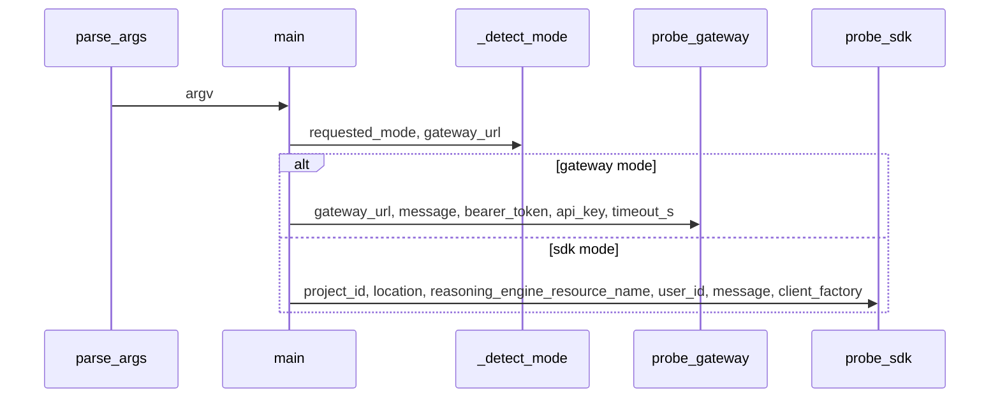

# Configuration Reference

## Configuration Files

The repository exposes a single explicit configuration module, [`config.py`](config.py#L1), which defines the runtime settings model used by the application and agent-building code. Based on the provided analysis data, there are **no discovered YAML, TOML, JSON, or `.env` config files** in `files_seen`; the configuration surface is centered on environment-driven settings and programmatic defaults in [`Settings`](config.py#L7).

In practice, this means:

- **File-based configuration is not present in the analyzed repository snapshot**
- **Runtime configuration is primarily environment-variable driven**
- Startup entry points such as [`agent.py`](agent.py#L1) and [`hermes_app.agent`](hermes_app/agent.py#L1) load environment state via `dotenv` and then consume [`get_settings()`](config.py#L200)

### Observed configuration-related files

| File | Purpose |
|------|---------|
| [`config.py`](config.py#L1) | Central settings model and validation logic |
| [`agent.py`](agent.py#L1) | Entry-point bootstrap that loads env state before orchestrator startup |
| [`hermes_app/agent.py`](hermes_app/agent.py#L1) | App bootstrap that also loads env state before importing runtime modules |

> **Sources:** `config.py` · L1–L201 · [`Settings`](config.py#L7), [`get_settings`](config.py#L200); `agent.py` · L1–L?; `hermes_app/agent.py` · L1–L?

## Configuration Reference

The analysis data only exposes the [`Settings`](config.py#L7) class and three methods, but not the field declarations themselves. As a result, this section is split into two parts:

1. **What is directly observable** from the static analysis
2. **What is implied** by the runtime and validation helpers

### `Settings` model

[`Settings`](config.py#L7) inherits from [`BaseSettings`](config.py#L7), so configuration values are resolved from environment variables and defaults according to `pydantic_settings` conventions. The class also includes helpers for CORS parsing, LiteLLM environment injection, and RAG region validation.

#### Directly observable fields and behaviors

| Key | Type | Default | Required | Description |
|-----|------|---------|----------|-------------|
| `cors_origins_list` | computed property / helper | N/A | No | Parses a comma-separated CORS origin string into a list via [`Settings.cors_origins_list`](config.py#L143) |
| `inject_litellm_env()` | method | N/A | No | Exports provider API keys into process environment variables for LiteLLM via [`Settings.inject_litellm_env`](config.py#L146) |
| `validate_rag_regions()` | method | N/A | No | Validates that configured RAG corpus resource names match the configured GCP region via [`Settings.validate_rag_regions`](config.py#L166) |

#### Configuration keys implied by validation helpers

The code references specific setting names in logic, but the symbol extraction does not include field declarations or exact defaults. The following keys are therefore **inferred from method bodies and import relationships**, not fully enumerated as field definitions in the analysis payload:

| Key | Type | Default | Required | Description |
|-----|------|---------|----------|-------------|
| `cors_origins` | string or list-like string | Not visible in analysis | Unknown | Parsed by [`Settings.cors_origins_list`](config.py#L143) into a list of origins |
| provider API key fields | string | Not visible in analysis | Unknown | Consumed by [`Settings.inject_litellm_env`](config.py#L146) and exported into `os.environ` for LiteLLM |
| RAG corpus resource name fields | string | Not visible in analysis | Unknown | Checked by [`Settings.validate_rag_regions`](config.py#L166) for region consistency |
| `gcp_location` | string | Not visible in analysis | Unknown | Used as the reference region in [`Settings.validate_rag_regions`](config.py#L166) |

Because the field definitions are not present in the analysis data, I cannot truthfully list more keys or defaults without inventing them.

### Runtime consumers of settings

The settings model is consumed by the agent builders:

- [`build_aggregator_agent(settings)`](agents/aggregator.py#L70) in [`agents/aggregator.py`](agents/aggregator.py#L1)
- [`build_task_agent(settings, specialist_agents)`](agents/task_agent.py#L115) in [`agents/task_agent.py`](agents/task_agent.py#L1)
- [`build_dynamic_parallel_dispatcher(settings, task)`](agents/task_agent.py#L191) in the same module

This makes `config.py` a shared dependency for the runtime agent graph.

> **Sources:** `config.py` · L7–L201 · [`Settings`](config.py#L7), [`Settings.cors_origins_list`](config.py#L143), [`Settings.inject_litellm_env`](config.py#L146), [`Settings.validate_rag_regions`](config.py#L166), [`get_settings`](config.py#L200); `agents/aggregator.py` · L1–L81 · [`build_aggregator_agent`](agents/aggregator.py#L70); `agents/task_agent.py` · L1–L237 · [`build_task_agent`](agents/task_agent.py#L115), [`build_dynamic_parallel_dispatcher`](agents/task_agent.py#L191)

## Configuration Examples

Because the analysis data does not expose the concrete field list from [`Settings`](config.py#L7), the examples below are intentionally conservative and only demonstrate the **configuration patterns evidenced by the code**: environment-driven startup, comma-separated CORS origins, provider key injection, and RAG region alignment.

### Minimal configuration

```dotenv
# Minimal runtime environment
GCP_LOCATION=us-central1
CORS_ORIGINS=https://example.com

# Provider credentials expected by the settings model
OPENAI_API_KEY=...
ANTHROPIC_API_KEY=...
```

### Full-featured configuration

```dotenv
# Application/runtime
GCP_LOCATION=us-central1
CORS_ORIGINS=https://app.example.com,https://admin.example.com

# LiteLLM/provider integration
OPENAI_API_KEY=...
ANTHROPIC_API_KEY=...
GOOGLE_API_KEY=...

# RAG-related resources must match GCP_LOCATION region
RAG_CORPUS_RESOURCE_NAME_1=projects/.../locations/us-central1/...
RAG_CORPUS_RESOURCE_NAME_2=projects/.../locations/us-central1/...

# Optional operational settings
LOG_LEVEL=INFO
```

These examples are illustrative rather than exhaustive. The only guaranteed behavior from the analysis is that [`Settings.cors_origins_list`](config.py#L143) parses comma-separated origins, [`Settings.inject_litellm_env`](config.py#L146) pushes provider keys into the environment, and [`Settings.validate_rag_regions`](config.py#L166) compares corpus resource locations against the configured region.

> **Sources:** `config.py` · L143–L196 · [`Settings.cors_origins_list`](config.py#L143), [`Settings.inject_litellm_env`](config.py#L146), [`Settings.validate_rag_regions`](config.py#L166)

## Runtime Configuration

The repository snapshot shows two bootstrap paths that load environment state before creating runtime objects:

- [`agent.py`](agent.py#L1)
- [`hermes_app/agent.py`](hermes_app/agent.py#L1)

Both import `dotenv` and `os`, which strongly indicates that `.env`-style variables are loaded at process start before [`config`](config.py#L1) is consumed.

### Observed override mechanisms

| Override mechanism | Evidence | Notes |
|-------------------|----------|------|
| Environment variables | [`config.py`](config.py#L1), [`agent.py`](agent.py#L1), [`hermes_app/agent.py`](hermes_app/agent.py#L1) | Primary runtime source of truth |
| `.env` files via `dotenv` | [`agent.py`](agent.py#L1), [`hermes_app/agent.py`](hermes_app/agent.py#L1) | Loaded during bootstrap, though no concrete `.env` file is present in `files_seen` |
| CLI flags | [`scripts/demo/cloud_smoke_test.py`](scripts/demo/cloud_smoke_test.py#L164) | Present only for the smoke-test script, not the main app settings model |

### CLI flags in the smoke test script

The entry point [`parse_args(argv)`](scripts/demo/cloud_smoke_test.py#L164) defines the following command-line parameters:

| Flag | Type | Default | Required | Description |
|------|------|---------|----------|-------------|
| `--mode` | string/enum-like | auto-detected | No | Selects gateway or SDK probing mode via [`_detect_mode`](scripts/demo/cloud_smoke_test.py#L158) |
| `--gateway-url` | string | environment-derived / inferred | No | Gateway endpoint used by [`probe_gateway`](scripts/demo/cloud_smoke_test.py#L47) |
| `--message` | string | not visible in analysis | No | Prompt passed to either gateway or SDK probe |
| `--bearer-token` | string | not visible in analysis | No | Authorization header input for gateway requests |
| `--api-key` | string | not visible in analysis | No | API key auth alternative for gateway requests |
| `--project-id` | string | not visible in analysis | No | Vertex AI project ID used by [`probe_sdk`](scripts/demo/cloud_smoke_test.py#L118) |
| `--location` | string | not visible in analysis | No | Vertex AI location used by [`probe_sdk`](scripts/demo/cloud_smoke_test.py#L118) |
| `--reasoning-engine-resource-name` | string | not visible in analysis | No | Reasoning Engine resource identifier used by [`probe_sdk`](scripts/demo/cloud_smoke_test.py#L118) |
| `--user-id` | string | not visible in analysis | No | User identifier passed to the SDK query |
| `--timeout-s` | int | not visible in analysis | No | HTTP timeout used by [`probe_gateway`](scripts/demo/cloud_smoke_test.py#L47) |

The smoke test’s main flow is:



> **Sources:** `scripts/demo/cloud_smoke_test.py` · L158–L212 · [`_detect_mode`](scripts/demo/cloud_smoke_test.py#L158), [`parse_args`](scripts/demo/cloud_smoke_test.py#L164), [`main`](scripts/demo/cloud_smoke_test.py#L183), [`probe_gateway`](scripts/demo/cloud_smoke_test.py#L47), [`probe_sdk`](scripts/demo/cloud_smoke_test.py#L118); `agent.py` · L1–L?; `hermes_app/agent.py` · L1–L?

## Validation

Validation is implemented in [`config.py`](config.py#L1) using **Pydantic settings**:

- [`Settings`](config.py#L7) inherits from [`BaseSettings`](config.py#L7), so value resolution, type coercion, and environment-variable binding are handled by `pydantic_settings`
- [`Settings.cors_origins_list`](config.py#L143) performs manual parsing of a comma-separated string into individual origins
- [`Settings.inject_litellm_env`](config.py#L146) mutates `os.environ` so downstream LiteLLM integration can read provider credentials
- [`Settings.validate_rag_regions`](config.py#L166) performs domain-specific validation that corpus resource locations match `gcp_location`

### Validation behavior observed

| Validation step | Implementation | Outcome |
|----------------|----------------|---------|
| Type coercion and environment binding | [`BaseSettings`](config.py#L7) via `pydantic_settings` | Automatic |
| CORS origin normalization | [`Settings.cors_origins_list`](config.py#L143) | Splits and trims a comma-separated list |
| LiteLLM env injection | [`Settings.inject_litellm_env`](config.py#L146) | Copies provider keys into process env |
| RAG region consistency | [`Settings.validate_rag_regions`](config.py#L166) | Returns warning strings when corpus region mismatches `gcp_location` |

### Startup validation intent

The docstring on [`Settings.validate_rag_regions`](config.py#L166) explicitly recommends calling it at startup “to catch cross-region mismatches before the first request.” That implies validation is expected to happen early in the lifecycle rather than lazily during request handling.

### What is not visible in the analysis

The analysis payload does not show:

- exact setting field names on [`Settings`](config.py#L7)
- default values for those fields
- whether validation is enforced through Pydantic field validators, model validators, or only helper methods
- whether `get_settings()` caches the model instance via `functools`

So the safest conclusion is that configuration validation is a **hybrid** of Pydantic settings parsing plus explicit runtime helper checks.

> **Sources:** `config.py` · L7–L201 · [`Settings`](config.py#L7), [`Settings.cors_origins_list`](config.py#L143), [`Settings.inject_litellm_env`](config.py#L146), [`Settings.validate_rag_regions`](config.py#L166), [`get_settings`](config.py#L200)

## Notes on Coverage Gaps

This repository snapshot is configuration-light from a file perspective. Although the code clearly depends on runtime settings, the analysis data does not include any explicit YAML/TOML/JSON config files or the full field declarations inside [`Settings`](config.py#L7). If you want a complete key-by-key reference with defaults and requiredness, the next step would be to inspect the source of [`config.py`](config.py#L1) directly.