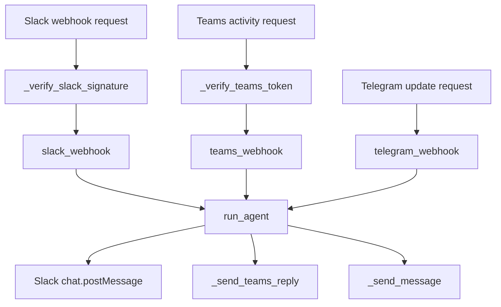
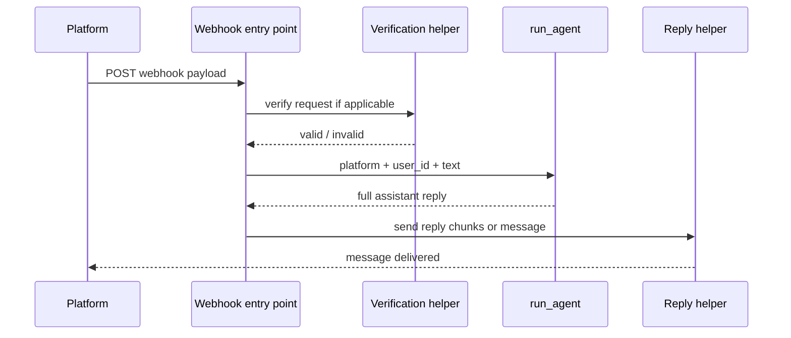

# Connector Integrations as Webhook Adapters

This page documents the connector family in `connectors/` as a set of webhook adapters that all normalize inbound platform messages into a shared execution path via [`run_agent`](connectors/runner.py#L34). The connectors themselves do not construct agents or define gateway authentication policy; they only verify platform-specific webhook requests, extract text, dispatch work to the shared runner, and send replies back through each platform’s API.

The three integrations covered here are:

- Slack webhook adapter in [`connectors/slack.py`](connectors/slack.py#L1)
- Microsoft Teams webhook adapter in [`connectors/teams.py`](connectors/teams.py#L1)
- Telegram webhook adapter in [`connectors/telegram.py`](connectors/telegram.py#L1)

All three are shaped around the same idea: verify the inbound request, identify the platform user and message text, call [`run_agent`](connectors/runner.py#L34), and then reply using a platform-specific helper. The shared runner centralizes session naming via [`_platform_session_id`](connectors/runner.py#L28), which namespaces sessions by platform and stable user ID.

## Architecture Overview

The connector layer is intentionally thin. Each platform module owns the platform-specific transport concerns, while the shared runner owns the cross-platform conversation handoff.



The diagram reflects the observed call structure in [`connectors.slack`](connectors/slack.py#L1), [`connectors.teams`](connectors/teams.py#L1), [`connectors.telegram`](connectors/telegram.py#L1), and [`connectors.runner`](connectors/runner.py#L1). Slack and Teams both perform inbound verification before dispatch; Telegram’s webhook entry point accepts the update and processes it directly, with no separate signature/JWT verification helper present in the analysis data.

> **Sources:** `connectors/slack.py` · L1–L153 · [`slack_webhook`](connectors/slack.py#L68) · [`_verify_slack_signature`](connectors/slack.py#L44) · `connectors/teams.py` · L1–L185 · [`teams_webhook`](connectors/teams.py#L93) · [`_verify_teams_token`](connectors/teams.py#L66) · `connectors/telegram.py` · L1–L100 · [`telegram_webhook`](connectors/telegram.py#L61) · `connectors/runner.py` · L1–L87 · [`run_agent`](connectors/runner.py#L34)

## Shared Runner and Session Namespacing

The shared execution path lives in [`connectors.runner`](connectors/runner.py#L1). The helper [`_platform_session_id(platform, platform_user_id)`](connectors/runner.py#L28) creates a namespaced session identifier by combining the platform tag with the platform’s stable user identifier. This is the key abstraction that makes Slack, Teams, and Telegram behave like one connector family: the same Hermes agent session model is reused across platforms, but the session namespace prevents collisions between users with the same raw identifier on different systems.

The primary API is [`run_agent(platform, platform_user_id, message)`](connectors/runner.py#L34). Its documented contract is simple: accept a short platform tag, a stable platform user ID, and the user’s text message; return the full plain-text response. Internally, the function constructs a `Content` payload and invokes the ADK runner asynchronously. The implementation also accumulates response parts and extracts the final text from the agent run result. Based on the observed relationships, it depends on [`_platform_session_id`](connectors/runner.py#L28), `Content`, `Part`, `run_async`, `create_session`, and `is_final_response`.

Because the connector modules all delegate to the same function, platform-specific webhooks do not need to know anything about agent selection, model choice, or memory tooling. That separation keeps the adapters focused on transport and makes them easy to compare and test.

### Practical call chain

```text
slack_webhook / teams_webhook / telegram_webhook
  → run_agent(platform, platform_user_id, message)
  → _platform_session_id(platform, platform_user_id)
  → ADK session creation / run_async
  → plain-text response
```

> **Sources:** `connectors/runner.py` · L1–L87 · [`_platform_session_id`](connectors/runner.py#L28) · [`run_agent`](connectors/runner.py#L34)

## Slack Adapter

Slack integration is implemented in [`connectors/slack.py`](connectors/slack.py#L1). It combines request verification, event filtering, shared runner dispatch, and response fan-out.

### Inbound verification

The helper [`_verify_slack_signature(signing_secret, timestamp, raw_body, signature)`](connectors/slack.py#L44) validates Slack’s HMAC-SHA256 request signature. The docstring explicitly states that it verifies Slack’s request signature, and the extracted relationships show use of `hmac`, `hashlib`, `compare_digest`, and a timestamp check. This is the first gate in the Slack flow and is called by [`slack_webhook(request)`](connectors/slack.py#L68).

The lower-level helper [`_get_slack_client(token)`](connectors/slack.py#L40) creates an `AsyncWebClient`, which Slack replies use after the agent response is produced.

### Webhook entry point

[`slack_webhook(request)`](connectors/slack.py#L68) receives a Slack Events API payload. The docstring states it handles two event kinds:

- `url_verification` challenge during app setup
- `message` events, including DMs and app mentions

The relationships show the function parsing the request body, checking Slack event fields, calling [`_verify_slack_signature`](connectors/slack.py#L44), and then dispatching to [`run_agent`](connectors/runner.py#L34). It also calls `_split_text` before emitting replies via `chat_postMessage`.

### Reply fan-out and text splitting

Slack has a local [`_split_text(text, limit)`](connectors/slack.py#L146) helper. Based on the relationship evidence, it slices long text into chunks using `len` and `append`. This is used by [`slack_webhook`](connectors/slack.py#L68) before posting messages, which implies long assistant outputs are chunked to satisfy Slack size limits.

### Slack flow summary

1. Verify signature with [`_verify_slack_signature`](connectors/slack.py#L44)
2. Handle challenge or message event in [`slack_webhook`](connectors/slack.py#L68)
3. Call [`run_agent`](connectors/runner.py#L34)
4. Split long replies with [`_split_text`](connectors/slack.py#L146)
5. Send replies using the Slack client from [`_get_slack_client`](connectors/slack.py#L40)

> **Sources:** `connectors/slack.py` · L40–L153 · [`_get_slack_client`](connectors/slack.py#L40) · [`_verify_slack_signature`](connectors/slack.py#L44) · [`slack_webhook`](connectors/slack.py#L68) · [`_split_text`](connectors/slack.py#L146)

## Microsoft Teams Adapter

Microsoft Teams integration is implemented in [`connectors/teams.py`](connectors/teams.py#L1). It follows the same pattern as Slack, but with Bot Framework JWT verification and a reply helper that posts back to the conversation service.

### JWKS retrieval and JWT verification

The helper [`_get_jwks()`](connectors/teams.py#L50) fetches and caches the JSON Web Key Set used to validate Bot Framework JWTs. The observed relationships show an HTTP call, JSON parsing, and timestamp-based caching.

[`_verify_teams_token(token, app_id)`](connectors/teams.py#L66) validates the incoming JWT using the JWKS, `get_unverified_header`, `construct`, and `decode`. The docstring states that it returns `True` if the Bot Framework token is valid. This helper is used directly by [`teams_webhook(request)`](connectors/teams.py#L93).

### Webhook entry point

[`teams_webhook(request)`](connectors/teams.py#L93) receives a Bot Framework `Activity` from Microsoft Teams and handles `message` activities. The docstring says all other activity types are acknowledged silently. The relationship data shows that the function:

- reads request metadata and JSON payload
- verifies the bearer token with [`_verify_teams_token`](connectors/teams.py#L66)
- extracts message text and identifiers from the activity
- invokes [`run_agent`](connectors/runner.py#L34)
- sends the answer via [`_send_teams_reply`](connectors/teams.py#L150)

### Outbound reply helper

[`_send_teams_reply(settings, service_url, conversation_id, reply_to_id, text)`](connectors/teams.py#L150) obtains a Bot Framework access token and posts a reply activity. The docstring is explicit that this helper performs the token acquisition and POST. The relationship data shows `raise_for_status`, `post`, JSON handling, and `rstrip`, which suggests it trims or normalizes reply content before sending.

### Teams flow summary

1. Fetch signing keys with [`_get_jwks`](connectors/teams.py#L50)
2. Verify Bot Framework JWT using [`_verify_teams_token`](connectors/teams.py#L66)
3. Process only `message` activities in [`teams_webhook`](connectors/teams.py#L93)
4. Call [`run_agent`](connectors/runner.py#L34)
5. Post the response using [`_send_teams_reply`](connectors/teams.py#L150)

> **Sources:** `connectors/teams.py` · L50–L185 · [`_get_jwks`](connectors/teams.py#L50) · [`_verify_teams_token`](connectors/teams.py#L66) · [`teams_webhook`](connectors/teams.py#L93) · [`_send_teams_reply`](connectors/teams.py#L150)

## Telegram Adapter

Telegram integration is implemented in [`connectors/telegram.py`](connectors/telegram.py#L1). It is the simplest of the three adapters in the analysis data: it focuses on update parsing, shared runner dispatch, and Bot API reply sending.

### Webhook entry point

[`telegram_webhook(request, x_telegram_bot_api_secret_token)`](connectors/telegram.py#L61) receives an `Update` from Telegram. The docstring says the implementation only handles `message` updates containing text; all other update types are ignored. The relationships show the function reading request JSON, extracting `chat_id` and text, and calling [`run_agent`](connectors/runner.py#L34).

Unlike Slack and Teams, the analysis data does not show a separate inbound verification helper for Telegram. The webhook accepts a secret-token header parameter and uses it as part of the request handling flow, but the observable code relationships only document the entry point itself.

### Outbound reply helper

[`_send_message(token, chat_id, text)`](connectors/telegram.py#L40) sends a text reply to a Telegram chat. The docstring confirms its purpose, and the relationship data shows it calling `post` on the Telegram Bot API. This helper is used by [`telegram_webhook`](connectors/telegram.py#L61) after the agent returns text.

### Text splitting behavior

Telegram has its own [`_split_text(text, limit)`](connectors/telegram.py#L50) helper. Like the Slack variant, the observable behavior is chunking based on message length with `len` and `append`. This is important because Telegram message size limits are enforced in the delivery path, so long assistant replies can be split before sending.

### Telegram flow summary

1. Receive an update in [`telegram_webhook`](connectors/telegram.py#L61)
2. Extract text messages only
3. Call [`run_agent`](connectors/runner.py#L34)
4. Split long output with [`_split_text`](connectors/telegram.py#L50)
5. Send via [`_send_message`](connectors/telegram.py#L40)

> **Sources:** `connectors/telegram.py` · L40–L100 · [`_send_message`](connectors/telegram.py#L40) · [`_split_text`](connectors/telegram.py#L50) · [`telegram_webhook`](connectors/telegram.py#L61)

## Connector Comparison

The three adapters differ mainly in verification and reply transport, while converging on the same shared runner.

| Platform | Inbound verification | Outbound reply helper | Text splitting behavior | Notes |
|---|---|---|---|---|
| Slack | [`_verify_slack_signature`](connectors/slack.py#L44) performs HMAC-SHA256 signature validation | Slack client created by [`_get_slack_client`](connectors/slack.py#L40), replies sent via `chat_postMessage` inside [`slack_webhook`](connectors/slack.py#L68) | Yes, via [`_split_text`](connectors/slack.py#L146) | Handles `url_verification` plus message events |
| Teams | [`_get_jwks`](connectors/teams.py#L50) + [`_verify_teams_token`](connectors/teams.py#L66) validate Bot Framework JWTs | [`_send_teams_reply`](connectors/teams.py#L150) posts reply activities | Not shown as a dedicated helper in the analysis data | Handles `message` activities only |
| Telegram | No separate verification helper evidenced; webhook accepts secret-token header parameter in [`telegram_webhook`](connectors/telegram.py#L61) | [`_send_message`](connectors/telegram.py#L40) posts to Telegram Bot API | Yes, via [`_split_text`](connectors/telegram.py#L50) | Ignores non-message updates |

### Interpretation

The important architectural pattern is that verification strategy is platform-specific, but post-verification execution is uniform. Slack and Teams have stronger explicit inbound authentication helpers in the codebase; Telegram’s entry point is simpler and is documented as handling only text updates. All three use the same reply orchestration pattern: run the shared agent, then deliver the response through a platform-specific API helper.

> **Sources:** `connectors/slack.py` · L40–L153 · [`_verify_slack_signature`](connectors/slack.py#L44) · `connectors/teams.py` · L50–L185 · [`_get_jwks`](connectors/teams.py#L50) · [`_verify_teams_token`](connectors/teams.py#L66) · `connectors/telegram.py` · L40–L100 · [`_send_message`](connectors/telegram.py#L40)

## End-to-End Inbound Dispatch Model

At a system level, the connector family is best understood as a “verification → normalization → shared runner → platform reply” pipeline. That pattern is what makes the connectors easy to extend: a new adapter only needs to implement its platform-specific verification and reply APIs, then hand off message text to [`run_agent`](connectors/runner.py#L34).



This sequence is accurate for Slack and Teams as evidenced by [`slack_webhook`](connectors/slack.py#L68) calling [`_verify_slack_signature`](connectors/slack.py#L44) and [`teams_webhook`](connectors/teams.py#L93) calling [`_verify_teams_token`](connectors/teams.py#L66). Telegram follows the same overall dispatch model, but with fewer documented verification steps in the available analysis data.

> **Sources:** `connectors/slack.py` · L44–L153 · [`slack_webhook`](connectors/slack.py#L68) · `connectors/teams.py` · L66–L185 · [`teams_webhook`](connectors/teams.py#L93) · `connectors/telegram.py` · L61–L100 · [`telegram_webhook`](connectors/telegram.py#L61) · `connectors/runner.py` · L28–L87 · [`run_agent`](connectors/runner.py#L34)

## Summary

The connector layer is a small but important integration boundary. Slack, Teams, and Telegram are implemented as independent webhook adapters, but they all converge on the same shared runner and session naming strategy. That design gives the codebase three practical benefits:

1. **Uniform behavior** across platforms through [`run_agent`](connectors/runner.py#L34)
2. **Platform-specific security and transport** in [`_verify_slack_signature`](connectors/slack.py#L44), [`_verify_teams_token`](connectors/teams.py#L66), and the Telegram webhook header flow
3. **Per-platform response shaping** through `_split_text` in Slack and Telegram, and `_send_teams_reply` for Teams

In short, these connectors are adapters around the same core chat execution engine, not separate bots.

> **Sources:** `connectors/runner.py` · L28–L87 · [`run_agent`](connectors/runner.py#L34) · `connectors/slack.py` · L44–L153 · `connectors/teams.py` · L50–L185 · `connectors/telegram.py` · L40–L100