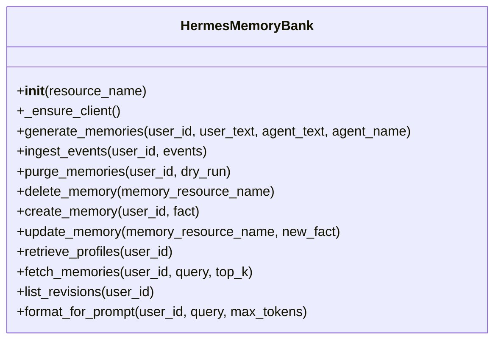
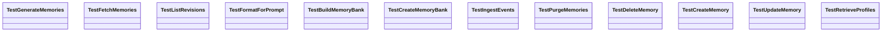

# Memory Module Reference

## Overview

This page documents the significant code in the `memory` package that is visible in the analysis data: the implementation module [`memory.memory_bank`](memory/memory_bank.py#L1) and its corresponding test module [`tests.memory.test_memory_bank`](tests/memory/test_memory_bank.py#L1). The package centers on a single production class, [`HermesMemoryBank`](memory/memory_bank.py#L79), which acts as an application-level facade over Vertex AI Agent Engine memories, plus two top-level helpers: [`_get_vertexai_client(project, location)`](memory/memory_bank.py#L41) and [`create_memory_bank(project, location, display_name)`](memory/memory_bank.py#L432).

The implementation is intentionally defensive and “graceful degradation” oriented. Most methods catch exceptions and return safe defaults rather than failing hard, which is consistent with the test suite’s focus on empty-list / false / `None` fallback behavior. The module also uses lazy client initialization through [`HermesMemoryBank._ensure_client(self)`](memory/memory_bank.py#L98), and bridges blocking SDK operations into async call sites with `asyncio.to_thread`.

### Cross-Module Dependency Table

| Module | Imports From | Called By | Calls Into | Inherits From |
|--------|-------------|-----------|------------|---------------|
| `memory.memory_bank` | `__future__`, `asyncio`, `logging`, `typing`, `vertexai`, `config` | `tests.memory.test_memory_bank` | `VertexClient`, `get_settings`, `getattr`, `to_thread`, SDK memory operations | — |
| `tests.memory.test_memory_bank` | `__future__`, `types`, `unittest.mock`, `pytest`, `memory.memory_bank`, `config` | — | `HermesMemoryBank`, `build_memory_bank`, `create_memory_bank`, `patch`, `MagicMock` | — |

> **Sources:** `memory/memory_bank.py` · L1–L498 · [`memory.memory_bank`](memory/memory_bank.py#L1) · [`HermesMemoryBank`](memory/memory_bank.py#L79) · [`build_memory_bank`](memory/memory_bank.py#L411) · [`create_memory_bank`](memory/memory_bank.py#L432)  
> **Sources:** `tests/memory/test_memory_bank.py` · L1–L495 · [`tests.memory.test_memory_bank`](tests/memory/test_memory_bank.py#L1)

---

## `memory/memory_bank.py`

### Purpose

[`memory.memory_bank`](memory/memory_bank.py#L1) encapsulates all interaction with the Vertex AI Agent Engine memory APIs. Its role is to provide a stable application-facing abstraction for:

- generating memories from chat turns,
- ingesting batched events,
- fetching relevant memories for prompt injection,
- creating/updating/deleting specific memory records,
- purging a user’s memory set,
- and provisioning a backing Agent Engine resource for memory storage.

The module is also explicitly designed to handle API drift across SDK versions. The docstrings note that some features are unavailable in newer SDKs (`retrieve_profiles`, revision history), so these methods intentionally degrade to empty results rather than raising.

### Public API

The significant exported symbols evidenced in the analysis are:

- [`_get_vertexai_client(project, location)`](memory/memory_bank.py#L41)
- [`HermesMemoryBank`](memory/memory_bank.py#L79)
- [`build_memory_bank()`](memory/memory_bank.py#L411)
- [`create_memory_bank(project, location, display_name)`](memory/memory_bank.py#L432)

### Key Classes

#### `HermesMemoryBank`

[`HermesMemoryBank`](memory/memory_bank.py#L79) is the main facade. Its docstring describes it as an “Application-level facade over Vertex AI Agent Engine memories,” and its methods are all thin orchestration wrappers around the underlying SDK client.

**Constructor**
- [`__init__(self, resource_name)`](memory/memory_bank.py#L92-L94)
  - Stores the full AgentEngine resource name.
  - Does not appear to eagerly create a client; client creation is deferred.

**Main methods**
- [`_ensure_client(self)`](memory/memory_bank.py#L98-L101): lazily initializes the underlying Vertex client.
- [`generate_memories(self, user_id, user_text, agent_text, agent_name)`](memory/memory_bank.py#L105-L141): distills a single exchange into durable memory.
- [`ingest_events(self, user_id, events)`](memory/memory_bank.py#L143-L185): sends a batch of conversation events to the memory backend.
- [`purge_memories(self, user_id, dry_run)`](memory/memory_bank.py#L187-L225): deletes all memories for a user, optionally just counting them.
- [`delete_memory(self, memory_resource_name)`](memory/memory_bank.py#L227-L248): deletes one memory by resource name.
- [`create_memory(self, user_id, fact)`](memory/memory_bank.py#L250-L283): writes a memory fact directly.
- [`update_memory(self, memory_resource_name, new_fact)`](memory/memory_bank.py#L285-L313): updates an existing fact.
- [`retrieve_profiles(self, user_id)`](memory/memory_bank.py#L315-L329): unsupported placeholder that returns `[]`.
- [`fetch_memories(self, user_id, query, top_k)`](memory/memory_bank.py#L331-L367): retrieves relevant memories for a query.
- [`list_revisions(self, user_id)`](memory/memory_bank.py#L369-L379): unsupported placeholder that returns `[]`.
- [`format_for_prompt(self, user_id, query, max_tokens)`](memory/memory_bank.py#L381-L406): fetches and formats memories as prompt text.

**Behavioral notes**
- Most methods wrap SDK calls in `asyncio.to_thread`, which indicates the SDK methods are blocking.
- Errors are swallowed in many methods, with the module preferring safe fallbacks:
  - `generate_memories` / `ingest_events` / mutation methods generally log and return without raising,
  - `fetch_memories` returns `[]` on failure,
  - `format_for_prompt` returns `""` on failure or empty memory sets.
- `ingest_events` normalizes event roles; the tests show `"agent"` is converted to `"model"` before sending to the SDK.

### Key Functions

- [`_get_vertexai_client(project, location)`](memory/memory_bank.py#L41-L74) — Build a `vertexai.Client`, falling back to configuration defaults when arguments are omitted.
- [`build_memory_bank()`](memory/memory_bank.py#L411-L427) — Create a `HermesMemoryBank` from settings if `MEMORY_BANK_RESOURCE_NAME` is configured.
- [`create_memory_bank(project, location, display_name)`](memory/memory_bank.py#L432-L498) — Provision or reuse an Agent Engine resource to back the memory bank.

### Interactions

`memory.memory_bank` imports from:
- `asyncio` for `to_thread`,
- `logging` for diagnostics,
- `typing` for annotations,
- `vertexai` for the client and SDK access,
- `config` for application settings.

It is imported by:
- [`tests.memory.test_memory_bank`](tests/memory/test_memory_bank.py#L1), which heavily mocks its SDK-facing behavior.

### Class Diagram

> **Sources:** `memory/memory_bank.py` · L41–L498 · [`_get_vertexai_client`](memory/memory_bank.py#L41) · [`HermesMemoryBank`](memory/memory_bank.py#L79) · [`build_memory_bank`](memory/memory_bank.py#L411) · [`create_memory_bank`](memory/memory_bank.py#L432)

---

## `tests/memory/test_memory_bank.py`

### Purpose

[`tests.memory.test_memory_bank`](tests/memory/test_memory_bank.py#L1) validates the contract of `memory.memory_bank` without requiring real Vertex AI access. The test file is structured around helper factories that build mock clients and fake SDK objects, then a series of focused test classes that exercise every method of [`HermesMemoryBank`](memory/memory_bank.py#L79) plus the provisioning helper [`create_memory_bank`](memory/memory_bank.py#L432) and configuration helper [`build_memory_bank`](memory/memory_bank.py#L411).

### Public API

This is a test-only module, so its “public API” is mostly the helper functions used to set up test fixtures:

- [`_make_mock_client()`](tests/memory/test_memory_bank.py#L32-L39)
- [`_make_engine(resource_name, display_name)`](tests/memory/test_memory_bank.py#L42-L49)
- [`_make_memory(fact)`](tests/memory/test_memory_bank.py#L52-L53)

### Key Classes

#### `TestGenerateMemories`

Tests [`HermesMemoryBank.generate_memories`](memory/memory_bank.py#L105-L141):
- success path calls the SDK `generate` operation,
- agent names are propagated into event metadata,
- exceptions are swallowed,
- the Vertex client is lazily initialized.

#### `TestFetchMemories`

Covers [`HermesMemoryBank.fetch_memories`](memory/memory_bank.py#L331-L367):
- returns fact strings,
- returns `[]` on error,
- passes `top_k` and scope parameters through,
- falls back to `str(memory)` when `fact` is missing.

#### `TestListRevisions`

Checks that [`HermesMemoryBank.list_revisions`](memory/memory_bank.py#L369-L379) returns `[]`, matching the unsupported-API behavior.

#### `TestFormatForPrompt`

Validates [`HermesMemoryBank.format_for_prompt`](memory/memory_bank.py#L381-L406):
- emits a formatted header,
- returns `""` when there are no memories,
- returns `""` on fetch failures,
- respects token-budget constraints.

#### `TestBuildMemoryBank`

Covers [`build_memory_bank()`](memory/memory_bank.py#L411-L427):
- returns `None` when resource name is missing or empty,
- returns a `HermesMemoryBank` when configured,
- returns `None` on exceptions.

#### `TestCreateMemoryBank`

Exercises [`create_memory_bank(project, location, display_name)`](memory/memory_bank.py#L432-L498):
- creates a new engine when needed,
- reuses existing engines when display names match,
- skips non-matching engines in listings,
- respects custom display names,
- falls back to create when listing raises.

#### `TestIngestEvents`

Tests [`HermesMemoryBank.ingest_events`](memory/memory_bank.py#L143-L185):
- sends batched events to the SDK,
- normalizes `"agent"` to `"model"`,
- swallows exceptions.

#### `TestPurgeMemories`

Tests [`HermesMemoryBank.purge_memories`](memory/memory_bank.py#L187-L225):
- purges with force enabled,
- honors dry-run behavior,
- returns zero on exception.

#### `TestDeleteMemory`

Tests [`HermesMemoryBank.delete_memory`](memory/memory_bank.py#L227-L248):
- calls SDK delete with the expected resource name,
- returns `False` on failure.

#### `TestCreateMemory`

Tests [`HermesMemoryBank.create_memory`](memory/memory_bank.py#L250-L283):
- returns the created resource name,
- returns `None` on failure.

#### `TestUpdateMemory`

Tests [`HermesMemoryBank.update_memory`](memory/memory_bank.py#L285-L313):
- invokes SDK update,
- returns `False` on failure.

#### `TestRetrieveProfiles`

Tests [`HermesMemoryBank.retrieve_profiles`](memory/memory_bank.py#L315-L329):
- always returns `[]` because the feature is unsupported in the SDK version targeted by this module.

### Key Functions

- [`_make_mock_client()`](tests/memory/test_memory_bank.py#L32-L39) — Builds a mock Vertex client and its mock memories collection.
- [`_make_engine(resource_name, display_name)`](tests/memory/test_memory_bank.py#L42-L49) — Constructs a fake AgentEngine structure with `api_resource` metadata.
- [`_make_memory(fact)`](tests/memory/test_memory_bank.py#L52-L53) — Returns a fake memory object with a `fact` field.

### Interactions

This module imports:
- `memory.memory_bank` for the production code under test,
- `config` for monkeypatched settings,
- `pytest`, `unittest.mock`, and `types` for fixture building and patching.

The test module is heavily coupled to the implementation via monkeypatching, but that coupling is intentional and narrowly scoped to observable behavior.

### Class Diagram

> **Sources:** `tests/memory/test_memory_bank.py` · L32–L495 · [`_make_mock_client`](tests/memory/test_memory_bank.py#L32) · [`_make_engine`](tests/memory/test_memory_bank.py#L42) · [`_make_memory`](tests/memory/test_memory_bank.py#L52) · [`TestCreateMemoryBank`](tests/memory/test_memory_bank.py#L273) · [`TestFormatForPrompt`](tests/memory/test_memory_bank.py#L173)