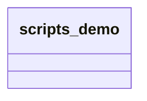
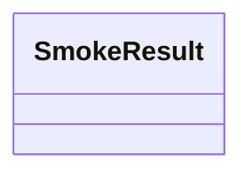
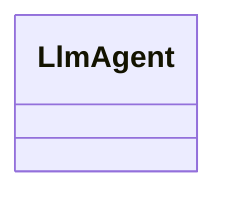
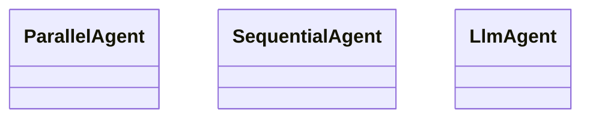
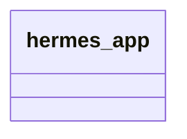
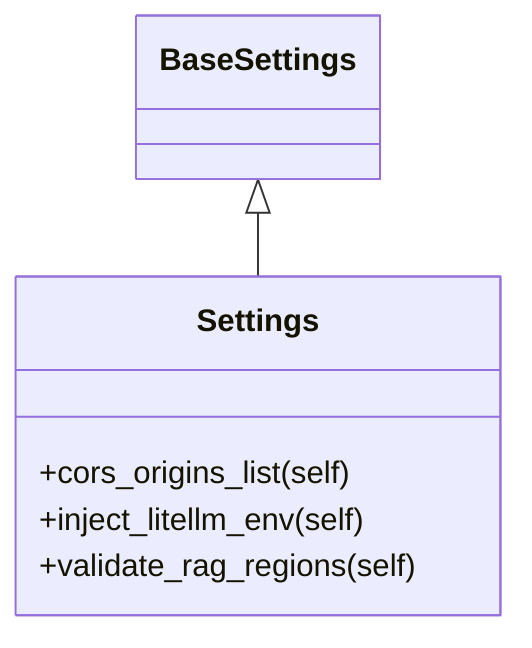
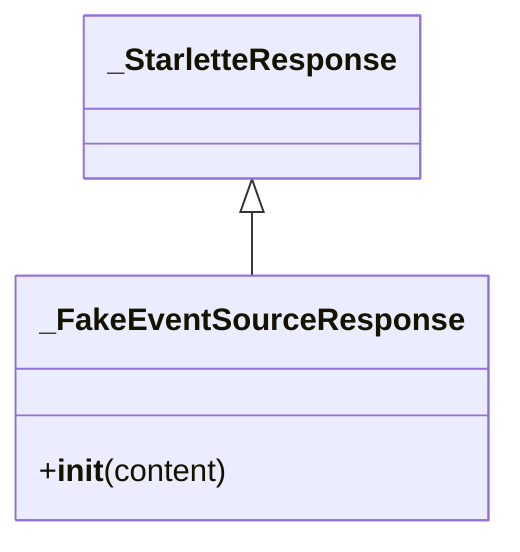
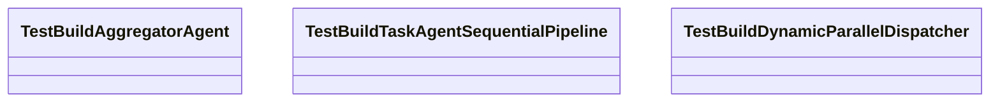
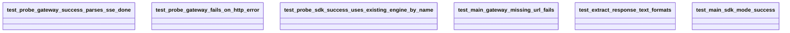

# Significant Modules and Packages

## scripts
### Purpose
The `scripts` package is a namespace package root for runnable utilities. In the analyzed repository, it contains the `scripts.demo` subpackage and does not expose any substantive runtime logic itself beyond package initialization (`scripts/__init__.py`). Its main role is organizational: grouping demonstration or operational scripts under a consistent import path.

### Public API
There are no exported classes or functions in `scripts/__init__.py` visible from the analysis. This module is effectively a package marker.

### Key Classes
None observed.

### Key Functions
None observed.

### Interactions
- Imported by the `scripts.demo` subpackage by virtue of package structure.
- No direct internal call relationships were observed.

### Class Diagram

> **Sources:** `scripts/__init__.py` · L1–L1 · [`scripts.__init__`](scripts/__init__.py#L1)

---

## scripts.demo
### Purpose
The `scripts.demo` package groups demonstration tooling, most notably the cloud smoke test entry point in [`scripts.demo.cloud_smoke_test`](scripts/demo/cloud_smoke_test.py#L1). Like the top-level `scripts` package, it is primarily structural and does not appear to implement standalone business logic in `scripts/demo/__init__.py`.

### Public API
No explicit public classes or functions are defined in `scripts/demo/__init__.py` in the available analysis.

### Key Classes
None observed.

### Key Functions
None observed.

### Interactions
- Serves as the package namespace for [`scripts.demo.cloud_smoke_test`](scripts/demo/cloud_smoke_test.py#L1).
- Imported by tests in `tests/scripts/test_cloud_smoke_test.py` through the package path `scripts.demo`.

### Class Diagram

> **Sources:** `scripts/demo/__init__.py` · L1–L1 · [`scripts.demo.__init__`](scripts/demo/__init__.py#L1)

---

## scripts.demo.cloud_smoke_test
### Purpose
This module implements a command-line smoke test for validating cloud connectivity in two modes: a direct gateway POST mode and a Vertex AI SDK mode. It is the clearest executable entry point in the repository and is listed as the sole entry point in the analysis. The module constructs a structured result object, sends requests, parses responses, and reports pass/fail state through exit status and printed output.

### Public API
Key public surface area includes:
- [`SmokeResult`](scripts/demo/cloud_smoke_test.py#L32)
- [`_auth_headers(bearer_token, api_key)`](scripts/demo/cloud_smoke_test.py#L38)
- [`probe_gateway(gateway_url, message, bearer_token, api_key, timeout_s)`](scripts/demo/cloud_smoke_test.py#L47)
- [`_extract_response_text(response)`](scripts/demo/cloud_smoke_test.py#L105)
- [`probe_sdk(project_id, location, reasoning_engine_resource_name, user_id, message, client_factory)`](scripts/demo/cloud_smoke_test.py#L118)
- [`_detect_mode(requested_mode, gateway_url)`](scripts/demo/cloud_smoke_test.py#L158)
- [`parse_args(argv)`](scripts/demo/cloud_smoke_test.py#L164)
- [`main(argv)`](scripts/demo/cloud_smoke_test.py#L183)

### Key Classes
#### [`SmokeResult`](scripts/demo/cloud_smoke_test.py#L32)
A lightweight dataclass used to normalize the output of both probe modes.
- **Constructor**: generated dataclass initializer with fields inferred from usage in `probe_gateway` and `probe_sdk`.
- **Main role**: holds success/failure state and a message string suitable for printing or downstream assertions.

Because the analysis does not include field names directly, the documentation is constrained to what is observable: both `probe_gateway` and `probe_sdk` construct `SmokeResult` instances to represent the probe outcome.

### Key Functions
#### [`_auth_headers(bearer_token, api_key)`](scripts/demo/cloud_smoke_test.py#L38)
Builds HTTP headers for gateway authentication, combining bearer and API-key based credentials.

#### [`probe_gateway(gateway_url, message, bearer_token, api_key, timeout_s)`](scripts/demo/cloud_smoke_test.py#L47)
Sends a request to the configured gateway endpoint using `httpx.Client`, then parses the streamed or structured response into a `SmokeResult`. The function’s call graph shows it handles:
- header creation via `_auth_headers`
- HTTP POST dispatch
- response body parsing
- SSE-style `"data:"` handling
- JSON decoding via `json.loads`

#### [`_extract_response_text(response)`](scripts/demo/cloud_smoke_test.py#L105)
Normalizes response objects into text. Tests indicate it supports at least multiple response shapes, which suggests defensive handling of SDK return types.

#### [`probe_sdk(project_id, location, reasoning_engine_resource_name, user_id, message, client_factory)`](scripts/demo/cloud_smoke_test.py#L118)
Exercises the Vertex AI path by initializing Vertex AI, retrieving a reasoning engine, and issuing a query. It returns `SmokeResult` and delegates text normalization to `_extract_response_text`.

#### [`_detect_mode(requested_mode, gateway_url)`](scripts/demo/cloud_smoke_test.py#L158)
Resolves the effective execution mode from user input and gateway URL availability.

#### [`parse_args(argv)`](scripts/demo/cloud_smoke_test.py#L164)
Defines the CLI interface using `argparse.ArgumentParser` and populates run parameters.

#### [`main(argv)`](scripts/demo/cloud_smoke_test.py#L183)
Top-level orchestration entry point:
1. parse CLI arguments
2. resolve mode
3. call `probe_gateway` or `probe_sdk`
4. print results

### Interactions
This module imports from:
- Python stdlib: `argparse`, `json`, `logging`, `os`, `sys`, `dataclasses`, `typing`
- Third-party: `httpx`, `vertexai`

It is tested by:
- [`tests.scripts.test_cloud_smoke_test`](tests/scripts/test_cloud_smoke_test.py#L1)

### Class Diagram

> **Sources:** `scripts/demo/cloud_smoke_test.py` · L1–L212 · [`SmokeResult`](scripts/demo/cloud_smoke_test.py#L32) · [`_auth_headers`](scripts/demo/cloud_smoke_test.py#L38) · [`probe_gateway`](scripts/demo/cloud_smoke_test.py#L47) · [`_extract_response_text`](scripts/demo/cloud_smoke_test.py#L105) · [`probe_sdk`](scripts/demo/cloud_smoke_test.py#L118) · [`_detect_mode`](scripts/demo/cloud_smoke_test.py#L158) · [`parse_args`](scripts/demo/cloud_smoke_test.py#L164) · [`main`](scripts/demo/cloud_smoke_test.py#L183)

---

## agents.aggregator
### Purpose
This module builds the aggregator agent used to consolidate parallel specialist outputs into a single response. The inline documentation in the analysis explicitly states that [`build_aggregator_agent`](agents/aggregator.py#L70) “build[s] the AggregatorAgent that consolidates parallel outputs.”

### Public API
- [`build_aggregator_agent(settings)`](agents/aggregator.py#L70)

### Key Classes
No class symbols were extracted from the module itself. The constructed object is an `LlmAgent` from `google.adk.agents`, not a locally defined class.

### Key Functions
#### [`build_aggregator_agent(settings)`](agents/aggregator.py#L70)
Creates an [`LlmAgent`](agents/aggregator.py#L70) configured to act as the aggregator. The relationship data shows it calls:
- `LlmAgent`
- `get_model`

This indicates the module is a factory wrapper around the underlying agent SDK and model provider abstraction.

### Interactions
Imports from:
- [`config`](config.py#L1) for application settings
- `models.provider` for `get_model`
- `google.adk.agents` for `LlmAgent`

Imported by:
- [`agents.task_agent`](agents/task_agent.py#L1)
- [`tests.agents.test_aggregator`](tests/agents/test_aggregator.py#L1)

### Class Diagram
The module has no local class hierarchy. The created runtime object is an SDK class:

> **Sources:** `agents/aggregator.py` · L1–L81 · [`build_aggregator_agent`](agents/aggregator.py#L70)

---

## agents.task_agent
### Purpose
This module assembles the task-oriented orchestration layer. It composes specialist agents, a parallel dispatcher, and an aggregator into deploy-time and request-time pipelines. The extracted docstring on [`build_task_agent`](agents/task_agent.py#L115) is especially informative: it describes both a “Parallel flow” and a “Sequential flow,” while [`build_dynamic_parallel_dispatcher`](agents/task_agent.py#L191) performs true JIT synthesis at request time.

### Public API
- [`build_task_agent(settings, specialist_agents)`](agents/task_agent.py#L115)
- [`build_dynamic_parallel_dispatcher(settings, task)`](agents/task_agent.py#L191)

### Key Classes
No local classes are defined in the analyzed module, but it constructs several agent objects from `google.adk.agents`:
- `ParallelAgent`
- `SequentialAgent`
- `LlmAgent`

The module also references an `AgentSynthesizer` from `agents.synthesizer`, but that symbol is only visible in relationship data.

### Key Functions
#### [`build_task_agent(settings, specialist_agents)`](agents/task_agent.py#L115)
Builds the static task orchestration pipeline. The call relationships show it wires together:
- `ParallelAgent`
- `SequentialAgent`
- `build_aggregator_agent`
- specialist builders such as `build_analytics_agent`, `build_hr_agent`, `build_it_helpdesk_agent`, and `build_developer_agent`
- `build_skill_learning_callback`

The docstring explains that it creates:
1. a `SequentialPipeline`
2. a `ParallelDispatcher`
3. an `AggregatorAgent`
4. sequential fallback specialists

#### [`build_dynamic_parallel_dispatcher(settings, task)`](agents/task_agent.py#L191)
Performs request-time synthesis of a task-specific parallel dispatch pipeline. If the synthesizer produces no specialist agents, the function returns `None`; otherwise it returns a `SequentialAgent`/pipeline-like structure and sequential agent list. The relationship data shows interactions with:
- `AgentSynthesizer`
- `synthesise`
- `ParallelAgent`
- `SequentialAgent`
- `build_aggregator_agent`

### Interactions
Imports from:
- [`config`](config.py#L1)
- `memory.skill_learning`
- `models.provider`
- [`agents.aggregator`](agents/aggregator.py#L1)
- `agents.analytics`
- `agents.developer`
- `agents.hr`
- `agents.it_helpdesk`
- `agents.synthesizer`
- `google.adk.agents`
- `logging`

Imported by:
- `tests.agents.test_aggregator`

### Class Diagram
No local class hierarchy exists, but the orchestration depends on a few SDK class types:

> **Sources:** `agents/task_agent.py` · L1–L237 · [`build_task_agent`](agents/task_agent.py#L115) · [`build_dynamic_parallel_dispatcher`](agents/task_agent.py#L191)

---

## hermes_app
### Purpose
The `hermes_app` package is a namespace for the application entrypoint wiring. In the analyzed files, it contains only package initialization and a module named [`hermes_app.agent`](hermes_app/agent.py#L1), which appears to be the actual bootstrap integration point.

### Public API
No explicit public API is visible in `hermes_app/__init__.py`.

### Key Classes
None observed.

### Key Functions
None observed.

### Interactions
- Hosts the application bootstrap module [`hermes_app.agent`](hermes_app/agent.py#L1).
- Included in the project structure alongside the top-level [`agent`](agent.py#L1) module.

### Class Diagram

> **Sources:** `hermes_app/__init__.py` · L1–L1 · [`hermes_app.__init__`](hermes_app/__init__.py#L1)

---

## hermes_app.agent
### Purpose
This module appears to be the application bootstrap entrypoint for the packaged app. The relationship graph shows it imports `config` and `agents.orchestrator`, as well as `dotenv`, `os`, and `sys`, which strongly suggests environment initialization followed by orchestrator startup.

### Public API
No functions or classes were extracted from this file in the available analysis, so its concrete callable surface cannot be documented here without speculation.

### Key Classes
None observed.

### Key Functions
None observed.

### Interactions
Imports:
- `sys`
- `os`
- `dotenv`
- [`config`](config.py#L1)
- `agents.orchestrator`

Imported by:
- No internal imported-by relationships were captured in the analysis.

### Class Diagram
No local class hierarchy detected.

> **Sources:** `hermes_app/agent.py` · L1–L1 · [`hermes_app.agent`](hermes_app/agent.py#L1)

---

## agent
### Purpose
The top-level `agent.py` module is another bootstrap/entrypoint-style module. It mirrors the bootstrap pattern seen in `hermes_app.agent`, importing environment utilities, configuration, and `agents.orchestrator`. This suggests it is a convenience launcher, likely for local or legacy invocation.

### Public API
No extracted callable symbols were present in the analysis.

### Key Classes
None observed.

### Key Functions
None observed.

### Interactions
Imports:
- `os`
- `dotenv`
- [`config`](config.py#L1)
- `agents.orchestrator`

Imported by:
- No internal imported-by relationships were captured.

### Class Diagram
No local class hierarchy detected.

> **Sources:** `agent.py` · L1–L1 · [`agent`](agent.py#L1)

---

## config
### Purpose
This module centralizes application configuration and environment handling. It defines the `Settings` model, helper methods for normalizing CORS origins, exporting provider credentials for LiteLLM, and validating region consistency for RAG corpora. The module is a foundational dependency across the repository.

### Public API
- [`Settings`](config.py#L7)
- [`Settings.cors_origins_list(self)`](config.py#L143)
- [`Settings.inject_litellm_env(self)`](config.py#L146)
- [`Settings.validate_rag_regions(self)`](config.py#L166)
- [`get_settings()`](config.py#L200)

### Key Classes
#### [`Settings`](config.py#L7)
A `pydantic_settings.BaseSettings` subclass used to load and validate runtime configuration.
- **Constructor**: inherited from `BaseSettings`
- **Main methods**:
  - [`cors_origins_list`](config.py#L143): parses comma-separated CORS origins into a list
  - [`inject_litellm_env`](config.py#L146): exports provider API keys into environment variables for LiteLLM
  - [`validate_rag_regions`](config.py#L166): verifies configured RAG corpus resources match the selected GCP region

The class is central to the application startup story and is imported by agent builders and bootstrap modules.

### Key Functions
#### [`get_settings()`](config.py#L200)
Factory/helper returning a configured `Settings` instance.

### Interactions
Imports:
- `functools`
- `pydantic_settings`
- `os`
- `re`

Imported by:
- [`agents.aggregator`](agents/aggregator.py#L1)
- [`agents.task_agent`](agents/task_agent.py#L1)
- [`hermes_app.agent`](hermes_app/agent.py#L1)
- [`agent`](agent.py#L1)
- `tests.agents.test_aggregator`

Inheritance:
- [`Settings`](config.py#L7) inherits from `BaseSettings`

### Class Diagram

> **Sources:** `config.py` · L1–L201 · [`Settings`](config.py#L7) · [`Settings.cors_origins_list`](config.py#L143) · [`Settings.inject_litellm_env`](config.py#L146) · [`Settings.validate_rag_regions`](config.py#L166) · [`get_settings`](config.py#L200)

---

## tests.conftest
### Purpose
This module provides the test harness infrastructure. It supplies lightweight fake agent classes and utility registration functions so tests can run without pulling in the full external dependency stack. It also stubs response classes and rate-limiting helpers.

### Public API
The analysis extracted several test fixtures/helpers:
- [`_make_module(name)`](tests/conftest.py#L22)
- [`_FakeLlmAgent`](tests/conftest.py#L30)
- [`_FakeLoopAgent`](tests/conftest.py#L39)
- [`_FakeParallelAgent`](tests/conftest.py#L44)
- [`_FakeSequentialAgent`](tests/conftest.py#L52)
- [`_noop_limit(_rate)`](tests/conftest.py#L168)
- [`_FakeEventSourceResponse`](tests/conftest.py#L186)
- [`_register_all()`](tests/conftest.py#L222)

### Key Classes
#### [`_FakeLlmAgent`](tests/conftest.py#L30)
A lightweight stand-in for `google.adk.agents.LlmAgent`.
- Constructor creates list-based child/tool storage used by tests.

#### [`_FakeLoopAgent`](tests/conftest.py#L39)
A stub agent class used in test environments.

#### [`_FakeParallelAgent`](tests/conftest.py#L44)
A stand-in for `google.adk.agents.ParallelAgent`.
- Constructor stores child agents in a list.

#### [`_FakeSequentialAgent`](tests/conftest.py#L52)
A stand-in for `google.adk.agents.SequentialAgent`.
- Constructor stores child agents in a list.

#### [`_FakeEventSourceResponse`](tests/conftest.py#L186)
A minimal stub so FastAPI accepts `EventSourceResponse` as a response type.
- Inherits from `_StarletteResponse`

### Key Functions
#### [`_make_module(name)`](tests/conftest.py#L22)
Builds a synthetic module object and populates its attributes.

#### [`_noop_limit(_rate)`](tests/conftest.py#L168)
No-op replacement for rate limiting.

#### [`_register_all()`](tests/conftest.py#L222)
Registers the full test double package graph.

### Interactions
Imports:
- `os`
- `sys`
- `types`
- `unittest.mock`
- `functools`
- `starlette.responses`

Imported by:
- [`tests.agents.test_aggregator`](tests/agents/test_aggregator.py#L1)

### Class Diagram

> **Sources:** `tests/conftest.py` · L1–L285 · [`_make_module`](tests/conftest.py#L22) · [`_FakeLlmAgent`](tests/conftest.py#L30) · [`_FakeParallelAgent`](tests/conftest.py#L44) · [`_FakeSequentialAgent`](tests/conftest.py#L52) · [`_noop_limit`](tests/conftest.py#L168) · [`_FakeEventSourceResponse`](tests/conftest.py#L186) · [`_register_all`](tests/conftest.py#L222)

---

## tests.agents.test_aggregator
### Purpose
This module validates the agent-construction behavior in `agents.aggregator` and `agents.task_agent`. It focuses on structural assertions rather than end-to-end execution, using the test doubles defined in [`tests.conftest`](tests/conftest.py#L1).

### Public API
Test cases are the main API surface:
- [`TestBuildAggregatorAgent`](tests/agents/test_aggregator.py#L27)
- [`TestBuildTaskAgentSequentialPipeline`](tests/agents/test_aggregator.py#L45)
- [`TestBuildDynamicParallelDispatcher`](tests/agents/test_aggregator.py#L86)

### Key Classes
#### [`TestBuildAggregatorAgent`](tests/agents/test_aggregator.py#L27)
Verifies that [`build_aggregator_agent`](agents/aggregator.py#L70) returns an LLM agent, has a description, and has no tools.

#### [`TestBuildTaskAgentSequentialPipeline`](tests/agents/test_aggregator.py#L45)
Verifies the static task pipeline shape, including:
- first sub-agent is a sequential pipeline
- pipeline has two children
- first child is a parallel dispatcher
- second child is an aggregator
- four specialist agents are present
- sequential fallback includes specialist agents

#### [`TestBuildDynamicParallelDispatcher`](tests/agents/test_aggregator.py#L86)
Verifies the dynamic synthesis path:
- returns `None` when no agents are synthesized
- returns a sequential pipeline when agents are found
- ends with an aggregator

### Key Functions
The individual test methods are the functional surface, for example:
- [`test_returns_llm_agent`](tests/agents/test_aggregator.py#L28)
- [`test_has_description`](tests/agents/test_aggregator.py#L32)
- [`test_no_tools`](tests/agents/test_aggregator.py#L36)
- [`test_first_sub_agent_is_sequential_pipeline`](tests/agents/test_aggregator.py#L46)
- [`test_sequential_pipeline_has_two_children`](tests/agents/test_aggregator.py#L51)
- [`test_pipeline_first_child_is_parallel_dispatcher`](tests/agents/test_aggregator.py#L56)
- [`test_pipeline_second_child_is_aggregator`](tests/agents/test_aggregator.py#L62)
- [`test_parallel_dispatcher_has_four_specialists`](tests/agents/test_aggregator.py#L68)
- [`test_specialist_agents_appended_for_sequential_fallback`](tests/agents/test_aggregator.py#L74)
- [`test_returns_none_when_no_agents_synthesised`](tests/agents/test_aggregator.py#L87)
- [`test_returns_sequential_pipeline_when_agents_found`](tests/agents/test_aggregator.py#L99)
- [`test_dynamic_pipeline_ends_with_aggregator`](tests/agents/test_aggregator.py#L114)

### Interactions
Imports:
- `pytest`
- [`agents.aggregator`](agents/aggregator.py#L1)
- [`agents.task_agent`](agents/task_agent.py#L1)
- [`config`](config.py#L1)
- [`tests.conftest`](tests/conftest.py#L1)

### Class Diagram

> **Sources:** `tests/agents/test_aggregator.py` · L1–L127 · [`TestBuildAggregatorAgent`](tests/agents/test_aggregator.py#L27) · [`TestBuildTaskAgentSequentialPipeline`](tests/agents/test_aggregator.py#L45) · [`TestBuildDynamicParallelDispatcher`](tests/agents/test_aggregator.py#L86)

---

## tests.scripts.test_cloud_smoke_test
### Purpose
This module tests the smoke-test script’s request and parsing behaviors, covering both the gateway path and the SDK path. It ensures that response extraction, failure handling, and main-mode dispatch work as intended.

### Public API
Primary test functions:
- [`test_probe_gateway_success_parses_sse_done()`](tests/scripts/test_cloud_smoke_test.py#L9)
- [`test_probe_gateway_fails_on_http_error()`](tests/scripts/test_cloud_smoke_test.py#L35)
- [`test_probe_sdk_success_uses_existing_engine_by_name()`](tests/scripts/test_cloud_smoke_test.py#L57)
- [`test_main_gateway_missing_url_fails()`](tests/scripts/test_cloud_smoke_test.py#L83)
- [`test_extract_response_text_formats()`](tests/scripts/test_cloud_smoke_test.py#L88)
- [`test_main_sdk_mode_success()`](tests/scripts/test_cloud_smoke_test.py#L95)

### Key Classes
No local production classes; tests use `MagicMock`, `SimpleNamespace`, and similar helpers.

### Key Functions
Each test function targets one observable behavior:
- Gateway SSE parsing and success handling
- HTTP error handling
- SDK client interaction
- argument/mode validation
- response text normalization
- main function success flow

### Interactions
Imports:
- `types`
- `unittest.mock`
- [`scripts.demo`](scripts/demo/__init__.py#L1)

### Class Diagram

> **Sources:** `tests/scripts/test_cloud_smoke_test.py` · L1–L106 · [`test_probe_gateway_success_parses_sse_done`](tests/scripts/test_cloud_smoke_test.py#L9) · [`test_probe_gateway_fails_on_http_error`](tests/scripts/test_cloud_smoke_test.py#L35) · [`test_probe_sdk_success_uses_existing_engine_by_name`](tests/scripts/test_cloud_smoke_test.py#L57) · [`test_main_gateway_missing_url_fails`](tests/scripts/test_cloud_smoke_test.py#L83) · [`test_extract_response_text_formats`](tests/scripts/test_cloud_smoke_test.py#L88) · [`test_main_sdk_mode_success`](tests/scripts/test_cloud_smoke_test.py#L95)