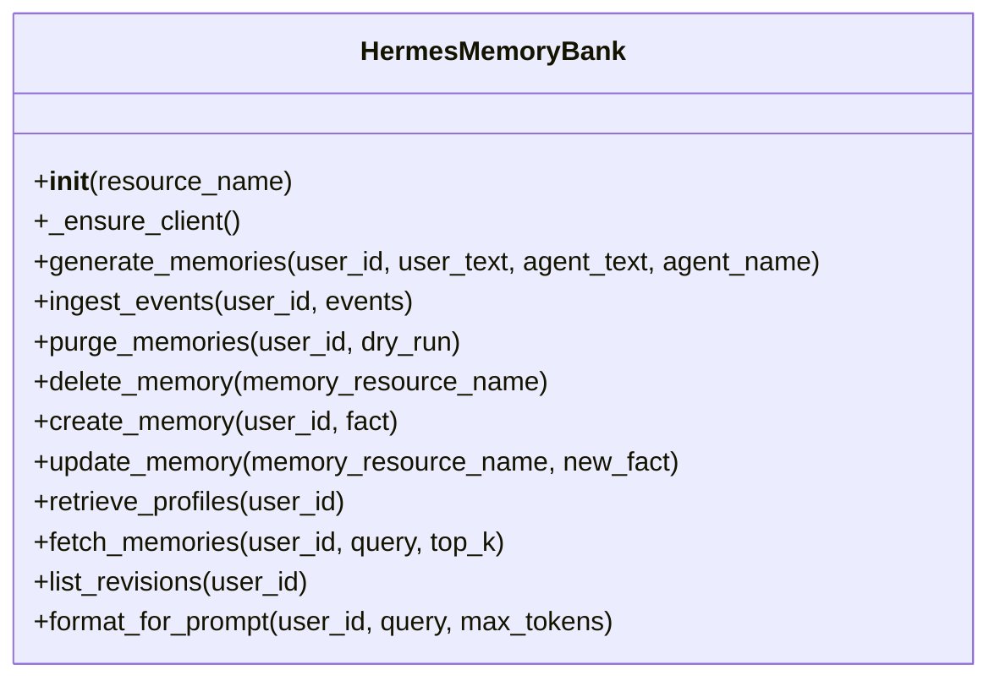
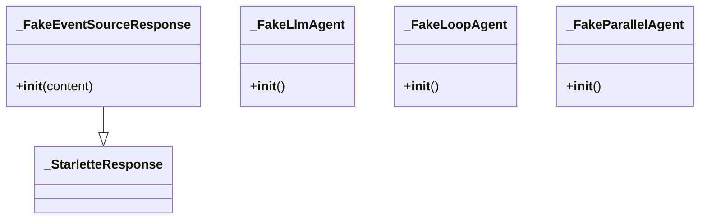
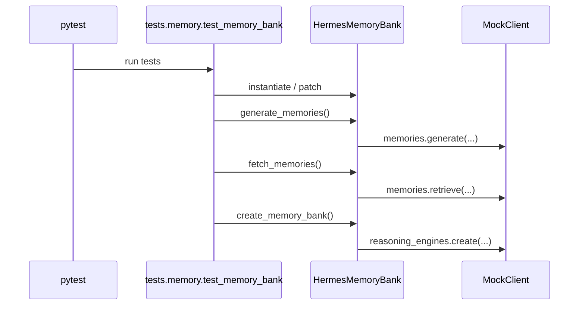

# Module Documentation: Memory Bank and Test Support

## Overview

This page documents the significant modules and packages visible in the repository snapshot, with emphasis on the production memory abstraction and its supporting test scaffolding. The codebase is small in the provided analysis, but the relationships are still meaningful: [`memory.memory_bank`](memory/memory_bank.py#L1) is the core implementation module, while [`tests.conftest`](tests/conftest.py#L1) and [`tests.memory.test_memory_bank`](tests/memory/test_memory_bank.py#L1) provide the test environment and behavioral verification.

The central design pattern is a lightweight application-facing facade over Vertex AI Agent Engine memory operations. The [`HermesMemoryBank`](memory/memory_bank.py#L79) class wraps SDK calls behind async methods, while helper functions such as [`build_memory_bank`](memory/memory_bank.py#L411) and [`create_memory_bank`](memory/memory_bank.py#L432) provide configuration-driven construction and provisioning. The tests strongly indicate that the implementation is intended to degrade gracefully when configuration or SDK capabilities are missing.

### Cross-module dependency summary

| Module | Imports From | Called By | Calls Into | Inherits From |
|--------|-------------|-----------|------------|---------------|
| `memory.memory_bank` | `__future__`, `asyncio`, `logging`, `typing`, `vertexai`, `config` | `tests.memory.test_memory_bank` | `VertexClient`, `get_settings`, SDK memory APIs | — |
| `tests.conftest` | `__future__`, `os`, `sys`, `types`, `unittest.mock`, `functools`, `starlette.responses` | test suite | module factories and stubs | `_StarletteResponse` |
| `tests.memory.test_memory_bank` | `__future__`, `types`, `unittest.mock`, `pytest`, `memory.memory_bank`, `config` | pytest runner | `HermesMemoryBank`, `build_memory_bank`, `create_memory_bank` | — |

> **Sources:** `memory/memory_bank.py` · L1–L470 · [`memory.memory_bank`](memory/memory_bank.py#L1), [`HermesMemoryBank`](memory/memory_bank.py#L79), [`build_memory_bank`](memory/memory_bank.py#L411), [`create_memory_bank`](memory/memory_bank.py#L432)  
> **Sources:** `tests/conftest.py` · L1–L274 · [`tests.conftest`](tests/conftest.py#L1), [`_FakeEventSourceResponse`](tests/conftest.py#L177)  
> **Sources:** `tests/memory/test_memory_bank.py` · L1–L490 · [`tests.memory.test_memory_bank`](tests/memory/test_memory_bank.py#L1)

## `memory/memory_bank.py`

### Purpose

The [`memory.memory_bank`](memory/memory_bank.py#L1) module implements the project’s memory subsystem. Its main responsibility is to present a stable application-level API for storing, retrieving, deleting, and formatting memories while isolating the rest of the application from Vertex AI SDK details. The docstrings show two distinct operating modes:

1. **Automatic memory extraction** via [`HermesMemoryBank.generate_memories`](memory/memory_bank.py#L105), which distills a conversation turn into durable memories.
2. **Explicit memory operations** such as [`create_memory`](memory/memory_bank.py#L250), [`update_memory`](memory/memory_bank.py#L285), and [`delete_memory`](memory/memory_bank.py#L227), which operate on concrete memory resources.

A notable aspect of the design is graceful degradation. The module includes support for absent configuration in [`build_memory_bank`](memory/memory_bank.py#L411), and it explicitly acknowledges unsupported SDK features in [`retrieve_profiles`](memory/memory_bank.py#L315) and [`list_revisions`](memory/memory_bank.py#L369), both of which return empty results for compatibility.

### Public API

Key exported symbols visible in the analysis:

- [`_get_vertexai_client(project, location)`](memory/memory_bank.py#L41)
- [`HermesMemoryBank`](memory/memory_bank.py#L79)
- [`build_memory_bank()`](memory/memory_bank.py#L411)
- [`create_memory_bank(project, location, display_name)`](memory/memory_bank.py#L432)

### Key Classes

#### [`HermesMemoryBank`](memory/memory_bank.py#L79)

**Constructor**
- [`__init__(self, resource_name)`](memory/memory_bank.py#L92)

The constructor stores the Agent Engine resource name. The class docstring describes the resource name as the full AgentEngine resource identifier, for example:
`projects/my-project/locations/us-central1/reasoningEngines/1234567890`.

**Main methods**
- [`_ensure_client(self)`](memory/memory_bank.py#L98): lazily initializes and returns the SDK client.
- [`generate_memories(self, user_id, user_text, agent_text, agent_name)`](memory/memory_bank.py#L105): asynchronously submits a user/agent exchange for memory generation.
- [`ingest_events(self, user_id, events)`](memory/memory_bank.py#L143): ingests a batch of events for SDK-side batching and memory generation.
- [`purge_memories(self, user_id, dry_run)`](memory/memory_bank.py#L187): bulk deletes all memories for a user, with dry-run support.
- [`delete_memory(self, memory_resource_name)`](memory/memory_bank.py#L227): deletes one memory by resource name.
- [`create_memory(self, user_id, fact)`](memory/memory_bank.py#L250): writes a single memory fact explicitly.
- [`update_memory(self, memory_resource_name, new_fact)`](memory/memory_bank.py#L285): updates an existing memory fact.
- [`retrieve_profiles(self, user_id)`](memory/memory_bank.py#L315): compatibility shim that returns `[]`.
- [`fetch_memories(self, user_id, query, top_k)`](memory/memory_bank.py#L331): retrieves relevant memories for a query.
- [`list_revisions(self, user_id)`](memory/memory_bank.py#L369): compatibility shim that returns `[]`.
- [`format_for_prompt(self, user_id, query, max_tokens)`](memory/memory_bank.py#L381): formats fetched memories into a prompt snippet.

### Key Functions

#### [`_get_vertexai_client(project, location)`](memory/memory_bank.py#L41)
Returns a `vertexai.Client` instance, using settings defaults when `project` or `location` are not provided. The docstring also notes an `ImportError` path with a helpful message if the installed SDK is too old.

#### [`build_memory_bank()`](memory/memory_bank.py#L411)
Constructs a [`HermesMemoryBank`](memory/memory_bank.py#L79) from runtime settings. Returns `None` if memory bank configuration is absent.

#### [`create_memory_bank(project, location, display_name)`](memory/memory_bank.py#L432)
Creates a new Agent Engine resource to serve as the memory bank, returning the resource name. The docstring indicates that it is safe to call repeatedly and that it reuses an existing engine when the display name matches.

### Interactions

The module imports from:
- `vertexai` for client and memory operations
- `config` for runtime settings access
- `asyncio`, `logging`, `typing`, and `__future__`

The module is imported by:
- [`tests.memory.test_memory_bank`](tests/memory/test_memory_bank.py#L1)

The relationships extracted from the code show that [`HermesMemoryBank._ensure_client`](memory/memory_bank.py#L98) calls [`_get_vertexai_client`](memory/memory_bank.py#L41), and every memory operation method in [`HermesMemoryBank`](memory/memory_bank.py#L79) depends on lazy client initialization. The higher-level helpers [`build_memory_bank`](memory/memory_bank.py#L411) and [`create_memory_bank`](memory/memory_bank.py#L432) are the main construction entry points.

### Class Hierarchy

There are no class-to-class inheritance relationships in the production module based on the available analysis.

> **Sources:** `memory/memory_bank.py` · L41–L470 · [`_get_vertexai_client`](memory/memory_bank.py#L41), [`HermesMemoryBank`](memory/memory_bank.py#L79), [`build_memory_bank`](memory/memory_bank.py#L411), [`create_memory_bank`](memory/memory_bank.py#L432)

## `tests/conftest.py`

### Purpose

The [`tests.conftest`](tests/conftest.py#L1) module provides shared pytest setup and test doubles for external dependencies. It exists to make the test suite runnable without the full runtime environment by replacing specific framework and SDK classes with lightweight stand-ins.

From the analysis, this file defines:
- a module factory helper [`_make_module(name)`](tests/conftest.py#L22)
- fake agent classes such as [`_FakeLlmAgent`](tests/conftest.py#L30), [`_FakeLoopAgent`](tests/conftest.py#L39), and [`_FakeParallelAgent`](tests/conftest.py#L44)
- a no-op rate limiting decorator wrapper [`_noop_limit(_rate)`](tests/conftest.py#L159)
- a stub response class [`_FakeEventSourceResponse`](tests/conftest.py#L177)
- a registry/bootstrap function [`_register_all()`](tests/conftest.py#L213)

The file’s contents suggest it is mostly concerned with mocking imported packages and registering those mocks into `sys.modules`.

### Public API

Key visible symbols:
- [`_make_module(name)`](tests/conftest.py#L22)
- [`_FakeLlmAgent`](tests/conftest.py#L30)
- [`_FakeLoopAgent`](tests/conftest.py#L39)
- [`_FakeParallelAgent`](tests/conftest.py#L44)
- [`_noop_limit(_rate)`](tests/conftest.py#L159)
- [`_FakeEventSourceResponse`](tests/conftest.py#L177)
- [`_register_all()`](tests/conftest.py#L213)

### Key Classes

#### [`_FakeLlmAgent`](tests/conftest.py#L30)
A lightweight stand-in for `google.adk.agents.LlmAgent`. The constructor is [`__init__(self)`](tests/conftest.py#L32) and it appears to populate list-based attributes for test purposes.

#### [`_FakeLoopAgent`](tests/conftest.py#L39)
A stub class with a simple constructor [`__init__(self)`](tests/conftest.py#L40). The analysis does not expose additional methods.

#### [`_FakeParallelAgent`](tests/conftest.py#L44)
A lightweight stand-in for `google.adk.agents.ParallelAgent`. Its constructor is [`__init__(self)`](tests/conftest.py#L46) and also initializes list attributes.

#### [`_FakeEventSourceResponse`](tests/conftest.py#L177)
A minimal stub so FastAPI accepts `EventSourceResponse` as a response type. It inherits from [`_StarletteResponse`](tests/conftest.py#L177) and defines [`__init__(self, content)`](tests/conftest.py#L179).

### Key Functions

#### [`_make_module(name)`](tests/conftest.py#L22)
Creates a dynamic module object and assigns provided attributes.

#### [`_noop_limit(_rate)`](tests/conftest.py#L159)
Wraps a function with a no-op decorator, likely replacing a production rate limiter.

#### [`_register_all()`](tests/conftest.py#L213)
Registers all of the fake modules created in this file, presumably into Python’s import system.

### Interactions

Imports observed:
- `os`, `sys`, `types`, `functools`, `unittest.mock`
- `starlette.responses`

This module is not imported by runtime code in the analysis snapshot; it is a test-only support file. The only class relationship visible is the inheritance of [`_FakeEventSourceResponse`](tests/conftest.py#L177) from [`_StarletteResponse`](tests/conftest.py#L177).

> **Sources:** `tests/conftest.py` · L1–L274 · [`tests.conftest`](tests/conftest.py#L1), [`_make_module`](tests/conftest.py#L22), [`_FakeEventSourceResponse`](tests/conftest.py#L177), [`_register_all`](tests/conftest.py#L213)

## `tests/memory/test_memory_bank.py`

### Purpose

The [`tests.memory.test_memory_bank`](tests/memory/test_memory_bank.py#L1) module contains the unit tests for [`memory.memory_bank`](memory/memory_bank.py#L1). It is focused on behavior rather than implementation details, verifying that the memory facade correctly:
- calls the SDK methods with the expected parameters
- normalizes event roles
- tolerates SDK failures by returning safe defaults
- respects configuration-based construction behavior
- handles memory formatting constraints

The test suite is organized into focused classes like [`TestGenerateMemories`](tests/memory/test_memory_bank.py#L48), [`TestFetchMemories`](tests/memory/test_memory_bank.py#L106), and [`TestCreateMemoryBank`](tests/memory/test_memory_bank.py#L263), each exercising one production API area.

### Public API

This is a test module, so the public API is its test cases and helper factories:
- [`_make_mock_client()`](tests/memory/test_memory_bank.py#L32)
- [`_make_memory(fact)`](tests/memory/test_memory_bank.py#L42)
- [`TestGenerateMemories`](tests/memory/test_memory_bank.py#L48)
- [`TestFetchMemories`](tests/memory/test_memory_bank.py#L106)
- [`TestListRevisions`](tests/memory/test_memory_bank.py#L150)
- [`TestFormatForPrompt`](tests/memory/test_memory_bank.py#L163)
- [`TestBuildMemoryBank`](tests/memory/test_memory_bank.py#L212)
- [`TestCreateMemoryBank`](tests/memory/test_memory_bank.py#L263)
- [`TestIngestEvents`](tests/memory/test_memory_bank.py#L330)
- [`TestPurgeMemories`](tests/memory/test_memory_bank.py#L373)
- [`TestDeleteMemory`](tests/memory/test_memory_bank.py#L406)
- [`TestCreateMemory`](tests/memory/test_memory_bank.py#L429)
- [`TestUpdateMemory`](tests/memory/test_memory_bank.py#L455)
- [`TestRetrieveProfiles`](tests/memory/test_memory_bank.py#L482)

### Key Classes

#### [`TestGenerateMemories`](tests/memory/test_memory_bank.py#L48)
Covers [`HermesMemoryBank.generate_memories`](memory/memory_bank.py#L105). Methods validate successful generation, inclusion of `agent_name` metadata, exception swallowing, and lazy client initialization.

#### [`TestFetchMemories`](tests/memory/test_memory_bank.py#L106)
Covers [`HermesMemoryBank.fetch_memories`](memory/memory_bank.py#L331). Methods validate fact extraction, fallback string conversion when `fact` is absent, error handling, and parameter forwarding such as `top_k`.

#### [`TestListRevisions`](tests/memory/test_memory_bank.py#L150)
Validates the compatibility behavior of [`HermesMemoryBank.list_revisions`](memory/memory_bank.py#L369), which always returns an empty list.

#### [`TestFormatForPrompt`](tests/memory/test_memory_bank.py#L163)
Exercises [`HermesMemoryBank.format_for_prompt`](memory/memory_bank.py#L381), checking formatting header behavior, empty outputs, exception handling, and token budgeting.

#### [`TestBuildMemoryBank`](tests/memory/test_memory_bank.py#L212)
Verifies [`build_memory_bank`](memory/memory_bank.py#L411) returns `None` when configuration is missing and returns a [`HermesMemoryBank`](memory/memory_bank.py#L79) when configured.

#### [`TestCreateMemoryBank`](tests/memory/test_memory_bank.py#L263)
Covers [`create_memory_bank`](memory/memory_bank.py#L432), including existing-engine reuse, filtering by display name, custom display names, and fallback creation on list failures.

#### [`TestIngestEvents`](tests/memory/test_memory_bank.py#L330)
Validates [`HermesMemoryBank.ingest_events`](memory/memory_bank.py#L143), including role normalization from `agent` to `model`.

#### [`TestPurgeMemories`](tests/memory/test_memory_bank.py#L373)
Validates [`HermesMemoryBank.purge_memories`](memory/memory_bank.py#L187), including dry-run behavior.

#### [`TestDeleteMemory`](tests/memory/test_memory_bank.py#L406)
Covers [`HermesMemoryBank.delete_memory`](memory/memory_bank.py#L227).

#### [`TestCreateMemory`](tests/memory/test_memory_bank.py#L429)
Covers [`HermesMemoryBank.create_memory`](memory/memory_bank.py#L250).

#### [`TestUpdateMemory`](tests/memory/test_memory_bank.py#L455)
Covers [`HermesMemoryBank.update_memory`](memory/memory_bank.py#L285).

#### [`TestRetrieveProfiles`](tests/memory/test_memory_bank.py#L482)
Confirms compatibility behavior of [`HermesMemoryBank.retrieve_profiles`](memory/memory_bank.py#L315), which returns `[]`.

### Key Functions

#### [`_make_mock_client()`](tests/memory/test_memory_bank.py#L32)
Builds a mock Vertex AI client and its memory collection for test injection.

#### [`_make_memory(fact)`](tests/memory/test_memory_bank.py#L42)
Constructs a lightweight memory-like object with a `fact` field for formatting and fetch tests.

### Interactions

This module imports:
- [`memory.memory_bank`](memory/memory_bank.py#L1)
- `config`
- `pytest`
- `types`
- `unittest.mock`

It is imported by no other module in the analysis snapshot; instead, it imports the production module under test. The tests form the strongest evidence for runtime behavior, especially around lazy initialization and error swallowing in the memory facade.

> **Sources:** `tests/memory/test_memory_bank.py` · L1–L490 · [`tests.memory.test_memory_bank`](tests/memory/test_memory_bank.py#L1), [`_make_mock_client`](tests/memory/test_memory_bank.py#L32), [`TestGenerateMemories`](tests/memory/test_memory_bank.py#L48), [`TestFetchMemories`](tests/memory/test_memory_bank.py#L106), [`TestCreateMemoryBank`](tests/memory/test_memory_bank.py#L263)

## Module coupling and design notes

### Tightly coupled pieces

The strongest coupling is between [`HermesMemoryBank`](memory/memory_bank.py#L79) and the Vertex AI client access pattern defined by [`_get_vertexai_client`](memory/memory_bank.py#L41). Every major method depends on `_ensure_client()`, which means the class is intentionally thin and SDK-facing.

The test suite is also tightly coupled to the public API of [`HermesMemoryBank`](memory/memory_bank.py#L79). The hub-node analysis shows [`_make_mock_client`](tests/memory/test_memory_bank.py#L32) as the major bridge used across nearly all test cases.

### Loosely coupled or isolated pieces

The compatibility methods [`retrieve_profiles`](memory/memory_bank.py#L315) and [`list_revisions`](memory/memory_bank.py#L369) are intentionally isolated: they provide stable signatures but do not currently connect to a supported SDK path.

### Observed circular dependencies

No circular imports or class inheritance cycles are visible in the provided analysis data.

> **Sources:** `memory/memory_bank.py` · L41–L470 · [`HermesMemoryBank`](memory/memory_bank.py#L79), [`_get_vertexai_client`](memory/memory_bank.py#L41)  
> **Sources:** `tests/memory/test_memory_bank.py` · L32–L490 · [`_make_mock_client`](tests/memory/test_memory_bank.py#L32), [`TestGenerateMemories`](tests/memory/test_memory_bank.py#L48)