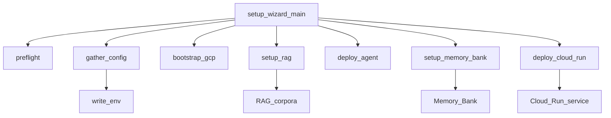
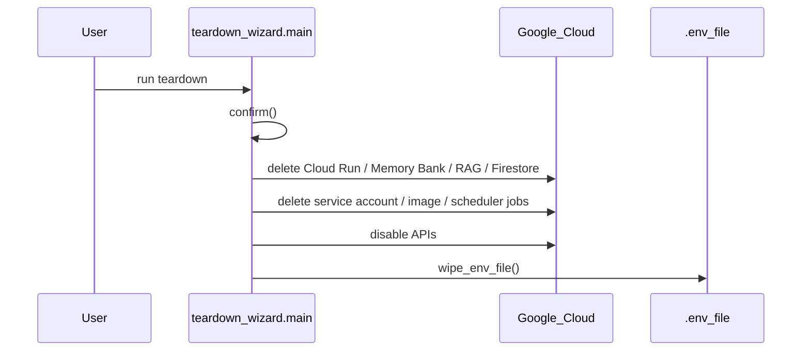

# Deployment Lifecycle and Environment Provisioning

## Overview

This repository’s deployment story is centered on a small set of orchestration scripts and infrastructure artifacts rather than a large declarative IaC stack. The primary lifecycle entry points are [`setup_wizard.py`](setup_wizard.py#L1), [`teardown_wizard.py`](teardown_wizard.py#L1), and [`scripts/deploy.py`](scripts/deploy.py#L1). Together they provision cloud resources, configure runtime environment variables, deploy the runtime service, and remove the same assets during teardown.

The deployment workflow is clearly split into two phases:

1. **Provisioning and deployment** — interactive setup and scripted deployment create the GCP-backed runtime and write local environment configuration.
2. **Deprovisioning** — teardown removes the deployed service and associated cloud resources, and can also wipe local `.env` state.

The infrastructure visible from the analysis is primarily Google Cloud–based. The code explicitly references Cloud Run, Cloud Scheduler, Firestore, Cloud Storage, BigQuery, Vertex AI Memory Bank, RAG corpora, and service accounts via the setup/teardown scripts and supporting modules such as [`gateway.main`](gateway/main.py#L1), [`gateway.tasks`](gateway/tasks.py#L1), [`memory.memory_bank`](memory/memory_bank.py#L1), [`tools.scheduler_tool`](tools/scheduler_tool.py#L1), and [`tools.storage_tool`](tools/storage_tool.py#L1).

> **Sources:** `setup_wizard.py` · `teardown_wizard.py` · `scripts/deploy.py` · `gateway/main.py` · `gateway/tasks.py` · `memory/memory_bank.py` · `tools/scheduler_tool.py` · `tools/storage_tool.py`

## Deployment Entry Points

The repository exposes several runnable scripts, but only a subset are directly involved in deployment lifecycle management.

| Entry point | What it does | Target environment | Lifecycle phase |
|---|---|---|---|
| [`setup_wizard.py`](setup_wizard.py#L1) | Interactive bootstrap: checks prerequisites, gathers config, provisions cloud resources, seeds data, deploys the runtime, and prints a summary | Local workstation + Google Cloud project | Provision / deploy |
| [`scripts/deploy.py`](scripts/deploy.py#L1) | Performs deployment-time orchestration for the service runtime | Google Cloud / production-like runtime | Deploy |
| [`teardown_wizard.py`](teardown_wizard.py#L1) | Removes Cloud Run, reasoning engine, memory bank, corpora, buckets, Firestore, service account, container image, scheduler jobs, APIs, and optionally wipes `.env` | Google Cloud project + local environment | Teardown |
| [`scripts/setup_rag.py`](scripts/setup_rag.py#L1) | Creates a RAG corpus resource | Google Cloud RAG / Vertex AI | Provisioning sub-step |
| [`scripts/register_agents.py`](scripts/register_agents.py#L1) | Registers agents into the agent registry | Cloud-backed agent registry | Provisioning sub-step |
| [`scripts/demo/seed_bigquery.py`](scripts/demo/seed_bigquery.py#L1) | Seeds demo BigQuery data | BigQuery dataset in a GCP project | Data provisioning |
| [`scripts/demo/seed_knowledge_base.py`](scripts/demo/seed_knowledge_base.py#L1) | Uploads documents/skills to knowledge corpora | RAG corpus / knowledge base | Data provisioning |
| [`scripts/demo/e2e_test.py`](scripts/demo/e2e_test.py#L1) | Runs end-to-end checks against a deployed system | Deployed runtime | Post-deploy validation |

A notable pattern here is that deployment is not a single command; instead, it is a workflow composed of several scripts with distinct responsibilities.

> **Sources:** `setup_wizard.py` · `scripts/deploy.py` · `teardown_wizard.py` · `scripts/setup_rag.py` · `scripts/register_agents.py` · `scripts/demo/seed_bigquery.py` · `scripts/demo/seed_knowledge_base.py` · `scripts/demo/e2e_test.py`

## Infrastructure Artifacts

### `infra/` assets

The repository includes explicit infrastructure files under `infra/`:

- [`infra/clouddeploy.yaml`](infra/clouddeploy.yaml) — a Cloud Deploy configuration artifact implied by its name.
- [`infra/setup.sh`](infra/setup.sh) — a shell-based setup artifact used to prepare infrastructure or deployment prerequisites.

While the analysis does not expose the contents of these files, their presence establishes that deployment uses both scripted orchestration and infra-side configuration.

### Container and runtime packaging

The root-level [`Dockerfile.gateway`](Dockerfile.gateway) is the clearest runtime packaging artifact. It implies that the gateway service is containerized and intended to be deployed into a container runtime, consistent with the Cloud Run deployment path in [`setup_wizard.deploy_cloud_run`](setup_wizard.py#L458) and [`setup_wizard.print_summary`](setup_wizard.py#L516).

### Configuration artifacts

Several files support environment provisioning:

- [`.env.example`](.env.example) — template for local/runtime environment variables.
- [`ui/.env.local.example`](ui/.env.local.example) — frontend environment template.
- [`agents.yaml`](agents.yaml) — agent configuration consumed by runtime/bootstrap scripts.
- [`governance/policies.yaml`](governance/policies.yaml) — policy configuration consumed by the policy engine.
- [`config.py`](config.py#L1) — settings model and environment injection logic.

The deployment process appears to write or update a real `.env` file from user-selected values, rather than relying solely on container environment injection.

> **Sources:** `infra/clouddeploy.yaml` · `infra/setup.sh` · `Dockerfile.gateway` · `.env.example` · `ui/.env.local.example` · `agents.yaml` · `governance/policies.yaml` · `config.py` · `setup_wizard.py`

## Provisioned Cloud Resources

The observable cloud resources implied by the symbols are summarized below.

| Resource | Evidence | Purpose in deployment lifecycle |
|---|---|---|
| Cloud Run service | [`setup_wizard.deploy_cloud_run`](setup_wizard.py#L458), [`teardown_wizard.delete_cloud_run`](teardown_wizard.py#L112) | Hosts the deployed gateway/runtime container |
| Cloud Scheduler jobs | [`tools.scheduler_tool.schedule_agent_task`](tools/scheduler_tool.py#L45), [`gateway.main.scheduler_trigger`](gateway/main.py#L430), [`teardown_wizard.delete_scheduler_jobs`](teardown_wizard.py#L270) | Scheduled task execution and webhook triggers |
| Firestore | [`gateway.tasks._get_firestore_client`](gateway/tasks.py#L58), [`memory.user_profile.get_or_create_profile`](memory/user_profile.py#L68), [`teardown_wizard.delete_firestore`](teardown_wizard.py#L217) | Persists tasks and user profile data |
| Cloud Storage / GCS | [`tools.storage_tool._get_gcs_client`](tools/storage_tool.py#L23), [`gateway.tasks.load_task_from_gcs`](gateway/tasks.py#L116), [`teardown_wizard.delete_gcs_bucket`](teardown_wizard.py#L201) | Stores objects and task payloads |
| BigQuery | [`tools.bigquery_tool._get_bq_client`](tools/bigquery_tool.py#L24), [`scripts/demo/seed_bigquery.py`](scripts/demo/seed_bigquery.py#L1) | Demo data and analytics queries |
| Vertex AI Memory Bank | [`memory.memory_bank.HermesMemoryBank`](memory/memory_bank.py#L56), [`memory.memory_bank.create_memory_bank`](memory/memory_bank.py#L434), [`teardown_wizard.delete_memory_bank`](teardown_wizard.py#L150) | Long-term memory persistence |
| Vertex AI RAG corpora | [`scripts/setup_rag.create_corpus`](scripts/setup_rag.py#L29), [`memory.skill_store.search_skills`](memory/skill_store.py#L36), [`teardown_wizard.delete_rag_corpora`](teardown_wizard.py#L179) | Knowledge and skill retrieval |
| Service account | [`teardown_wizard.delete_service_account`](teardown_wizard.py#L236) | Runtime identity for service-to-service calls |
| Container image | [`teardown_wizard.delete_container_image`](teardown_wizard.py#L249) | Deployed application artifact cleanup |
| Google APIs | [`teardown_wizard.disable_apis`](teardown_wizard.py#L305) | Optional project-level cleanup |

This resource list is not speculative: each item is directly referenced by a setup or teardown function, or by runtime code that depends on it.

> **Sources:** `setup_wizard.py` · `teardown_wizard.py` · `gateway/tasks.py` · `memory/user_profile.py` · `memory/memory_bank.py` · `memory/skill_store.py` · `tools/storage_tool.py` · `tools/bigquery_tool.py` · `scripts/setup_rag.py`

## Setup Flow and Runtime Environment

The deployment bootstrap is concentrated in [`setup_wizard.main`](setup_wizard.py#L557), which orchestrates the overall setup lifecycle. Based on the visible function structure, the flow is:

1. [`preflight`](setup_wizard.py#L121) validates prerequisites.
2. [`gather_config`](setup_wizard.py#L171) collects environment-specific choices and persists them via `.env`.
3. [`bootstrap_gcp`](setup_wizard.py#L244) initializes the cloud project-level foundation.
4. [`setup_rag`](setup_wizard.py#L320) provisions corpora / knowledge stores.
5. [`deploy_agent`](setup_wizard.py#L375) deploys or configures the agent runtime.
6. [`seed_demo_data`](setup_wizard.py#L418) seeds sample data.
7. [`setup_memory_bank`](setup_wizard.py#L433) configures memory persistence.
8. [`deploy_cloud_run`](setup_wizard.py#L458) deploys the Cloud Run service.
9. [`print_summary`](setup_wizard.py#L516) prints a post-deploy summary including the gateway URL and env file location.

A key detail is that `setup_wizard.py` is not only a deployer; it is also an environment provisioning tool. It writes `.env` entries using [`write_env`](setup_wizard.py#L98) and prompts via [`ask`](setup_wizard.py#L75) / [`ask_yn`](setup_wizard.py#L89), which indicates the repository expects local operator-driven configuration during bootstrap.

The settings layer in [`config.Settings`](config.py#L7) and [`Settings.inject_litellm_env`](config.py#L142) suggests the runtime derives provider credentials from environment variables at startup. That means deployment must ensure the environment contains the correct model and cloud credentials before launching the runtime.

> **Sources:** `setup_wizard.py` · `config.py`

## Teardown Flow and Cleanup Coverage

The teardown script is intentionally comprehensive. [`teardown_wizard.main`](teardown_wizard.py#L337) coordinates deletion of the infrastructure and associated runtime state, and the helper functions reveal the exact cleanup surface:

- [`delete_cloud_run`](teardown_wizard.py#L112)
- [`delete_reasoning_engine`](teardown_wizard.py#L126)
- [`delete_memory_bank`](teardown_wizard.py#L150)
- [`delete_rag_corpora`](teardown_wizard.py#L179)
- [`delete_gcs_bucket`](teardown_wizard.py#L201)
- [`delete_firestore`](teardown_wizard.py#L217)
- [`delete_service_account`](teardown_wizard.py#L236)
- [`delete_container_image`](teardown_wizard.py#L249)
- [`delete_scheduler_jobs`](teardown_wizard.py#L270)
- [`disable_apis`](teardown_wizard.py#L305)
- [`wipe_env_file`](teardown_wizard.py#L323)

The presence of [`confirm`](teardown_wizard.py#L98) and the dedicated `require_yes` semantics in the docstring show that teardown is guarded against accidental destructive execution. This is a good sign operationally: the script expects human confirmation before removing cloud resources.

The `wipe_env_file` step is also notable because it extends teardown into the local environment. This means lifecycle cleanup is not only cloud-side; it also resets operator state on the machine that performed setup.

> **Sources:** `teardown_wizard.py`

## Deployment Entry Point Comparison

The following table focuses specifically on scripts that participate in deployment lifecycle management, including provisioning and teardown.

| Entry point | Deploys or tears down | Target environment | Notes |
|---|---|---|---|
| [`setup_wizard.main`](setup_wizard.py#L557) | Deploys and provisions the full environment | Local operator environment + GCP project | Interactive bootstrap with config gathering, seeding, and Cloud Run deployment |
| [`scripts/deploy.main`](scripts/deploy.py#L31) | Deploys the service/runtime | Cloud runtime | Appears to be a non-interactive deployment helper |
| [`scripts/setup_rag.main`](scripts/setup_rag.py#L43) | Provisions RAG corpora | Vertex AI / RAG environment | Specialized provisioning script |
| [`scripts/register_agents.main`](scripts/register_agents.py#L69) | Registers agents | Agent registry | Supports deployment-time registration of agent metadata |
| [`teardown_wizard.main`](teardown_wizard.py#L337) | Tears down deployed resources | Google Cloud project + local `.env` | Broad cleanup, guarded by confirmation |
| [`scripts/demo/seed_bigquery.main`](scripts/demo/seed_bigquery.py#L291) | Seeds demo BigQuery tables | BigQuery | Useful post-provisioning data step |
| [`scripts/demo/seed_knowledge_base.main`](scripts/demo/seed_knowledge_base.py#L181) | Seeds corpora and skills | RAG / knowledge base | Demo content bootstrap |
| [`scripts/demo/e2e_test.main`](scripts/demo/e2e_test.py#L513) | Validates deployment | Deployed runtime | Post-deploy verification |

For operators, the important distinction is that `setup_wizard.py` is the umbrella workflow, while the `scripts/*` entry points are specialized tools that can be run independently when only a subset of the environment needs to be created or updated.

> **Sources:** `setup_wizard.py` · `scripts/deploy.py` · `scripts/setup_rag.py` · `scripts/register_agents.py` · `teardown_wizard.py` · `scripts/demo/seed_bigquery.py` · `scripts/demo/seed_knowledge_base.py` · `scripts/demo/e2e_test.py`

## Operational Notes and Gaps

A few deployment details are clearly visible; others are implied but not fully inspectable from the symbol metadata alone:

- The repository definitely deploys to **Google Cloud**, with Cloud Run, Cloud Scheduler, Firestore, GCS, BigQuery, and Vertex AI Memory Bank/RAG all represented.
- The exact commands executed by [`scripts/deploy.py`](scripts/deploy.py#L1) and the content of `infra/clouddeploy.yaml` are not available in the symbol listing, so their behavior should be treated as inferred from file purpose rather than exhaustively described.
- The runtime likely uses environment variables heavily, because [`config.Settings`](config.py#L7) and `.env.example` exist, and deployment scripts explicitly write env values.
- There is a clear separation between **local bootstrap** and **remote runtime**. Local setup prepares configuration and credentials, while Cloud Run hosts the production-facing service.

In practice, this means deployment operators should treat the setup wizard as the authoritative source of the environment contract, and use teardown only when they intend to remove the complete cloud footprint.

> **Sources:** `scripts/deploy.py` · `infra/clouddeploy.yaml` · `config.py` · `.env.example` · `setup_wizard.py` · `teardown_wizard.py`