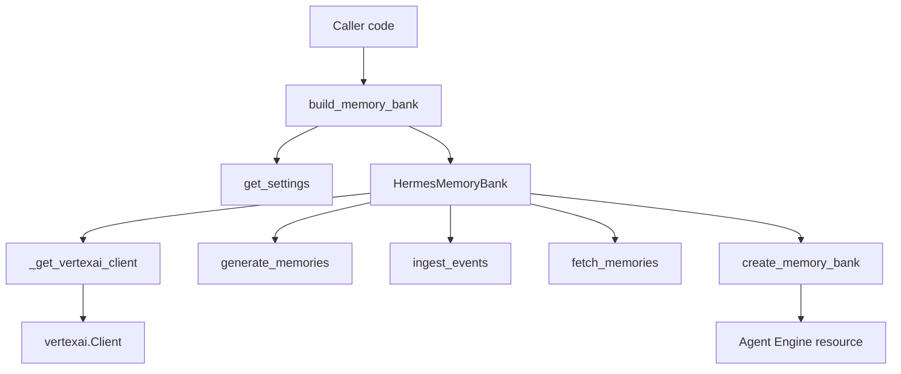

# External Integrations, Plugins, and Ecosystem

This page documents the repository’s external dependencies, the third-party systems it integrates with, and the extension surfaces visible in the analyzed codebase. The repository snapshot is relatively small and centers on the memory subsystem in [`memory/memory_bank.py`](memory/memory_bank.py#L1), with tests in [`tests/memory/test_memory_bank.py`](tests/memory/test_memory_bank.py#L1) and test scaffolding in [`tests/conftest.py`](tests/conftest.py#L1). Evidence for broader ecosystem positioning is primarily found in the docs files listed in the snapshot, especially [`README.md`](README.md) and [`docs/ARCHITECTURE.md`](docs/ARCHITECTURE.md), but their content was not directly enumerated in the static analysis payload, so ecosystem claims below are intentionally conservative.

## External Dependencies

The following third-party libraries and SDKs are evidenced by imports, test usage, or docstring references. Version numbers are only stated when explicitly visible in code comments/docstrings.

| Library / SDK | Version | Purpose | Evidence |
|---|---:|---|---|
| `vertexai` | SDK >= 1.112 referenced | Core integration for Agent Engine memory operations: client creation, memory CRUD, ingestion, retrieval, and resource creation | [`memory.memory_bank`](memory/memory_bank.py#L1), [`_get_vertexai_client`](memory/memory_bank.py#L41), [`HermesMemoryBank.create_memory_bank`](memory/memory_bank.py#L432) |
| `pytest` | Not specified | Test runner for the memory bank test suite | [`tests.memory.test_memory_bank`](tests/memory/test_memory_bank.py#L1) |
| `unittest.mock` | Standard library | Extensive mocking of Vertex AI client behavior in tests | [`tests.conftest`](tests/conftest.py#L1), [`tests.memory.test_memory_bank`](tests/memory/test_memory_bank.py#L1) |
| `starlette.responses` | Not specified | Response-type compatibility stub in test scaffolding | [`tests.conftest`](tests/conftest.py#L1), [`_FakeEventSourceResponse`](tests/conftest.py#L177) |
| `asyncio` | Standard library | Runs blocking Vertex SDK calls in background threads via `asyncio.to_thread` | [`HermesMemoryBank.generate_memories`](memory/memory_bank.py#L105), [`HermesMemoryBank.fetch_memories`](memory/memory_bank.py#L331) |
| `logging` | Standard library | Operational logging and graceful-degradation behavior | [`memory.memory_bank`](memory/memory_bank.py#L1) |

### Notes on version evidence

The static analysis does not expose a `requirements.txt` contents list, only the file presence. The only concrete version-related information surfaced in code is the docstring note that `RetrieveProfiles` is not available in the Agent Engine memories API “SDK >= 1.112” and that there is no standalone `vertexai.preview.memory_bank.MemoryBank.create()` in that SDK line. That is important because it explains why the implementation uses Agent Engine resources as the backing storage mechanism. See [`HermesMemoryBank.retrieve_profiles`](memory/memory_bank.py#L315) and [`HermesMemoryBank.create_memory_bank`](memory/memory_bank.py#L432).

> **Sources:** `memory/memory_bank.py` · L1–L470 · [`_get_vertexai_client`](memory/memory_bank.py#L41), [`HermesMemoryBank`](memory/memory_bank.py#L79), [`create_memory_bank`](memory/memory_bank.py#L432) · `tests/conftest.py` · L1–L274

## Integrations

### Vertex AI Agent Engine Memories

This is the primary external integration and the central purpose of the repository’s implementation layer.

#### What it does

[`HermesMemoryBank`](memory/memory_bank.py#L79) is described as an “application-level facade over Vertex AI Agent Engine memories.” It wraps memory lifecycle operations such as:

- automatic memory generation from conversation turns via [`generate_memories`](memory/memory_bank.py#L105)
- batched ingestion via [`ingest_events`](memory/memory_bank.py#L143)
- direct CRUD operations like [`create_memory`](memory/memory_bank.py#L250), [`update_memory`](memory/memory_bank.py#L285), and [`delete_memory`](memory/memory_bank.py#L227)
- retrieval through [`fetch_memories`](memory/memory_bank.py#L331)
- bulk deletion via [`purge_memories`](memory/memory_bank.py#L187)
- Agent Engine resource creation via [`create_memory_bank`](memory/memory_bank.py#L432)

The docstring for [`create_memory_bank`](memory/memory_bank.py#L432) makes the SDK migration explicit: because SDK >= 1.112 no longer exposes a standalone `VertexAiMemoryBank` resource class, the implementation creates a lightweight Agent Engine resource dedicated to memory storage.

#### How it’s configured

The configuration pattern is deliberately environment/settings-driven:

- [`_get_vertexai_client`](memory/memory_bank.py#L41) accepts optional `project` and `location` arguments and falls back to values from `get_settings()`
- [`build_memory_bank`](memory/memory_bank.py#L411) returns `None` if `MEMORY_BANK_RESOURCE_NAME` is absent or empty, allowing the application to degrade gracefully
- [`create_memory_bank`](memory/memory_bank.py#L432) takes `project`, `location`, and `display_name` parameters and creates or reuses an Agent Engine resource
- the `resource_name` passed to [`HermesMemoryBank.__init__`](memory/memory_bank.py#L92) is the full Agent Engine resource name, e.g. `projects/.../locations/.../reasoningEngines/...`

The tests confirm this configuration behavior: `build_memory_bank` returns `None` when the setting is unset, and `create_memory_bank` reuses an existing engine when the `display_name` matches. See [`TestBuildMemoryBank`](tests/memory/test_memory_bank.py#L212) and [`TestCreateMemoryBank`](tests/memory/test_memory_bank.py#L263).

#### Code reference

- [`_get_vertexai_client(project, location)`](memory/memory_bank.py#L41)
- [`HermesMemoryBank`](memory/memory_bank.py#L79)
- [`HermesMemoryBank.generate_memories`](memory/memory_bank.py#L105)
- [`HermesMemoryBank.ingest_events`](memory/memory_bank.py#L143)
- [`HermesMemoryBank.fetch_memories`](memory/memory_bank.py#L331)
- [`build_memory_bank`](memory/memory_bank.py#L411)
- [`create_memory_bank`](memory/memory_bank.py#L432)

#### Integration flow

> **Sources:** `memory/memory_bank.py` · L41–L470 · [`_get_vertexai_client`](memory/memory_bank.py#L41), [`HermesMemoryBank`](memory/memory_bank.py#L79), [`build_memory_bank`](memory/memory_bank.py#L411), [`create_memory_bank`](memory/memory_bank.py#L432)

### FastAPI / Starlette response compatibility in tests

The repository’s test scaffolding includes a compatibility stub for Starlette response handling.

#### What it does

[`_FakeEventSourceResponse`](tests/conftest.py#L177) subclasses `_StarletteResponse` and provides a minimal stand-in so FastAPI accepts `EventSourceResponse` as a response type during tests. This is not an application integration in the production code path; it is a test-environment adapter.

#### How it’s configured

The stub is declared in [`tests/conftest.py`](tests/conftest.py#L1) and registered through `_register_all()` ([`tests/conftest.py`](tests/conftest.py#L213)), which appears to inject multiple fake modules into `sys.modules` so tests can import components that are absent or impractical to load in a unit-test context.

#### Code reference

- [`_FakeEventSourceResponse`](tests/conftest.py#L177)
- [`_register_all`](tests/conftest.py#L213)

> **Sources:** `tests/conftest.py` · L177–L180, L213–L274 · [`_FakeEventSourceResponse`](tests/conftest.py#L177), [`_register_all`](tests/conftest.py#L213)

## Extension Points

The analyzed codebase does not expose a formal plugin framework, but it does contain several extension-like seams that are important for maintainers and integrators.

### Memory ingestion and extraction callbacks

[`HermesMemoryBank.generate_memories`](memory/memory_bank.py#L105) is explicitly documented as being called from a `skill_learning_callback` “fire-and-forget” after every agent turn. That means the memory layer is already designed as a callback target rather than a tightly coupled direct dependency. The method itself wraps the blocking Vertex SDK call in `asyncio.to_thread`, which makes it safe to invoke from asynchronous application code.

This is the clearest extension seam in the repository: upstream agent logic can decide when and how to invoke memory generation, and the memory bank just performs the storage-side operation.

### Explicit memory-as-a-tool path

[`HermesMemoryBank.create_memory`](memory/memory_bank.py#L250) is documented as useful for the “memory-as-a-tool” pattern, where the agent explicitly decides what to remember instead of relying on automatic extraction/consolidation. That means the interface supports both:

- automatic memory distillation
- direct, caller-driven memory creation

This is effectively an application-level extension point for agent behavior.

### Prompt injection hook

[`HermesMemoryBank.format_for_prompt`](memory/memory_bank.py#L381) fetches memories and formats them as a system prompt snippet. The docstring states that the caller, specifically `gateway/main.py`, injects this into the session system prompt. Even though `gateway/main.py` is not in the analyzed file set, the contract is clear: the memory bank acts as a provider of prompt-ready context rather than mutating prompts directly.

### SDK-compatibility fallback behavior

Several methods intentionally return empty or safe fallback values rather than failing:

- [`retrieve_profiles`](memory/memory_bank.py#L315) returns `[]`
- [`list_revisions`](memory/memory_bank.py#L369) returns `[]`
- [`build_memory_bank`](memory/memory_bank.py#L411) returns `None` if not configured
- [`format_for_prompt`](memory/memory_bank.py#L381) returns `""` when no memories are available or the bank is unavailable

These are not “plugins” in the strict sense, but they are integration seams because upstream code can treat the memory bank as optional.

#### Extension-seam summary

| Extension point | Type | Consumer expectation | Code reference |
|---|---|---|---|
| `skill_learning_callback` usage | Callback hook | Invoke memory generation after a turn | [`HermesMemoryBank.generate_memories`](memory/memory_bank.py#L105) |
| Direct fact creation | Tool-like API | Explicit agent-authored memory writes | [`HermesMemoryBank.create_memory`](memory/memory_bank.py#L250) |
| Prompt snippet generation | Prompt injection seam | Caller inserts returned text into system prompt | [`HermesMemoryBank.format_for_prompt`](memory/memory_bank.py#L381) |
| Optional bank construction | Graceful optionality | Caller handles `None` and continues without memory | [`build_memory_bank`](memory/memory_bank.py#L411) |

> **Sources:** `memory/memory_bank.py` · L105–L406, L411–L470 · [`HermesMemoryBank.generate_memories`](memory/memory_bank.py#L105), [`HermesMemoryBank.create_memory`](memory/memory_bank.py#L250), [`HermesMemoryBank.format_for_prompt`](memory/memory_bank.py#L381), [`build_memory_bank`](memory/memory_bank.py#L411)

## Related Projects

The analysis payload includes only limited documentation evidence, so related-project identification must be cautious. The strongest evidence comes from naming and docstrings rather than explicit comparisons in the visible source set.

### Evidenced adjacent APIs and older implementations

[`HermesMemoryBank.create_memory_bank`](memory/memory_bank.py#L432) includes a migration note referencing the older `vertexai.preview.memory_bank.MemoryBank.create()` API. This indicates the codebase is aligned with Vertex AI’s evolving memory API surface and is a migration-target project for users coming from the preview memory bank interface.

### Likely same-space tool category

From the repository layout and memory abstractions, this project sits in the “LLM agent memory management” space, alongside tools that provide:

- long-term memory persistence for agents
- memory retrieval for prompt augmentation
- automatic extraction of durable facts from chat turns
- optional direct memory CRUD tooling

However, the current static analysis does not expose explicit comparisons to named open-source peers in README/docs, so this page does not assert specific competitor projects.

### Repository-local ecosystem hints

The presence of `README.md` and `docs/ARCHITECTURE.md` suggests the project is documented as a broader application or platform, not just a library. The test scaffolding in [`tests/conftest.py`](tests/conftest.py#L1) also indicates the project likely integrates with a larger agent stack whose modules are simulated in tests, but those modules were not present in the analyzed snapshot.

> **Sources:** `memory/memory_bank.py` · L432–L470 · [`create_memory_bank`](memory/memory_bank.py#L432) · `README.md` · `docs/ARCHITECTURE.md`

## Roadmap / Known Limitations

The available analysis data contains no explicit `TODO` or `FIXME` strings, and the `risks` array is empty. That said, several limitations are directly visible in code and tests.

### Unsupported or stubbed API surfaces

Two public methods are deliberately non-functional in the current SDK line:

- [`HermesMemoryBank.retrieve_profiles`](memory/memory_bank.py#L315) always returns an empty list
- [`HermesMemoryBank.list_revisions`](memory/memory_bank.py#L369) always returns an empty list

The docstrings explain that these capabilities are not available in Agent Engine memories API SDK >= 1.112, so the stubs exist for backward compatibility.

### Graceful failure over strict error propagation

Multiple operations swallow exceptions and return safe defaults. This is useful for resilience, but it also means failures can be silent unless logs are monitored:

- [`generate_memories`](memory/memory_bank.py#L105) swallows exceptions
- [`ingest_events`](memory/memory_bank.py#L143) swallows exceptions
- [`purge_memories`](memory/memory_bank.py#L187) returns `0` on error
- [`delete_memory`](memory/memory_bank.py#L227) returns `False` on error
- [`create_memory`](memory/memory_bank.py#L250) returns `None` on error
- [`update_memory`](memory/memory_bank.py#L285) returns `False` on error
- [`fetch_memories`](memory/memory_bank.py#L331) returns `[]` on error
- [`build_memory_bank`](memory/memory_bank.py#L411) returns `None` on error

This design prioritizes application continuity over observability. If the repository evolves into a production platform, stronger error reporting or metrics could be a future improvement area.

### Potential test-surface gap

The knowledge-gaps metadata flags [`_make_module`](tests/conftest.py#L22) as called six times but lacking test coverage. That is not a production limitation, but it does suggest the test scaffolding itself is somewhat unverified.

### No visible dependency lock or CI evidence in this snapshot

The static snapshot does not include build commands, test commands, or CI files. That means ecosystem maintenance practices such as dependency pinning, reproducible builds, or automated integration testing could not be verified here.

#### Limitation summary

| Area | Limitation | Evidence |
|---|---|---|
| API completeness | `retrieve_profiles` and `list_revisions` are stubs | [`HermesMemoryBank.retrieve_profiles`](memory/memory_bank.py#L315), [`HermesMemoryBank.list_revisions`](memory/memory_bank.py#L369) |
| Error handling | Many methods suppress exceptions and return defaults | [`HermesMemoryBank`](memory/memory_bank.py#L105–L406) |
| Test scaffolding | `_make_module` has no direct coverage | [`tests/conftest.py`](tests/conftest.py#L22); knowledge gaps metadata |
| Build/CI visibility | No build/test commands or CI files in snapshot | analysis metadata |

> **Sources:** `memory/memory_bank.py` · L105–L470 · [`HermesMemoryBank`](memory/memory_bank.py#L79), [`retrieve_profiles`](memory/memory_bank.py#L315), [`list_revisions`](memory/memory_bank.py#L369), [`build_memory_bank`](memory/memory_bank.py#L411) · `tests/conftest.py` · L22–L26

## Relationship Snapshot

Although this page focuses on external integrations, the internal dependency picture helps explain where those integrations terminate.

| Module | Imports From | Called By | Calls Into | Inherits From |
|---|---|---|---|---|
| `memory.memory_bank` | `asyncio`, `logging`, `typing`, `vertexai`, `config` | `tests.memory.test_memory_bank` | `vertexai.Client`-related SDK methods, `get_settings` | — |
| `tests.conftest` | `os`, `sys`, `types`, `unittest.mock`, `functools`, `starlette.responses` | test suite | `ModuleType`, fake module registration helpers | `_StarletteResponse` via [`_FakeEventSourceResponse`](tests/conftest.py#L177) |
| `tests.memory.test_memory_bank` | `types`, `unittest.mock`, `pytest`, `memory.memory_bank`, `config` | — | `HermesMemoryBank`, `build_memory_bank`, `create_memory_bank` | — |

> **Sources:** `memory/memory_bank.py` · L1–L470 · `tests/conftest.py` · L1–L274 · `tests/memory/test_memory_bank.py` · L1–L490