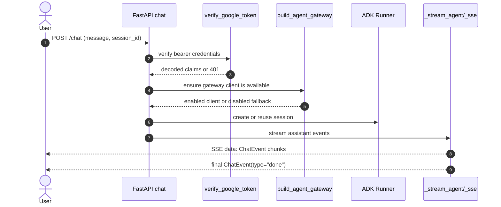
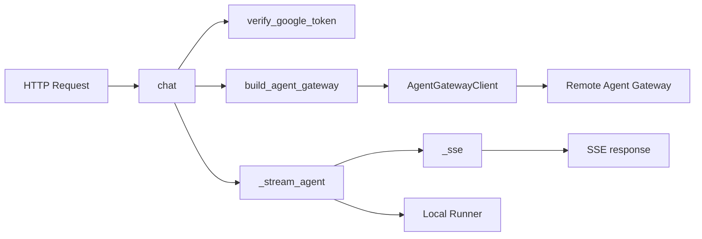

# Gateway Subsystem End-to-End

## Overview

The gateway subsystem is the HTTP-facing control plane for the application. It owns request authentication, app startup and shutdown lifecycle, chat orchestration, and the fallback path to direct runner execution when Agent Gateway is unavailable. The public surface is concentrated in three modules: [`gateway.agent_gateway`](gateway/agent_gateway.py), [`gateway.auth`](gateway/auth.py), and [`gateway.main`](gateway/main.py).

At a high level, the flow is:

1. The FastAPI app starts via [`lifespan`](gateway/main.py#L63) and initialises settings, tracing, the agent runner, memory bank, and policy engine.
2. Incoming chat requests hit [`chat`](gateway/main.py#L152), which validates the user token through [`verify_google_token`](gateway/auth.py#L42) and screen checks the prompt before proceeding.
3. If Agent Gateway is configured, [`AgentGatewayClient`](gateway/agent_gateway.py#L63) can send messages either as a one-shot response or a streaming SSE feed. Otherwise, the app falls back to the local ADK [`Runner`](gateway/main.py#L63) path.
4. Responses are emitted as Server-Sent Events using [`_sse`](gateway/main.py#L242) and the internal streaming helper [`_stream_agent`](gateway/main.py#L203).

The design is intentionally tolerant of missing infrastructure. [`build_agent_gateway`](gateway/agent_gateway.py#L184) returns a disabled client when the endpoint is not configured, and [`verify_google_token`](gateway/auth.py#L42) can be bypassed in local development with `DISABLE_AUTH=true`. This makes the subsystem suitable for both production and offline development.

> **Sources:** `gateway/main.py` · L63–L243 · [`lifespan`](gateway/main.py#L63) · [`ChatRequest`](gateway/main.py#L136) · [`ChatEvent`](gateway/main.py#L141) · [`chat`](gateway/main.py#L152) · [`_stream_agent`](gateway/main.py#L203) · [`_sse`](gateway/main.py#L242) · `gateway/agent_gateway.py` · L30–L211 · [`AgentGatewayConfig`](gateway/agent_gateway.py#L30) · [`AgentGatewayClient`](gateway/agent_gateway.py#L63) · [`build_agent_gateway`](gateway/agent_gateway.py#L184) · `gateway/auth.py` · L42–L110 · [`verify_google_token`](gateway/auth.py#L42)

## Configuration Objects

### `AgentGatewayConfig`

[`AgentGatewayConfig`](gateway/agent_gateway.py#L30) is the central configuration object for Agent Gateway routing. Its docstring explicitly states that all fields are optional and that unset fields trigger graceful fallback to direct Runner execution. That fallback-first behavior is a core architectural choice: the gateway subsystem does not require Agent Gateway to be present in order to serve requests.

The class also defines a [`__post_init__`](gateway/agent_gateway.py#L57) hook, which is used to normalise the enabled state based on the presence of the endpoint. The test suite confirms this behavior: when an endpoint is set, the config is enabled; when no endpoint exists, the config is disabled.

### `ChatRequest` and `ChatEvent`

[`ChatRequest`](gateway/main.py#L136) is the request body model for chat calls. It defines the structured input accepted by [`chat`](gateway/main.py#L152), including the user's message and session metadata.

[`ChatEvent`](gateway/main.py#L141) is the event envelope emitted by the streaming path. The `chat` endpoint documents that each SSE event is a JSON-encoded `ChatEvent`, and that the final event has `type='done'`. This model is the contract between the internal streaming helper and the frontend client, which consumes the SSE feed incrementally.

### Runtime Settings Dependencies

Although the settings type itself lives in [`config.py`](config.py), the gateway subsystem reads it at startup and in auth checks. The startup path calls `get_settings`, then uses settings to initialise tracing, the policy engine, memory bank, and agent runner. Agent Gateway construction also reads settings to decide whether to enable remote routing.

| Object | Responsibility | Notable behavior |
|---|---|---|
| [`AgentGatewayConfig`](gateway/agent_gateway.py#L30) | Controls Agent Gateway enablement and routing parameters | Falls back to direct execution when unset |
| [`ChatRequest`](gateway/main.py#L136) | Validated request payload for chat | Used by the streaming chat endpoint |
| [`ChatEvent`](gateway/main.py#L141) | Structured SSE response event | Final event marks completion |

> **Sources:** `gateway/agent_gateway.py` · L30–L58 · [`AgentGatewayConfig`](gateway/agent_gateway.py#L30) · `gateway/main.py` · L136–L144 · [`ChatRequest`](gateway/main.py#L136) · [`ChatEvent`](gateway/main.py#L141)

## Client Lifecycle

### Construction and Lazy Initialisation

[`AgentGatewayClient`](gateway/agent_gateway.py#L63) is the async client wrapper responsible for interacting with the remote Agent Gateway service. Its docstring makes the lifecycle contract explicit: when `config.enabled == False`, all methods return `None` or an empty iterator, and callers fall back to direct Runner execution.

The client is lazily initialised via [`_ensure_client`](gateway/agent_gateway.py#L75). This method creates the underlying `httpx.AsyncClient` only when the first request needs it. That pattern avoids unnecessary network-client setup during startup when Agent Gateway may not be used at all.

### Message Sending

[`send_message`](gateway/agent_gateway.py#L94) performs a one-shot call to the gateway and returns the JSON response. It uses `_ensure_client` internally, posts the message, and returns `None` on gateway failure to preserve the fallback contract. The implementation also includes debug logging around the request/response exchange.

### Streaming Calls

[`stream_message`](gateway/agent_gateway.py#L137) is the streaming companion to `send_message`. It opens an HTTP stream, iterates over `aiter_lines`, and yields SSE data lines. If Agent Gateway is disabled or the stream fails, it yields nothing, which allows the caller to detect the empty iterator and transparently switch to the local ADK runner.

### Shutdown

[`close`](gateway/agent_gateway.py#L175) closes the underlying HTTP client. This method is called from the app shutdown path managed by [`lifespan`](gateway/main.py#L63), ensuring the network client does not leak resources across process restarts.

### Builder Function

[`build_agent_gateway`](gateway/agent_gateway.py#L184) is the factory used by the application to create an `AgentGatewayClient`. It reads settings, logs whether Agent Gateway is enabled, and returns a disabled client when `AGENT_GATEWAY_ENDPOINT` is missing. This means the gateway subsystem can be deployed in environments where Agent Gateway is not provisioned yet.

| Public API | Responsibility | Lifecycle role |
|---|---|---|
| [`AgentGatewayClient`](gateway/agent_gateway.py#L63) | Wrap remote Agent Gateway interactions | Long-lived app singleton |
| [`AgentGatewayClient._ensure_client`](gateway/agent_gateway.py#L75) | Lazily create `httpx.AsyncClient` | First-use initialisation |
| [`AgentGatewayClient.send_message`](gateway/agent_gateway.py#L94) | One-shot remote chat request | Non-streaming path |
| [`AgentGatewayClient.stream_message`](gateway/agent_gateway.py#L137) | SSE stream from Agent Gateway | Streaming path |
| [`AgentGatewayClient.close`](gateway/agent_gateway.py#L175) | Release HTTP resources | Shutdown cleanup |
| [`build_agent_gateway`](gateway/agent_gateway.py#L184) | Construct configured client | Startup factory |

> **Sources:** `gateway/agent_gateway.py` · L63–L211 · [`AgentGatewayClient`](gateway/agent_gateway.py#L63) · [`AgentGatewayClient._ensure_client`](gateway/agent_gateway.py#L75) · [`AgentGatewayClient.send_message`](gateway/agent_gateway.py#L94) · [`AgentGatewayClient.stream_message`](gateway/agent_gateway.py#L137) · [`AgentGatewayClient.close`](gateway/agent_gateway.py#L175) · [`build_agent_gateway`](gateway/agent_gateway.py#L184)

## Authentication

### Google ID Token Verification

[`verify_google_token`](gateway/auth.py#L42) validates Google ID tokens and returns decoded claims. The docstring makes three important guarantees:

- invalid or expired tokens raise HTTP 401,
- successful verification is cached for five minutes to avoid a round trip on every request,
- when `DISABLE_AUTH=true`, validation is skipped and a synthetic `"local-dev"` user is returned.

That behavior is a good example of the gateway subsystem’s production/dev duality. In production, the endpoint is protected by bearer-token verification. In local development, the same endpoints remain accessible without external identity infrastructure.

### Dependency Usage in the API

The chat endpoint and the user-scoped session/memory routes are all keyed off the authenticated user. `chat` receives the authenticated user context, which is produced by the auth dependency. This pattern ensures session creation, memory retrieval, and response generation all operate within a user identity boundary.

### Failure Modes

The auth function is designed to fail fast and clearly:

- malformed credentials → 401
- expired token → 401
- unauthorized caller → 401
- local dev bypass → synthetic user identity

This is important because the chat pipeline depends on the authenticated user ID for session naming, memory lookup, and policy enforcement.

> **Sources:** `gateway/auth.py` · L42–L110 · [`verify_google_token`](gateway/auth.py#L42)

## Chat Handling: Streaming and Non-Streaming

### Request Entry Point

[`chat`](gateway/main.py#L152) is the primary chat endpoint. Its docstring says it streams chat responses as Server-Sent Events, with each event JSON-encoded as a `ChatEvent`. The implementation performs prompt safety screening via `screen_prompt` before any model or gateway request is issued, and it enforces request limits with the configured rate limiter.

If the prompt fails safety checks, the endpoint raises an HTTP error rather than reaching the runner. If streaming cannot be initiated, the endpoint responds with an error rather than silently degrading into an inconsistent state.

### Streaming Path

The streaming flow is handled by [`_stream_agent`](gateway/main.py#L203). This helper accepts `user_id`, `session_id`, and `message`, then:

1. wraps the run in an observability span via [`agent_span`](gateway/observability.py#L86),
2. sends the user message to the runner,
3. consumes agent events from the async run,
4. emits SSE strings through [`_sse`](gateway/main.py#L242),
5. converts intermediate event chunks into `ChatEvent` payloads,
6. emits a final `done` event when the response completes.

The response is surfaced to the client through `EventSourceResponse`, which matches the frontend’s streaming consumption pattern.

### Non-Streaming Fallback Behavior

The repository’s gateway client exposes non-streaming behavior via [`AgentGatewayClient.send_message`](gateway/agent_gateway.py#L94). While the public HTTP `chat` endpoint is SSE-based, the subsystem still supports non-streaming request/response semantics when interacting with the remote Agent Gateway. This is important because the remote service may be used by other parts of the system or by future API surfaces that need a single JSON response instead of a live stream.

### SSE Formatting

[`_sse`](gateway/main.py#L242) is intentionally tiny: it serialises a `ChatEvent` with `model_dump_json` and wraps it in the SSE `data:` framing. This keeps the transport logic separate from the event-generation logic in `_stream_agent`, which improves testability and makes the streaming contract easier to reason about.

### End-to-End Behavior

The important property is graceful fallback. When Agent Gateway is unavailable, the application can still serve chat through the local runner. When streaming is available, the endpoint delivers incremental chunks to the UI. The tests in `tests/gateway/test_main_chat.py` confirm that prompt blocking and runner initialisation failures are handled explicitly.

> **Sources:** `gateway/main.py` · L152–L243 · [`chat`](gateway/main.py#L152) · [`_stream_agent`](gateway/main.py#L203) · [`_sse`](gateway/main.py#L242) · `gateway/agent_gateway.py` · L94–L173 · [`AgentGatewayClient.send_message`](gateway/agent_gateway.py#L94) · [`AgentGatewayClient.stream_message`](gateway/agent_gateway.py#L137)

## Public API Responsibility Table

| Public class/function | Responsibility | Notes |
|---|---|---|
| [`AgentGatewayConfig`](gateway/agent_gateway.py#L30) | Configuration for Agent Gateway routing | Optional fields; graceful fallback when unset |
| [`AgentGatewayClient`](gateway/agent_gateway.py#L63) | Async client for remote Agent Gateway calls | Uses lazy `httpx.AsyncClient` creation |
| [`build_agent_gateway`](gateway/agent_gateway.py#L184) | Build configured gateway client | Returns disabled client when endpoint missing |
| [`verify_google_token`](gateway/auth.py#L42) | Validate Google ID token and return claims | Caches verification; local-dev bypass supported |
| [`ChatRequest`](gateway/main.py#L136) | Schema for chat request payloads | Input model for `/chat` |
| [`ChatEvent`](gateway/main.py#L141) | Schema for SSE chat events | Output model for streaming responses |
| [`chat`](gateway/main.py#L152) | Chat endpoint returning SSE stream | Authenticates, screens prompt, dispatches response |
| [`lifespan`](gateway/main.py#L63) | App startup/shutdown lifecycle manager | Initializes runner, tracing, memory, policy, cleans up client |
| [`_stream_agent`](gateway/main.py#L203) | Convert agent output into SSE events | Internal streaming orchestrator |
| [`_sse`](gateway/main.py#L242) | Format one `ChatEvent` as SSE payload | Minimal transport helper |

> **Sources:** `gateway/agent_gateway.py` · L30–L211 · [`AgentGatewayConfig`](gateway/agent_gateway.py#L30) · [`AgentGatewayClient`](gateway/agent_gateway.py#L63) · [`build_agent_gateway`](gateway/agent_gateway.py#L184) · `gateway/auth.py` · L42–L110 · [`verify_google_token`](gateway/auth.py#L42) · `gateway/main.py` · L63–L243 · [`ChatRequest`](gateway/main.py#L136) · [`ChatEvent`](gateway/main.py#L141) · [`chat`](gateway/main.py#L152) · [`lifespan`](gateway/main.py#L63) · [`_stream_agent`](gateway/main.py#L203) · [`_sse`](gateway/main.py#L242)

## Request Flow and Client Creation

The gateway subsystem’s end-to-end flow is easiest to understand as a chain of dependencies:

- [`lifespan`](gateway/main.py#L63) initialises settings, tracing, runner, and optional subsystems.
- [`chat`](gateway/main.py#L152) handles each incoming request.
- [`verify_google_token`](gateway/auth.py#L42) produces the authenticated user context.
- [`build_agent_gateway`](gateway/agent_gateway.py#L184) creates a remote client if configured.
- [`_stream_agent`](gateway/main.py#L203) streams response events.
- [`_sse`](gateway/main.py#L242) encodes each event for transport.

> **Sources:** `gateway/main.py` · L63–L243 · [`lifespan`](gateway/main.py#L63) · [`chat`](gateway/main.py#L152) · [`_stream_agent`](gateway/main.py#L203) · [`_sse`](gateway/main.py#L242) · `gateway/auth.py` · L42–L110 · [`verify_google_token`](gateway/auth.py#L42) · `gateway/agent_gateway.py` · L63–L211 · [`build_agent_gateway`](gateway/agent_gateway.py#L184) · [`AgentGatewayClient`](gateway/agent_gateway.py#L63)

## Explicitly Out of Scope

This page intentionally does **not** document connector webhooks, agent internals, memory learning algorithms, policy rule semantics, or the non-chat endpoints in `gateway/main.py`. Those pieces are related to the broader application, but they are separate subsystems and would dilute the gateway-specific end-to-end picture.

> **Sources:** `gateway/main.py` · L1–L489 · `gateway/agent_gateway.py` · L1–L211 · `gateway/auth.py` · L1–L110