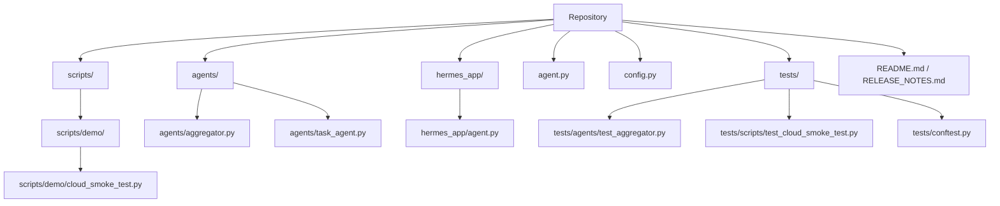

# Project Overview

## What is this project?

This repository appears to be a Python-based agent orchestration system built around Google ADK-style agents, configuration management, and a cloud smoke-test entry point. The top-level bootstrap files [`agent.py`](agent.py#L1) and [`hermes_app.agent`](hermes_app/agent.py#L1) both import [`config`](config.py#L1) and an [`agents.orchestrator`](hermes_app/agent.py#L1) module, indicating that the project’s core purpose is to initialize and serve an application composed of multiple specialized agents. The main agent-building logic is concentrated in [`agents.task_agent`](agents/task_agent.py#L1) and [`agents.aggregator`](agents/aggregator.py#L1), where the system constructs a task-oriented pipeline and a final aggregation step via [`build_task_agent`](agents/task_agent.py#L115) and [`build_aggregator_agent`](agents/aggregator.py#L70).

At a high level, the project solves a common multi-agent coordination problem: how to route work to specialized sub-agents, optionally execute them in parallel, and then consolidate their outputs into a single response. The docstring on [`build_aggregator_agent`](agents/aggregator.py#L70) explicitly states that it “consolidates parallel outputs,” while [`build_task_agent`](agents/task_agent.py#L115) documents both a parallel flow and a sequential fallback flow. The presence of [`build_dynamic_parallel_dispatcher`](agents/task_agent.py#L191) shows that the system can synthesize task-specific agent groups at request time, which is a strong signal that dynamic orchestration is a first-class goal.

The repository also includes a standalone operational utility, [`scripts.demo.cloud_smoke_test`](scripts/demo/cloud_smoke_test.py#L1), with a public entry point [`main`](scripts/demo/cloud_smoke_test.py#L183). This script validates external deployment connectivity in two modes: a gateway HTTP path via [`probe_gateway`](scripts/demo/cloud_smoke_test.py#L47) and an SDK path via [`probe_sdk`](scripts/demo/cloud_smoke_test.py#L118). In other words, the project is not only an agent framework, but also a deployable system with a built-in way to verify that the cloud integration is alive.

> **Sources:** `agent.py` · L1–L1 · [`agent`](agent.py#L1)  
> `hermes_app/agent.py` · L1–L1 · [`hermes_app.agent`](hermes_app/agent.py#L1)  
> `agents/aggregator.py` · L1–L81 · [`build_aggregator_agent`](agents/aggregator.py#L70)  
> `agents/task_agent.py` · L1–L237 · [`build_task_agent`](agents/task_agent.py#L115) · [`build_dynamic_parallel_dispatcher`](agents/task_agent.py#L191)  
> `scripts/demo/cloud_smoke_test.py` · L1–L212 · [`main`](scripts/demo/cloud_smoke_test.py#L183)

## Who is it for?

This project is primarily for developers and platform engineers building or operating a multi-agent application. The code suggests three clear audience segments:

1. **Application engineers** who need a composable orchestration layer for specialist agents such as analytics, HR, developer, and IT helpdesk workflows. Those integrations are referenced in [`build_task_agent`](agents/task_agent.py#L115), which imports builder modules like `agents.analytics`, `agents.developer`, `agents.hr`, and `agents.it_helpdesk`.
2. **Platform or DevOps engineers** who deploy the service and need a quick way to confirm the remote runtime is healthy. They would use [`scripts.demo.cloud_smoke_test`](scripts/demo/cloud_smoke_test.py#L1), especially [`probe_gateway`](scripts/demo/cloud_smoke_test.py#L47) and [`probe_sdk`](scripts/demo/cloud_smoke_test.py#L118).
3. **Maintainers and test authors** who need confidence in orchestration behavior. The test suite focuses heavily on [`build_aggregator_agent`](agents/aggregator.py#L70), [`build_task_agent`](agents/task_agent.py#L115), and the smoke-test helper functions in [`scripts/demo/cloud_smoke_test.py`](scripts/demo/cloud_smoke_test.py#L1).

Typical use cases include deploying an agentic backend, routing a task to specialist sub-agents, collecting a final synthesized answer, and validating the deployment against either a gateway endpoint or an SDK-based reasoning engine. The configuration layer in [`config.py`](config.py#L1) further suggests that operators can tune runtime behavior via environment variables, CORS settings, API credentials, and RAG region validation.

> **Sources:** `agents/task_agent.py` · L115–L237 · [`build_task_agent`](agents/task_agent.py#L115) · [`build_dynamic_parallel_dispatcher`](agents/task_agent.py#L191)  
> `scripts/demo/cloud_smoke_test.py` · L47–L212 · [`probe_gateway`](scripts/demo/cloud_smoke_test.py#L47) · [`probe_sdk`](scripts/demo/cloud_smoke_test.py#L118)  
> `config.py` · L7–L201 · [`Settings`](config.py#L7) · [`Settings.inject_litellm_env`](config.py#L146) · [`Settings.validate_rag_regions`](config.py#L166)

## Key Features

- **Parallel specialist orchestration** via [`build_task_agent`](agents/task_agent.py#L115), which constructs a [`ParallelAgent`](agents/task_agent.py#L115) branch for independent subtasks.
- **Aggregation of parallel results** through [`build_aggregator_agent`](agents/aggregator.py#L70), designed to produce a single user-facing response from multiple specialist outputs.
- **Sequential fallback routing** in [`build_task_agent`](agents/task_agent.py#L115), which also appends specialist agents for step-by-step delegation.
- **Just-in-time dynamic dispatch** with [`build_dynamic_parallel_dispatcher`](agents/task_agent.py#L191), which synthesizes a task-specific pipeline at request time.
- **Runtime health probing** with [`probe_gateway`](scripts/demo/cloud_smoke_test.py#L47) and [`probe_sdk`](scripts/demo/cloud_smoke_test.py#L118), allowing verification of two external integration modes.
- **Structured smoke-test reporting** through the [`SmokeResult`](scripts/demo/cloud_smoke_test.py#L32) dataclass.
- **Centralized runtime configuration** in [`Settings`](config.py#L7), including environment injection via [`Settings.inject_litellm_env`](config.py#L146) and validation via [`Settings.validate_rag_regions`](config.py#L166).
- **Test-backed orchestration contracts** in [`tests/agents/test_aggregator.py`](tests/agents/test_aggregator.py#L1) and [`tests/scripts/test_cloud_smoke_test.py`](tests/scripts/test_cloud_smoke_test.py#L1), which verify the shape and behavior of key assembly functions.

> **Sources:** `agents/aggregator.py` · L70–L81 · [`build_aggregator_agent`](agents/aggregator.py#L70)  
> `agents/task_agent.py` · L115–L237 · [`build_task_agent`](agents/task_agent.py#L115) · [`build_dynamic_parallel_dispatcher`](agents/task_agent.py#L191)  
> `scripts/demo/cloud_smoke_test.py` · L32–L212 · [`SmokeResult`](scripts/demo/cloud_smoke_test.py#L32) · [`main`](scripts/demo/cloud_smoke_test.py#L183)  
> `config.py` · L7–L201 · [`Settings`](config.py#L7)

## Quick Start

The analysis data does not include explicit `build_commands` or `test_commands`, so the exact packaging workflow is not observable from this snapshot. However, the repository does expose a concrete entry point: [`scripts/demo/cloud_smoke_test.py`](scripts/demo/cloud_smoke_test.py#L1), with its CLI entry function [`main`](scripts/demo/cloud_smoke_test.py#L183). That makes the fastest verifiable path likely to be running the smoke test directly with Python after setting the required environment variables for either gateway mode or SDK mode.

A practical starting sequence would be:

```bash
# Install project dependencies according to the repository's packaging docs
# (not visible in the analysis snapshot)

# Run the cloud smoke test entry point
python scripts/demo/cloud_smoke_test.py --help
python scripts/demo/cloud_smoke_test.py
```

The CLI arguments are parsed by [`parse_args`](scripts/demo/cloud_smoke_test.py#L164), and mode selection is handled by [`_detect_mode`](scripts/demo/cloud_smoke_test.py#L158). Depending on your deployment, the script calls either [`probe_gateway`](scripts/demo/cloud_smoke_test.py#L47) or [`probe_sdk`](scripts/demo/cloud_smoke_test.py#L118). If you are working on the agent assembly layer instead of deployment validation, the key runtime objects are built from [`build_task_agent`](agents/task_agent.py#L115) and [`build_aggregator_agent`](agents/aggregator.py#L70), both of which depend on [`Settings`](config.py#L7).

Because no build metadata is present in the analysis payload, this page cannot truthfully state a canonical install command such as `pip install -e .` or `poetry install`. The safest recommendation is to inspect the repository’s README and environment setup files before execution.

> **Sources:** `scripts/demo/cloud_smoke_test.py` · L158–L212 · [`_detect_mode`](scripts/demo/cloud_smoke_test.py#L158) · [`parse_args`](scripts/demo/cloud_smoke_test.py#L164) · [`main`](scripts/demo/cloud_smoke_test.py#L183)  
> `agents/task_agent.py` · L115–L237 · [`build_task_agent`](agents/task_agent.py#L115)  
> `agents/aggregator.py` · L70–L81 · [`build_aggregator_agent`](agents/aggregator.py#L70)  
> `config.py` · L7–L201 · [`Settings`](config.py#L7)

## Project Structure

The repository is organized around a small number of top-level concerns: scripts, agents, application bootstrap, configuration, and tests.



At the file level, the key implementation modules are [`scripts/__init__.py`](scripts/__init__.py#L1), [`scripts/demo/__init__.py`](scripts/demo/__init__.py#L1), [`scripts/demo/cloud_smoke_test.py`](scripts/demo/cloud_smoke_test.py#L1), [`agents/aggregator.py`](agents/aggregator.py#L1), [`agents/task_agent.py`](agents/task_agent.py#L1), [`hermes_app/agent.py`](hermes_app/agent.py#L1), [`agent.py`](agent.py#L1), and [`config.py`](config.py#L1). The test suite mirrors this split with focused coverage for the orchestration and smoke test paths.

> **Sources:** `scripts/__init__.py` · L1–L1 · [`scripts.__init__`](scripts/__init__.py#L1)  
> `scripts/demo/__init__.py` · L1–L1 · [`scripts.demo.__init__`](scripts/demo/__init__.py#L1)  
> `scripts/demo/cloud_smoke_test.py` · L1–L212 · [`scripts.demo.cloud_smoke_test`](scripts/demo/cloud_smoke_test.py#L1)  
> `agents/aggregator.py` · L1–L81 · [`agents.aggregator`](agents/aggregator.py#L1)  
> `agents/task_agent.py` · L1–L237 · [`agents.task_agent`](agents/task_agent.py#L1)  
> `hermes_app/agent.py` · L1–L1 · [`hermes_app.agent`](hermes_app/agent.py#L1)  
> `agent.py` · L1–L1 · [`agent`](agent.py#L1)  
> `config.py` · L1–L201 · [`config`](config.py#L1)

## How it Works (High Level)

Request handling starts in the application bootstrap files [`agent.py`](agent.py#L1) and [`hermes_app.agent`](hermes_app/agent.py#L1), which both import [`config`](config.py#L1) and `agents.orchestrator`, implying a standard startup path that loads settings and wires the orchestrator into the runtime. The core orchestration logic lives in [`build_task_agent`](agents/task_agent.py#L115), which constructs a task pipeline composed of a [`ParallelAgent`](agents/task_agent.py#L115), an [`AggregatorAgent`](agents/aggregator.py#L70), and sequential specialist fallbacks. When a task requires on-the-fly specialization, [`build_dynamic_parallel_dispatcher`](agents/task_agent.py#L191) uses an [`AgentSynthesizer`] relationship to synthesize agents at request time and returns a fresh pipeline.

For deployment verification, the smoke-test entry point [`main`](scripts/demo/cloud_smoke_test.py#L183) selects a mode with [`_detect_mode`](scripts/demo/cloud_smoke_test.py#L158), then calls either [`probe_gateway`](scripts/demo/cloud_smoke_test.py#L47) or [`probe_sdk`](scripts/demo/cloud_smoke_test.py#L118). Those probes produce a normalized [`SmokeResult`](scripts/demo/cloud_smoke_test.py#L32), making it easy to report success or failure consistently across different cloud backends. In short: bootstrap loads config, the task agent routes work, the aggregator combines results, and the smoke test confirms the deployed path is reachable.

> **Sources:** `agent.py` · L1–L1 · [`agent`](agent.py#L1)  
> `hermes_app/agent.py` · L1–L1 · [`hermes_app.agent`](hermes_app/agent.py#L1)  
> `config.py` · L1–L201 · [`config`](config.py#L1)  
> `agents/task_agent.py` · L115–L237 · [`build_task_agent`](agents/task_agent.py#L115) · [`build_dynamic_parallel_dispatcher`](agents/task_agent.py#L191)  
> `agents/aggregator.py` · L70–L81 · [`build_aggregator_agent`](agents/aggregator.py#L70)  
> `scripts/demo/cloud_smoke_test.py` · L32–L212 · [`SmokeResult`](scripts/demo/cloud_smoke_test.py#L32) · [`main`](scripts/demo/cloud_smoke_test.py#L183)