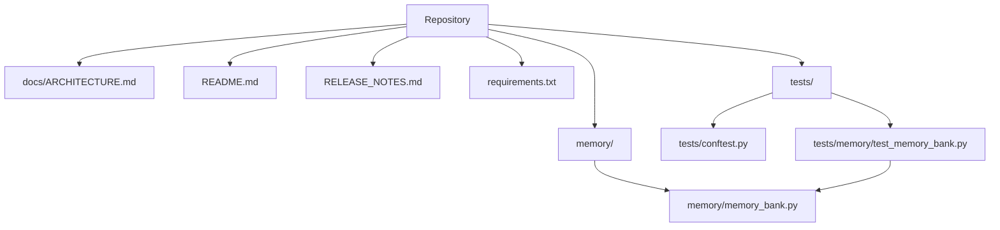

# Project Overview

## What is this project?

This repository is a focused memory-management component for an AI application, centered on the [`memory.memory_bank`](memory/memory_bank.py#L1) module and its [`HermesMemoryBank`](memory/memory_bank.py#L79) facade. From the available code, the project’s purpose is to connect an application to Vertex AI Agent Engine memories so that conversational context can be saved, queried, formatted, updated, and deleted over time. The public surface is intentionally narrow but practical: it exposes helpers for creating and initializing the memory backend, then provides higher-level async methods such as [`generate_memories`](memory/memory_bank.py#L105), [`ingest_events`](memory/memory_bank.py#L143), [`fetch_memories`](memory/memory_bank.py#L331), and [`format_for_prompt`](memory/memory_bank.py#L381).

The code strongly suggests a “memory as infrastructure” goal rather than a full agent framework. The memory layer is designed to degrade gracefully when configuration is missing: [`build_memory_bank`](memory/memory_bank.py#L411) returns `None` if `MEMORY_BANK_RESOURCE_NAME` is not configured, and [`retrieve_profiles`](memory/memory_bank.py#L315) / [`list_revisions`](memory/memory_bank.py#L369) explicitly return empty lists because those features are not supported in the current SDK version. The lower-level provisioning function [`create_memory_bank`](memory/memory_bank.py#L432) creates or reuses a lightweight Agent Engine resource dedicated to memory storage.

## Who is it for?

This project appears targeted at developers building AI assistants or agentic applications that need persistent user context across sessions. The most likely users are:

- backend engineers integrating long-term memory into an assistant
- platform engineers responsible for Vertex AI / Agent Engine deployment
- application developers who want a simple facade over memory creation, ingestion, retrieval, and cleanup
- test engineers validating memory behavior with mocked Vertex AI clients, as shown in [`tests/memory/test_memory_bank.py`](tests/memory/test_memory_bank.py#L1) and the fixtures in [`tests/conftest.py`](tests/conftest.py#L1)

Typical use cases include remembering user preferences, summarizing prior turns into durable facts, injecting relevant context into a system prompt, purging a user’s stored memories, and manually creating or correcting a memory entry.

> **Sources:** `memory/memory_bank.py` · L1–L470 · [`memory.memory_bank`](memory/memory_bank.py#L1) · [`HermesMemoryBank`](memory/memory_bank.py#L79) · [`build_memory_bank`](memory/memory_bank.py#L411) · [`create_memory_bank`](memory/memory_bank.py#L432)

## Key Features

The repository’s observable capabilities are concentrated in [`HermesMemoryBank`](memory/memory_bank.py#L79):

- Async memory generation from a user/agent exchange via [`generate_memories`](memory/memory_bank.py#L105)
- Batched event ingestion via [`ingest_events`](memory/memory_bank.py#L143), which normalizes event roles and delegates to the SDK
- Retrieval of relevant memories via [`fetch_memories`](memory/memory_bank.py#L331), including `top_k` control
- Prompt formatting via [`format_for_prompt`](memory/memory_bank.py#L381), which transforms fetched memories into a system-prompt snippet
- Direct CRUD-style operations:
  - [`create_memory`](memory/memory_bank.py#L250)
  - [`update_memory`](memory/memory_bank.py#L285)
  - [`delete_memory`](memory/memory_bank.py#L227)
  - [`purge_memories`](memory/memory_bank.py#L187)
- Lazy Vertex AI client initialization through [`_get_vertexai_client`](memory/memory_bank.py#L41) and [`HermesMemoryBank._ensure_client`](memory/memory_bank.py#L98)
- Configuration-driven construction with [`build_memory_bank`](memory/memory_bank.py#L411)
- One-time backend provisioning with [`create_memory_bank`](memory/memory_bank.py#L432)
- Compatibility shims for unsupported SDK features such as [`retrieve_profiles`](memory/memory_bank.py#L315) and [`list_revisions`](memory/memory_bank.py#L369)

The test suite in [`tests/memory/test_memory_bank.py`](tests/memory/test_memory_bank.py#L1) indicates these behaviors are well-covered: successful calls, error swallowing, lazy initialization, prompt formatting budgets, dry-run behavior, and SDK interaction details.

> **Sources:** `memory/memory_bank.py` · L41–L470 · [`_get_vertexai_client`](memory/memory_bank.py#L41) · [`HermesMemoryBank.generate_memories`](memory/memory_bank.py#L105) · [`HermesMemoryBank.ingest_events`](memory/memory_bank.py#L143) · [`HermesMemoryBank.fetch_memories`](memory/memory_bank.py#L331) · [`HermesMemoryBank.format_for_prompt`](memory/memory_bank.py#L381) · [`create_memory_bank`](memory/memory_bank.py#L432)

## Quick Start

The repository snapshot does not include explicit build or test commands in the analysis payload, and no `entry_points` were detected. What is observable is that the implementation lives in `memory/memory_bank.py`, and the tests are intended to be run with `pytest` based on imports in [`tests/memory/test_memory_bank.py`](tests/memory/test_memory_bank.py#L1).

A reasonable “fastest path” for a developer would therefore be:

```bash
pip install -r requirements.txt
pytest
```

If you are wiring the project into an application, the practical runtime entry points are the memory facade and its builder:

```python
from memory.memory_bank import build_memory_bank

bank = build_memory_bank()
if bank is not None:
    prompt_snippet = await bank.format_for_prompt(
        user_id="u123",
        query="VPN setup",
        max_tokens=300,
    )
```

For provisioning a backend resource explicitly, the top-level helper is [`create_memory_bank`](memory/memory_bank.py#L432). For application use, instantiate [`HermesMemoryBank`](memory/memory_bank.py#L79) with an Agent Engine resource name and call its async methods.

| Task | Relevant symbol |
|------|------------------|
| Initialize from configuration | [`build_memory_bank`](memory/memory_bank.py#L411) |
| Provision a new backend | [`create_memory_bank`](memory/memory_bank.py#L432) |
| Fetch prompt-ready context | [`HermesMemoryBank.format_for_prompt`](memory/memory_bank.py#L381) |
| Ingest conversation turns | [`HermesMemoryBank.ingest_events`](memory/memory_bank.py#L143) |

> **Sources:** `requirements.txt` · `memory/memory_bank.py` · [`build_memory_bank`](memory/memory_bank.py#L411) · [`create_memory_bank`](memory/memory_bank.py#L432) · [`HermesMemoryBank`](memory/memory_bank.py#L79)

## Project Structure

At the repository level, the codebase is small and centered on one implementation module plus test scaffolding and documentation.



The visible layout suggests a clean separation between implementation, test support, and tests. `tests/conftest.py` provides broad fixture and stub registration for the test environment, while `tests/memory/test_memory_bank.py` focuses specifically on the memory facade and provisioning helpers.

> **Sources:** `docs/ARCHITECTURE.md` · `README.md` · `RELEASE_NOTES.md` · `requirements.txt` · `memory/memory_bank.py` · `tests/conftest.py` · `tests/memory/test_memory_bank.py`

## How it Works (High Level)

At startup, application code can call [`build_memory_bank`](memory/memory_bank.py#L411) to construct a [`HermesMemoryBank`](memory/memory_bank.py#L79) only when `MEMORY_BANK_RESOURCE_NAME` is configured. The bank lazily creates its Vertex AI client through [`_ensure_client`](memory/memory_bank.py#L98) and [`_get_vertexai_client`](memory/memory_bank.py#L41), which keeps initialization deferred until the first real operation. Conversation turns can then be either distilled via [`generate_memories`](memory/memory_bank.py#L105) or streamed in batch form with [`ingest_events`](memory/memory_bank.py#L143). Later, [`fetch_memories`](memory/memory_bank.py#L331) retrieves relevant facts, and [`format_for_prompt`](memory/memory_bank.py#L381) packages them for injection into a system prompt, exactly as the docstring describes for the gateway integration. Administrative operations such as [`purge_memories`](memory/memory_bank.py#L187), [`delete_memory`](memory/memory_bank.py#L227), [`create_memory`](memory/memory_bank.py#L250), and [`update_memory`](memory/memory_bank.py#L285) provide lifecycle management for stored user memories.

The test suite validates that this flow is resilient: errors are swallowed in several non-critical methods, unsupported SDK features return empty lists, and prompt formatting respects token budgets. That makes the module suitable for production assistant pipelines where memory should enhance the experience without blocking the main conversation path.

> **Sources:** `memory/memory_bank.py` · L41–L470 · [`_get_vertexai_client`](memory/memory_bank.py#L41) · [`HermesMemoryBank`](memory/memory_bank.py#L79) · [`generate_memories`](memory/memory_bank.py#L105) · [`ingest_events`](memory/memory_bank.py#L143) · [`fetch_memories`](memory/memory_bank.py#L331) · [`format_for_prompt`](memory/memory_bank.py#L381) · [`build_memory_bank`](memory/memory_bank.py#L411)