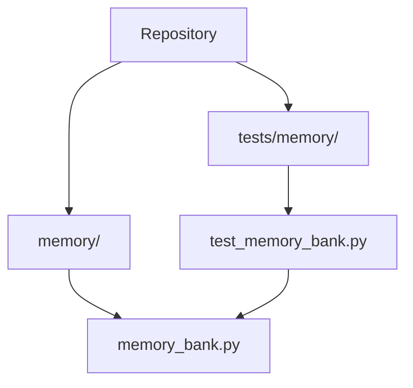

# Project Overview: Hermes Memory Bank

## What is this project?

This repository contains the memory-management layer for Hermes, centered on the [`memory.memory_bank`](memory/memory_bank.py#L1) module and its main facade class, [`HermesMemoryBank`](memory/memory_bank.py#L79). From the code that is present, the project’s purpose is to connect an application to Google Vertex AI Agent Engine memories, letting Hermes store, retrieve, update, and purge user-specific memory facts in a durable backing service.

The design is intentionally practical and production-oriented. The docstrings for [`HermesMemoryBank.generate_memories`](memory/memory_bank.py#L105), [`HermesMemoryBank.ingest_events`](memory/memory_bank.py#L143), and [`HermesMemoryBank.fetch_memories`](memory/memory_bank.py#L331) show three core workflows:
- turn-by-turn memory extraction,
- batched event ingestion,
- prompt-time memory retrieval.

There is also an environment/config-driven construction path via [`build_memory_bank`](memory/memory_bank.py#L411), plus a provisioning helper, [`create_memory_bank`](memory/memory_bank.py#L432), that creates or reuses a dedicated Agent Engine resource to act as the memory store. The companion test module [`tests.memory.test_memory_bank`](tests/memory/test_memory_bank.py#L1) validates these behaviors extensively.

> **Sources:** `memory/memory_bank.py` · L1–L498 · [`memory.memory_bank`](memory/memory_bank.py#L1), [`HermesMemoryBank`](memory/memory_bank.py#L79), [`build_memory_bank`](memory/memory_bank.py#L411), [`create_memory_bank`](memory/memory_bank.py#L432)

## Who is it for?

This project is for developers building an AI assistant or agent that needs persistent, per-user memory backed by Vertex AI. The API surface suggests three primary audiences:

- **Application developers** integrating memory into a chat or agent runtime, especially through [`HermesMemoryBank.format_for_prompt`](memory/memory_bank.py#L381) and [`HermesMemoryBank.fetch_memories`](memory/memory_bank.py#L331).
- **Platform engineers / DevOps engineers** responsible for provisioning and configuring the backing memory resource via [`create_memory_bank`](memory/memory_bank.py#L432) and environment settings consumed by [`_get_vertexai_client`](memory/memory_bank.py#L41) and [`build_memory_bank`](memory/memory_bank.py#L411).
- **Test and QA engineers** who need deterministic behavior around memory ingestion, retrieval, and failure handling, as shown by [`tests.memory.test_memory_bank`](tests/memory/test_memory_bank.py#L1).

Typical use cases include:
- injecting user context into an assistant’s system prompt at session start,
- writing memory facts after a conversation turn,
- explicitly creating or updating memory records when an agent decides something should be remembered,
- bulk purging a user’s memories for privacy or account deletion workflows.

> **Sources:** `memory/memory_bank.py` · L79–L498 · [`HermesMemoryBank`](memory/memory_bank.py#L79), [`HermesMemoryBank.format_for_prompt`](memory/memory_bank.py#L381), [`build_memory_bank`](memory/memory_bank.py#L411), [`create_memory_bank`](memory/memory_bank.py#L432); `tests/memory/test_memory_bank.py` · L1–L495

## Key Features

- **Lazy Vertex AI client initialization** via [`HermesMemoryBank._ensure_client`](memory/memory_bank.py#L98) and [`_get_vertexai_client`](memory/memory_bank.py#L41), reducing startup cost and allowing graceful fallback when configuration is missing.
- **Automatic memory extraction from dialogue turns** with [`HermesMemoryBank.generate_memories`](memory/memory_bank.py#L105), which is documented as a fire-and-forget callback after agent turns.
- **Batch event ingestion** through [`HermesMemoryBank.ingest_events`](memory/memory_bank.py#L143), which normalizes conversation events before calling the SDK’s ingest operation.
- **Memory retrieval for prompt injection** via [`HermesMemoryBank.fetch_memories`](memory/memory_bank.py#L331) and [`HermesMemoryBank.format_for_prompt`](memory/memory_bank.py#L381).
- **Direct CRUD operations on memories** using [`HermesMemoryBank.create_memory`](memory/memory_bank.py#L250), [`HermesMemoryBank.update_memory`](memory/memory_bank.py#L285), [`HermesMemoryBank.delete_memory`](memory/memory_bank.py#L227), and [`HermesMemoryBank.purge_memories`](memory/memory_bank.py#L187).
- **Compatibility shims for unsupported SDK features** such as [`HermesMemoryBank.retrieve_profiles`](memory/memory_bank.py#L315) and [`HermesMemoryBank.list_revisions`](memory/memory_bank.py#L369), which return empty lists while logging their unsupported status.
- **Resource provisioning helper** with [`create_memory_bank`](memory/memory_bank.py#L432), which can reuse an existing Agent Engine by display name or create a new one.
- **Comprehensive behavior coverage** in [`tests.memory.test_memory_bank`](tests/memory/test_memory_bank.py#L1), including success paths, error swallowing, lazy initialization, token budgeting, and display-name matching.

> **Sources:** `memory/memory_bank.py` · L41–L498 · [`_get_vertexai_client`](memory/memory_bank.py#L41), [`HermesMemoryBank`](memory/memory_bank.py#L79), [`HermesMemoryBank.generate_memories`](memory/memory_bank.py#L105), [`HermesMemoryBank.ingest_events`](memory/memory_bank.py#L143), [`HermesMemoryBank.fetch_memories`](memory/memory_bank.py#L331), [`HermesMemoryBank.format_for_prompt`](memory/memory_bank.py#L381), [`create_memory_bank`](memory/memory_bank.py#L432); `tests/memory/test_memory_bank.py` · L58–L495

## Quick Start

The analysis data does not include explicit build or test commands, so the fastest observable path is to use the module directly from Python and confirm behavior with the existing tests.

### 1. Configure the memory bank resource

`build_memory_bank()` reads configuration from the project settings via [`get_settings`](memory/memory_bank.py#L41) and returns `None` if no resource name is configured. In practice, this means you should ensure the memory bank resource name is available in settings before constructing the facade.

### 2. Instantiate or provision the bank

If the resource already exists, call [`build_memory_bank`](memory/memory_bank.py#L411) to obtain a [`HermesMemoryBank`](memory/memory_bank.py#L79). If you need to create the backing Agent Engine first, call [`create_memory_bank`](memory/memory_bank.py#L432) and persist the returned resource name in configuration.

### 3. Use the facade

A minimal usage pattern, based on the class docstring, looks like this:

```python
from memory.memory_bank import HermesMemoryBank

bank = HermesMemoryBank(resource_name="projects/my-project/locations/us-central1/reasoningEngines/1234567890")
await bank.generate_memories(
    user_id="u123",
    user_text="How do I reset my VPN?",
    agent_text="Go to Settings > VPN > Reset."
)
memories = await bank.fetch_memories(user_id="u123", query="VPN setup")
```

### 4. Run the tests

The repository includes a dedicated test suite at [`tests/memory/test_memory_bank.py`](tests/memory/test_memory_bank.py#L1). Because no test runner command is listed in the analysis data, a typical local verification step would be to run the project’s standard Python test runner against that file or directory.

> **Sources:** `memory/memory_bank.py` · L411–L498 · [`build_memory_bank`](memory/memory_bank.py#L411), [`create_memory_bank`](memory/memory_bank.py#L432), [`HermesMemoryBank`](memory/memory_bank.py#L79); `tests/memory/test_memory_bank.py` · L1–L495

## Project Structure



At the top level visible from the analysis, the repository is very small and focused: an implementation module in `memory/memory_bank.py` and its test companion in `tests/memory/test_memory_bank.py`. The tests import the implementation module directly, so the structure is intentionally straightforward and centered on one domain boundary: “memory” as a reusable service layer.

> **Sources:** `memory/memory_bank.py` · L1–L498; `tests/memory/test_memory_bank.py` · L1–L495

## How it Works (High Level)

The flow begins when application code constructs a [`HermesMemoryBank`](memory/memory_bank.py#L79) directly or asks [`build_memory_bank`](memory/memory_bank.py#L411) to create one from settings. The bank lazily creates its Vertex AI client through [`_ensure_client`](memory/memory_bank.py#L98), which delegates to [`_get_vertexai_client`](memory/memory_bank.py#L41) and handles SDK/version and configuration concerns. During a conversation, the application can either call [`generate_memories`](memory/memory_bank.py#L105) after each turn or stream structured events into [`ingest_events`](memory/memory_bank.py#L143), both of which offload blocking SDK work with `asyncio.to_thread`. At session start, [`fetch_memories`](memory/memory_bank.py#L331) and [`format_for_prompt`](memory/memory_bank.py#L381) retrieve relevant memories and turn them into prompt text, while maintenance operations like [`purge_memories`](memory/memory_bank.py#L187), [`delete_memory`](memory/memory_bank.py#L227), [`create_memory`](memory/memory_bank.py#L250), and [`update_memory`](memory/memory_bank.py#L285) manage the underlying records.

The tests in [`tests.memory.test_memory_bank`](tests/memory/test_memory_bank.py#L1) confirm this lifecycle end to end: they assert lazy initialization, error swallowing, token-budget behavior, event normalization, and provisioning logic around [`create_memory_bank`](memory/memory_bank.py#L432).

> **Sources:** `memory/memory_bank.py` · L41–L498 · [`_get_vertexai_client`](memory/memory_bank.py#L41), [`HermesMemoryBank`](memory/memory_bank.py#L79), [`HermesMemoryBank.generate_memories`](memory/memory_bank.py#L105), [`HermesMemoryBank.ingest_events`](memory/memory_bank.py#L143), [`HermesMemoryBank.fetch_memories`](memory/memory_bank.py#L331), [`HermesMemoryBank.format_for_prompt`](memory/memory_bank.py#L381), [`build_memory_bank`](memory/memory_bank.py#L411), [`create_memory_bank`](memory/memory_bank.py#L432); `tests/memory/test_memory_bank.py` · L58–L495