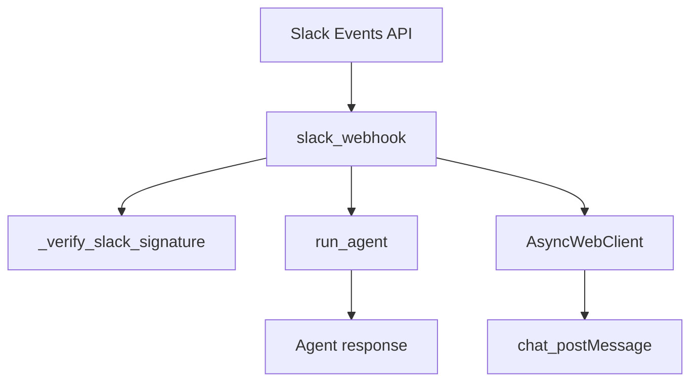
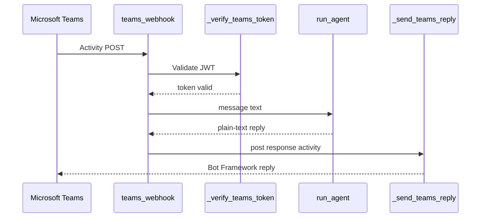
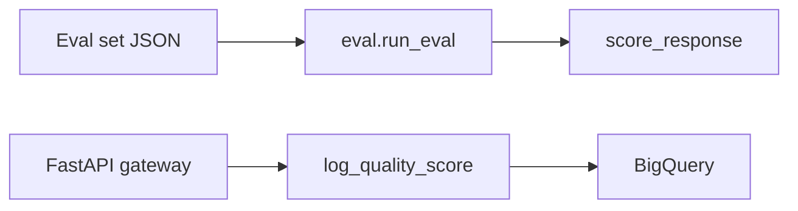

# External Integrations and Third-Party Services

This page documents the repository’s connections to external systems and third-party services, with emphasis on how those systems are wired into the application boundary. It intentionally avoids internal agent reasoning and instead focuses on ingress/egress paths, authentication, and operational backends.

The main integration surface is the FastAPI gateway in [`gateway/main.py`](gateway/main.py#L1), with platform-specific webhooks in [`connectors/slack.py`](connectors/slack.py#L1), [`connectors/teams.py`](connectors/teams.py#L1), and [`connectors/telegram.py`](connectors/telegram.py#L1). Google identity and Google Cloud services are handled by [`gateway/auth.py`](gateway/auth.py#L42), [`gateway/tasks.py`](gateway/tasks.py#L1), [`gateway/observability.py`](gateway/observability.py#L37), and the evaluation modules under [`eval/`](eval/__init__.py#L1).

## Integration Overview

The repository integrates with several external ecosystems:

- **Slack** via Events API webhooks and the Slack Web API in [`connectors.slack`](connectors/slack.py#L68)
- **Microsoft Teams** via Bot Framework Activity webhooks and reply posting in [`connectors.teams`](connectors/teams.py#L93)
- **Telegram** via Bot API webhook handling in [`connectors.telegram`](connectors/telegram.py#L61)
- **Google authentication** via Google ID token validation in [`gateway.auth.verify_google_token`](gateway/auth.py#L42)
- **Google Cloud evaluation/monitoring backends** including BigQuery and Cloud Trace in [`eval.online_monitor`](eval/online_monitor.py#L21) and [`gateway.observability`](gateway/observability.py#L37)
- **Cloud Scheduler / OIDC server-to-server trigger flow** via [`gateway.main.scheduler_trigger`](gateway/main.py#L430)

The cross-module dependency pattern is consistent: platform webhooks call the common bridge function [`connectors.runner.run_agent`](connectors/runner.py#L34), while gateway HTTP routes either validate Google-authenticated users or accept service-to-service webhook tokens before dispatching work.

### Integration Summary Table

| Integration | Purpose | Auth Mechanism | Primary Module(s) |
|---|---|---|---|
| Slack | Receive messages/events and post replies | Slack signing secret HMAC verification; Slack bot token for outbound replies | [`connectors.slack`](connectors/slack.py#L44), [`connectors.runner`](connectors/runner.py#L34) |
| Microsoft Teams | Receive Bot Framework Activities and send reply activities | Bot Framework JWT verification; access token for reply posting | [`connectors.teams`](connectors/teams.py#L66), [`connectors.runner`](connectors/runner.py#L34) |
| Telegram | Receive Telegram Updates and send replies via Bot API | Telegram secret token header for webhook validation; bot token for outbound API calls | [`connectors.telegram`](connectors/telegram.py#L61), [`connectors.runner`](connectors/runner.py#L34) |
| Google authentication | Protect gateway APIs for end users | Google ID token verification using OAuth2 / Google token introspection | [`gateway.auth.verify_google_token`](gateway/auth.py#L42), [`gateway.main`](gateway/main.py#L152) |
| BigQuery evaluation / monitoring | Offline scoring and online quality logging | Google Cloud credentials / project-scoped client auth | [`eval.metrics`](eval/metrics.py#L23), [`eval.online_monitor`](eval/online_monitor.py#L21), [`tools.bigquery_tool`](tools/bigquery_tool.py#L104) |
| Cloud Trace / observability | Distributed tracing for gateway requests and agent turns | Google Cloud Trace exporter via Application Default Credentials | [`gateway.observability`](gateway/observability.py#L37) |
| Cloud Scheduler | Trigger scheduled tasks in the gateway | OIDC token issued to the service account | [`gateway.main.scheduler_trigger`](gateway/main.py#L430), [`tools.scheduler_tool`](tools/scheduler_tool.py#L45) |

> **Sources:** `gateway/main.py` · L1–L489 · [`scheduler_trigger`](gateway/main.py#L430) · `connectors/slack.py` · L1–L153 · `connectors/teams.py` · L1–L185 · `connectors/telegram.py` · L1–L100 · `gateway/auth.py` · L42–L110 · `eval/online_monitor.py` · L21–L66 · `gateway/observability.py` · L37–L114

## Slack

Slack integration lives in [`connectors.slack`](connectors/slack.py#L1), which exposes [`slack_webhook(request)`](connectors/slack.py#L68). This handler is the HTTP ingress point for Slack Events API traffic. The implementation explicitly supports the `url_verification` challenge used during Slack app setup, and it handles message events such as direct messages and app mentions.

### Inbound flow

The webhook first validates the incoming request with [`_verify_slack_signature`](connectors/slack.py#L44), which uses HMAC-SHA256 request signing. This is the primary security boundary; the function checks Slack’s signature header against the request body and timestamp, rejecting stale or invalid requests. Once accepted, the webhook parses the event payload and routes text messages into [`connectors.runner.run_agent`](connectors/runner.py#L34), which is the shared platform-neutral execution bridge.

### Outbound replies

For responses, [`_get_slack_client`](connectors/slack.py#L40) creates a Slack `AsyncWebClient`, and the webhook uses `chat_postMessage` to send the final text back to the originating channel. The code also includes [`_split_text`](connectors/slack.py#L146) to chunk long responses, indicating that Slack message length constraints are handled by segmenting the output before posting.

### Operational notes

Slack integration is callback-driven and asynchronous. It does not appear to use a separate queueing layer; instead, the webhook creates a background task for the reply flow and sends the response directly once the agent output is ready. That makes the Slack connector relatively thin: authenticate, normalise the event, call [`run_agent`](connectors/runner.py#L34), then post the reply.

> **Sources:** `connectors/slack.py` · L40–L153 · [`_verify_slack_signature`](connectors/slack.py#L44) · [`slack_webhook`](connectors/slack.py#L68) · [`_split_text`](connectors/slack.py#L146) · `connectors/runner.py` · L34–L87 · [`run_agent`](connectors/runner.py#L34)

## Microsoft Teams

Microsoft Teams integration is implemented in [`connectors.teams`](connectors/teams.py#L1). The main ingress handler is [`teams_webhook(request)`](connectors/teams.py#L93), which accepts Bot Framework Activities from Teams and only processes `message` activity types.

### Authentication and request verification

Teams uses a more elaborate verification path than Slack. The helper [`_verify_teams_token`](connectors/teams.py#L66) validates the Bot Framework JWT, and [`_get_jwks`](connectors/teams.py#L50) retrieves signing keys used for token verification. This is the inbound trust boundary before any message is passed to the shared runner.

### Reply posting

After the agent generates a response, [`_send_teams_reply`](connectors/teams.py#L150) obtains a Bot Framework access token and posts a reply activity back to the conversation. The implementation uses `httpx` for HTTP calls, which suggests the connector talks directly to Microsoft’s Bot Framework HTTP endpoints rather than through an SDK abstraction.

### Notes on scope

The connector only handles conversational activity. Other activity types are acknowledged silently, which keeps the integration narrow and focused on human chat interactions. As with Slack, the Teams connector delegates all application-specific response generation to [`connectors.runner.run_agent`](connectors/runner.py#L34).

> **Sources:** `connectors/teams.py` · L50–L185 · [`_get_jwks`](connectors/teams.py#L50) · [`_verify_teams_token`](connectors/teams.py#L66) · [`teams_webhook`](connectors/teams.py#L93) · [`_send_teams_reply`](connectors/teams.py#L150) · `connectors/runner.py` · L34–L87

## Telegram

Telegram integration is implemented in [`connectors.telegram`](connectors/telegram.py#L1). The main handler, [`telegram_webhook(request, x_telegram_bot_api_secret_token)`](connectors/telegram.py#L61), receives Telegram `Update` objects and replies using the Bot API.

### Request validation

Telegram’s webhook security is based on a secret token header, exposed as the `x_telegram_bot_api_secret_token` parameter in the webhook signature. This differs from Slack’s HMAC signing and Teams’ JWT verification, but the design goal is the same: reject unauthorised webhook callers before any agent execution occurs.

### Message handling and reply delivery

The webhook only handles text message updates; other update kinds are ignored. Once a message is accepted, the connector calls [`connectors.runner.run_agent`](connectors/runner.py#L34) and then sends the response through [`_send_message`](connectors/telegram.py#L40), which posts to the Telegram Bot API. The connector also includes [`_split_text`](connectors/telegram.py#L50), indicating response chunking for Telegram’s message size constraints.

> **Sources:** `connectors/telegram.py` · L40–L100 · [`_send_message`](connectors/telegram.py#L40) · [`telegram_webhook`](connectors/telegram.py#L61) · [`_split_text`](connectors/telegram.py#L50) · `connectors/runner.py` · L34–L87

## Google Authentication

End-user access to the gateway is protected by [`gateway.auth.verify_google_token`](gateway/auth.py#L42). This function validates Google ID tokens and returns the decoded claims used by downstream FastAPI dependencies.

### What it protects

The authentication layer is used by the public gateway endpoints in [`gateway.main`](gateway/main.py#L152), including chat streaming and memory/task operations. The intent is to ensure that user-specific state like sessions, memories, and tasks is only accessible to the authenticated principal.

### How validation works

[`verify_google_token`](gateway/auth.py#L42) performs Google token validation and caches results for five minutes to avoid repeated round-trips to Google on every request. The docstring also notes a local-development bypass: when `DISABLE_AUTH=true`, token validation is skipped and a synthetic `"local-dev"` user is returned so the app can run without Google login.

This is a pragmatic deployment pattern: production uses real Google identity, while local development avoids any dependency on external login flows.

> **Sources:** `gateway/auth.py` · L42–L110 · [`verify_google_token`](gateway/auth.py#L42) · `gateway/main.py` · L152–L417

## Analytics and Evaluation Backends

The repository contains both **offline evaluation** and **online monitoring** paths, and both are backed by Google Cloud services.

### Offline evaluation

[`eval.metrics.score_response`](eval/metrics.py#L23) is explicitly described as “Fully offline.” It computes response quality locally from the response text and expected keywords, without external API calls. The CLI in [`eval.run_eval.main`](eval/run_eval.py#L25) loads an eval set, scores responses, and emits a summary. Although the scoring logic is offline, the workflow is still part of the analytics ecosystem because it produces structured evaluation output for deployment-time quality checks.

### Online monitoring

[`eval.online_monitor.log_quality_score`](eval/online_monitor.py#L21) writes a quality score row to BigQuery asynchronously. Its docstring states that it “fails silently,” which is a strong sign that monitoring is intentionally non-blocking and should not interfere with user requests. [`build_online_monitor`](eval/online_monitor.py#L58) returns configuration only when `GCP_PROJECT_ID` is set, so it gracefully degrades when GCP is unavailable.

### Evaluation in the gateway

The gateway imports [`governance.policy_engine`](governance/policy_engine.py#L1) and [`tools.model_armor`](tools/model_armor.py#L1) for safety checks, but those are policy/safety layers rather than evaluation backends. The analytics-specific external backends are the BigQuery logging path and the evaluation runner itself.

> **Sources:** `eval/metrics.py` · L23–L52 · [`score_response`](eval/metrics.py#L23) · `eval/run_eval.py` · L25–L78 · [`main`](eval/run_eval.py#L25) · `eval/online_monitor.py` · L21–L66 · [`log_quality_score`](eval/online_monitor.py#L21) · [`build_online_monitor`](eval/online_monitor.py#L58)

## Gateway Connectivity to External Services

The gateway acts as the integration hub, wiring together identity, cloud telemetry, scheduled jobs, and platform webhooks.

### Service-to-service scheduler trigger

[`gateway.main.scheduler_trigger`](gateway/main.py#L430) is a special webhook endpoint for Cloud Scheduler. Its docstring notes that Cloud Scheduler attaches an OIDC token issued for the Hermes service account, and [`_verify_scheduler_oidc_token`](gateway/main.py#L460) verifies that token matches the expected service account. This is a distinct trust path from human Google login: it is explicitly server-to-server.

### Tracing and observability

[`gateway.observability.setup_tracing`](gateway/observability.py#L37) initialises OpenTelemetry with the Google Cloud Trace exporter. It is designed to degrade silently when the necessary packages are absent, which means the application can still run locally without tracing installed. [`instrument_fastapi`](gateway/observability.py#L69) instruments the FastAPI app, and [`agent_span`](gateway/observability.py#L86) wraps each agent turn in a trace span.

### Persistence backends used by gateway features

The gateway task subsystem persists records to Firestore via [`gateway.tasks._get_firestore_client`](gateway/tasks.py#L58) and [`gateway.tasks._persist`](gateway/tasks.py#L96). The same module includes a GCS fallback reader [`load_task_from_gcs`](gateway/tasks.py#L116), showing that the runtime can recover task state from cloud storage after restarts.

> **Sources:** `gateway/main.py` · L430–L489 · [`scheduler_trigger`](gateway/main.py#L430) · [`_verify_scheduler_oidc_token`](gateway/main.py#L460) · `gateway/observability.py` · L37–L114 · [`setup_tracing`](gateway/observability.py#L37) · `gateway/tasks.py` · L58–L267 · [`_persist`](gateway/tasks.py#L96) · [`load_task_from_gcs`](gateway/tasks.py#L116)

## Deployment and Setup Hooks that Touch External Systems

The setup scripts reveal how the repository expects those external systems to be provisioned.

- [`setup_wizard.setup_rag`](setup_wizard.py#L320) provisions RAG corpora and writes the resulting resource names to the environment
- [`setup_wizard.setup_memory_bank`](setup_wizard.py#L433) creates or configures the Memory Bank resource used by [`memory.memory_bank.build_memory_bank`](memory/memory_bank.py#L413)
- [`scripts.setup_rag.create_corpus`](scripts/setup_rag.py#L29) creates RAG corpora directly
- [`scripts.demo.seed_bigquery.main`](scripts/demo/seed_bigquery.py#L291) seeds demo BigQuery datasets
- [`scripts.demo.seed_knowledge_base.main`](scripts/demo/seed_knowledge_base.py#L181) uploads documents and skills to corpora

These scripts are important because they demonstrate that the repository is not only consuming external services at runtime, but also provisioning and seeding them during deployment and demo setup.

> **Sources:** `setup_wizard.py` · L320–L454 · [`setup_rag`](setup_wizard.py#L320) · [`setup_memory_bank`](setup_wizard.py#L433) · `scripts/setup_rag.py` · L29–L59 · `scripts/demo/seed_bigquery.py` · L291–L311 · `scripts/demo/seed_knowledge_base.py` · L181–L223