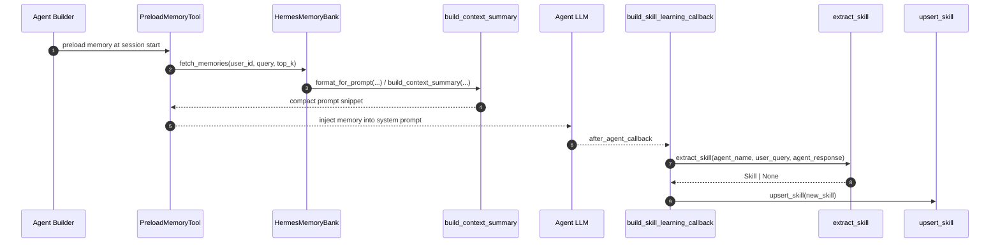
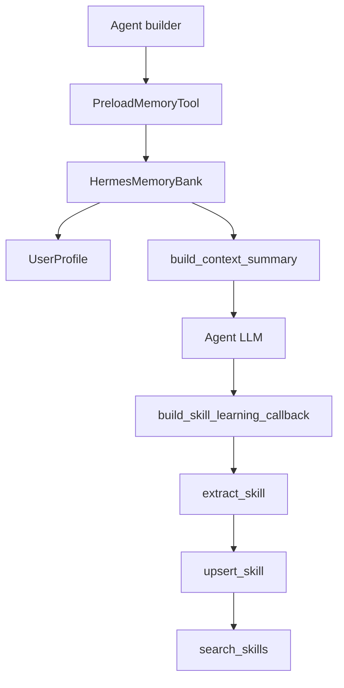

# Memory Subsystem Architecture

## Overview

The `memory` package is the repository’s long-term context layer: it captures user-specific facts, derives reusable skills from prior conversations, and prepares a compact prompt-sized context bundle for agents at run time. In this codebase, memory is not a single database abstraction; it is a coordinated subsystem spanning retrieval, persistence, prompt assembly, and background learning. The key visible entry points are [`build_memory_bank`](memory/memory_bank.py#L413), [`build_context_summary`](memory/context_budget.py#L37), [`retrieve_cross_corpus`](memory/cross_corpus.py#L64), [`build_skill_learning_callback`](memory/skill_learning.py#L25), and [`search_skills`](memory/skill_store.py#L36).

The subsystem supports two related but distinct memory domains:

1. **User memory / profile memory** — stable, user-scoped facts stored in Firestore and Vertex AI Memory Bank, exposed through [`HermesMemoryBank`](memory/memory_bank.py#L56) and [`UserProfile`](memory/user_profile.py#L31).
2. **Skill memory / knowledge memory** — reusable operational knowledge extracted from conversations, serialized as [`Skill`](memory/skill_models.py#L15), ingested into RAG corpora, and retrieved by [`search_skills`](memory/skill_store.py#L36) or [`retrieve_cross_corpus`](memory/cross_corpus.py#L64).

This design gives agents two ways to remember: durable personalization and reusable procedural knowledge. The agent-facing integration is explicit in the agent builders: [`build_analytics_agent`](agents/analytics.py#L37), [`build_developer_agent`](agents/developer.py#L54), [`build_hr_agent`](agents/hr.py#L42), and [`build_it_helpdesk_agent`](agents/it_helpdesk.py#L42) all import memory-related helpers such as [`PreloadMemoryTool`](agents/analytics.py#L37), [`build_skill_learning_callback`](memory/skill_learning.py#L25), and in some cases the memory bank façade.

> **Sources:** `memory/memory_bank.py` · L56–L458 · [`HermesMemoryBank`](memory/memory_bank.py#L56) · [`build_memory_bank`](memory/memory_bank.py#L413)  
> **Sources:** `memory/context_budget.py` · L37–L111 · [`build_context_summary`](memory/context_budget.py#L37)  
> **Sources:** `memory/skill_learning.py` · L25–L132 · [`build_skill_learning_callback`](memory/skill_learning.py#L25)  
> **Sources:** `memory/skill_store.py` · L36–L171 · [`search_skills`](memory/skill_store.py#L36) · [`upsert_skill`](memory/skill_store.py#L115)

## Memory Modules and Responsibilities

The table below summarises the visible memory-related modules and their roles based on the repository’s symbols and relationships.

| Module | Role in memory domain | Key symbols | Notes |
|---|---|---|---|
| `memory/memory_bank.py` | Facade over Vertex AI Memory Bank for user memories | [`HermesMemoryBank`](memory/memory_bank.py#L56), [`fetch_memories`](memory/memory_bank.py#L321), [`create_memory`](memory/memory_bank.py#L224), [`purge_memories`](memory/memory_bank.py#L166) | Handles create/read/update/delete, profile retrieval, prompt formatting, and fallback behavior |
| `memory/user_profile.py` | Firestore-backed stable user profile storage | [`UserProfile`](memory/user_profile.py#L31), [`get_or_create_profile`](memory/user_profile.py#L68), [`update_profile`](memory/user_profile.py#L88) | Profile data is intentionally resilient; it returns a minimal profile on failure |
| `memory/context_budget.py` | Prompt budget control for memory injection | [`build_context_summary`](memory/context_budget.py#L37), [`prioritise_memory`](memory/context_budget.py#L94) | Trims memory content to fit the available system prompt budget |
| `memory/cross_corpus.py` | Merge-and-deduplicate retrieval across multiple corpora | [`retrieve_cross_corpus`](memory/cross_corpus.py#L64), [`RetrievedContext`](memory/cross_corpus.py#L21) | Useful when memory is spread across knowledge and skills corpora |
| `memory/skill_models.py` | Schema for versioned, extracted skills | [`Skill`](memory/skill_models.py#L15), [`to_rag_text`](memory/skill_models.py#L34), [`to_metadata`](memory/skill_models.py#L48) | Defines the persisted shape for skills stored in RAG |
| `memory/skill_loader.py` | Imports skills from markdown files | [`load_skills_from_dir`](memory/skill_loader.py#L42), [`_parse_skill_file`](memory/skill_loader.py#L85) | Converts local docs into `Skill` objects |
| `memory/skill_store.py` | Read/write layer for skill corpora | [`search_skills`](memory/skill_store.py#L36), [`upsert_skill`](memory/skill_store.py#L115) | Handles retrieval, versioning, and upload |
| `memory/skill_extractor.py` | LLM-based skill extraction from conversations | [`extract_skill`](memory/skill_extractor.py#L72) | Builds a lightweight extractor agent and parses structured output |
| `memory/skill_learning.py` | Background callback that learns from agent turns | [`build_skill_learning_callback`](memory/skill_learning.py#L25), [`_learn_in_background`](memory/skill_learning.py#L100) | Connects agents to skill extraction and persistence |

> **Sources:** `memory/memory_bank.py` · L56–L458 · [`HermesMemoryBank`](memory/memory_bank.py#L56)  
> **Sources:** `memory/user_profile.py` · L31–L101 · [`UserProfile`](memory/user_profile.py#L31)  
> **Sources:** `memory/context_budget.py` · L37–L111 · [`build_context_summary`](memory/context_budget.py#L37)  
> **Sources:** `memory/cross_corpus.py` · L21–L94 · [`retrieve_cross_corpus`](memory/cross_corpus.py#L64)  
> **Sources:** `memory/skill_models.py` · L15–L61 · [`Skill`](memory/skill_models.py#L15)  
> **Sources:** `memory/skill_loader.py` · L42–L154 · [`load_skills_from_dir`](memory/skill_loader.py#L42)  
> **Sources:** `memory/skill_store.py` · L36–L171 · [`search_skills`](memory/skill_store.py#L36)  
> **Sources:** `memory/skill_extractor.py` · L50–L118 · [`extract_skill`](memory/skill_extractor.py#L72)  
> **Sources:** `memory/skill_learning.py` · L25–L132 · [`build_skill_learning_callback`](memory/skill_learning.py#L25)

## Integration with Agents

Memory is wired into agent construction rather than being bolted on at the gateway. The symbols show three important integration points:

- **Preload-time context injection** via `PreloadMemoryTool` in agent builders such as [`build_analytics_agent`](agents/analytics.py#L37), [`build_developer_agent`](agents/developer.py#L54), [`build_hr_agent`](agents/hr.py#L42), and [`build_it_helpdesk_agent`](agents/it_helpdesk.py#L42).
- **Post-turn learning** via [`build_skill_learning_callback`](memory/skill_learning.py#L25), which is imported by those same agents and run after turns.
- **Direct memory bank access** via [`HermesMemoryBank.format_for_prompt`](memory/memory_bank.py#L383) and [`HermesMemoryBank.fetch_memories`](memory/memory_bank.py#L321), which prepare the user context that gets injected into the system prompt.

The relationship data confirms this coupling. For example, `agents.analytics` imports `memory.skill_learning` and `google.adk.tools.preload_memory_tool`, then `build_analytics_agent` calls both [`build_skill_learning_callback`](memory/skill_learning.py#L25) and `PreloadMemoryTool`. The same pattern appears in the HR, IT helpdesk, and developer agents. This means memory is part of the agent lifecycle: it is loaded before inference and updated after the response.

At runtime, the most observable sequence is:

1. The agent session starts.
2. A preload tool asks the memory layer for relevant context.
3. The system prompt is built under token budget constraints.
4. The agent generates a response.
5. The after-turn callback extracts new reusable knowledge.
6. The extracted skill is written back to the skills corpus.

> **Sources:** `agents/analytics.py` · L37–L53 · [`build_analytics_agent`](agents/analytics.py#L37)  
> **Sources:** `agents/developer.py` · L54–L79 · [`build_developer_agent`](agents/developer.py#L54)  
> **Sources:** `agents/hr.py` · L42–L70 · [`build_hr_agent`](agents/hr.py#L42)  
> **Sources:** `agents/it_helpdesk.py` · L42–L71 · [`build_it_helpdesk_agent`](agents/it_helpdesk.py#L42)  
> **Sources:** `memory/memory_bank.py` · L321–L408 · [`fetch_memories`](memory/memory_bank.py#L321) · [`format_for_prompt`](memory/memory_bank.py#L383)  
> **Sources:** `memory/skill_learning.py` · L25–L117 · [`build_skill_learning_callback`](memory/skill_learning.py#L25) · [`_learn_in_background`](memory/skill_learning.py#L100)  
> **Sources:** `memory/skill_extractor.py` · L72–L118 · [`extract_skill`](memory/skill_extractor.py#L72)  
> **Sources:** `memory/skill_store.py` · L115–L140 · [`upsert_skill`](memory/skill_store.py#L115)

## Persistence and Retrieval Responsibilities

The memory layer clearly separates persistence from retrieval, but keeps both behind thin facades.

### Persistent user memory

[`HermesMemoryBank`](memory/memory_bank.py#L56) is the primary persistence façade. Its methods show the supported operations:

- [`generate_memories`](memory/memory_bank.py#L80) and [`ingest_events`](memory/memory_bank.py#L119) write durable memories into Vertex AI Memory Bank.
- [`create_memory`](memory/memory_bank.py#L224) supports an explicit “memory-as-a-tool” pattern.
- [`update_memory`](memory/memory_bank.py#L258) and [`delete_memory`](memory/memory_bank.py#L201) allow correction and removal.
- [`purge_memories`](memory/memory_bank.py#L166) bulk-deletes a user’s memories.
- [`list_revisions`](memory/memory_bank.py#L360) exposes revision history for debugging.
- [`retrieve_profiles`](memory/memory_bank.py#L288) returns structured profile views.
- [`fetch_memories`](memory/memory_bank.py#L321) retrieves relevant memories for prompt injection.
- [`format_for_prompt`](memory/memory_bank.py#L383) converts them into prompt-ready text.

The implementation also degrades gracefully. [`build_memory_bank`](memory/memory_bank.py#L413) returns `None` when `MEMORY_BANK_RESOURCE_NAME` is not configured, which means the rest of the system can continue without long-term memory.

### Structured user profile storage

[`UserProfile`](memory/user_profile.py#L31) and its helpers [`get_or_create_profile`](memory/user_profile.py#L68) and [`update_profile`](memory/user_profile.py#L88) handle stable facts such as user attributes. These are backed by Firestore and are deliberately resilient: `get_or_create_profile` never raises and returns a minimal profile on any error.

### Skill retrieval and versioning

Skill memory has its own path:

- [`Skill`](memory/skill_models.py#L15) defines the versioned object model.
- [`search_skills`](memory/skill_store.py#L36) queries the skills corpus.
- [`upsert_skill`](memory/skill_store.py#L115) deduplicates and versions skills, archiving near-duplicates first.
- [`load_skills_from_dir`](memory/skill_loader.py#L42) seeds skills from markdown docs.
- [`retrieve_cross_corpus`](memory/cross_corpus.py#L64) merges results across multiple corpora and deduplicates by text.

A key architectural point is that retrieval is designed to fit the context window. [`build_context_summary`](memory/context_budget.py#L37) and [`prioritise_memory`](memory/context_budget.py#L94) explicitly rank and trim memory items to a token budget before prompt injection.

> **Sources:** `memory/memory_bank.py` · L80–L408 · [`HermesMemoryBank`](memory/memory_bank.py#L56)  
> **Sources:** `memory/user_profile.py` · L31–L101 · [`UserProfile`](memory/user_profile.py#L31)  
> **Sources:** `memory/skill_models.py` · L15–L61 · [`Skill`](memory/skill_models.py#L15)  
> **Sources:** `memory/skill_store.py` · L36–L171 · [`search_skills`](memory/skill_store.py#L36) · [`upsert_skill`](memory/skill_store.py#L115)  
> **Sources:** `memory/skill_loader.py` · L42–L154 · [`load_skills_from_dir`](memory/skill_loader.py#L42)  
> **Sources:** `memory/cross_corpus.py` · L21–L94 · [`retrieve_cross_corpus`](memory/cross_corpus.py#L64)  
> **Sources:** `memory/context_budget.py` · L37–L111 · [`build_context_summary`](memory/context_budget.py#L37)

## Cross-Module Dependency Table

The following table focuses on memory-domain modules and their visible dependency relationships from the analysis data.

| Module | Imports From | Called By | Calls Into | Inherits From |
|--------|-------------|-----------|------------|---------------|
| `memory.memory_bank` | `vertexai.preview`, `config` | `gateway.main`, `memory.skill_learning`, `setup_wizard` | `MemoryBank` SDK, `asyncio.to_thread` | — |
| `memory.user_profile` | `firebase/firestore` via lazy helper, `config` | `memory.context_budget`, `gateway.main` | Firestore client methods | — |
| `memory.context_budget` | `memory.skill_models`, `memory.user_profile` | agent prompt assembly paths | `UserProfile.to_prompt_summary` | — |
| `memory.cross_corpus` | `vertexai`, `asyncio`, `typing` | `memory.skill_store` | `retrieval_query`, deduplication helpers | — |
| `memory.skill_models` | `pydantic`, `datetime`, `json` | `memory.skill_loader`, `memory.skill_store`, `memory.skill_extractor` | JSON serialization/deserialization | `BaseModel` |
| `memory.skill_loader` | `yaml`, `re`, `pathlib`, `memory.skill_models` | `scripts/demo/seed_knowledge_base.py` | `Skill` construction helpers | — |
| `memory.skill_store` | `vertexai.preview`, `config`, `memory.skill_models` | `memory.skill_learning`, `scripts/demo/seed_knowledge_base.py` | RAG corpus retrieval/upload APIs | — |
| `memory.skill_extractor` | `google.adk.agents`, `google.adk.runners`, `models.provider`, `memory.skill_models` | `memory.skill_learning` | `LlmAgent`, `InMemoryRunner`, JSON parsing | — |
| `memory.skill_learning` | `memory.memory_bank`, `memory.skill_extractor`, `memory.skill_store` | agent builders (`agents.*`) | `extract_skill`, `upsert_skill`, `build_memory_bank` | — |

> **Sources:** `memory/memory_bank.py` · L56–L458 · [`HermesMemoryBank`](memory/memory_bank.py#L56)  
> **Sources:** `memory/user_profile.py` · L31–L101 · [`get_or_create_profile`](memory/user_profile.py#L68)  
> **Sources:** `memory/context_budget.py` · L37–L111 · [`build_context_summary`](memory/context_budget.py#L37)  
> **Sources:** `memory/cross_corpus.py` · L21–L94 · [`retrieve_cross_corpus`](memory/cross_corpus.py#L64)  
> **Sources:** `memory/skill_models.py` · L15–L61 · [`Skill`](memory/skill_models.py#L15)  
> **Sources:** `memory/skill_loader.py` · L42–L154 · [`load_skills_from_dir`](memory/skill_loader.py#L42)  
> **Sources:** `memory/skill_store.py` · L36–L171 · [`search_skills`](memory/skill_store.py#L36)  
> **Sources:** `memory/skill_extractor.py` · L72–L118 · [`extract_skill`](memory/skill_extractor.py#L72)  
> **Sources:** `memory/skill_learning.py` · L25–L132 · [`build_skill_learning_callback`](memory/skill_learning.py#L25)

## Memory Access During an Agent Run

The memory path during a typical agent turn is intentionally lightweight and asynchronous. The main architectural pattern is: fetch relevant historical context before inference, then learn from the response after inference.

This diagram captures the key observed responsibilities:

- **Prompt-time retrieval**: [`PreloadMemoryTool`](agents/analytics.py#L37) and [`HermesMemoryBank.fetch_memories`](memory/memory_bank.py#L321) pull in user context.
- **Budgeting**: [`build_context_summary`](memory/context_budget.py#L37) compresses profile and skill context into a bounded prompt snippet.
- **Post-response learning**: [`build_skill_learning_callback`](memory/skill_learning.py#L25) extracts a new [`Skill`](memory/skill_models.py#L15) and persists it through [`upsert_skill`](memory/skill_store.py#L115).
- **Reuse on subsequent turns**: [`search_skills`](memory/skill_store.py#L36) makes previously learned skills discoverable again.

> **Sources:** `agents/analytics.py` · L37–L53 · [`build_analytics_agent`](agents/analytics.py#L37)  
> **Sources:** `memory/memory_bank.py` · L321–L408 · [`fetch_memories`](memory/memory_bank.py#L321) · [`format_for_prompt`](memory/memory_bank.py#L383)  
> **Sources:** `memory/user_profile.py` · L31–L101 · [`UserProfile`](memory/user_profile.py#L31)  
> **Sources:** `memory/context_budget.py` · L37–L111 · [`build_context_summary`](memory/context_budget.py#L37)  
> **Sources:** `memory/skill_learning.py` · L25–L117 · [`build_skill_learning_callback`](memory/skill_learning.py#L25)  
> **Sources:** `memory/skill_extractor.py` · L72–L118 · [`extract_skill`](memory/skill_extractor.py#L72)  
> **Sources:** `memory/skill_store.py` · L36–L140 · [`search_skills`](memory/skill_store.py#L36) · [`upsert_skill`](memory/skill_store.py#L115)

## Design Observations and Limitations

A few important properties are visible in the analysis data:

- The memory layer is **graceful under partial configuration**. [`build_memory_bank`](memory/memory_bank.py#L413) can return `None`, and several operations in [`HermesMemoryBank`](memory/memory_bank.py#L56) catch exceptions and degrade safely.
- The subsystem is **multi-store by design**. Firestore appears in profile and task persistence, Vertex AI Memory Bank handles user memories, and RAG corpora handle skills. This split keeps domains distinct but requires careful orchestration.
- Retrieval is **prompt-aware** rather than exhaustive. [`build_context_summary`](memory/context_budget.py#L37) and [`prioritise_memory`](memory/context_budget.py#L94) show that only a compact, ranked subset is intended to reach the LLM.
- The available analysis does not expose the exact prompt templates or corpus schemas beyond the symbols shown here, so the documentation should treat those details as implementation-specific. What is clearly observable is the presence of facades, callbacks, and helper functions that connect the memory subsystem to agents and retrieval backends.

> **Sources:** `memory/memory_bank.py` · L56–L458 · [`HermesMemoryBank`](memory/memory_bank.py#L56)  
> **Sources:** `memory/context_budget.py` · L37–L111 · [`prioritise_memory`](memory/context_budget.py#L94)  
> **Sources:** `memory/skill_store.py` · L115–L171 · [`upsert_skill`](memory/skill_store.py#L115)