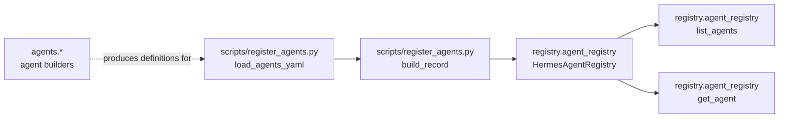

# Registry Package Overview

## What the registry package is for

The `registry` package provides a discoverable source of agent definitions and lookup functionality, centered on [`HermesAgentRegistry`](registry/agent_registry.py#L23) and the lightweight [`AgentRecord`](registry/agent_registry.py#L14). In this codebase, the registry is not a generic configuration system; it is specifically an abstraction for registering agent metadata, listing registered agents, and resolving a single agent by name. The public builder [`build_registry`](registry/agent_registry.py#L84) constructs the registry facade and degrades gracefully when the underlying Vertex AI registry integration is unavailable.

At a high level, the package exists so that agents can be published once and later discovered by setup or orchestration scripts. The concrete consumption point visible in the repository is [`scripts/register_agents.py`](scripts/register_agents.py#L1), which loads agent definitions from YAML, converts each raw definition into a registry record via [`build_record`](scripts/register_agents.py#L32), and then uses registry-style registration semantics to persist them. This gives the repository a single “source of truth” for agent discovery rather than hard-coding agent lists in multiple places.

The registry package should therefore be understood as an adapter around discoverable agent metadata, not as the place where agents are built. The build logic lives in modules such as [`agents.loader`](agents/loader.py#L1), [`agents.orchestrator`](agents/orchestrator.py#L1), and the domain-specific builders like [`build_analytics_agent`](agents/analytics.py#L37) or [`build_task_agent`](agents/task_agent.py#L160). The registry’s job is to expose those definitions so other parts of the system can find them later.

> **Sources:** `registry/agent_registry.py` · L14–L90 · [`AgentRecord`](registry/agent_registry.py#L14) · [`HermesAgentRegistry`](registry/agent_registry.py#L23) · [`build_registry`](registry/agent_registry.py#L84)

## What gets registered and how it is consumed

The analysis data shows the registry package centred on agent records rather than tool definitions or deployment state. The registered unit is [`AgentRecord`](registry/agent_registry.py#L14), which is consumed by [`HermesAgentRegistry.register_agent`](registry/agent_registry.py#L64) and enumerated via [`HermesAgentRegistry.list_agents`](registry/agent_registry.py#L70). A single item can be resolved using [`HermesAgentRegistry.get_agent`](registry/agent_registry.py#L75), which returns `None` when a name is not present.

From the surrounding code, the most likely producer of these records is [`scripts/register_agents.py`](scripts/register_agents.py#L1), whose [`run`](scripts/register_agents.py#L43) function reads agent definitions from YAML and emits records using [`build_record`](scripts/register_agents.py#L32). The YAML loading itself is implemented in [`load_agents_yaml`](scripts/register_agents.py#L23), which means the script is designed to take declarative agent definitions and feed them into the registry. This is the key discoverability path: YAML → record construction → registry registration → later lookup.

The registry entries are then consumed by setup or bootstrap flows that need to publish the set of available agents. The repository’s other builder modules do not directly query the registry in the provided evidence, so it is safer to describe consumption as “setup scripts register definitions for later lookup” rather than claiming a specific runtime lookup path inside the gateway. What is clearly observable is that the registry exposes `register`, `list`, and `get` operations, which are exactly the primitives expected by a consumer that needs to seed or discover agent metadata.

### Registry-related symbols

| Symbol | Kind | File | Purpose |
|---|---|---:|---|
| [`AgentRecord`](registry/agent_registry.py#L14) | class | `registry/agent_registry.py` | Container for a single registered agent definition |
| [`HermesAgentRegistry`](registry/agent_registry.py#L23) | class | `registry/agent_registry.py` | Registry facade with Vertex AI-backed lookup and registration |
| [`HermesAgentRegistry.__init__`](registry/agent_registry.py#L26) | method | `registry/agent_registry.py` | Initializes the registry wrapper |
| [`HermesAgentRegistry._vertex_register`](registry/agent_registry.py#L34) | method | `registry/agent_registry.py` | Low-level registration call to Vertex AI |
| [`HermesAgentRegistry._vertex_list`](registry/agent_registry.py#L49) | method | `registry/agent_registry.py` | Low-level list call to Vertex AI |
| [`HermesAgentRegistry.register_agent`](registry/agent_registry.py#L64) | method | `registry/agent_registry.py` | Registers a single agent record |
| [`HermesAgentRegistry.list_agents`](registry/agent_registry.py#L70) | method | `registry/agent_registry.py#L70` | Returns all registered agents |
| [`HermesAgentRegistry.get_agent`](registry/agent_registry.py#L75) | method | `registry/agent_registry.py#L75` | Looks up one agent by name |
| [`build_registry`](registry/agent_registry.py#L84) | function | `registry/agent_registry.py` | Builds the registry facade with graceful fallback |
| [`scripts/register_agents.py`](scripts/register_agents.py#L1) | module | `scripts/register_agents.py` | Script entry point for loading and registering agent definitions |
| [`load_agents_yaml`](scripts/register_agents.py#L23) | function | `scripts/register_agents.py` | Reads YAML agent definitions |
| [`build_record`](scripts/register_agents.py#L32) | function | `scripts/register_agents.py` | Converts raw YAML data to a registry record |
| [`run`](scripts/register_agents.py#L43) | function | `scripts/register_agents.py` | Drives the registration workflow |
| [`main`](scripts/register_agents.py#L69) | function | `scripts/register_agents.py` | CLI entry point |

> **Sources:** `registry/agent_registry.py` · L14–L90 · `scripts/register_agents.py` · L23–L82 · [`AgentRecord`](registry/agent_registry.py#L14) · [`HermesAgentRegistry`](registry/agent_registry.py#L23) · [`build_registry`](registry/agent_registry.py#L84) · [`load_agents_yaml`](scripts/register_agents.py#L23) · [`build_record`](scripts/register_agents.py#L32) · [`run`](scripts/register_agents.py#L43)

## How registry entries flow through setup and agent tooling

The clearest relationship in the static analysis is the one between the registration script and the registry facade. [`scripts/register_agents.py`](scripts/register_agents.py#L1) is the primary setup-side consumer: it imports the YAML loader, transforms each raw entry into a record, and then performs registration. The builder-side modules in `agents/` are adjacent to this process because they define the actual agent graphs that are ultimately published, but they are not the registry itself. For example, [`build_agent`](agents/__init__.py#L11) and [`build_orchestrator`](agents/orchestrator.py#L34) assemble runtime agents, while `scripts/register_agents.py` is concerned with making those agents discoverable.

This separation matters. The registry package holds discoverable definitions and lookup functionality; the agent builders hold executable behavior. A setup script can therefore register an agent definition without needing to execute the agent graph. That design is reinforced by the `HermesAgentRegistry` API, which exposes only register/list/get operations rather than any execution primitives.

A simplified interpretation of the workflow is:

1. YAML definitions are loaded by [`load_agents_yaml`](scripts/register_agents.py#L23).
2. Raw data is converted into a structured registry item via [`build_record`](scripts/register_agents.py#L32).
3. The record is persisted through [`HermesAgentRegistry.register_agent`](registry/agent_registry.py#L64).
4. Later, tooling can enumerate or resolve the record using [`HermesAgentRegistry.list_agents`](registry/agent_registry.py#L70) or [`HermesAgentRegistry.get_agent`](registry/agent_registry.py#L75).

Because the analysis does not show a direct call from runtime agents back into the registry package, it would be inaccurate to claim the gateway or any specific agent module performs registry lookups during chat handling. What is visible is the setup-time publication path.

> **Sources:** `scripts/register_agents.py` · L23–L82 · `registry/agent_registry.py` · L14–L90 · `agents/__init__.py` · L11–L19 · `agents/orchestrator.py` · L34–L44

## Observed module relationships

The cross-module evidence is relatively small and focused. `registry.agent_registry` is standalone in the provided relationship set: the analysis does not show imports from `agents.*` into the registry module itself, nor does it show the registry directly calling back into builder modules. That suggests a clean separation between registry infrastructure and agent construction.

The adjacent consumption pattern is outside the registry package itself, in `scripts/register_agents.py`, which likely bridges source definitions into registry entries. Since the static analysis does not provide detailed relationships for that script beyond its symbols, the best-supported statement is that it acts as the public registration entry point. The script is therefore the observable “consumer” of the registry package in this repository snapshot.

| Module | Imports From | Called By | Calls Into | Inherits From |
|---|---|---|---|---|
| `registry.agent_registry` | not shown in evidence | `scripts/register_agents.py` | Vertex AI registry operations via internal helpers | not shown |
| `scripts/register_agents.py` | not shown in evidence | setup/manual execution | `registry.agent_registry` via registration flow | not shown |
| `agents.__init__` and `agents.*` | `config`, `models.provider`, `tools.*`, memory helpers | runtime setup/builders | agent construction APIs, not registry APIs | not shown |

Because the registry package is intentionally narrow, there is no evidence here of deep coupling or circular dependencies. The observed shape is “producer script → registry facade → lookup/list operations,” with agents acting as the definition source.

> **Sources:** `registry/agent_registry.py` · L14–L90 · `scripts/register_agents.py` · L1–L82 · `agents/__init__.py` · L1–L19 · `agents/orchestrator.py` · L1–L44