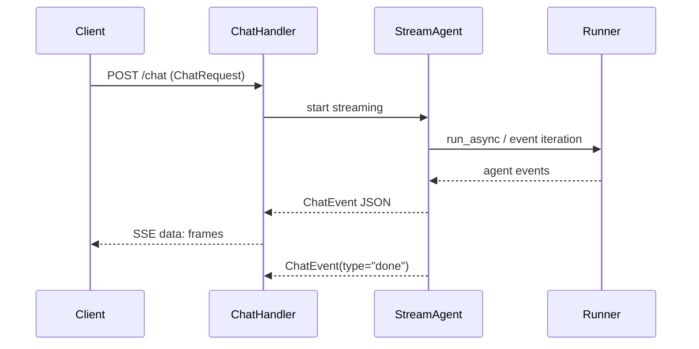

# Gateway and Webhook Network API Reference

This page documents the externally exposed HTTP interfaces implemented by the gateway and connector modules, with emphasis on request/response contracts and streaming behavior. It intentionally stays at the network boundary: it covers the FastAPI endpoints in [`gateway.main`](gateway/main.py#L1), the connector webhook handlers in [`connectors.slack`](connectors/slack.py#L1), [`connectors.teams`](connectors/teams.py#L1), and [`connectors.telegram`](connectors/telegram.py#L1), and the request/response models that shape those interfaces.

## Overview

The gateway exposes a small set of authenticated JSON endpoints for chat streaming, session and memory management, task submission, and scheduler-triggered task execution. The connector modules expose webhook endpoints that receive platform-specific events from Slack, Microsoft Teams, and Telegram and then forward the message content into the agent runner via [`run_agent`](connectors/runner.py#L34). The gateway also supports Server-Sent Events (SSE) streaming through [`chat`](gateway/main.py#L152-L200), which emits [`ChatEvent`](gateway/main.py#L141-L144) objects serialized as SSE `data:` frames.

The main endpoint surface is implemented in [`gateway.main`](gateway/main.py#L1), which defines the request models [`ChatRequest`](gateway/main.py#L136-L138), [`CreateMemoryRequest`](gateway/main.py#L309-L310), [`TaskRequest`](gateway/main.py#L338-L340), and [`SchedulerTriggerRequest`](gateway/main.py#L423-L426). Security is split between Google ID token verification for user-facing endpoints via [`verify_google_token`](gateway/auth.py#L42-L110) and connector-specific request verification for Slack, Teams, and Telegram webhooks.

> **Sources:** `gateway/main.py` · L1–L489 · [`ChatRequest`](gateway/main.py#L136-L138) · [`ChatEvent`](gateway/main.py#L141-L144) · [`chat`](gateway/main.py#L152-L200) · [`SchedulerTriggerRequest`](gateway/main.py#L423-L426) · `connectors/slack.py` · L1–L143 · [`slack_webhook`](connectors/slack.py#L68-L143) · `connectors/teams.py` · L1–L185 · [`teams_webhook`](connectors/teams.py#L93-L147) · `connectors/telegram.py` · L1–L100 · [`telegram_webhook`](connectors/telegram.py#L61-L100)

## Endpoint Catalog

The table below lists the network interfaces visible in the analysis data. Where the exact route decorator is not shown in the symbol metadata, the path is inferred only from in-code docstrings and surrounding naming patterns when explicitly stated there; otherwise the path is described conservatively.

| Method | Path | Auth | Payload | Response shape |
|---|---|---|---|---|
| `POST` | `/chat` | Google ID token via [`verify_google_token`](gateway/auth.py#L42-L110) | [`ChatRequest`](gateway/main.py#L136-L138): `message`, optional `session_id`, optional `agent_name` | SSE stream of [`ChatEvent`](gateway/main.py#L141-L144) frames; final event has `type="done"` |
| `GET` | `/sessions` | Google ID token | Query parameter `user_id` | JSON list of sessions for the authenticated user |
| `DELETE` | `/memories/{user_id}` | Google ID token | Path `user_id` | JSON result indicating purge outcome |
| `GET` | `/memories/{user_id}` | Google ID token | Path `user_id`, optional query `query`, optional `top_k` | JSON list of memory entries or profiles |
| `POST` | `/memories/{user_id}` | Google ID token | [`CreateMemoryRequest`](gateway/main.py#L309-L310): `fact` | JSON confirmation / created-memory response |
| `POST` | `/tasks` | Google ID token | [`TaskRequest`](gateway/main.py#L338-L340): task description/context fields | JSON task record with `task_id` and `status="pending"` |
| `GET` | `/tasks/{task_id}` | Google ID token | Path `task_id` | JSON task record; includes `status`, `progress`, and terminal `result` or `error` fields |
| `DELETE` | `/tasks/{task_id}` | Google ID token | Path `task_id` | JSON cancellation acknowledgement or updated task record |
| `GET` | `/tasks` | Google ID token | None | JSON list of authenticated user tasks |
| `POST` | `/scheduler/trigger` | OIDC token issued for the configured service account | [`SchedulerTriggerRequest`](gateway/main.py#L423-L426) | JSON task submission result |
| `POST` | Slack webhook path configured in deployment | Slack signature verification (`X-Slack-Signature`, `X-Slack-Request-Timestamp`) | Slack Events API envelope | JSON acknowledgment; may also return challenge text during URL verification |
| `POST` | Teams webhook path configured in deployment | Bot Framework JWT verification (`Authorization: Bearer ...`) | Microsoft Teams Activity JSON | JSON acknowledgment, with message replies sent asynchronously |
| `POST` | Telegram webhook path configured in deployment | Telegram secret token header (`X-Telegram-Bot-Api-Secret-Token`) | Telegram `Update` JSON | JSON acknowledgment |

A few rows deserve special attention:

- The `/chat` endpoint is explicitly documented as a streaming SSE interface in [`chat`](gateway/main.py#L152-L200).
- The task-related endpoints are backed by the task store functions in [`gateway.tasks`](gateway/tasks.py#L1-L267), but this page keeps the focus on the HTTP boundary rather than internal persistence mechanics.
- The webhook paths are not shown as literal route constants in the symbol data, but each handler is clearly described as a webhook receiver and includes platform-specific verification logic.

> **Sources:** `gateway/main.py` · L152–L457 · [`chat`](gateway/main.py#L152-L200) · [`list_sessions`](gateway/main.py#L247-L264) · [`clear_memories`](gateway/main.py#L268-L283) · [`list_memories`](gateway/main.py#L287-L306) · [`create_memory`](gateway/main.py#L314-L332) · [`submit_task`](gateway/main.py#L345-L364) · [`get_task`](gateway/main.py#L368-L395) · [`cancel_task`](gateway/main.py#L399-L410) · [`list_my_tasks`](gateway/main.py#L414-L417) · [`scheduler_trigger`](gateway/main.py#L430-L457) · `connectors/slack.py` · L68–L143 · `connectors/teams.py` · L93–L147 · `connectors/telegram.py` · L61–L100

## Gateway Request and Response Models

### `ChatRequest`

The chat endpoint accepts a Pydantic request body model defined as [`ChatRequest`](gateway/main.py#L136-L138). The symbol metadata shows the model exists, and the `chat` handler consumes it directly. The model is used to initiate a streaming user message request and is the primary input to the gateway’s conversational API.

Observable fields from the call sites and UI contract:

- `message`: the user’s text message
- `session_id`: optional conversation/session identifier used to continue a prior thread
- `agent_name`: optional routing hint when selecting an agent

Because the analysis data only exposes the class name and line span, the exact field declarations are not reproduced here. What is clear is that [`chat`](gateway/main.py#L152-L200) reads the request body, then either creates a new session or continues an existing one, and finally streams SSE output back to the caller.

### `ChatEvent`

Streaming responses are represented by the Pydantic model [`ChatEvent`](gateway/main.py#L141-L144). The handler docstring states that each SSE event is a JSON-encoded `ChatEvent`, and that the final event has `type='done'`. Based on the event pipeline in [`_stream_agent`](gateway/main.py#L203-L239), the event stream includes:

- incremental text chunks
- final completion marker
- error events when the agent stream fails
- likely intermediate metadata such as agent status or message fragments, depending on the event emitted by the underlying runner

Again, the exact field declarations are not present in the analysis payload, so this documentation limits itself to the observable contract: a `ChatEvent` serializes to JSON and is sent via SSE using [`_sse`](gateway/main.py#L242-L243).

### Other Gateway Models

The following request models also define the gateway’s public contract:

- [`CreateMemoryRequest`](gateway/main.py#L309-L310) for memory creation
- [`TaskRequest`](gateway/main.py#L338-L340) for long-running task submission
- [`SchedulerTriggerRequest`](gateway/main.py#L423-L426) for scheduled task triggers

These are all `BaseModel` subclasses and are consumed by the corresponding endpoint handlers in [`gateway.main`](gateway/main.py#L1-L489).

> **Sources:** `gateway/main.py` · L136–L144 · [`ChatRequest`](gateway/main.py#L136-L138) · [`ChatEvent`](gateway/main.py#L141-L144) · `gateway/main.py` · L309–L310 · [`CreateMemoryRequest`](gateway/main.py#L309-L310) · `gateway/main.py` · L338–L340 · [`TaskRequest`](gateway/main.py#L338-L340) · `gateway/main.py` · L423–L426 · [`SchedulerTriggerRequest`](gateway/main.py#L423-L426)

## Streaming: SSE Event Structure

The gateway’s chat API is the only streaming interface in the analysis data. The implementation in [`chat`](gateway/main.py#L152-L200) returns an `EventSourceResponse`, and the actual streaming generator is [`_stream_agent`](gateway/main.py#L203-L239). The helper [`_sse`](gateway/main.py#L242-L243) converts a `ChatEvent` into the SSE wire format by serializing the Pydantic model to JSON.

### SSE frame shape

At the wire level, each SSE message is emitted as a `data:` frame containing a single JSON object:

```text
data: {"type":"...","...":"..."}

```

The important properties of the stream are:

1. Each event corresponds to exactly one `ChatEvent` JSON payload.
2. The client should treat the stream as append-only; no separate envelope or batching format is used.
3. The terminal event is identified by `type="done"`.
4. If the agent raises an error mid-stream, the handler emits an error-shaped `ChatEvent` rather than silently closing.

### Stream lifecycle

The stream is assembled in [`_stream_agent`](gateway/main.py#L203-L239) as follows:

1. The handler validates request size and auth.
2. The gateway creates or reuses a session.
3. The agent runner is invoked asynchronously.
4. Each agent event is normalized into a `ChatEvent`.
5. Each `ChatEvent` is serialized through [`_sse`](gateway/main.py#L242-L243).
6. A final `done` event closes the stream.

This means the stream is compatible with standard EventSource clients and the frontend can render chunks incrementally as they arrive.



> **Sources:** `gateway/main.py` · L152–L243 · [`chat`](gateway/main.py#L152-L200) · [`_stream_agent`](gateway/main.py#L203-L239) · [`_sse`](gateway/main.py#L242-L243) · [`ChatEvent`](gateway/main.py#L141-L144)

## Webhook Endpoints and Verification

### Slack webhook

The Slack webhook handler is [`slack_webhook`](connectors/slack.py#L68-L143). Its docstring states that it receives Slack Events API payloads and handles:

- `url_verification` challenges during app setup
- message events, including DMs and app mentions

Verification is performed with [`_verify_slack_signature`](connectors/slack.py#L44-L64), which implements Slack’s HMAC-SHA256 signature check. The logic uses the request timestamp and raw body together with the signing secret to validate the incoming request. At the endpoint level, this implies the following required headers/inputs:

| Item | Purpose |
|---|---|
| `X-Slack-Request-Timestamp` | Prevents replay attacks via time validation |
| `X-Slack-Signature` | Carries the HMAC signature to verify |
| Raw request body | Used in the signature base string |

If the request is a URL-verification challenge, the endpoint returns the challenge response expected by Slack. Otherwise it parses the event payload, extracts the message text, and forwards it to [`run_agent`](connectors/runner.py#L34).

### Teams webhook

The Teams webhook handler is [`teams_webhook`](connectors/teams.py#L93-L147). Its docstring says it receives a Bot Framework Activity from Microsoft Teams and only processes activity type `"message"`; other activity types are acknowledged silently.

Request verification is performed by [`_verify_teams_token`](connectors/teams.py#L66-L89), which validates the Bot Framework JWT using keys fetched from [`_get_jwks`](connectors/teams.py#L50-L63). Endpoint-level verification therefore requires:

| Item | Purpose |
|---|---|
| `Authorization: Bearer <JWT>` | Bot Framework token presented by Teams |
| `appid` claim / app ID comparison | Confirms the token was issued for the expected bot |
| JWKS retrieval | Used to verify the signing key and token integrity |

The handler then extracts the message text, conversation metadata, and reply target from the Activity JSON. After calling [`run_agent`](connectors/runner.py#L34), the response is posted back using [`_send_teams_reply`](connectors/teams.py#L150-L185).

### Telegram webhook

The Telegram handler is [`telegram_webhook`](connectors/telegram.py#L61-L100). Its docstring states that Telegram sends POST requests containing an `Update` object and that the implementation only handles message updates with text; other update types are ignored.

Verification is performed via the `x_telegram_bot_api_secret_token` parameter, corresponding to the `X-Telegram-Bot-Api-Secret-Token` header. At the endpoint level, the contract is:

| Item | Purpose |
|---|---|
| `X-Telegram-Bot-Api-Secret-Token` | Shared-secret verification of the webhook caller |
| JSON `Update` body | Telegram update envelope |
| `message.text` | User text forwarded to the agent |

After verification, the handler forwards the message to [`run_agent`](connectors/runner.py#L34) and returns the response via the Telegram Bot API helper [`_send_message`](connectors/telegram.py#L40-L47).

> **Sources:** `connectors/slack.py` · L44–L143 · [`_verify_slack_signature`](connectors/slack.py#L44-L64) · [`slack_webhook`](connectors/slack.py#L68-L143) · `connectors/teams.py` · L50–L185 · [`_verify_teams_token`](connectors/teams.py#L66-L89) · [`teams_webhook`](connectors/teams.py#L93-L147) · `connectors/telegram.py` · L61–L100 · [`telegram_webhook`](connectors/telegram.py#L61-L100)

## Authentication and Error Semantics

### Gateway authentication

Most gateway endpoints are protected with [`verify_google_token`](gateway/auth.py#L42-L110), which validates Google ID tokens and raises HTTP 401 on invalid or expired tokens. The docstring also notes a local-development escape hatch: when `DISABLE_AUTH=true`, the dependency returns a synthetic `"local-dev"` user and skips validation entirely.

The scheduler trigger endpoint is explicitly different: [`scheduler_trigger`](gateway/main.py#L430-L457) does not use the normal human-user auth flow. Instead, [`_verify_scheduler_oidc_token`](gateway/main.py#L460-L489) validates an OIDC token issued for the configured service account, which is appropriate for Cloud Scheduler server-to-server invocation.

### Connector error behavior

The connector handlers appear to follow a fail-fast verification pattern:

- Slack rejects invalid signatures before processing.
- Teams rejects invalid JWTs or bad issuer/audience/app-ID combinations.
- Telegram rejects missing or mismatched secret tokens.

For webhooks, the common strategy is to acknowledge valid non-message events quietly, and only invoke the agent path when a text message is available.

> **Sources:** `gateway/auth.py` · L42–L110 · [`verify_google_token`](gateway/auth.py#L42-L110) · `gateway/main.py` · L430–L489 · [`scheduler_trigger`](gateway/main.py#L430-L457) · [`_verify_scheduler_oidc_token`](gateway/main.py#L460-L489)

## Practical Client Expectations

### Chat clients

A client integrating with [`chat`](gateway/main.py#L152-L200) should:

- send a JSON body shaped like [`ChatRequest`](gateway/main.py#L136-L138)
- include a valid Google ID token
- consume the response as SSE rather than standard JSON
- wait for the terminal `done` event before considering the turn complete

### Webhook consumers

External platforms calling the webhook endpoints should:

- preserve the raw request body for Slack signature verification
- pass a valid Bot Framework bearer token for Teams
- include the Telegram secret token header
- send the exact platform JSON envelope expected by the vendor

The gateway and connectors are designed to degrade predictably at the network boundary: authentication failures become HTTP errors, while valid event types are normalized into agent invocations.

> **Sources:** `gateway/main.py` · L136–L243 · [`ChatRequest`](gateway/main.py#L136-L138) · [`chat`](gateway/main.py#L152-L200) · `connectors/slack.py` · L68–L143 · `connectors/teams.py` · L93–L147 · `connectors/telegram.py` · L61–L100