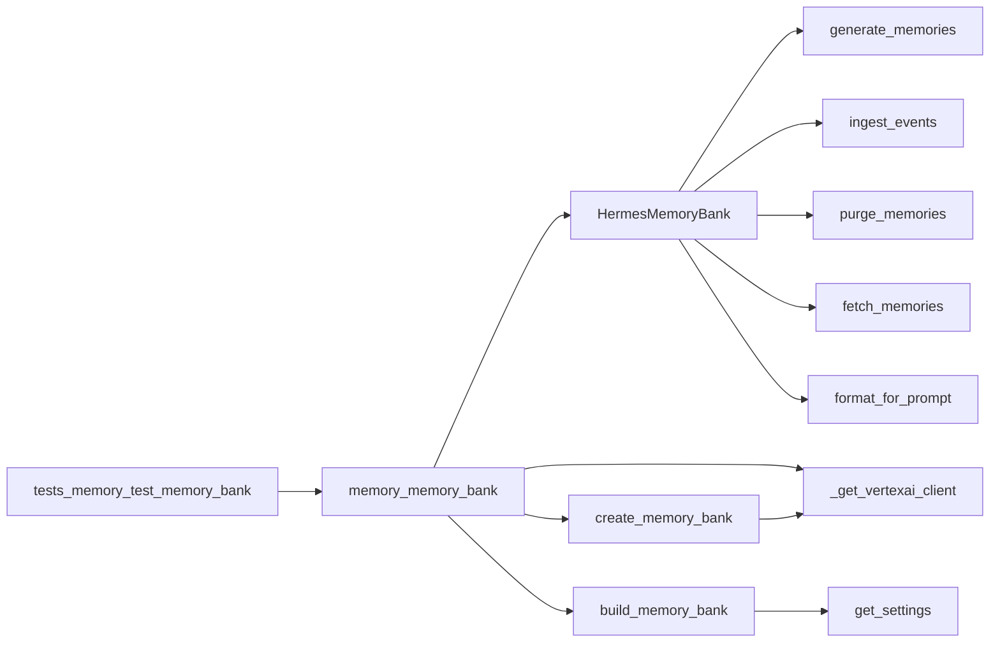

# Technical Debt Assessment: `memory/memory_bank.py`

## Summary

This codebase is small and focused, with a single implementation module and a strong test suite around its core behaviors (`memory/memory_bank.py` and `tests/memory/test_memory_bank.py`). Overall technical debt is **Medium**: the implementation is reasonably well-tested, but it carries a few maintainability risks, notably a very large facade class, repeated error-handling patterns, and several intentionally unsupported compatibility methods that add API surface without real functionality.

The biggest debt is not correctness-related but architectural: [`HermesMemoryBank`](memory/memory_bank.py#L79) centralizes many responsibilities, while `build_memory_bank()` and `create_memory_bank()` embed configuration, SDK adaptation, and resource-creation logic in the same module. The tests are thorough for the supported behaviors, but several methods return empty values by design, which should be documented and revisited as SDK support evolves.

---

## Debt Inventory

| # | Area | Severity | Description | Files Affected | Effort to Fix |
|---|------|----------|-------------|----------------|---------------|
| 1 | Large facade / mixed responsibilities | 🟠 High | [`HermesMemoryBank`](memory/memory_bank.py#L79) bundles client lifecycle, memory CRUD, prompt formatting, batching, purge, and compatibility stubs in one class. | `memory/memory_bank.py` | L |
| 2 | Repeated exception-swallowing pattern | 🟡 Medium | Multiple methods catch broad exceptions and return fallback values, which can hide partial failures and make debugging harder. | `memory/memory_bank.py` | M |
| 3 | Unsupported methods retained for compatibility | 🟡 Medium | [`retrieve_profiles`](memory/memory_bank.py#L315), [`list_revisions`](memory/memory_bank.py#L369) always return empty lists, which may mislead callers. | `memory/memory_bank.py` | S |
| 4 | Token budgeting / truncation logic is ad hoc | 🟡 Medium | [`format_for_prompt`](memory/memory_bank.py#L381) implements token budgeting locally with string-length logic rather than a shared utility. | `memory/memory_bank.py` | M |
| 5 | Async wrapper around blocking SDK calls | 🟡 Medium | `asyncio.to_thread()` is used repeatedly to offload blocking SDK calls; effective, but repetitive and easy to misapply. | `memory/memory_bank.py` | M |
| 6 | Test-only fake SDK objects mirror production SDK internals | 🟢 Low | Helper mocks like [`_make_mock_client`](tests/memory/test_memory_bank.py#L32) and [`_make_engine`](tests/memory/test_memory_bank.py#L42) are tightly coupled to current SDK structure. | `tests/memory/test_memory_bank.py` | S |
| 7 | Missing repository-wide dependency visibility | 🟢 Low | No `pyproject.toml`, `package.json`, or `go.mod` was present in the analyzed files, so dependency risk cannot be assessed from evidence. | N/A | S |

> **Sources:** `memory/memory_bank.py` · L1–L498 · [`HermesMemoryBank`](memory/memory_bank.py#L79), [`build_memory_bank`](memory/memory_bank.py#L411), [`create_memory_bank`](memory/memory_bank.py#L432)  
> **Sources:** `tests/memory/test_memory_bank.py` · L1–L495 · [`TestGenerateMemories`](tests/memory/test_memory_bank.py#L58), [`TestCreateMemoryBank`](tests/memory/test_memory_bank.py#L273)

---

## Critical Issues

No **Critical** issues were evidenced in the provided analysis. The module appears functionally covered by tests, and there are no explicit signs of data loss bugs, security vulnerabilities, or broken entry points in the analyzed code.

### High: Large Facade Class with Multiple Responsibilities

[`HermesMemoryBank`](memory/memory_bank.py#L79) is a broad application facade over Vertex AI Agent Engine memories. It implements client initialization, ingestion, retrieval, creation, update, deletion, purge, prompt formatting, and compatibility shims all in one class.

#### Why this is a problem
- It increases cognitive load and makes the module harder to change safely.
- It couples unrelated responsibilities: network client management, domain logic, and presentation formatting.
- It makes testing more brittle as one class accumulates more branches and SDK adaptation logic.

#### Concrete fix
Split the class into focused collaborators:
- `VertexClientProvider` for SDK/client creation
- `MemoryWriter` for create/update/delete/purge/ingest operations
- `MemoryRetriever` for `fetch_memories()` and prompt formatting
- `MemoryCompatibilityAdapter` for unsupported methods

Example direction:

```python
class MemoryRetriever:
    def __init__(self, client):
        self.client = client

    async def fetch_memories(self, user_id: str, query: str, top_k: int = 10) -> list[str]:
        ...
```

Then keep `HermesMemoryBank` as a thin orchestration layer or replace it with composition entirely.

> **Sources:** `memory/memory_bank.py` · L79–L406 · [`HermesMemoryBank`](memory/memory_bank.py#L79), [`generate_memories`](memory/memory_bank.py#L105), [`fetch_memories`](memory/memory_bank.py#L331), [`format_for_prompt`](memory/memory_bank.py#L381)

### High: Unsupported API Methods Exposed as Functional Surface

[`retrieve_profiles`](memory/memory_bank.py#L315) and [`list_revisions`](memory/memory_bank.py#L369) are documented as unsupported in the current SDK and always return `[]`.

#### Why this is a problem
- These methods present an API that appears implemented but is effectively inert.
- Callers may assume they are retrieving meaningful data and build workflows around empty results.
- The behavior is hidden behind normal-looking method signatures, increasing the risk of silent failure-by-design.

#### Concrete fix
Either:
1. Remove them from public surface, or
2. Raise a clear `NotImplementedError`, or
3. Rename/document them as explicit compatibility stubs.

For example:

```python
def retrieve_profiles(self, user_id: str) -> list[str]:
    raise NotImplementedError(
        "RetrieveProfiles is not supported by SDK >= 1.112; use fetch_memories() instead."
    )
```

> **Sources:** `memory/memory_bank.py` · L315–L329 · [`retrieve_profiles`](memory/memory_bank.py#L315)  
> **Sources:** `memory/memory_bank.py` · L369–L379 · [`list_revisions`](memory/memory_bank.py#L369)

---

## Code Smell Patterns

### 1) God Object / Bloated Facade

The strongest smell is the breadth of [`HermesMemoryBank`](memory/memory_bank.py#L79). It centralizes many unrelated operations and thus becomes a change magnet.

**Example:** the class spans methods for generate, ingest, purge, delete, create, update, fetch, revisions, and prompt formatting.

**Recommended refactor:** split by responsibility and keep only a small orchestration layer. This will also improve test isolation.

> **Sources:** `memory/memory_bank.py` · L79–L406 · [`HermesMemoryBank`](memory/memory_bank.py#L79)

### 2) Repeated Broad Exception Handling

Methods such as [`generate_memories`](memory/memory_bank.py#L105), [`ingest_events`](memory/memory_bank.py#L143), [`purge_memories`](memory/memory_bank.py#L187), [`delete_memory`](memory/memory_bank.py#L227), [`create_memory`](memory/memory_bank.py#L250), [`update_memory`](memory/memory_bank.py#L285), and [`fetch_memories`](memory/memory_bank.py#L331) all catch broad exceptions and return a fallback value.

**Why it matters:** this can mask infrastructure failures and make operational issues appear like normal empty responses.

**Recommended refactor:** centralize exception handling in a helper that logs structured context and optionally distinguishes transient SDK errors from unsupported behavior.

> **Sources:** `memory/memory_bank.py` · L105–L367 · [`generate_memories`](memory/memory_bank.py#L105), [`fetch_memories`](memory/memory_bank.py#L331)

### 3) Ad Hoc Feature Degradation

The compatibility methods [`retrieve_profiles`](memory/memory_bank.py#L315) and [`list_revisions`](memory/memory_bank.py#L369) are explicit no-ops. This is understandable for SDK migration, but it becomes technical debt if left indefinitely.

**Recommended refactor:** replace silent degradation with a compatibility shim that emits warnings or exceptions, and track removal in the roadmap.

> **Sources:** `memory/memory_bank.py` · L315–L379 · [`retrieve_profiles`](memory/memory_bank.py#L315), [`list_revisions`](memory/memory_bank.py#L369)

### 4) Local Token-Budget Heuristic

[`format_for_prompt`](memory/memory_bank.py#L381) assembles prompt text and trims by a `max_tokens` budget using local logic. That approach is reasonable, but it is isolated and likely hard to reuse consistently.

**Recommended refactor:** extract prompt formatting into a shared utility and define a single token-counting strategy.

> **Sources:** `memory/memory_bank.py` · L381–L406 · [`format_for_prompt`](memory/memory_bank.py#L381)

### 5) Test Mock Structure Mirrors SDK Internals

The test helpers [`_make_mock_client`](tests/memory/test_memory_bank.py#L32) and [`_make_engine`](tests/memory/test_memory_bank.py#L42) encode a specific object shape from the Vertex SDK.

**Why it matters:** SDK updates may require repeated test updates even if app behavior remains unchanged.

**Recommended refactor:** wrap SDK interactions behind a small adapter interface so tests mock the adapter, not SDK internals.

> **Sources:** `tests/memory/test_memory_bank.py` · L32–L53 · [`_make_mock_client`](tests/memory/test_memory_bank.py#L32), [`_make_engine`](tests/memory/test_memory_bank.py#L42)

---

## Missing Tests

Based on the provided analysis, there is **1 implementation file** and **1 test file**, so the raw ratio is superficially strong. However, test coverage is concentrated entirely on `memory/memory_bank.py`; there are no tests for configuration loading, SDK import fallback behavior, logging behavior, or any higher-level integration path.

### Areas with limited or unverified coverage

| Module / Function | Coverage Observation | Gap |
|---|---|---|
| [`_get_vertexai_client`](memory/memory_bank.py#L41) | Not directly tested for ImportError fallback messaging or settings fallback behavior. | Error-path and configuration-path verification missing. |
| [`build_memory_bank`](memory/memory_bank.py#L411) | Tested for empty config and exception fallback. | No test of exact settings resolution or logging output. |
| [`create_memory_bank`](memory/memory_bank.py#L432) | Good unit coverage for creation and existing-engine reuse. | No live integration test against real SDK objects. |
| [`format_for_prompt`](memory/memory_bank.py#L381) | Tested for formatting and token budget. | No test for edge cases like long memory entries with newline-heavy payloads. |
| Compatibility methods | Tested that they return empty lists. | No test that callers are warned or that these stubs are intentionally deprecated. |

### Coverage ratio note
The analysis does not provide numeric coverage metrics, so this assessment is qualitative. The test suite is broad within this module, but the repo as analyzed does not expose enough breadth to prove coverage outside the memory-bank boundary.

> **Sources:** `memory/memory_bank.py` · L41–L498 · [`_get_vertexai_client`](memory/memory_bank.py#L41), [`build_memory_bank`](memory/memory_bank.py#L411), [`create_memory_bank`](memory/memory_bank.py#L432)  
> **Sources:** `tests/memory/test_memory_bank.py` · L1–L495 · test classes and helpers

---

## Dependency & Security Concerns

No `pyproject.toml`, `package.json`, or `go.mod` file was included in the provided analysis, so there is **insufficient evidence** to identify outdated packages, pinned versions, or known CVE-prone dependency patterns.

### What is observable
- The implementation imports `vertexai` and relies on `config` settings.
- The SDK migration note in [`create_memory_bank`](memory/memory_bank.py#L432) indicates a dependency on Vertex AI SDK behavior changes.

### Security posture notes
- There are no obvious secrets handling issues visible in the analyzed files.
- There are no explicit authentication/authorization checks in `memory/memory_bank.py`; that may be appropriate if this module is only a backend facade, but it should be validated at the call site.

> **Sources:** `memory/memory_bank.py` · L1–L498 · imports and SDK adaptation logic in [`_get_vertexai_client`](memory/memory_bank.py#L41), [`create_memory_bank`](memory/memory_bank.py#L432)

---

## TODO / FIXME Tracker

No `TODO`, `FIXME`, `HACK`, or `XXX` comments were present in the provided analysis data.

| File | Line | Comment | Suggested Action |
|---|---:|---|---|
| — | — | No tracked TODO/FIXME comments evidenced | Add explicit tracker comments where future migration work is intended, especially around unsupported compatibility methods |

> **Sources:** `memory/memory_bank.py` · L1–L498 · no TODO/FIXME evidence in supplied analysis  
> **Sources:** `tests/memory/test_memory_bank.py` · L1–L495 · no TODO/FIXME evidence in supplied analysis

---

## Refactoring Roadmap

| Priority | Action | Rationale | Estimated Effort |
|----------|-----------|-----------|------------------|
| 1 | Split [`HermesMemoryBank`](memory/memory_bank.py#L79) into smaller collaborators | Highest impact on maintainability; reduces class size and change risk | L |
| 2 | Replace silent empty-list compatibility methods with explicit deprecation handling | Prevents hidden behavior and improves caller clarity | S |
| 3 | Extract shared error-handling / retry policy for SDK calls | Reduces repeated `try/except` boilerplate and makes failure behavior consistent | M |
| 4 | Extract prompt formatting/token budgeting into a reusable utility | Improves readability and reuse for any future prompt injection path | M |
| 5 | Add tests for `_get_vertexai_client()` fallback and helpful ImportError messaging | Closes the main untested edge of SDK initialization | S |
| 6 | Add a small adapter interface around Vertex SDK objects | Decouples tests and app logic from SDK structure changes | M |
| 7 | Decide whether compatibility stubs should be removed or retained with warnings | Prevents long-term accumulation of dead API surface | S |

> **Sources:** `memory/memory_bank.py` · L41–L498 · [`_get_vertexai_client`](memory/memory_bank.py#L41), [`HermesMemoryBank`](memory/memory_bank.py#L79), [`build_memory_bank`](memory/memory_bank.py#L411), [`create_memory_bank`](memory/memory_bank.py#L432)

---

## Relationship and Coverage Snapshot

The analyzed code is tightly centered around a single production module and its unit tests. Relationship statistics show **288 total relationships**, with **17 imports** and **271 calls**, which is a high call-density for such a small surface area and reinforces the “central facade” debt pattern.



> **Sources:** `memory/memory_bank.py` · L1–L498 · [`HermesMemoryBank`](memory/memory_bank.py#L79), [`build_memory_bank`](memory/memory_bank.py#L411), [`create_memory_bank`](memory/memory_bank.py#L432)  
> **Sources:** `tests/memory/test_memory_bank.py` · L1–L495 · test module imports and method coverage  
> **Sources:** `relationship_stats` · total 288 relationships, 17 imports, 271 calls