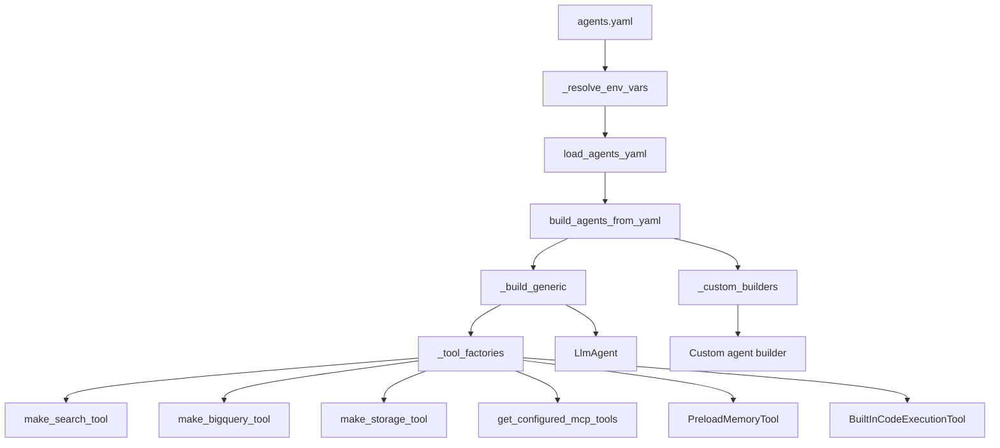
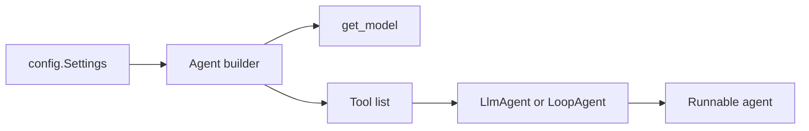

# Tool Layer and Agent Capability Injection

## Overview

This repository treats tools as the primary capability surface that agents consume at build time. Rather than embedding connector-specific logic inside agent definitions, each agent composes a tool list from shared factories and helper adapters. The result is a clean separation between:

- **agent intent and prompting** in [`agents/analytics.py`](agents/analytics.py#L37), [`agents/developer.py`](agents/developer.py#L54), [`agents/hr.py`](agents/hr.py#L42), [`agents/it_helpdesk.py`](agents/it_helpdesk.py#L42), and [`agents/task_agent.py`](agents/task_agent.py#L160)
- **tool construction and normalisation** in [`tools/*.py`](tools/bigquery_tool.py#L1), [`tools/search_tool.py`](tools/search_tool.py#L16), [`tools/storage_tool.py`](tools/storage_tool.py#L86), [`tools/mcp_connector.py`](tools/mcp_connector.py#L96), and related modules
- **tool injection into agents** through builders such as [`build_analytics_agent`](agents/analytics.py#L37), [`build_developer_agent`](agents/developer.py#L54), and the generic YAML loader in [`agents/loader.py`](agents/loader.py#L147)

The core pattern is straightforward: a builder resolves model configuration via [`get_model`](models/provider.py#L75), assembles a `tools=[...]` list, and passes that list into ADK agent constructors like `LlmAgent` or `LoopAgent`. In the special case of dynamic YAML-defined agents, [`build_agents_from_yaml`](agents/loader.py#L147) uses a tool factory registry to translate declarative tool names into concrete ADK tool objects.

This page intentionally stays focused on the tool layer itself. It does **not** cover full orchestration flows or connector webhook implementations beyond what is necessary to explain how tools reach agents.

> **Sources:** `agents/loader.py` · L47–L203 · [`_tool_factories`](agents/loader.py#L47), [`build_agents_from_yaml`](agents/loader.py#L147), [`_build_generic`](agents/loader.py#L181); `agents/analytics.py` · L37–L53 · [`build_analytics_agent`](agents/analytics.py#L37); `tools/bigquery_tool.py` · L85–L116 · [`make_bigquery_tool`](tools/bigquery_tool.py#L85), [`run_bigquery_query`](tools/bigquery_tool.py#L104)

## Tool Registration Model

Tool registration happens in two broad ways in this codebase:

1. **Static registration inside agent builders**
2. **Declarative registration via YAML and the loader’s factory map**

### Static registration in agent builders

The domain-specific agent builders create their own tool sets directly. For example, [`build_analytics_agent`](agents/analytics.py#L37) imports and invokes [`make_bigquery_tool`](tools/bigquery_tool.py#L85) and [`make_search_tool`](tools/search_tool.py#L16), while also adding [`PreloadMemoryTool`](agents/analytics.py#L37) and a skill-learning callback built by [`build_skill_learning_callback`](memory/skill_learning.py#L25). Similarly, [`build_developer_agent`](agents/developer.py#L54) composes tools from [`make_search_tool`](tools/search_tool.py#L16) and [`make_storage_tool`](tools/storage_tool.py#L86), and [`build_hr_agent`](agents/hr.py#L42) composes workspace-facing tools such as calendar, drive, Gmail, and search adapters.

This approach keeps the agent module authoritative for its own capabilities: the builder knows exactly which tools are intended for that role.

### Declarative registration via the loader

The generic path is centralized in [`agents/loader.py`](agents/loader.py#L1). The helper [`_tool_factories`](agents/loader.py#L47) builds a name-to-factory mapping from settings-aware constructors such as [`make_search_tool`](tools/search_tool.py#L16), [`make_bigquery_tool`](tools/bigquery_tool.py#L85), [`make_storage_tool`](tools/storage_tool.py#L86), and the memory/tooling adapters around `PreloadMemoryTool` and MCP toolsets. This map is then consumed by [`_build_generic`](agents/loader.py#L181), which reads a YAML entry and resolves each requested tool name into an instantiated tool.

The loader also provides a small but important compatibility layer:

- [`_resolve_env_vars`](agents/loader.py#L125) substitutes `${VAR:-default}` placeholders in YAML text before parsing
- [`_custom_builders`](agents/loader.py#L107) allows specific agent names to bypass generic construction and use bespoke builders instead
- unknown tool names are skipped with warnings rather than causing the entire build to fail

That makes the loader resilient: it can handle partially configured YAML, while still giving operators a way to express agent capability sets in configuration.

### Shared registration characteristics

Across both registration modes, several common patterns appear:

| Characteristic | Static builders | YAML loader |
|---|---|---|
| Tool creation point | Agent module | [`agents/loader.py`](agents/loader.py#L47) |
| Input source | Hard-coded builder logic | YAML config dict |
| Settings dependency | Directly via `settings` | Passed into factory map |
| Failure behavior | Usually explicit in builder | Warnings + best-effort continuation |
| Output | `tools=[...]` on `LlmAgent` / `LoopAgent` | `tools=[...]` on built agent |

> **Sources:** `agents/analytics.py` · L37–L53 · [`build_analytics_agent`](agents/analytics.py#L37); `agents/developer.py` · L54–L79 · [`build_developer_agent`](agents/developer.py#L54); `agents/hr.py` · L42–L70 · [`build_hr_agent`](agents/hr.py#L42); `agents/it_helpdesk.py` · L42–L71 · [`build_it_helpdesk_agent`](agents/it_helpdesk.py#L42); `agents/loader.py` · L47–L203 · [`_tool_factories`](agents/loader.py#L47), [`_custom_builders`](agents/loader.py#L107), [`_resolve_env_vars`](agents/loader.py#L125), [`build_agents_from_yaml`](agents/loader.py#L147)

## Tool Factory Resolution

The main dynamic resolution logic lives in [`agents/loader.py`](agents/loader.py#L47). The loader converts abstract tool names from configuration into concrete tool instances.

### `_tool_factories(settings)`

[`_tool_factories`](agents/loader.py#L47) is the central registry for tool factories. It is settings-aware and returns a mapping that includes factory functions for tools such as:

- [`make_search_tool`](tools/search_tool.py#L16)
- [`make_bigquery_tool`](tools/bigquery_tool.py#L85)
- [`make_storage_tool`](tools/storage_tool.py#L86)
- [`get_configured_mcp_tools`](tools/mcp_connector.py#L96)
- `PreloadMemoryTool` integration
- `BuiltInCodeExecutionTool` integration

That means the loader does not need to know any connector-specific details; it only knows how to ask for a tool by name and instantiate it with the current settings.

### `_custom_builders()`

[`_custom_builders`](agents/loader.py#L107) is a second registry, but for full agents rather than tools. It maps known agent identities to bespoke builder functions such as [`build_analytics_agent`](agents/analytics.py#L37), [`build_developer_agent`](agents/developer.py#L54), [`build_hr_agent`](agents/hr.py#L42), [`build_it_helpdesk_agent`](agents/it_helpdesk.py#L42), and [`build_task_agent`](agents/task_agent.py#L160). This matters because these agents have richer, role-specific tool composition and should not be flattened into a generic YAML path.

### `_build_generic(cfg, settings, tool_map)`

[`_build_generic`](agents/loader.py#L181) is the fallback builder. It reads the configuration dict, resolves the requested tool names against the map from [`_tool_factories`](agents/loader.py#L47), and passes the resulting list into `LlmAgent(...)`. The builder also tolerates missing or invalid tool names by warning and skipping them, which keeps builds robust for partially deployed environments.

### Loader flow

This diagram captures the essential design: configuration selects capability names, factories resolve those names, and agents receive ready-to-use tool objects.

> **Sources:** `agents/loader.py` · L47–L203 · [`_tool_factories`](agents/loader.py#L47), [`_custom_builders`](agents/loader.py#L107), [`_resolve_env_vars`](agents/loader.py#L125), [`load_agents_yaml`](agents/loader.py#L133), [`build_agents_from_yaml`](agents/loader.py#L147), [`_build_generic`](agents/loader.py#L181)

## Shared Helpers and Adapters

A significant amount of the tool layer is devoted to shared helpers that normalize access to external systems and present a consistent interface to agents.

### Workspace and cloud tools

The Workspace-facing helpers follow a common pattern: each module exposes a cached service getter and one or more domain functions.

- [`tools/gmail_tool.py`](tools/gmail_tool.py#L1) exposes [`send_email`](tools/gmail_tool.py#L67), [`search_emails`](tools/gmail_tool.py#L110), and [`get_email`](tools/gmail_tool.py#L154)
- [`tools/calendar_tool.py`](tools/calendar_tool.py#L1) exposes [`create_calendar_event`](tools/calendar_tool.py#L56), [`list_calendar_events`](tools/calendar_tool.py#L111), and [`check_availability`](tools/calendar_tool.py#L155)
- [`tools/drive_tool.py`](tools/drive_tool.py#L1) exposes [`search_drive_files`](tools/drive_tool.py#L66), [`read_drive_file`](tools/drive_tool.py#L109), and [`list_drive_folder`](tools/drive_tool.py#L162)

These modules share the same architectural intent: hide underlying API client setup and return simple dict payloads suitable for agent tool calls.

### Storage and BigQuery adapters

The developer and task agents rely on general-purpose data access adapters:

- [`make_bigquery_tool`](tools/bigquery_tool.py#L85) and [`run_bigquery_query`](tools/bigquery_tool.py#L104)
- [`make_storage_tool`](tools/storage_tool.py#L86), [`read_gcs_file`](tools/storage_tool.py#L119), and [`write_gcs_file`](tools/storage_tool.py#L133)

The storage adapter includes a safety helper, [`_safe_path`](tools/storage_tool.py#L31), which ensures only safe object paths are handled. In contrast, the BigQuery adapter focuses on read-only query execution and result shaping.

### Model Armor as a pre/post screen

Although not a tool in the ADK sense, [`screen_prompt`](tools/model_armor.py#L122) and [`screen_response`](tools/model_armor.py#L134) act as shared policy adapters around model I/O. They are invoked from gateway code before or after agent execution and effectively govern what inputs and outputs tools can observe or emit indirectly.

### MCP toolset adapters

[`tools/mcp_connector.py`](tools/mcp_connector.py#L1) provides the bridge from config to ADK `MCPToolset` instances:

- [`make_filesystem_mcp_toolset`](tools/mcp_connector.py#L34)
- [`make_sse_mcp_toolset`](tools/mcp_connector.py#L64)
- [`get_configured_mcp_tools`](tools/mcp_connector.py#L96)

These adapters are especially important for generic agents because they let a YAML config add external tool bundles without changing agent code.

> **Sources:** `tools/gmail_tool.py` · L1–L208 · [`send_email`](tools/gmail_tool.py#L67), [`search_emails`](tools/gmail_tool.py#L110), [`get_email`](tools/gmail_tool.py#L154); `tools/calendar_tool.py` · L1–L196 · [`create_calendar_event`](tools/calendar_tool.py#L56), [`list_calendar_events`](tools/calendar_tool.py#L111), [`check_availability`](tools/calendar_tool.py#L155); `tools/drive_tool.py` · L1–L197 · [`search_drive_files`](tools/drive_tool.py#L66), [`read_drive_file`](tools/drive_tool.py#L109), [`list_drive_folder`](tools/drive_tool.py#L162); `tools/storage_tool.py` · L31–L145 · [`_safe_path`](tools/storage_tool.py#L31), [`make_storage_tool`](tools/storage_tool.py#L86); `tools/bigquery_tool.py` · L85–L116 · [`make_bigquery_tool`](tools/bigquery_tool.py#L85), [`run_bigquery_query`](tools/bigquery_tool.py#L104); `tools/mcp_connector.py` · L34–L123 · [`make_filesystem_mcp_toolset`](tools/mcp_connector.py#L34), [`make_sse_mcp_toolset`](tools/mcp_connector.py#L64), [`get_configured_mcp_tools`](tools/mcp_connector.py#L96); `tools/model_armor.py` · L122–L143 · [`screen_prompt`](tools/model_armor.py#L122), [`screen_response`](tools/model_armor.py#L134)

## How Agents Acquire Capabilities

Each agent builder assembles its capabilities explicitly, and that assembly is what makes the agent “able” to do useful work.

### Analytics agent

[`build_analytics_agent`](agents/analytics.py#L37) is a good example of tightly scoped capability injection. It creates an `LlmAgent` with model selection from [`get_model`](models/provider.py#L75), then injects:

- BigQuery access via [`make_bigquery_tool`](tools/bigquery_tool.py#L85)
- knowledge retrieval via [`make_search_tool`](tools/search_tool.py#L16)
- memory preload via `PreloadMemoryTool`
- learning callbacks from [`build_skill_learning_callback`](memory/skill_learning.py#L25)

This gives the analytics agent a minimal but effective analytical toolbox.

### Developer agent

[`build_developer_agent`](agents/developer.py#L54) adds source and object storage access via [`make_storage_tool`](tools/storage_tool.py#L86), search via [`make_search_tool`](tools/search_tool.py#L16), and code execution capability through the ADK built-in code execution tool import. This is a capability bundle appropriate for development workflows, where the agent needs both information retrieval and sandboxed action execution.

### HR and IT helpdesk agents

[`build_hr_agent`](agents/hr.py#L42) and [`build_it_helpdesk_agent`](agents/it_helpdesk.py#L42) both combine workspace-adjacent tools with knowledge search. Their tool lists are broader than analytics because they must bridge multiple external systems, but they still follow the same pattern: build tool objects, then hand them directly to `LlmAgent`.

### Task agent

[`build_task_agent`](agents/task_agent.py#L160) is structurally different because it returns a `LoopAgent`. Its executor is built from multiple direct tool functions, including [`run_bigquery_query`](tools/bigquery_tool.py#L104), [`search_knowledge_base`](tools/search_tool.py#L61), [`schedule_agent_task`](tools/scheduler_tool.py#L45), and storage helpers from [`tools/storage_tool.py`](tools/storage_tool.py#L119). The important takeaway is that even though the execution semantics differ, capability acquisition still happens by assembling a tool set first and then injecting it into the agent object.

### Capability flow summary

The builder is the hinge point: it converts configuration into a concrete capability set.

> **Sources:** `agents/analytics.py` · L37–L53 · [`build_analytics_agent`](agents/analytics.py#L37); `agents/developer.py` · L54–L79 · [`build_developer_agent`](agents/developer.py#L54); `agents/hr.py` · L42–L70 · [`build_hr_agent`](agents/hr.py#L42); `agents/it_helpdesk.py` · L42–L71 · [`build_it_helpdesk_agent`](agents/it_helpdesk.py#L42); `agents/task_agent.py` · L90–L180 · [`_build_planner`](agents/task_agent.py#L90), [`_build_executor`](agents/task_agent.py#L138), [`build_task_agent`](agents/task_agent.py#L160); `models/provider.py` · L75–L108 · [`get_model`](models/provider.py#L75)

## Main Tool-Related Symbols

| Symbol | File | Role |
|---|---|---|
| [`_tool_factories`](agents/loader.py#L47) | `agents/loader.py` | Builds the settings-aware map from tool names to factory functions. |
| [`_custom_builders`](agents/loader.py#L107) | `agents/loader.py` | Resolves named agents to bespoke builders instead of generic YAML construction. |
| [`_build_generic`](agents/loader.py#L181) | `agents/loader.py` | Creates an `LlmAgent` from YAML config and resolved tools. |
| [`build_agents_from_yaml`](agents/loader.py#L147) | `agents/loader.py` | Loads YAML, resolves tools, and returns the agent list. |
| [`make_bigquery_tool`](tools/bigquery_tool.py#L85) | `tools/bigquery_tool.py` | Produces an ADK tool for BigQuery queries. |
| [`run_bigquery_query`](tools/bigquery_tool.py#L104) | `tools/bigquery_tool.py` | Module-level direct query helper, used by task execution. |
| [`make_search_tool`](tools/search_tool.py#L16) | `tools/search_tool.py` | Produces a knowledge-base search tool. |
| [`search_knowledge_base`](tools/search_tool.py#L61) | `tools/search_tool.py` | Direct search function for non-ADK callers. |
| [`make_storage_tool`](tools/storage_tool.py#L86) | `tools/storage_tool.py` | Produces a GCS read/write/list tool wrapper. |
| [`read_gcs_file`](tools/storage_tool.py#L119) | `tools/storage_tool.py` | Direct GCS read helper. |
| [`write_gcs_file`](tools/storage_tool.py#L133) | `tools/storage_tool.py` | Direct GCS write helper. |
| [`get_configured_mcp_tools`](tools/mcp_connector.py#L96) | `tools/mcp_connector.py` | Builds all configured MCP toolsets for injection. |
| [`screen_prompt`](tools/model_armor.py#L122) | `tools/model_armor.py` | Screens prompt content before execution. |
| [`screen_response`](tools/model_armor.py#L134) | `tools/model_armor.py` | Screens model output before return. |
| [`build_skill_learning_callback`](memory/skill_learning.py#L25) | `memory/skill_learning.py` | Produces the after-agent callback that learns from turns. |
| [`PreloadMemoryTool`](agents/analytics.py#L37) | `agents/analytics.py` | Injects memory at session start for agent context. |
| [`build_analytics_agent`](agents/analytics.py#L37) | `agents/analytics.py` | Example of a statically composed tool-bearing agent builder. |
| [`build_task_agent`](agents/task_agent.py#L160) | `agents/task_agent.py` | Example of a loop-based agent that consumes direct helper functions. |

> **Sources:** `agents/loader.py` · L47–L203 · [`_tool_factories`](agents/loader.py#L47), [`_custom_builders`](agents/loader.py#L107), [`_build_generic`](agents/loader.py#L181), [`build_agents_from_yaml`](agents/loader.py#L147); `tools/bigquery_tool.py` · L85–L116 · [`make_bigquery_tool`](tools/bigquery_tool.py#L85), [`run_bigquery_query`](tools/bigquery_tool.py#L104); `tools/search_tool.py` · L16–L91 · [`make_search_tool`](tools/search_tool.py#L16), [`search_knowledge_base`](tools/search_tool.py#L61); `tools/storage_tool.py` · L86–L145 · [`make_storage_tool`](tools/storage_tool.py#L86), [`read_gcs_file`](tools/storage_tool.py#L119), [`write_gcs_file`](tools/storage_tool.py#L133); `tools/mcp_connector.py` · L96–L123 · [`get_configured_mcp_tools`](tools/mcp_connector.py#L96); `tools/model_armor.py` · L122–L143 · [`screen_prompt`](tools/model_armor.py#L122), [`screen_response`](tools/model_armor.py#L134); `memory/skill_learning.py` · L25–L72 · [`build_skill_learning_callback`](memory/skill_learning.py#L25)

## Cross-Module Dependency Table

| Module | Imports From | Called By | Calls Into | Inherits From |
|--------|-------------|-----------|------------|---------------|
| `agents.loader` | `tools.bigquery_tool`, `tools.search_tool`, `tools.storage_tool`, `tools.mcp_connector`, `agents.*`, `google.adk.*`, `config` | `agents.orchestrator`, `scripts/register_agents.py` | `_tool_factories`, `_custom_builders`, `load_agents_yaml`, `build_agents_from_yaml`, `_build_generic` | — |
| `agents.analytics` | `tools.bigquery_tool`, `tools.search_tool`, `memory.skill_learning`, `models.provider`, `config` | `agents.loader` | `make_bigquery_tool`, `make_search_tool`, `build_skill_learning_callback`, `get_model` | `LlmAgent` |
| `agents.developer` | `tools.search_tool`, `tools.storage_tool`, `memory.skill_learning`, `models.provider`, `config` | `agents.loader` | `make_search_tool`, `make_storage_tool`, `build_skill_learning_callback`, `get_model` | `LlmAgent` |
| `agents.hr` | `tools.calendar_tool`, `tools.drive_tool`, `tools.gmail_tool`, `tools.search_tool`, `memory.skill_learning`, `models.provider`, `config` | `agents.loader` | `make_search_tool`, `build_skill_learning_callback`, `get_model` | `LlmAgent` |
| `agents.it_helpdesk` | `tools.calendar_tool`, `tools.drive_tool`, `tools.gmail_tool`, `tools.search_tool`, `tools.storage_tool`, `memory.skill_learning`, `models.provider`, `config` | `agents.loader` | `make_search_tool`, `make_storage_tool`, `build_skill_learning_callback`, `get_model` | `LlmAgent` |
| `agents.task_agent` | `tools.bigquery_tool`, `tools.search_tool`, `tools.scheduler_tool`, `tools.storage_tool`, `models.provider`, `config` | `agents.loader`, `gateway.tasks` | `run_bigquery_query`, `search_knowledge_base`, `schedule_agent_task`, `read_gcs_file`, `write_gcs_file` | `LoopAgent` |
| `tools.bigquery_tool` | `config` | `agents.analytics`, `agents.task_agent`, `agents.loader` | `_run_query`, `make_bigquery_tool`, `run_bigquery_query` | — |
| `tools.search_tool` | `config` | `agents.analytics`, `agents.developer`, `agents.hr`, `agents.it_helpdesk`, `agents.task_agent`, `agents.loader` | `make_search_tool`, `search_knowledge_base` | — |
| `tools.storage_tool` | `config` | `agents.developer`, `agents.it_helpdesk`, `agents.task_agent`, `agents.loader` | `make_storage_tool`, `read_gcs_file`, `write_gcs_file` | — |
| `tools.mcp_connector` | `config` | `agents.loader` | `make_filesystem_mcp_toolset`, `make_sse_mcp_toolset`, `get_configured_mcp_tools` | — |

This table shows an important architectural fact: the tool layer is highly shared, but not deeply coupled. Agent modules import the tool helpers they need; the loader imports them all to support generic assembly.

> **Sources:** `agents/loader.py` · L47–L203 · [`_tool_factories`](agents/loader.py#L47), [`_custom_builders`](agents/loader.py#L107), [`build_agents_from_yaml`](agents/loader.py#L147); `agents/analytics.py` · L37–L53 · [`build_analytics_agent`](agents/analytics.py#L37); `agents/developer.py` · L54–L79 · [`build_developer_agent`](agents/developer.py#L54); `agents/hr.py` · L42–L70 · [`build_hr_agent`](agents/hr.py#L42); `agents/it_helpdesk.py` · L42–L71 · [`build_it_helpdesk_agent`](agents/it_helpdesk.py#L42); `agents/task_agent.py` · L160–L180 · [`build_task_agent`](agents/task_agent.py#L160); `tools/bigquery_tool.py` · L85–L116 · [`make_bigquery_tool`](tools/bigquery_tool.py#L85), [`run_bigquery_query`](tools/bigquery_tool.py#L104); `tools/search_tool.py` · L16–L91 · [`make_search_tool`](tools/search_tool.py#L16), [`search_knowledge_base`](tools/search_tool.py#L61); `tools/storage_tool.py` · L86–L145 · [`make_storage_tool`](tools/storage_tool.py#L86), [`read_gcs_file`](tools/storage_tool.py#L119), [`write_gcs_file`](tools/storage_tool.py#L133); `tools/mcp_connector.py` · L34–L123 · [`make_filesystem_mcp_toolset`](tools/mcp_connector.py#L34), [`make_sse_mcp_toolset`](tools/mcp_connector.py#L64), [`get_configured_mcp_tools`](tools/mcp_connector.py#L96)